```{r, include=FALSE}
library(Statamarkdown)
stataexe <- find_stata()
knitr::opts_chunk$set(engine.path=list(stata=stataexe),
  error=TRUE, cleanlog=TRUE, comment=NA)

```


```{r setup, include=FALSE}
knitr::opts_chunk$set(echo = TRUE)
```

# Introducción a STATA 

##  Pantalla y ventanas principales

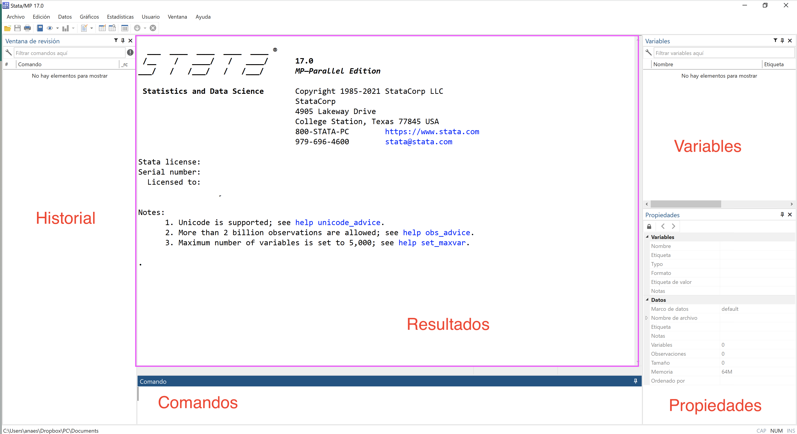

## STATA y su pantalla

Pero además utilizaremos otras pantallas. Una muy útil es la de el *do-file*
Aquí copiamos los comandos para no olvidar lo que hemos hecho en nuestra base de datos y poderlo replicar. Documentar nuestro código es importante para la replicabilidad (de nosotros mismos y de los demás)

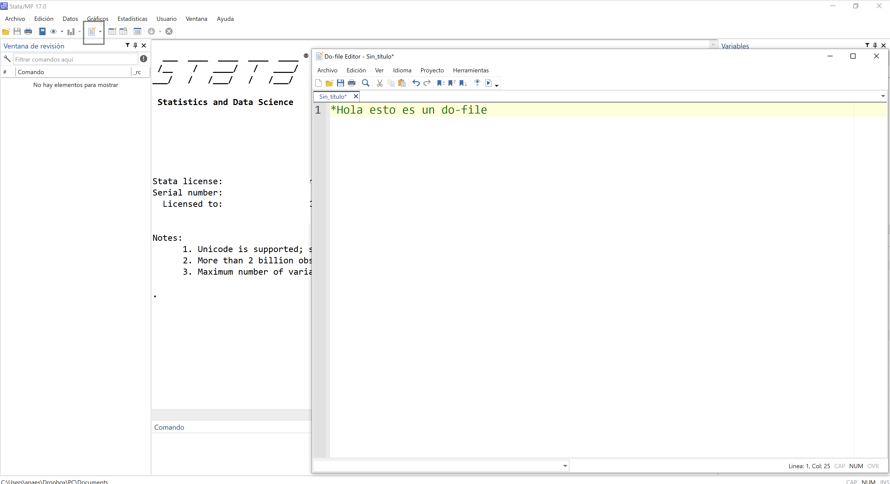

Otra muy útil es la edición de datos, <b>"Edit"</b>.  Parece una hoja de Excel y podemos editar los datos directamente, capturales, ponerles nombre, etiquetarlos.

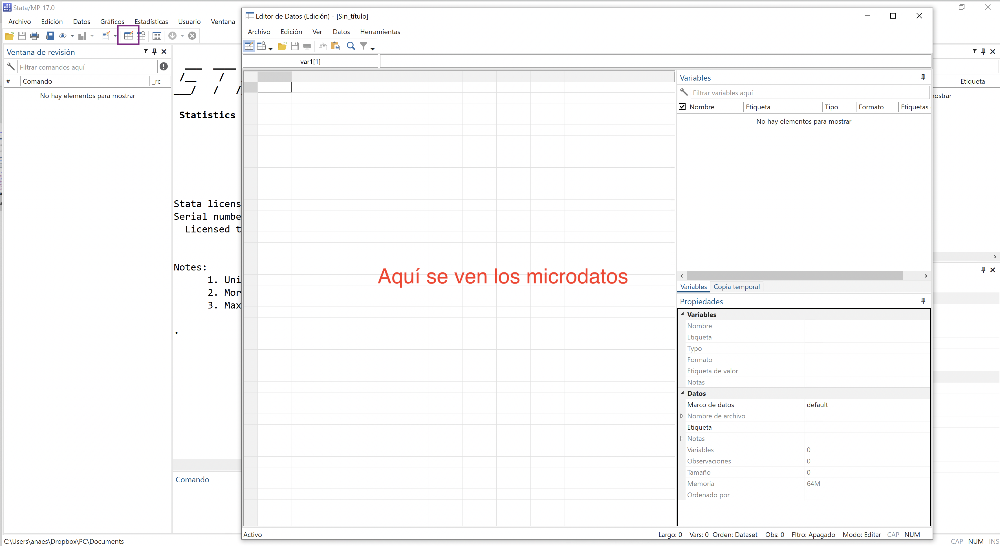

*¡Tip!*
Es muy útil usar en lugar de la edición, la de "Navegación" o *"Browse*. Se ve aparentemente igual. Pero sólo inspecciona y no cambia. Esto es útil, porque si editamos es mucho mejor hacerlo por comando para que quede claro qué hicimos con nuestra base de datos

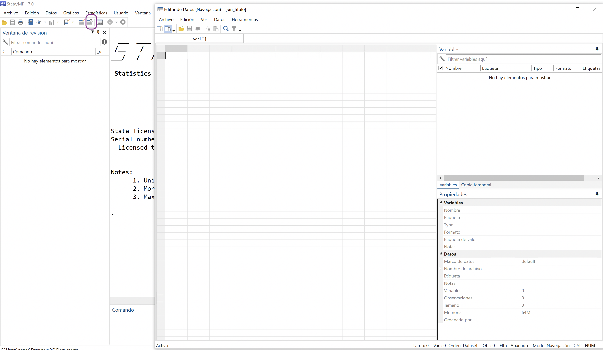

## STATA como una gran calculadora
El comando más simple es comando "display", este comando nos presenta en la pantalla de resultados las operaciones que le pidamos.

```{stata, collectcode=TRUE, warnings=FALSE}

display  "hola"
di 5+3
di chi2(10, 85)

```

Pedir ayuda
(Nota, con un asterisco los comandos no se vuelven de "chocolate")

```{stata, collectcode=TRUE}

help display

help chi2

help operators
```

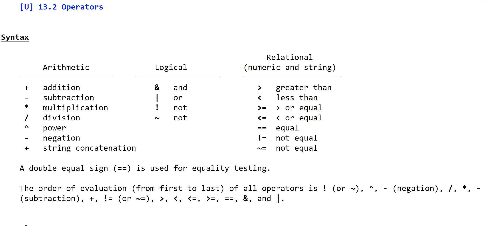

Los operadores son importantísimos porque nos ayudan a poner filtros y saber cómo "lee" nuestras indicaciones STATA

# Usando bases de datos

Vamos a utilizar la Encuesta de Hogares de Propósitos Múltiples de 2019, que está en el repositorio. Si descargas el repositorio, descomprime el archivo ehpm_2019.rar. 

Para que te funcionen mejor los comandos de este material, puedes establecer el directorio de donde descargaste el repositorio, cambiando el directorio de trabajo. Este el directorio que por *default*, STATA buscará tus archivos. 

Esto lo puedes hacer en el Menú y luego buscas la carpeta.

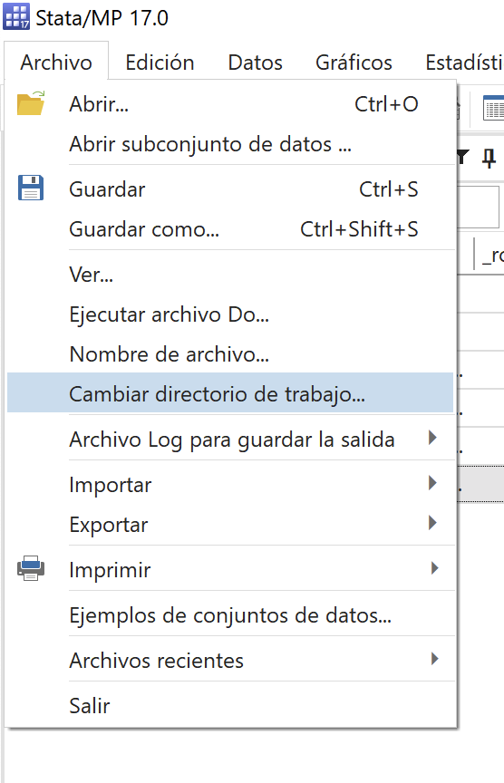

O puedes hacerlo desde línea de comando: 

```
cd "C:\carpeta\carpeta"

```

Para abrir una base de datos existente

Podemos hacerlo una base de datos "manualmente" usando:
  * los botones de "abrir" 
  * File -> Open o
  
  * Los botones CTRL + O

  
O bien escribir la liga de donde los estamos utilizando. 


```{stata, collectcode=TRUE}
use "datos/ehpm_2019", clear

describe

```

## Revisiones rápidas

También tenemos los siguientes comandos para revisar una base de datos

STATA a diferencia de otros paquetes le gusta abreviar, lo cual puede ser una gran ventaja para cuando estamos escribiendo nuestro código 
¿Cómo saber cuánto?  Podemos buscar el comando en la ayuda o darle help + comando. 

Veamos qué sucedes con el somando summarize:


```{stata, collectcode=TRUE}

*su
su r104


```

Este así como el siguiente sirven para toda la base si no establecemos qué variables usamos. O para una lista de variables

```{stata, collectcode=TRUE}

*codebook, c

codebook r104
```

En STATA, cada comando tiene **opciones**, son parámetros que establecemos despues de la sintaxis normal del comando despues de una ","


En este caso, queremos escribir la versión compacta del codebook, escribimos después de la coma ", "compact"


# Importación de diferentes formatos

Cuando tenemos otra base de datos abierta será muy importante, que usemos la función clear ya sea como opción sola o al final de nuestros comandos

```{stata, collectcode=TRUE}

clear // cierra la sesión de la base de datos


```

## Archivos separados por coma
En el Menú, podemos seleccionar la opción importar y elegir el tipo de archivo. 
El repositorio tenemos un archivo separado por comas "ejemplo_csv.csv"

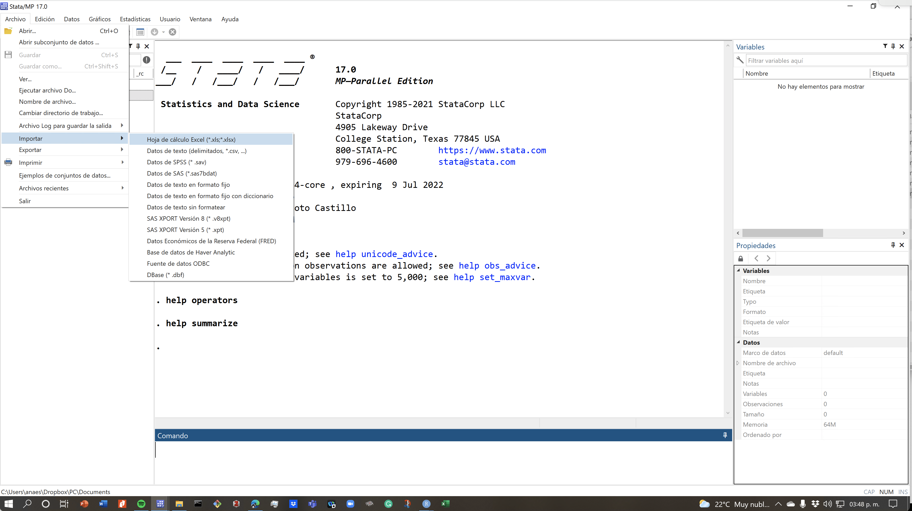

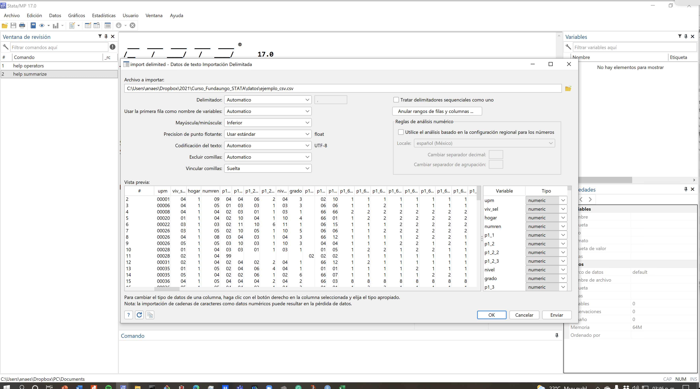

En códigos esto es equivalente a: 


```{stata, collectcode=TRUE}
import delimited "datos\ejemplo_csv.csv", clear

describe

```

## Importando desde Excel 

Para el caso de importar archivos de Excel es muy similar. Hay que verificar que estemos importando la hoja relevante. En este caso la hoja se llama "para_importar". Si no, por *default* querrá  abrir la primera hoja del libro de Excel. 


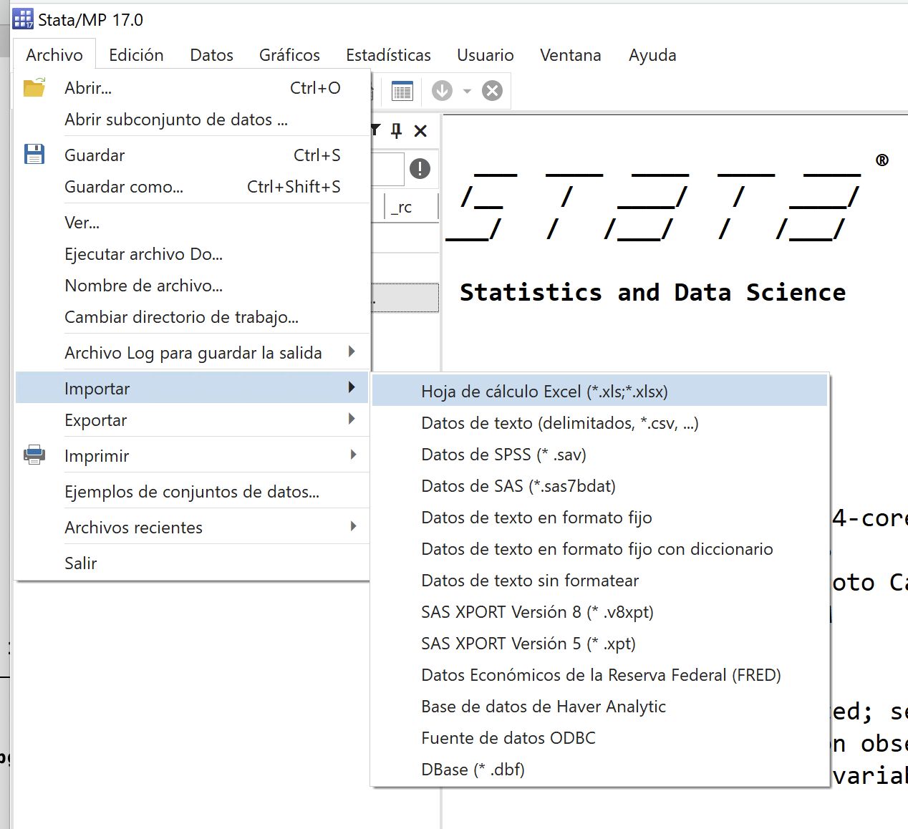

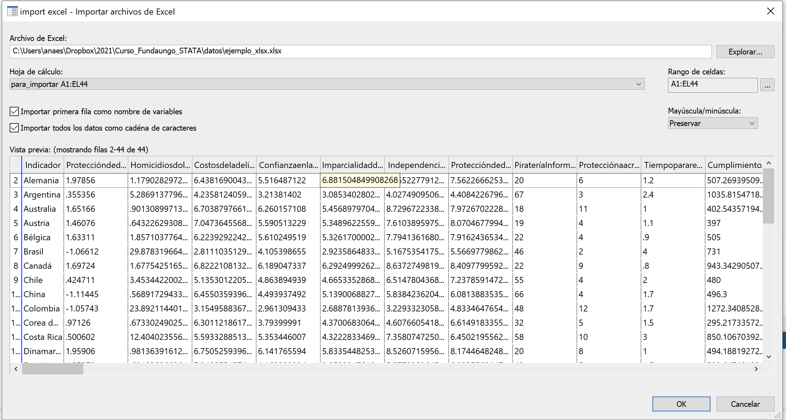

Checa que puedes importar todos los datos como cadena, no queremos eso. . 

```{stata, collectcode=TRUE}
import excel "datos\ejemplo_xlsx.xlsx", sheet("para_importar") firstrow clear


```

La opción *firstrow* hace referencia a la opción de dejar la primera fila como nombres. Intenta no usar caracteres especiales y nombres que inicen con números. STATA eliminará espacios en los nombres de las variables. Si alguna columna no tiene nombre le pondrá el nombre de la columna en Excel (una o varias letras). La opción *clear* cierra la base anterior. 

## Otros formatos

En versiones nuevas de STATA se pueden importar ya desde diferentes formatos. Veamos un ejemplo, hoy ya solo con comandos: 

```{stata, collectcode=TRUE}
import dbase "datos\ejemplo_dbf.dbf", clear

```

# Creación de variables

Volvamos a la base de la EHPM. 

```{stata, collectcode=TRUE}
use "datos/ehpm_2019", clear

describe

```

De aquí en adelante usaremos sólo código y menos "pantallazos" y menú. Lo ideal es que abras un archivo para do file

## Generando variables

Para crear variables usamos el comando generate que tiene estas opciones:

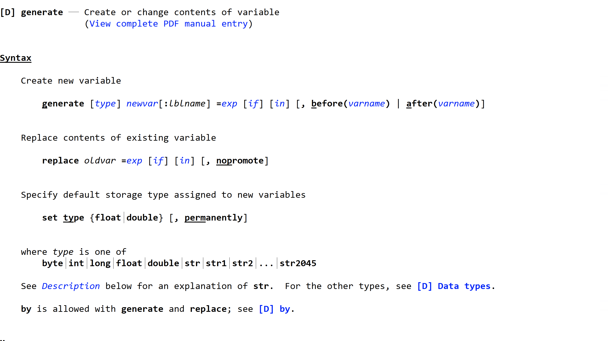
Empezemos creando una variable x


```{stata, collectcode=TRUE}
gen x=1

```

Esto genera una nueva columna donde todas las observaciones valen 1. Aquí es donde "generate" tiene su mejor amigo "replace"

Supongamos que esta variable vale 1 cuando se cumple con la condición de ser mujer, es decir debe valer cero para los hombres


```{stata, collectcode=TRUE}
replace x=0 if r104==1

```

Ojo con los "="; cuando se trata de un operador de filtro se ponen dos. 

Veamos este resultado (y de paso damos una revisada a los tabulados)
```{stata, collectcode=TRUE}
tabulate  x
```

Si queremos eliminar una variable, utilizamos "drop"
```{stata, collectcode=TRUE}

drop x

```

## Clonando variables

A veces queremos clonar una variable para modificarla si utilizamos "generate x=var0", por ejemplo, sólo copiáremos los valores de var0 en x, y no todas sus propiedades. 


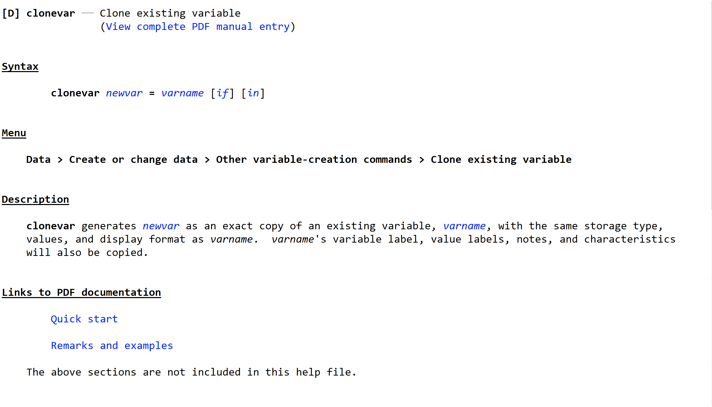

Veamos la diferencia:

```{stata, collectcode=TRUE}

gen x1=r104

clonevar x2=r104

describe x1 x2

```

## Extensiones para generar variables
Esta es de mis funciones favoritas. Permite usar funciones, y también nos permite hacer variables por grupo. 

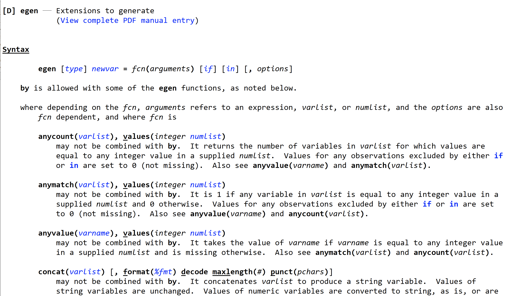


### Ejemplo 1:

Una de mis funciones favoritas es "cut", nos ahorra mucho para recodificar variables cuantitativas. 

Supongamos que queremos hacer una variable de edad quinquenal:

```{stata, collectcode=TRUE}

egen edad5=cut(r106), at(0(5)100)

tab edad5

```

¡Revisemos la variable en editor y cambiemos su etiqueta!

### Ejemplo 2:

Podemos hacer cualquier función. Por ejemplo, la moda es una medida que sólo se podrá calcular de esta forma. 


```{stata, collectcode=TRUE}

egen moda_edad=mode(r106)

tab moda_eda

```

### Ejemplo 3:

Pero también podemos hacer medias, sumas, conteos y muchas funciones ma. Lo bueno es que podemos utilizar la función by. 


```{stata, collectcode=TRUE}

egen mean_edad=mean(r106), by(region)

tab mean_eda

```


# Recodificación y etiquetado de variables

Supongamos que queremos cerrar nuestra variable edad5 en 65 años y más. Podemos hacer una simple recodificación:

```{stata, collectcode=TRUE}

recode edad5 (65/100=65)

tab edad5

```

Si queremos generar una nueva variable de nuestra codificación podemos utilizar la opción, gen() después de la coma, explicitando el nuevo nombre de nuestra variable. Supongamos que queremos eliminar a los menores porque no son parte de la edad activa:


```{stata, collectcode=TRUE}

recode edad5 (65/100=65) (0/15=.), gen(pet5)

tab pet5

```


Una de las cosas que es molesto es que STATA titula esta variable con el mismo título de la origina y la palabra "RECODE", podemos cambiarlo:


```{stata, collectcode=TRUE}

label var pet5 "Edad quinquena de la PET"

tab pet5

```

Hay también etiquetas de los valores. STATA almacena estos elementos como un elemento accesorio a nuestras variables, y podemos utilizar la misma etiqueta.

Revisemos las etiquetas de un a variable. Para eso debemos saber cómo se llama la etiqueta:


```{stata, collectcode=TRUE}

labelbook r104

```

Esta es la información que tenemos para esta variable. Supongamos que estamos trabajando en inglés, quisiéramos cambiar esta etiqueta (y no necesariamente borrar la otra)


```{stata, collectcode=TRUE}

label define sexlabel 1 "Male" 2 "Female"
labelbook sexlabel

```

Una vez definida la podemos asignar a la variable:


```{stata, collectcode=TRUE}

label values r104 sexlabel

tab r104

```

Una opción muy importante en las etiquetas es "modify". Nos permite modificar una etiqueta que ya existe. 

Supongamos que quisiéramos modificar la anterior:


```{stata, collectcode=TRUE}

label define sexlabel 3 "Nonbinary", modify
labelbook sexlabel

```


# Tabulados

Ya hicimos un par de tabulados, esta función es muy potente y nos servirá para hacer varias cosas. 

Algunas opciones esque podemos agregar el "summary" de una variable:

```{stata, collectcode=TRUE}

tab r104, summ(r106)

```

Otra opción es pedirle que nos muestre los missings


```{stata, collectcode=TRUE}

tab r104, miss

```

Otra opción interesante es pedirle que nos elimine las etiquetas


```{stata, collectcode=TRUE}

tab r104, nolabel

```

Estas opciones puedes ser utilizadas para tablas de una entrada y de dos entradas


## Con factor de expansión

Para utilizar el factor de expansión tenemos varias opciones en STATA. 

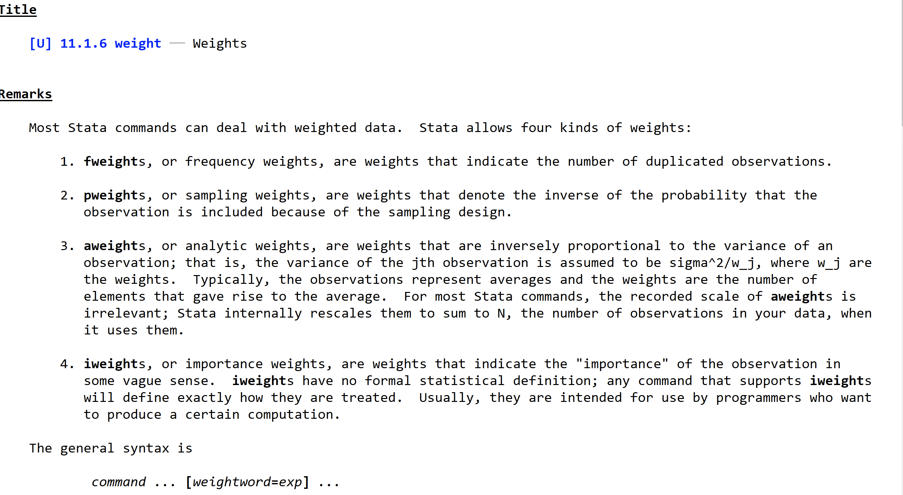

Para tabulados debemos usar los factores de frecuencia o los iweights si son valores con decimales.


```{stata, collectcode=TRUE}

tab r104 [iw=fac00]
tab actpr r104 [iw=fac00]

```


## De doble entrada

La última tabla es de doble entrada. Como vemos no presenta los porcentajes.
Hay de varios tipos 

### Porcentaje de filas
```{stata, collectcode=TRUE}

tab actpr r104 [iw=fac00], row

```

### Porcentaje de columnas

```{stata, collectcode=TRUE}

tab actpr r104 [iw=fac00], col

```


### Porcentaje del total

```{stata, collectcode=TRUE}

tab actpr r104 [iw=fac00], cell

```

Todos juntos... más vale hacerlo más simple


```{stata, collectcode=TRUE}

tab actpr r104 [iw=fac00], row col cell nofreq

```

#### Más de dos variables


```{stata, collectcode=TRUE}

table region actpr2012 r104 [iw=fac00]

table region actpr2012 r104 [iw=fac00], stat(percent)
table (region actpr2012) r104 [iw=fac00], stat(percent)
table region (actpr2012 r104) [iw=fac00], stat(percent)

table region actpr2012 r104 [iw=fac00], stat(percent,total) // default
table region actpr2012 r104 [iw=fac00], stat(percent, across (r104))
table region actpr2012 r104 [iw=fac00], stat(percent, across (actpr2012))


```

# Tablas de estadísticos

El comando "tabstat" nos sirve para hacer tablas de estadístico. Podemos combinar diferentes estadísticos y podemos utilizar la función "by)


```{stata, collectcode=TRUE}

tabstat money if actpr2012==10 [aw=fac00]

tabstat money if actpr2012==10 [aw=fac00], s(mean p50 p90)

tabstat money if actpr2012==10 [aw=fac00], s(mean p50 p90) by(r104)


```

 

# Gráficos

## Variables cuantitativas

Tenemos que ver: centro, dispersión, sesos y valores atípicos

### Histograma

```{stata, collectcode=TRUE}

histogram money if actpr2012==10 

histogram money if actpr2012==10 , normal


```

### Kdensity


```{stata, collectcode=TRUE}
kdensity money if actpr2012==10 

```
### Boxplot


```{stata, collectcode=TRUE}
graph box money if actpr2012==10 
graph hbox money if actpr2012==10
graph hbox money if actpr2012==10, over(r104)

```

## Variables cualitativas


### Pastel... pero ya no se usa. 


```{stata, collectcode=TRUE}

graph pie  if actpr2012==10, over(r104)

```

### Barras

Para que sea más fácil e intuitivo utilizaremos un "ado".


```
ssc install catplot, replace

```

```{stata, collectcode=TRUE}

catplot r104 if actpr2012==10
catplot r104 if actpr2012==10 [iw=fac]

catplot r104 actpr2012 if r106>14 [iw=fac]

```


Un poquito más complicado


```{stata, collectcode=TRUE}


catplot r104 actpr2012 if r106>15, ///
percent(r104) ///
var1opts(label(labsize(small))) ///
var2opts(label(labsize(small)))  ///
title("Condición de actividad" ///
, span size(medium)) ///
blabel(bar, format(%4.1f)) ///
intensity(25) ///
asyvars


```


Podemos cambiar de esquemas para hacer estos gráficos más bonitos. 
Podemos instalar unos mejores esquemas 


```
ssc install blindschemes, replace

```


```{stata, collectcode=TRUE}


catplot r104 actpr2012 if r106>15, ///
percent(r104) ///
var1opts(label(labsize(small))) ///
var2opts(label(labsize(small)))  ///
title("Condición de actividad" ///
, span size(medium)) ///
blabel(bar, format(%4.1f)) ///
intensity(25) ///
asyvars scheme(plottig)
```


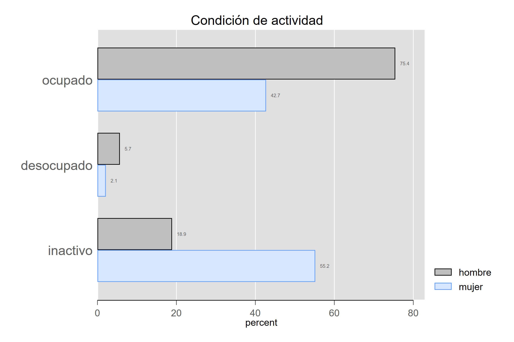

