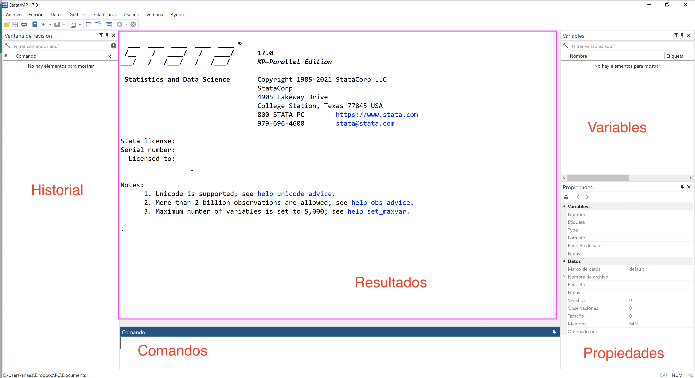
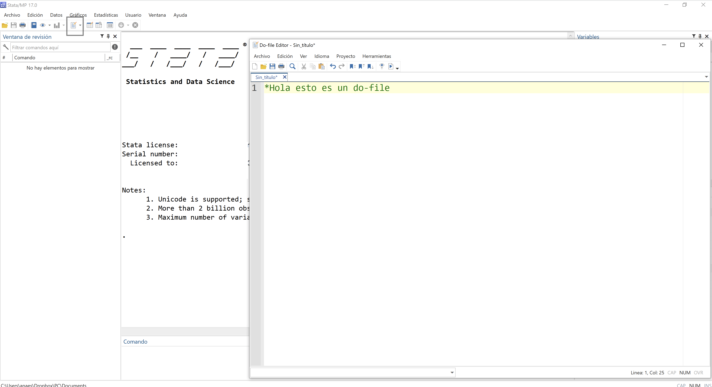
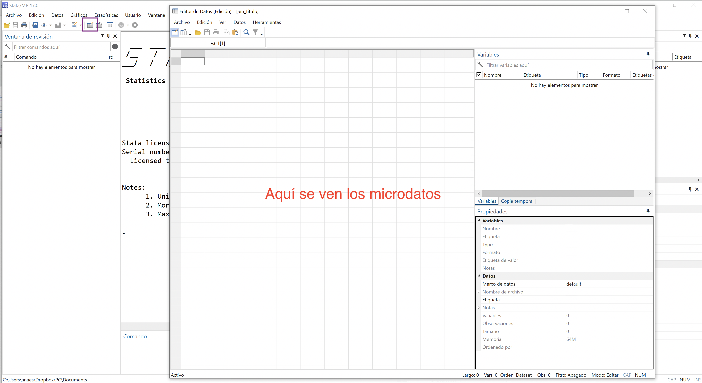
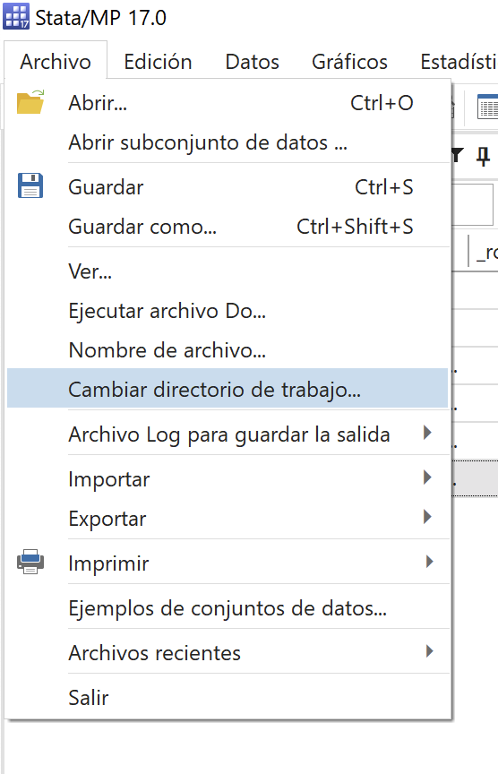
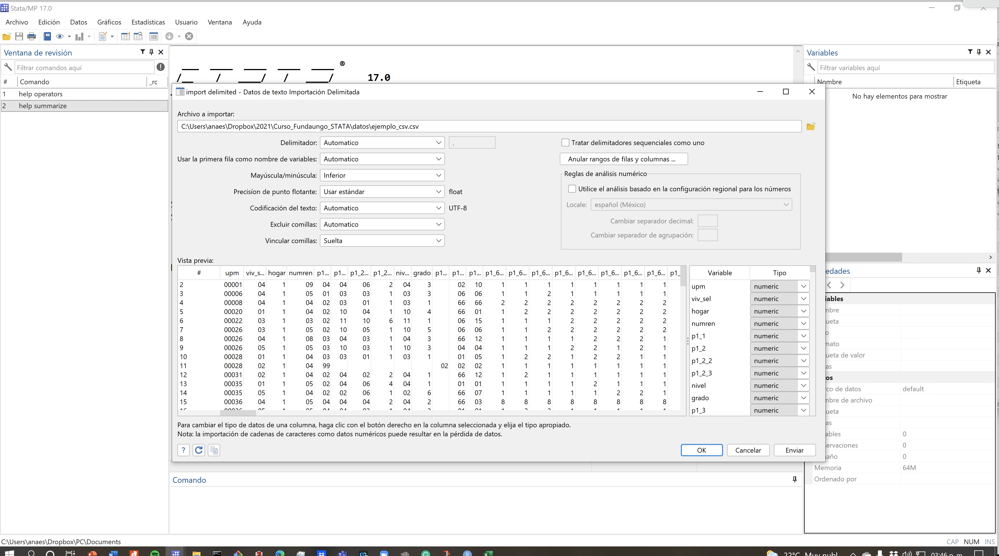
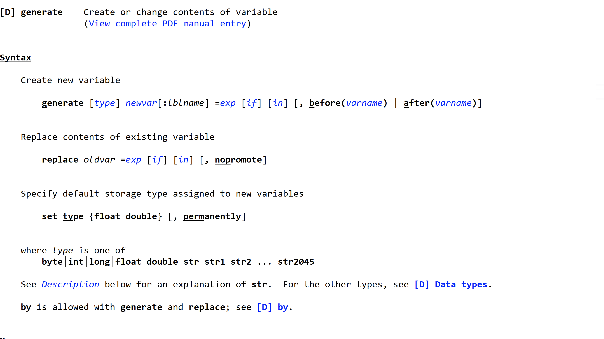
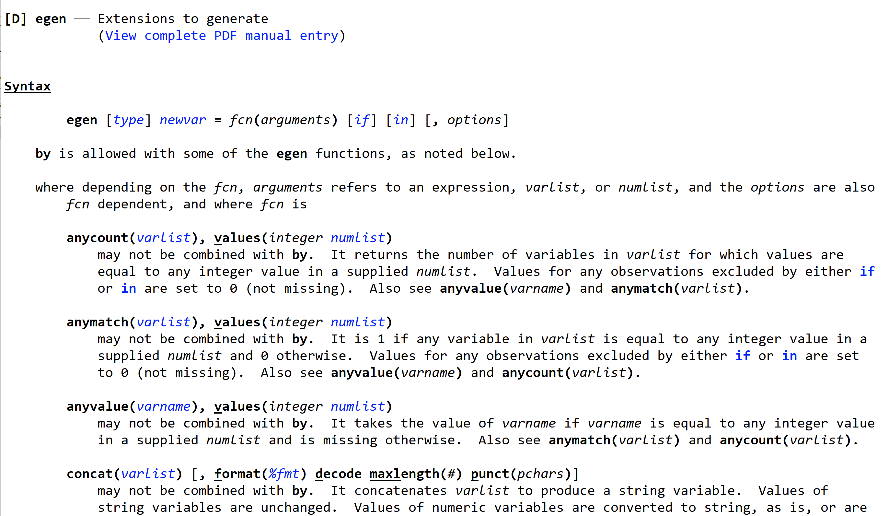
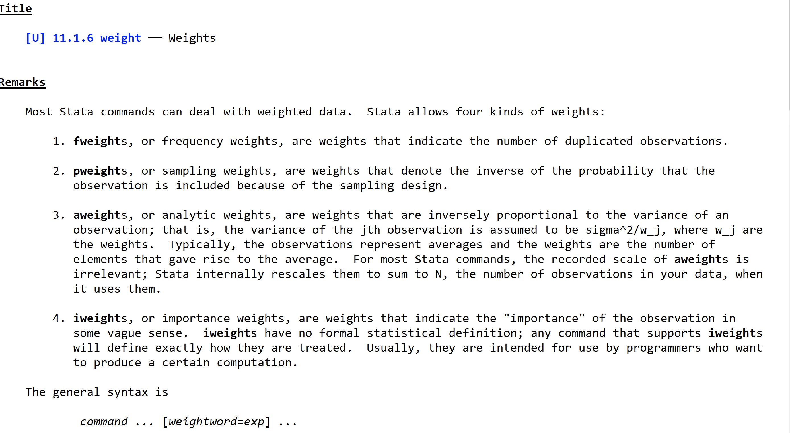

Sesión 1
================
Ana Escoto
10/9/2021

# Introducción a STATA

## Pantalla y ventanas principales



## STATA y su pantalla

Pero además utilizaremos otras pantallas. Una muy útil es la de el
*do-file* Aquí copiamos los comandos para no olvidar lo que hemos hecho
en nuestra base de datos y poderlo replicar. Documentar nuestro código
es importante para la replicabilidad (de nosotros mismos y de los demás)



Otra muy útil es la edición de datos, <b>“Edit”</b>. Parece una hoja de
Excel y podemos editar los datos directamente, capturales, ponerles
nombre, etiquetarlos.



*¡Tip!* Es muy útil usar en lugar de la edición, la de “Navegación” o
*"Browse*. Se ve aparentemente igual. Pero sólo inspecciona y no cambia.
Esto es útil, porque si editamos es mucho mejor hacerlo por comando para
que quede claro qué hicimos con nuestra base de datos


## STATA como una gran calculadora

El comando más simple es comando “display”, este comando nos presenta en
la pantalla de resultados las operaciones que le pidamos.

``` stata
display  "hola"
di 5+3
di chi2(10, 85)
```

    hola

    8

    1

Pedir ayuda (Nota, con un asterisco los comandos no se vuelven de
“chocolate”)

``` stata
help display

help chi2

help operators
```

    request ignored because of batch mode

    request ignored because of batch mode

    request ignored because of batch mode


Los operadores son importantísimos porque nos ayudan a poner filtros y
saber cómo “lee” nuestras indicaciones STATA

# Usando bases de datos

Vamos a utilizar la Encuesta de Hogares de Propósitos Múltiples de 2019,
que está en el repositorio. Si descargas el repositorio, descomprime el
archivo ehpm\_2019.rar.

Para que te funcionen mejor los comandos de este material, puedes
establecer el directorio de donde descargaste el repositorio, cambiando
el directorio de trabajo. Este el directorio que por *default*, STATA
buscará tus archivos.

Esto lo puedes hacer en el Menú y luego buscas la carpeta.



O puedes hacerlo desde línea de comando:

    cd "C:\carpeta\carpeta"

Para abrir una base de datos existente

Podemos hacerlo una base de datos “manualmente” usando: \* los botones
de “abrir” \* File -&gt; Open o

-   Los botones CTRL + O

O bien escribir la liga de donde los estamos utilizando.

``` stata
use "datos/ehpm_2019", clear

describe
```

    Contains data from datos/ehpm_2019.dta
     Observations:        74,448                  
        Variables:           816                  
    -------------------------------------------------------------------------------
    Variable      Storage   Display    Value
        name         type    format    label      Variable label
    -------------------------------------------------------------------------------
    r421a           byte    %8.0g                 rango de número de personas de la
                                                    empresa o negocio en el que
                                                    trabaja
    edicion         int     %8.0g                 año de levantamiento
    lote            int     %8.0g                 lote
    tipo            byte    %8.0g      tipo       tipo
    folio           float   %9.0g                 folio
    viv             byte    %8.0g      viv        vivienda
    r101            byte    %8.0g                 número de orden
    idboleta        long    %12.0g                identificador de hogar
    fac00           float   %9.0g                 factor de expansión
    area            byte    %8.0g      area       Área geográfica
    region          byte    %8.0g      region     región geográfica
    correlativo     int     %8.0g                 correlativo
    municauto       byte    %8.0g                 municipios autorrepresentados
    estratoarea     int     %8.0g      estratoarea
                                                  estratos
    codigomunic     int     %8.0g      codigomunic
                                                  códigos municipales
    autorrepresen~o byte    %8.0g                 municipio autorrepresentado
    znorte          byte    %8.0g                 zona norte
    r004            byte    %8.0g      r004       código de departamento
    r005            byte    %8.0g                 código de municipio
    r006            byte    %8.0g                 código de cantón
    r015            byte    %8.0g      r015       mes de levantamiento
    r017            byte    %8.0g      r017       resultado final de la entrevista
    r018            byte    %8.0g                 número de orden del principal
                                                    informante
    r019            byte    %8.0g      r019       entrevista con boleta anexa
    r020            byte    %8.0g      r020       confiabilidad de la información
    r021a           byte    %8.0g                 número de miembros del hogar
    r021b           byte    %8.0g                 personas de 4 años y más del
                                                    hogar
    r022            byte    %8.0g                 personas de 5 años y más del
                                                    hogar
    r023            byte    %8.0g                 personas con trabajo agropecuario
                                                    del hogar
    r024            byte    %8.0g                 personas que se enfermaron del
                                                    hogar
    r027            byte    %8.0g                 personas que utilizan internet
                                                    del hogar
    r033            byte    %8.0g                 personas de 4 años y más del
                                                    hogar
    r034            byte    %8.0g                 personas de 5 años y más del
                                                    hogar
    r035            byte    %8.0g                 personas con trabajo agropecuario
                                                    del hogar
    r035a           byte    %8.0g                 personas con producción de patio
                                                    del hogar
    r036            byte    %8.0g                 personas que se enfermaron del
                                                    hogar
    r038            byte    %8.0g      r038       boleta con sección de subsidios
    r042            byte    %8.0g      r042       boleta con sección de subsidios
    r04a            byte    %8.0g                 personas con producción de patio
                                                    del hogar
    actpr           byte    %8.0g      actpr      estado ocupacional
    actpr2012       byte    %8.0g      actpr2012
                                                  estado ocupacional agregado
    actse           byte    %8.0g      actse      estado ocupacional urbano
    aproba1         byte    %8.0g                 número de grados aprobados
    ciuo414         byte    %8.0g      ciuo414    grupo ocupacional (ciuo 08)
    ciiu416         byte    %8.0g      ciiu416    rama de actividad económica (ciiu
                                                    rev. 4)
    ciuo436         byte    %8.0g      ciuo436    grupo ocupacional (ciuo 08)
    ciiu438         byte    %8.0g      ciiu438    rama de actividad económica (ciiu
                                                    rev. 4)
    d411b           byte    %8.0g                 número de días trabajados la
                                                    semana anterior
    d412b           byte    %8.0g                 número de días habituales
                                                    trabajados en la semana
    gasper          float   %9.0g                 gasto percápita del hogar
    gastohog        float   %9.0g                 gasto total del hogar
    ghali           float   %9.0g                 gasto del hogar en alimentación
    ghu12           float   %9.0g                 gasto del hogar en artículos y
                                                    servicios en los últimos 12
                                                    meses
    gmed            float   %9.0g                 gasto del hogar en educación
    gmem            float   %9.0g                 gasto del hogar en empleo
    gmsa            float   %9.0g                 gasto del hogar en salud
    gmvi            float   %9.0g                 gasto del hogar en vivienda
    gtmh            float   %9.0g                 gasto del hogar en alimentación y
                                                    otros artículos (total sección
                                                    8)
    h411a           byte    %8.0g                 horas trabajadas la semana
                                                    anterior
    h412a           byte    %8.0g                 horas habituales trabajadas en la
                                                    semana
    imeds           float   %9.0g                 ingreso por empleo dependiente
    imei            float   %9.0g                 ingreso por empleo independiente
    imes            float   %9.0g                 ingreso por empleo secundario
    imnl            float   %9.0g                 ingreso por actividades no
                                                    laborales
    ingfa           float   %9.0g                 ingreso total del hogar
    ingneto         float   %9.0g                 ingreso neto por actividades
                                                    agropecuarias
    ingpe           float   %9.0g                 ingreso percápita del hogar
    ingre           float   %9.0g                 ingreso total (persona)
    irefa           float   %9.0g                 ingreso del hogar por remesas
                                                    monetarias
    irefa1          float   %9.0g                 ingreso del hogar por remesas en
                                                    efectivo
    irefb           float   %9.0g                 ingreso del hogar por remesas
                                                    eventuales
    irefb1          float   %9.0g                 ingreso del hogar por
                                                    transferencias bancarias
    ires            float   %9.0g                 ingreso del hogar por remesas en
                                                    especie
    miemh           byte    %8.0g                 número de miembros del hogar
    miemh_exdomes~o byte    %8.0g                 número de miembros del hogar
                                                    excluyendo servicio doméstico
    money           float   %9.0g                 ingreso por trabajo dependiente o
                                                    empleo independiente
    oia             float   %9.0g                 otros ingresos
    oimed           float   %9.0g                 otros ingresos por trabajo
                                                    dependiente
    pobreza         byte    %8.0g      pobreza    condición de pobreza del hogar
    segm            byte    %8.0g      segm       segmentación del mercado laboral
                                                    urbano
    totayuda        float   %9.0g                 ingreso del hogar en remesas
                                                    monetarias y no monetarias
    r01a            byte    %8.0g      r01a       tiene el hogar algún miembro en
                                                    el extranjero
    r01b            byte    %8.0g                 total de miembros en el
                                                    extranjero
    r01c            byte    %8.0g                 hombres en el extranjero
    r01d            byte    %8.0g                 mujeres en el extranjero
    r01e            byte    %8.0g                 tiempo en el extranjero del más
                                                    reciente
    r01f_a          int     %8.0g      r01f_a     país de residencia de los
                                                    miembros en el extranjero
    r01f_b          int     %8.0g      r01f_b     país de residencia de los
                                                    miembros en el extranjero
    r01f_c          int     %8.0g      r01f_c     país de residencia de los
                                                    miembros en el extranjero
    r01f_d          byte    %8.0g      r01f_d     país de residencia de los
                                                    miembros en el extranjero
    r01otr          byte    %8.0g                 otro país de residencia
    r02a            byte    %8.0g      r02a       tiene el hogar pupilos
    r02b            byte    %8.0g                 total de pupilos
    r02c            byte    %8.0g                 hombres pupilos
    r02d            byte    %8.0g                 mujeres pupilas
    r03             byte    %8.0g      r03        realizó el hogar viajes
                                                    turísticos
    r0401           byte    %8.0g                 viajes con pernoctación
    r0402           byte    %8.0g                 viajes de un día
    r0501           float   %9.0g      r0501      gasto en viajes con pernoctación
    r0502           int     %8.0g      r0502      gasto en viajes de un día
    r06             byte    %8.0g      r06        hay menores de edad cuyos padres
                                                    no viven en el hogar
    r06a            byte    %8.0g      r06a       ausencia por muerte
    r06b            byte    %8.0g      r06b       ausencia por migración
    r06c            byte    %8.0g      r06c       ausencia por abandono
    r06otr          byte    %8.0g                 ausencia por otra razón
    r103            byte    %8.0g      r103       relación de parentesco
    r103otr         byte    %8.0g                 otra relación de parentesco
    r104            byte    %8.0g      r104       sexo
    r105m           byte    %8.0g      r105m      mes de nacimiento
    r105a           int     %8.0g                 año de nacimiento
    r106            byte    %8.0g                 edad en años cumplidos
    r107            byte    %8.0g      r107       estado familiar
    r108a           byte    %8.0g                 número de orden del padre
                                                    (menores de edad)
    r108b           byte    %8.0g                 numero de orden de la madre
                                                    (menores de edad)
    r201a           byte    %8.0g      r201a      asiste a un centro de educación
                                                    inicial (menores de 4 años)
    r202a           byte    %8.0g      r202a      sabe leer y escribir
    r202b           byte    %8.0g      r202b      donde aprendió a leer y escribir
    r202botr        byte    %8.0g                 otro lugar donde aprendió a leer
                                                    y escribir
    r203            byte    %8.0g      r203       estudia actualmente
    r204            byte    %8.0g      r204       nivel que cursa actualmente
    r204otr         byte    %8.0g                 otro nivel que cursa actualmente
    r204g           byte    %8.0g                 grado que cursa actualmente
    r205            byte    %8.0g      r205       jornada de estudios
    r206a           byte    %8.0g      r206a      está repitiendo el grado que
                                                    cursa
    r206b           byte    %8.0g                 número de veces que ha repetido
                                                    el grado que cursa
    r207            byte    %8.0g      r207       razón por la que está repitiendo
                                                    el grado
    r207otr         byte    %8.0g                 otra razón por la que está
                                                    repitiendo el grado
    r208            byte    %8.0g      r208       razón por la que abandonó o
                                                    reprobó el grado
    r208otr         byte    %8.0g                 otra razón por la que abandonó o
                                                    reprobó el grado
    r209            byte    %8.0g      r209       estudió la parvularia
    r210a           byte    %8.0g      r210a      tipo de centro de enseñanza al
                                                    que asiste
    r210b           byte    %8.0g      r210b      tiene el centro de enseñanza
                                                    centro de cómputo o aula
                                                    informática
    r210c           byte    %8.0g      r210c      tiene el centro de enseñanza
                                                    biblioteca
    r211a           byte    %8.0g      r211a      recibe gratis del centro de
                                                    enseñanza asistencia médica
    r211b           byte    %8.0g      r211b      recibe gratis del centro de
                                                    enseñanza alimentos
    r211c           byte    %8.0g      r211c      recibe gratis del centro de
                                                    enseñanza textos
    r211d           byte    %8.0g      r211d      recibe gratis del centro de
                                                    enseñanza beca para matrícula
    r211e           byte    %8.0g      r211e      recibe gratis del centro de
                                                    enseñanza beca de cuota escolar
    r211f           byte    %8.0g      r211f      recibe gratis del centro de
                                                    enseñanza zapatos
    r211g           byte    %8.0g      r211g      recibe gratis del centro de
                                                    enseñanza útiles escolares
    r211h           byte    %8.0g      r211h      recibe gratis del centro de
                                                    enseñanza uniformes
    r212            byte    %8.0g      r212       se matriculó durante el año
                                                    lectivo
    r213            byte    %8.0g      r213       ha asistido alguna vez a algún
                                                    centro de enseñanza
    r214            byte    %8.0g      r214       tipo de centro de enseñanza al
                                                    que asistió
    r215a           byte    %8.0g      r215a      Último nivel cursado y aprobado
    r215otr         byte    %8.0g                 otro nivel cursado y aprobado
    r215b           byte    %8.0g                 Último grado cursado y aprobado
    r216a           byte    %8.0g      r216a      repitió el último grado que
                                                    aprobó
    r216b           byte    %8.0g                 número de veces que repitió el
                                                    último grado que aprobó
    r217            byte    %8.0g      r217       título o diploma que obtuvo en el
                                                    nivel más alto que aprobó
    r217otro        byte    %8.0g                 otro título o diploma que obtuvo
                                                    en el nivel más alto que aprobó
    r218            byte    %8.0g      r218       carrera en la cual se graduó de
                                                    pregrado o postgrado
    r218otr         byte    %8.0g                 otra carrera en la cual se graduó
                                                    de pregrado o postgrado
    r219            byte    %8.0g      r219       razón por la que no estudia
                                                    actualmente
    r219otr         byte    %8.0g                 otra razón por la que no estudia
                                                    actualmente
    r220a1          byte    %8.0g      r220a1     gastó en matrícula
    r220a2          float   %9.0g                 monto anual gastado en matrícula
    r220b1          byte    %8.0g      r220b1     gastó en útiles
    r220b2          float   %9.0g                 monto anual gastado en útiles
    r220c1          byte    %8.0g      r220c1     gastó en uniformes
    r220c2          float   %9.0g                 monto anual gastado en uniformes
    r220d1          byte    %8.0g      r220d1     gastó en textos
    r220d2          float   %9.0g                 monto anual gastado en textos
    r220e1          byte    %8.0g      r220e1     gastó en calzado escolar
    r220e2          float   %9.0g                 monto anual gastado en calzado
                                                    escolar
    r220f1          byte    %8.0g      r220f1     gastó en cuota de padres de
                                                    familia
    r220f2          float   %9.0g                 monto anual en cuota de padres de
                                                    familia
    r221a1          byte    %8.0g      r221a1     gastó en cuota escolar
    r221a2          float   %9.0g                 monto mensual en cuota escolar
    r221b1          byte    %8.0g      r221b1     gastó en transporte
    r221b2          float   %9.0g                 monto mensual en transporte
    r221c1          byte    %8.0g      r221c1     gastó en refrigerio
    r221c2          float   %9.0g                 monto mensual en refrigerio
    r221d1          byte    %8.0g      r221d1     tuvo otros gastos escolares
    r221d2          float   %9.0g                 monto mensual en otros gastos
    gasto_mat_ini~n float   %9.0g                 monto anual gastado en educación
                                                    el año anterior para este año
    r301            byte    %8.0g      r301       tipo de vivienda
    r301otr         byte    %8.0g                 otro tipo de vivienda
    r301b           byte    %8.0g                 número de pisos (concominio)
    r301c           byte    %8.0g      r301c      vivienda en buen estado
    r302            byte    %8.0g      r302       material predominante en el techo
    r302otr         byte    %8.0g                 otro material predominante en el
                                                    techo
    r302b           byte    %8.0g      r302b      techo en buen estado
    r303            byte    %8.0g      r303       material predominante en las
                                                    paredes
    r303otr         byte    %8.0g                 otro material predominante en las
                                                    paredes
    r303b           byte    %8.0g      r303b      paredes en buen estado
    r304            byte    %8.0g      r304       material predominante en el piso
    r304otr         byte    %8.0g                 otro material predominante en el
                                                    piso
    r305            byte    %8.0g                 habitaciones de uso exclusivo del
                                                    hogar
    r306            byte    %8.0g                 habitaciones utilizadas
                                                    exclusivamente como dormitorios
    r307            byte    %8.0g                 habitaciones utilizadas
                                                    exclusivamente para trabajar o
                                                    para negocio
    r308            float   %9.0g      r308       forma de tenencia de la vivienda
    r308otr         byte    %8.0g                 otra forma de tenencia de la
                                                    vivienda
    r308b           byte    %8.0g                 número de orden del propietario
    r308c           float   %9.0g                 cuota mensual (alquiler o pago a
                                                    plazos)
    r309            byte    %8.0g      r309       paga con algún bien o servicio el
                                                    uso de la vivienda
    r310            int     %8.0g                 valor que tendrían los bienes o
                                                    servicios pagados
    r310a           float   %9.0g                 valor que pagaría por mes si
                                                    tuviera que alquilar la
                                                    vivienda
    r310b           byte    %8.0g      r310b      está el terreno inscrito en el
                                                    cnr a nombre de algún miembro
                                                    del hogar
    r310_01         byte    %8.0g                 número de orden del propietario
                                                    del terreno
    r311            byte    %8.0g      r311       tipo de alumbrado de la vivienda
    r311otr         byte    %8.0g                 otro tipo de alumbrado de la
                                                    vivienda
    r312            float   %9.0g      r312       tiene la vivienda servicio de
                                                    agua por cañería
    r312d           byte    %8.0g                 días de la última semana que le
                                                    cayó agua
    r312h           byte    %8.0g                 horas al día de la última semana
                                                    que le cayo agua
    r313            float   %9.0g      r313       forma de abastecimiento de agua
                                                    de la vivienda
    r313otr         byte    %8.0g                 otra forma de abastecimiento de
                                                    agua de la vivienda
    r314            byte    %8.0g      r314       servicio de baño de la vivienda
    r314otr         byte    %8.0g                 otro servicio de baño de la
                                                    vivienda
    r315a           byte    %8.0g      r315a      tiene servicio sanitario la
                                                    vivienda
    r316            byte    %8.0g      r316       tiene acceso a servicio sanitario
    r317            byte    %8.0g      r317       tipo de servicio sanitario que
                                                    utiliza
    r318            byte    %8.0g      r318       comparte el servicio sanitario
                                                    con otros hogares
    r318_1          byte    %8.0g                 número de hogares que utilizan el
                                                    servicio sanitario
    r319a           byte    %8.0g      r319a      forma en la que se deshacen de
                                                    las excretas
    r319b           byte    %8.0g      r319b      forma en la que se deshacen de
                                                    las excretas
    r319c           byte    %8.0g      r319c      forma en la que se deshacen de
                                                    las excretas
    r319otr         byte    %8.0g                 otra forma en la que se deshacen
                                                    de las excretas
    r320            byte    %8.0g      r320       forma en la que se deshacen de
                                                    las aguas grises
    r320otr         byte    %8.0g                 otra forma en la que se deshacen
                                                    de las aguas grises
    r321a1          byte    %8.0g      r321a1     recibe el hogar subsidio de gas
    r321a2          byte    %8.0g      r321a2     recibe el hogar subsidio de
                                                    energía eléctrica
    r321a3          byte    %8.0g      r321a3     recibe el hogar bonos comunidades
                                                    solidarias rurales
    r321a4          byte    %8.0g      r321a4     recibe el hogar bonos comunidades
                                                    solidarias urbanas
    r321a5          byte    %8.0g      r321a5     recibe el hogar pensión básica
                                                    universal
    r321a6          byte    %8.0g      r321a6     recibe el hogar subsidio de agua
    r321a7          byte    %8.0g      r321a7     recibe el hogar otro beneficio
    r321a8          byte    %8.0g      r321a8     recibe el hogar paquete agrícola
    r321aotr        byte    %8.0g                 otro beneficio que recibe el
                                                    hogar
    r322            byte    %8.0g      r322       combustible utilizado
                                                    predominantemente para cocinar
    r322otr         byte    %8.0g                 otro combustible utilizado
                                                    predominantemente para cocinar
    r323            byte    %8.0g      r323       tiene servicio doméstico
    r323b           float   %9.0g                 pago mensual por el servicio
                                                    doméstico
    r3241a          byte    %8.0g      r3241a     tiene el hogar teléfono fijo
    r3241b          byte    %8.0g                 número de teléfonos fijos
    r3242a          byte    %8.0g      r3242a     tiene el hogar teléfono celular
    r3242b          byte    %8.0g                 número de teléfonos celulares
    r3243a          byte    %8.0g      r3243a     tiene el hogar internet
    r3243a1         byte    %8.0g      r3243a1    tiene el hogar internet móvil
    r3244a          byte    %8.0g      r3244a     tiene el hogar cable
    r3245a          byte    %8.0g      r3245a     tiene el hogar cable del vecino
    r325            byte    %8.0g      r325       forma en la que se deshace de la
                                                    basura
    r325ot          byte    %8.0g                 otra forma en la que se deshace
                                                    de la basura
    r32601a         byte    %8.0g      r32601a    tiene el hogar radio
    r32601b         byte    %8.0g                 número de radios
    r32602a         byte    %8.0g      r32602a    tiene el hogar equipo de sonido
    r32602b         byte    %8.0g                 número de equipos de sonido
    r32603a         byte    %8.0g      r32603a    tiene el hogar televisor
    r32603b         byte    %8.0g                 número de televisores
    r32604a         byte    %8.0g      r32604a    tiene el hogar video casetera o
                                                    dvd
    r32604b         byte    %8.0g                 número de video caseteras o dvd
    r32605a         byte    %8.0g      r32605a    tiene el hogar refrigeradora
    r32605b         byte    %8.0g                 número de refrigeradoras
    r32606a         byte    %8.0g      r32606a    tiene el hogar lavadora
    r32606b         byte    %8.0g                 número de lavadoras
    r32607a         byte    %8.0g      r32607a    tiene el hogar licuadora
    r32607b         byte    %8.0g                 número de licuadoras
    r32608a         byte    %8.0g      r32608a    tiene el hogar ventilador
    r32608b         byte    %8.0g                 número de ventiladores
    r32609a         byte    %8.0g      r32609a    tiene el hogar computadora
    r32609b         byte    %8.0g                 número de computadoras
    r32610a         byte    %8.0g      r32610a    tiene el hogar secadora de ropa
    r32610b         byte    %8.0g                 número de secadoras de ropa
    r32611a         byte    %8.0g      r32611a    tiene el hogar máquina de coser
    r32611b         byte    %8.0g                 número de máquinas de coser
    r32612a         byte    %8.0g      r32612a    tiene el hogar vehículo (uso del
                                                    hogar)
    r32612b         byte    %8.0g                 número de vehículos
    r32613a         byte    %8.0g      r32613a    tiene el hogar plancha
    r32613b         byte    %8.0g                 número de planchas
    r32614a         byte    %8.0g      r32614a    tiene el hogar horno microondas
    r32614b         byte    %8.0g                 número de hornos microondas
    r32615a         byte    %8.0g      r32615a    tiene el hogar videojuegos
    r32615b         byte    %8.0g                 número de videojuegos
    r32616a         byte    %8.0g      r32616a    tiene el hogar generador de
                                                    electricidad
    r32616b         byte    %8.0g                 número de generadores de
                                                    electricidad
    r32617a         byte    %8.0g      r32617a    tiene el hogar aire acondicionado
    r32617b         byte    %8.0g                 número de aires acondicionados
    r32618a         byte    %8.0g      r32618a    tiene el hogar tanque o cisterna
    r32618b         byte    %8.0g                 número de tanques o cisternas
    r32619a         byte    %8.0g      r32619a    tiene el hogar motocicleta
    r32619b         byte    %8.0g                 número de motocicletas
    r327            byte    %8.0g      r327       ha tenido algún problema por
                                                    corrientes de agua en la
                                                    vivienda
    r3281           byte    %8.0g      r3281      tuvo daños en la vivienda
    r3282           byte    %8.0g      r3282      tuvo pérdida de muebles o enseres
    r3283           byte    %8.0g      r3283      tuvo pérdida de alimentos
    r3284           byte    %8.0g      r3284      tuvo pérdida de animales de
                                                    granja
    r3285           byte    %8.0g      r3285      tuvo lesiones a un miembro del
                                                    hogar
    r3286           byte    %8.0g      r3286      tuvo enfermedad en un miembro del
                                                    hogar
    r3287           byte    %8.0g      r3287      tuvo otros daños
    r329            byte    %8.0g      r329       ha sufrido en la vivienda algún
                                                    derrumbe o alúd
    r330            byte    %8.0g      r330       hay alguna cárcava o quebrada que
                                                    pueda afectar a la vivienda
    r33101a         byte    %8.0g      r33101a    tipo de gasto en agua (servicio
                                                    de anda)
    r33101b         float   %9.0g                 gasto mensual en agua (servicio
                                                    de anda)
    r33101a1        byte    %8.0g      r33101a1   tipo de gasto en agua envasada
    r33101b1        float   %9.0g                 gasto mensual en agua envasada
    r33101a2        byte    %8.0g      r33101a2   tipo de gasto en agua (otras
                                                    fuentes)
    r33101b2        float   %9.0g                 gasto mensual en agua (otras
                                                    fuentes)
    r33102a         byte    %8.0g      r33102a    tipo de gasto en electricidad
    r33102b         float   %9.0g                 gasto mensual en electricidad
    r33103a         byte    %8.0g      r33103a    tipo de gasto en kerosene
    r33103b         float   %9.0g                 gasto mensual en kerosene
    r33104a         byte    %8.0g      r33104a    tipo de gasto en gas propano
    r33104b         float   %9.0g                 gasto mensual en gas propano
    r33105a         byte    %8.0g      r33105a    tipo de gasto en candela
    r33105b         float   %9.0g                 gasto mensual en candela
    r33106a         byte    %8.0g      r33106a    tipo de gasto en leña
    r33106b         float   %9.0g                 gasto mensual en leña
    r33107a         byte    %8.0g      r33107a    tipo de gasto en carga de batería
    r33107b         float   %9.0g                 gasto mensual en carga de batería
    r33108a         byte    %8.0g      r33108a    tipo de gasto en internet móvil
    r33108b         float   %9.0g                 gasto mensual en internet móvil
    r33109a         byte    %8.0g      r33109a    tipo de gasto en teléfono fijo
    r33109b         float   %9.0g                 gasto mensual en teléfono fijo
    r33110a         byte    %8.0g      r33110a    tipo de gasto en celular
    r33110b         float   %9.0g                 gasto mensual en celular
    r33111a         byte    %8.0g      r33111a    tipo de gasto en cable/cable del
                                                    vecino
    r33111b         float   %9.0g                 gasto mensual en cable/cable del
                                                    vecino
    r33112a         byte    %8.0g      r33112a    tipo de gasto en internet (hogar)
    r33112b         float   %9.0g                 gasto mensual en internet (hogar)
    r33113a         byte    %8.0g      r33113a    tipo de gasto en cibercafé
    r33113b         float   %9.0g                 gasto mensual en cibercafé
    r33114a         byte    %8.0g      r33114a    tipo de gasto en impuestos
                                                    municipales
    r33114b         float   %9.0g                 gasto mensual en impuestos
                                                    municipales
    r33115a         byte    %8.0g      r33115a    tipo de gasto en pago de
                                                    vigilancia
    r33115b         float   %9.0g                 gasto mensual en pago de
                                                    vigilancia
    r33116a         byte    %8.0g      r33116a    tipo de gasto en recolección de
                                                    basura
    r33116b         float   %9.0g                 gasto mensual en recolección de
                                                    basura
    r33117a         byte    %8.0g      r33117a    tipo de gasto en paquete de
                                                    servicios
    r33117b         float   %9.0g                 gasto mensual en paquete de
                                                    servicios
    r33118a         byte    %8.0g      r33118a    tipo de gasto en otro servicio
    r33118b         float   %9.0g                 gasto mensual en otro servicio
    r33118otr       byte    %8.0g                 otro servicio que recibe el hogar
    r331total       float   %9.0g                 gasto mensual total en servicios
    r402            byte    %8.0g                 número de orden del informante
    r403            byte    %8.0g      r403       realizó algún trabajo la semana
                                                    anterior
    r404            byte    %8.0g      r404       realizó alguna actividad para
                                                    obtener ingresos la semana
                                                    anterior
    r405            byte    %8.0g      r405       tiene algún empleo fijo al que
                                                    próximamente volverá
    r405b           byte    %8.0g      r405b      tiene algún negocio, empresa o
                                                    actividad propia a la que
                                                    próximamente volverá
    r406            float   %9.0g      r406       razón por la que no trabajó la
                                                    semana anterior
    r4061           byte    %8.0g                 número de semanas que dejó de
                                                    trabajar
    r4062           byte    %8.0g                 número de días que dejó de
                                                    trabajar
    r406a           byte    %8.0g      r406a      recibió sueldo, salario o paga
                                                    durante el período de ausencia
    r406b           byte    %8.0g      r406b      tiempo en el que regresará al
                                                    mismo trabajo
    r407            byte    %8.0g      r407       buscó trabajo o trató de
                                                    establecer su propia empresa o
                                                    negocio
    r408            byte    %8.0g      r408       actividad que realizó para buscar
                                                    trabajo o establecer su propia
                                                    empresa o nego
    r408otr         byte    %8.0g                 otra actividad que realizó para
                                                    buscar trabajo o establecer su
                                                    propia empresa o
    r409            byte    %8.0g      r409       razón por la que no buscó trabajo
    r409otr         byte    %8.0g                 otra razón por la que no buscó
                                                    trabajo
    r409a           byte    %8.0g      r409a      hubiera estado dispuesto a
                                                    trabajar si hubiera encontrado
                                                    trabajo o conseguido c
    r410            byte    %8.0g      r410       ha trabajado antes
    r411a           byte    %8.0g                 horas (de lunes a viernes) que
                                                    trabajó la semana anterior
    r411b           byte    %8.0g                 días (de lunes a viernes) que
                                                    trabajó la semana anterior
    r411c           byte    %8.0g      r411c      jornada (de lunes a viernes) que
                                                    trabajó la semana anterior
    r411d           byte    %8.0g                 horas (sábado y domingo) que
                                                    trabajó la semana anterior
    r411e           byte    %8.0g                 días (sábado y domingo) que
                                                    trabajó la semana anterior
    r411f           byte    %8.0g      r411f      jornada (sábado y domingo) que
                                                    trabajó la semana anterior
    r412a           byte    %8.0g                 horas (de lunes a viernes) que
                                                    trabaja habitualmente a la
                                                    semana
    r412b           byte    %8.0g                 días (de lunes a viernes) que
                                                    trabaja habitualmente a la
                                                    semana
    r412c           byte    %8.0g      r412c      jornada (de lunes a viernes) que
                                                    trabaja habitualmente a la
                                                    semana
    r412d           byte    %8.0g                 horas (sábado y domingo) que
                                                    trabaja habitualmente a la
                                                    semana
    r412e           byte    %8.0g                 días (sábado y domingo) que
                                                    trabaja habitualmente a la
                                                    semana
    r412f           byte    %8.0g      r412f      jornada (sábado y domingo) que
                                                    trabaja habitualmente a la
                                                    semana
    r413            byte    %8.0g      r413       razón por la que trabaja menos de
                                                    40 horas en la semana
    r413otr         byte    %8.0g                 otra razón por la que trabaja
                                                    menos de 40 horas
    r413a           byte    %8.0g      r413a      razón por la que trabaja 40 horas
                                                    o más en la semana
    r413a_otr       byte    %8.0g                 otra razón por la que trabaja 40
                                                    horas o más en la semana
    r414            int     %8.0g                 código de la ocupación (ciuo 08)
    r416            int     %8.0g                 código de la actividad económica
                                                    (ciiu rev. 4)
    r414indicador   byte    %8.0g      r414indicador
                                                  indicador de actividad
                                                    agropecuaria
    r417a01         byte    %8.0g      r417a01    en su empleo trabaja con
                                                    herramientas peligrosas
    r417a02         byte    %8.0g      r417a02    en su empleo trabaja con químicos
    r417a03         byte    %8.0g      r417a03    en su empleo trabaja llevando
                                                    cargas pesadas
    r417a04         byte    %8.0g      r417a04    en su empleo trabaja en ambiente
                                                    con gases, fuego
    r417a05         byte    %8.0g      r417a05    en su empleo trabaja en ambiente
                                                    con polvo, humo
    r417a06         byte    %8.0g      r417a06    en su empleo trabaja con
                                                    explosivos
    r417a07         byte    %8.0g      r417a07    en su empleo trabaja en alturas
    r417a08         byte    %8.0g      r417a08    en su empleo trabaja bajo el
                                                    agua, en altamar o en manglares
    r417a09         byte    %8.0g      r417a09    en su empleo trabaja bajo tierra
    r417a10         byte    %8.0g      r417a10    en su empleo trabaja con
                                                    temperaturas o humedad extrema
    r417a11         byte    %8.0g      r417a11    en su empleo trabaja en ambiente
                                                    bullicioso
    r417a12         byte    %8.0g      r417a12    en su empleo trabaja con luz
                                                    insuficiente
    r417a13         byte    %8.0g      r417a13    en su empleo trabaja con mota u
                                                    otras partículas
    r417a14         byte    %8.0g      r417a14    en su empleo trabaja con alguna
                                                    otra dificultad
    r417a15         byte    %8.0g      r417a15    en su empleo trabaja con riesgo
                                                    de accidentes graves
    r417a16         byte    %8.0g      r417a16    en su empleo trabaja con
                                                    agresiones verbales o amenazas
    r417a14otr      byte    %8.0g                 otra dificultad con la cual
                                                    trabaja
    r417a           byte    %8.0g      r417a      le proveen de medidas o equipo de
                                                    seguridad
    r418            byte    %8.0g      r418       categoría ocupacional
    r418tr          byte    %8.0g                 otra categoría ocupacional
    r418a           byte    %8.0g      r418a      razón principal por la que no
                                                    trabaja como asalariado
                                                    permanente
    r418a_otr       byte    %8.0g                 otra razón por la que no trabaja
                                                    como asalariado permanente
    r419            byte    %8.0g      r419       ha firmado contrato de trabajo
    r419a           byte    %8.0g                 número de meses de duración del
                                                    contrato
    r420            byte    %8.0g      r420       sector en el que trabaja
    r420_otr        byte    %8.0g                 otro sector en el que trabaja
    r421            int     %8.0g                 número de personas de la empresa
                                                    o negocio en el que trabaja
    r422a           byte    %8.0g      r422a      cobertura del isss
    r422b           byte    %8.0g      r422b      cobertura de bienestar
                                                    magisterial
    r422c           byte    %8.0g      r422c      cobertura del ipsfa
    r422d           byte    %8.0g      r422d      cobertura de seguro de salud
                                                    colectivo
    r422e           byte    %8.0g      r422e      cobertura de seguro de salud
                                                    privado
    r422f           byte    %8.0g      r422f      cobertura de la afp
    r422g           byte    %8.0g      r422g      cobertura del inpep
    r423            byte    %8.0g      r423       periodicidad con la que recibe el
                                                    sueldo o salario
    r424            float   %9.0g                 sueldo o salario bruto que
                                                    recibió de acuerdo a la
                                                    periodicidad
    r424a           byte    %8.0g      r424a      le deducen del salario el
                                                    impuesto sobre la renta
    r42501a         float   %9.0g                 monto que recibe por pago de
                                                    horas extras
    r42501b         byte    %8.0g                 veces al año que recibe pago de
                                                    horas extras
    r42502a         float   %9.0g                 monto que recibe por salario
                                                    vacacional
    r42502b         byte    %8.0g                 veces al año que recibe salario
                                                    vacacional
    r42503a         float   %9.0g                 monto que recibe por aguinaldo
    r42503b         byte    %8.0g                 veces al año que recibe aguinaldo
    r42504a         float   %9.0g                 monto que recibe por
                                                    bonificaciones, comisiones,
                                                    viáticos
    r42504b         byte    %8.0g                 veces al año que recibe
                                                    bonificaciones, comisiones,
                                                    viáticos
    r42505a         float   %9.0g                 alimentos o refrigerios
    r42505b         int     %8.0g                 veces al año que recibe alimentos
                                                    o refrigerios
    r42506a         int     %8.0g                 monto que recibe por ropa,
                                                    uniformes o calzado
    r42506b         byte    %8.0g                 veces al año que recibe ropa,
                                                    uniformes o calzado
    r42507a         int     %8.0g                 monto que recibe por mercaderías
                                                    (en especie)
    r42507b         byte    %8.0g                 veces al año que recibe
                                                    mercaderías (en especie)
    r42508a         int     %8.0g                 monto que recibe por vivienda
    r42508b         byte    %8.0g                 veces al año que recibe vivienda
    r42509a         float   %9.0g                 monto que recibe por transporte o
                                                    combustible
    r42509b         byte    %8.0g                 veces al año que recibe
                                                    transporte o combustible
    r42510a         int     %8.0g                 monto que recibe por seguro
                                                    privado de salud
    r42510b         byte    %8.0g                 veces al año que recibe seguro
                                                    privado de salud
    r42511a         int     %8.0g                 monto que recibe por propinas
    r42511b         byte    %8.0g                 veces al año que recibe propinas
    r42512a         int     %8.0g                 monto que recibe por otro
                                                    beneficio
    r42512b         byte    %8.0g                 veces al año que recibe otro
                                                    beneficio
    r42512ot        byte    %8.0g                 otro beneficio que recibe
    r425a           byte    %8.0g      r425a      ha participado en algún curso en
                                                    la empresa o institución en la
                                                    que trabaja
    r425b           byte    %8.0g      r425b      la empresa o institucion en la
                                                    que trabaja ha llevado a cabo
                                                    una negociación co
    r426            byte    %8.0g      r426       lugar en el que realiza la
                                                    actividad
    r426a           byte    %8.0g      r426a      lleva la empresa o institución
                                                    contabilidad
    r426b1          byte    %8.0g      r426b1     la empresa o institución está
                                                    registrada en las oficinas de
                                                    impuestos
    r426b2          byte    %8.0g      r426b2     la empresa o institución está
                                                    registrada en las oficinas de
                                                    seguridad social
    r427            byte    %8.0g      r427       periodicidad con la que recibe el
                                                    ingreso del negocio
    r428            float   %9.0g                 ingreso bruto recibido en el
                                                    tiempo establecido
    r429            float   %9.0g                 costo total erogado en el tiempo
                                                    establecido
    r430            byte    %8.0g      r430       utiliza productos para consumo
                                                    propio de los bienes producidos
                                                    por el negocio
    r431            float   %9.0g                 monto de los productos del
                                                    negocio utilizados para el
                                                    consumo del hogar
    r431a           byte    %8.0g      r431a      tipo de propiedad de la empresa o
                                                    negocio donde trabaja
    r431otr         byte    %8.0g                 otro tipo de propiedad de la
                                                    empresa o negocio donde trabaja
    r432            byte    %8.0g      r432       tiene una ocupación secundaria
    r433            byte    %8.0g                 horas de trabajo semanales que
                                                    dedica al empleo secundario
    r434            float   %9.0g                 ingreso recibido por el empleo
                                                    secundario
    r43501a         byte    %8.0g                 monto que recibe por pago de
                                                    horas extras
    r43501b         byte    %8.0g                 veces al año que recibe pago de
                                                    horas extras
    r43502a         byte    %8.0g                 monto que recibe por salario
                                                    vacacional
    r43502b         byte    %8.0g                 veces al año que recibe salario
                                                    vacacional
    r43503a         int     %8.0g                 monto que recibe por aguinaldo
    r43503b         byte    %8.0g                 veces al año que recibe aguinaldo
    r43504a         int     %8.0g                 monto que recibe por
                                                    bonificaciones, comisiones,
                                                    viáticos
    r43504b         byte    %8.0g                 veces al año que recibe
                                                    bonificaciones, comisiones,
                                                    viáticos
    r43505a         float   %9.0g                 alimentos o refrigerios
    r43505b         byte    %8.0g                 veces al año que recibe alimentos
                                                    o refrigerios
    r43506a         int     %8.0g                 monto que recibe por ropa,
                                                    uniformes o calzado
    r43506b         byte    %8.0g                 veces al año que recibe ropa,
                                                    uniformes o calzado
    r43507a         byte    %8.0g                 monto que recibe por mercaderías
                                                    (en especie)
    r43507b         byte    %8.0g                 veces al año que recibe
                                                    mercaderías (en especie)
    r43508a         byte    %8.0g                 monto que recibe por vivienda
    r43508b         byte    %8.0g                 veces al año que recibe vivienda
    r43509a         byte    %8.0g                 monto que recibe por transporte o
                                                    combustible
    r43509b         byte    %8.0g                 veces al año que recibe
                                                    transporte o combustible
    r43510a         byte    %8.0g                 monto que recibe por seguro
                                                    privado de salud
    r43510b         byte    %8.0g                 veces al año que recibe seguro
                                                    privado de salud
    r43511a         byte    %8.0g                 monto que recibe por propinas
    r43511b         byte    %8.0g                 veces al año que recibe propinas
    r43512a         byte    %8.0g                 monto que recibe por otro
                                                    beneficio
    r43512b         byte    %8.0g                 veces al año que recibe otro
                                                    beneficio
    r43512ot        byte    %8.0g                 otro beneficio que recibe
    r436            int     %8.0g                 código de la ocupación secundaria
                                                    (ciuo 08)
    r438            int     %8.0g                 código de la actividad económica
                                                    secundaria (ciiu rev. 4)
    r439            int     %8.0g                 número de personas de la empresa
                                                    o negocio en el que trabaja por
                                                    empleo secunda
    r440            byte    %8.0g      r440       categoria ocupacional de los
                                                    cesantes
    r440tr          byte    %8.0g                 otra categoria ocupacional de los
                                                    cesantes
    r441            byte    %8.0g      r441       había firmado contrato de trabajo
                                                    (cesantes)
    r442            byte    %8.0g      r442       sector en el que trabajaba
                                                    (cesantes)
    r443            byte    %8.0g      r443       razón por la que dejó la
                                                    ocupación anterior (cesantes)
    r443otr         byte    %8.0g                 otra razón por la que dejó la
                                                    ocupación anterior (cesantes)
    r44401a         float   %9.0g                 monto que recibe por remesas del
                                                    exterior
    r44401b         byte    %8.0g                 veces al año que recibe remesas
                                                    del exterior
    r44402a         float   %9.0g                 monto que recibe por ayuda de
                                                    familiares que residen en el
                                                    país
    r44402b         byte    %8.0g                 veces al año que recibe ayuda de
                                                    familiares que residen en el
                                                    país
    r44403a         float   %9.0g                 monto que recibe por cuota
                                                    alimenticia
    r44403b         byte    %8.0g                 veces al año que recibe cuota
                                                    alimenticia
    r44404a         int     %8.0g                 monto que recibe por alquiler de
                                                    viviendas
    r44404b         byte    %8.0g                 veces al año que recibe alquiler
                                                    de viviendas
    r44405a         int     %8.0g                 monto que recibe por alquiler de
                                                    negocios o máquinas
    r44405b         byte    %8.0g                 veces al año que recibe alquiler
                                                    de negocios o máquinas
    r44406a         int     %8.0g                 monto que recibe por alquiler de
                                                    terrenos
    r44406b         byte    %8.0g                 veces al año que recibe alquiler
                                                    de terrenos
    r44407a         float   %9.0g                 monto que recibe por jubilación,
                                                    pensión de invalidez o vejez
    r44407b         byte    %8.0g                 veces al año que recibe
                                                    jubilación, pensión de
                                                    invalidez o vejez
    r44408a         int     %8.0g                 monto que recibe por depreciación
                                                    de vehículos
    r44408b         byte    %8.0g                 veces al año que recibe
                                                    depreciación de vehículos
    r44409a         float   %9.0g                 monto que recibe por pensión por
                                                    sobrevivencia
    r44409b         byte    %8.0g                 veces al año que recibe pensión
                                                    por sobrevivencia
    r44410a         int     %8.0g                 monto que recibe por ahorros
    r44410b         byte    %8.0g                 veces al año que recibe ahorros
    r44411a         float   %9.0g                 monto que recibe por otros
                                                    ingresos
    r44411b         byte    %8.0g                 veces al año que recibe otros
                                                    ingresos
    r44411ot        byte    %8.0g                 otros ingresos
    r44501          int     %8.0g                 monto que recibe por utilidades
                                                    empresariales
    r44502          int     %8.0g                 monto que recibe por dividendos
                                                    por acciones
    r44503          int     %8.0g                 monto que recibe por intereses
    r44504          int     %8.0g                 monto que recibe por herencias,
                                                    loterías, juegos de azar
    r44505          int     %8.0g                 monto que recibe por
                                                    indemnización por retiro o
                                                    despido
    r44506          int     %8.0g                 monto que recibe por ayuda del
                                                    gobierno en efectivo
    r44507          int     %8.0g                 monto que recibe por actividades
                                                    eventuales
    r44508          int     %8.0g                 monto que recibe por
                                                    arrendamiento de tierras
    r44509          int     %8.0g                 monto que recibe por remesas
                                                    eventuales del exterior
    r44510          int     %8.0g                 monto que recibe por remesas
                                                    eventuales locales
    r44511          int     %8.0g                 monto que recibe por aguinaldo
    r44512          double  %10.0g                monto que recibe por otros
                                                    ingresos
    r44512ot        byte    %8.0g                 otros ingresos
    r445a           byte    %8.0g                 edad a la que empezó a trabajar
    r445b1          byte    %8.0g      r445b1     es miembro activo de una
                                                    cooperativa
    r445b2          byte    %8.0g      r445b2     es miembro activo de un sindicato
    r445b3          byte    %8.0g      r445b3     es miembro activo de una
                                                    asociación gremial
    r445b4          byte    %8.0g      r445b4     es miembro activo de una
                                                    asociación profesional
    r445b5          byte    %8.0g      r445b5     es miembro activo de una
                                                    asociación de empresas
    r445b6          byte    %8.0g      r445b6     es miembro activo de alguna otra
                                                    organización
    r445b6otr       byte    %8.0g                 otra organización a la cual
                                                    pertenece
    r445c           byte    %8.0g      r445c      hay alguna época del año en que
                                                    no se consigue trabajo
    r445d           byte    %8.0g      r445d      período en el cual no se consigue
                                                    trabajo
    r445e           byte    %8.0g      r445e      período en el cual ha pasado sin
                                                    poder trabajar contra su
                                                    voluntad
    r445fh1         byte    %8.0g                 horas dedicadas a cuidar, atender
                                                    sin pago a niños
    r445fh2         byte    %8.0g                 horas dedicadas a reparar o dar
                                                    mantenimiento a la vivienda,
                                                    muebles, aparatos d
    r445fh3         byte    %8.0g                 horas dedicadas a realizar el
                                                    quehacer del hogar
    r445fh4         byte    %8.0g                 horas dedicadas a acarrear leña
    r445fh5         byte    %8.0g                 horas dedicadas a acarrear agua
    r445fm1         byte    %8.0g                 minutos dedicadas a cuidar,
                                                    atender sin pago a niños
    r445fm2         byte    %8.0g                 minutos dedicadas a reparar o dar
                                                    mantenimiento a la vivienda,
                                                    muebles, aparatos
    r445fm3         byte    %8.0g                 minutos dedicadas a realizar el
                                                    quehacer del hogar
    r445fm4         byte    %8.0g                 minutos dedicadas a acarrear leña
    r445fm5         byte    %8.0g                 minutos dedicadas a acarrear agua
    r44601          byte    %8.0g      r44601     desayunó fuera del hogar
    r44602          byte    %8.0g      r44602     almorzó fuera del hogar
    r44603          byte    %8.0g      r44603     cenó fuera del hogar
    r44604          byte    %8.0g      r44604     tuvo refrigerio fuera del hogar
    r44605          byte    %8.0g      r44605     tuvo otro gasto fuera del hogar
                                                    en alimentación
    r44605ot        byte    %8.0g                 otro gasto fuera del hogar en
                                                    alimentación
    r44701          byte    %8.0g                 veces a la semana que gastó en
                                                    desayuno
    r44702          byte    %8.0g                 veces a la semana que gastó en
                                                    almuerzo
    r44703          byte    %8.0g                 veces a la semana que gastó en
                                                    cena
    r44704          byte    %8.0g                 veces a la semana que gastó en
                                                    refrigerio
    r44705          byte    %8.0g                 veces a la semana que gastó en
                                                    otro gasto fuera del hogar en
                                                    alimentación
    r44801          float   %9.0g                 monto gastado por día en desayuno
    r44802          float   %9.0g                 monto gastado por día en almuerzo
    r44803          float   %9.0g                 monto gastado por día en cena
    r44804          float   %9.0g                 monto gastado por día en
                                                    refrigerio
    r44805          float   %9.0g                 monto gastado por día en otro
                                                    gasto fuera del hogar en
                                                    alimentación
    r44901          byte    %8.0g      r44901     utilizó transporte público
    r44902          byte    %8.0g      r44902     utilizó teléfono público
    r44903          byte    %8.0g      r44903     utilizó combustible, reparación
                                                    de vehículo
    r44904          byte    %8.0g      r44904     utilizó hospedaje
    r45001          byte    %8.0g                 veces a la semana que utilizó
                                                    transporte público
    r45002          byte    %8.0g                 veces a la semana que utilizó
                                                    teléfono público
    r45003          byte    %8.0g                 veces a la semana que utilizó
                                                    combustible, reparación de
                                                    vehículo
    r45004          byte    %8.0g                 veces a la semana que utilizó
                                                    hospedaje
    r45101          float   %9.0g                 monto gastado por día en
                                                    transporte público
    r45102          byte    %8.0g                 monto gastado por día en teléfono
                                                    público
    r45103          float   %9.0g                 monto gastado por día en
                                                    combustible, reparación de
                                                    vehículo
    r45104          float   %9.0g                 monto gastado por día en
                                                    hospedaje
    r452a           byte    %8.0g      r452a      tuvo en posesión tierra con
                                                    vocación agropecuaria
    r452b           float   %9.0g                 número de manzanas con vocación
                                                    agropecuaria
    r453            byte    %8.0g      r453       ha realizado actividades
                                                    agropecuarias como patrono o
                                                    cuenta propia
    r502            byte    %8.0g                 número de orden del informante
    r503a           byte    %8.0g      r503a      forma de tenencia de la tierra
    r503a1          byte    %8.0g                 número de orden del propietario
                                                    de la tierra
    r503b           byte    %8.0g      r503b      forma secundaria de tenencia de
                                                    la tierra
    r503aotr        byte    %8.0g                 otra forma de tenencia de la
                                                    tierra
    r5031           byte    %8.0g      r5031      tiene título de propiedad
                                                    inscrito en el centro nacional
                                                    de registro
    r5032           byte    %8.0g      r5032      se siente seguro de la propiedad
                                                    de la tierra
    r5033           byte    %8.0g      r5033      persona que reclamaría la tierra
    r5033otr        byte    %8.0g                 otra persona que reclamaría la
                                                    tierra
    r504            float   %9.0g                 superficie total en manzanas de
                                                    explotación agropecuaria
    r5051           float   %9.0g                 superficie con cultivo
    r5052           float   %9.0g                 superficie con pastos naturales
    r5053           float   %9.0g                 superficie en descanso
    r5054           float   %9.0g                 superficie con bosque o
                                                    matorrales
    r5055           float   %9.0g                 superficie dada en arrendamiento
    r5056           float   %9.0g                 superficie con infraestructura
                                                    bajo techo
    r5057           float   %9.0g                 superficie con otro tipo de
                                                    infraestructura
    r5057a          byte    %8.0g                 sin tierra (pecuario)
    r5058           float   %9.0g                 superficie con otro tipo de
                                                    estructura
    r50508ot        byte    %8.0g                 otro tipo de estructura
    r506            byte    %8.0g      r506       tipo de actividad agropecuaria
    r506b           byte    %8.0g                 número de niños de 5 a 17 años
                                                    del hogar que participan en la
                                                    actividad agrop
    r507            byte    %8.0g      r507       solicitó crédito para la
                                                    actividad agropecuaria
    r508            byte    %8.0g      r508       obtuvo el crédito solicitado
    r509            byte    %8.0g      r509       entidad a la que solicitó el
                                                    crédito
    r509otr         byte    %8.0g                 otra entidad a la que solicitó el
                                                    crédito
    r510            double  %10.0g                ingreso bruto de la producción
                                                    agropecuaria
    r511            double  %10.0g                costo total de la producción
                                                    agropecuaria
    r512            byte    %8.0g      r512       realizó actividades agropecuarias
                                                    en el patio de la vivienda
    r513a           byte    %8.0g                 metros cuadrados dedicados a
                                                    granos en el patio
    r513b           byte    %8.0g                 metros cuadrados dedicados a
                                                    hortalizas en el patio
    r513c           byte    %8.0g                 número de árboles frutales en el
                                                    patio
    r513d           byte    %8.0g                 número de animales en el patio
    r514            byte    %8.0g      r514       utilizó esta producción para
                                                    comsumo o comercialización
    r515a           float   %9.0g                 monto estimado para autoconsumo
    r515b           int     %8.0g                 monto estimado para
                                                    comercialización
    r601            byte    %8.0g      r601       tipo de seguro médico
    r601otr         byte    %8.0g                 otro tipo de seguro médico
    r602            byte    %8.0g      r602       síntoma, enfermedad o lesión más
                                                    reciente que tuvo el mes
                                                    anterior
    r602otr         byte    %8.0g                 otro síntoma, enfermedad o lesión
                                                    más reciente que tuvo el mes
                                                    anterior
    r603            byte    %8.0g      r603       persona a la que consultó
    r604            byte    %8.0g      r604       lugar en el que consultó
    r604otr         byte    %8.0g                 otro lugar en el que consultó
    r6051a          byte    %8.0g      r6051a     tuvo consulta médica
    r6052a          float   %9.0g                 monto gastado en consulta médica
    r6053a          byte    %8.0g      r6053a     institución que cubrió la
                                                    consulta médica
    r6053a_otr      byte    %8.0g                 otra institución que cubrió la
                                                    consulta médica
    r6051b          byte    %8.0g      r6051b     tuvo análisis de laboratorio
    r6052b          float   %9.0g                 monto gastado en análisis de
                                                    laboratorio
    r6053b          byte    %8.0g      r6053b     institución que cubrió los
                                                    análisis de laboratorio
    r6053b_otr      byte    %8.0g                 otra institución que cubrió los
                                                    análisis de laboratorio
    r6051c          byte    %8.0g      r6051c     tuvo rayos x
    r6052c          int     %8.0g                 monto gastado en rayos x
    r6053c          byte    %8.0g      r6053c     institución que cubrió los rayos
                                                    x
    r6053c_otr      byte    %8.0g                 otra institución que cubrió los
                                                    rayos x
    r6051d          byte    %8.0g      r6051d     tuvo otros exámenes
    r6052d          float   %9.0g                 monto gastado en otros exámenes
    r6053d          byte    %8.0g      r6053d     institución que cubrió los otros
                                                    exámenes
    r6053d_otr      byte    %8.0g                 otra institución que cubrió los
                                                    otros exámenes
    r606            byte    %8.0g      r606       estudo hospitalizado
    r607            byte    %8.0g      r607       lugar en el que estuvo
                                                    hospitalizado
    r607otr         byte    %8.0g                 otro lugar en el que estuvo
                                                    hospitalizado
    r608            byte    %8.0g                 días que estuvo hospitalizado
    r6091a          byte    %8.0g      r6091a     tuvo hospitalización
    r6092a          float   %9.0g                 monto gastado en hospitalización
    r6093a          byte    %8.0g      r6093a     institución que cubrió la
                                                    hospitalización
    r6094aotr       byte    %8.0g                 otra institución que cubrió la
                                                    hospitalización
    r6093b          byte    %8.0g      r6093b     tuvo medicamentos
    r6091b          int     %8.0g                 monto gastado en medicamentos
    r6092b          byte    %8.0g      r6092b     institución que cubrió los
                                                    medicamentos
    r6094botr       byte    %8.0g                 otra institución que cubrió los
                                                    medicamentos
    r6091c          byte    %8.0g      r6091c     tuvo exámenes de laboratorio,
                                                    rayos x y otros gastos
    r6092c          int     %8.0g                 monto gastado en exámenes de
                                                    laboratorio, rayos x y otros
                                                    gastos
    r6093c          byte    %8.0g      r6093c     institución que cubrió los
                                                    exámenes de laboratorio, rayos
                                                    x y otros gastos
    r6094cotr       byte    %8.0g                 otra institución que cubrió los
                                                    exámenes de laboratorio, rayos
                                                    x y otros gast
    r6101           byte    %8.0g      r6101      obtuvo medicinas
    r6102           float   %9.0g                 monto gasto en medicinas
    r6103           byte    %8.0g      r6103      institución que cubrió las
                                                    medicinas
    r610otr         byte    %8.0g                 otra institucion que cubrió las
                                                    medicinas
    r611            byte    %8.0g      r611       razón por la que no consultó al
                                                    sistema de salud pública
    r611otr         byte    %8.0g                 otra razón por la que no consultó
                                                    al sistema de salud pública
    r612            byte    %8.0g      r612       lugar al que acudiría si algún
                                                    miembro del hogar se enfermara
    r612otr         byte    %8.0g                 otro lugar al que acudiría si
                                                    algún miembro del hogar se
                                                    enfermara
    r613            byte    %8.0g      r613       razón por la que no asistiría a
                                                    un centro del sistema de salud
                                                    pública
    r613otr         byte    %8.0g                 otra razón por la que no
                                                    asistiría a un centro del
                                                    sistema de salud pública
    r701            byte    %8.0g                 número de orden del informante
    r702a           byte    %8.0g      r702a      tiene el hogar algún miembro que
                                                    fue parte del hogar en el
                                                    extranjero
    r703            byte    %8.0g      r703       recibe remesas en efectivo o en
                                                    especie de forma regular o
                                                    eventual
    r7041a          int     %8.0g                 monto recibido en efectivo
    r7043a          byte    %8.0g      r7043a     periodicidad de lo recibido en
                                                    efectivo
    r7043aotr       byte    %8.0g                 otra periodicidad de lo recibido
                                                    en efectivo
    r7041b          float   %9.0g                 monto recibido a través de
                                                    transferencias bancarias
    r7042b          byte    %8.0g      r7042b     periodicidad de lo recibido a
                                                    través de transferencias
                                                    bancarias
    r7042botr       byte    %8.0g                 otra periodicidad de lo recibido
                                                    a través de transferencias
                                                    bancarias
    r70501a         int     %8.0g                 monto eventual destinado a
                                                    consumo
    r70501b         float   %9.0g                 monto en divisas destinado a
                                                    consumo
    r70502a         int     %8.0g                 monto eventual destinado a
                                                    vivienda
    r70502b         float   %9.0g                 monto en divisas destinado a
                                                    vivienda
    r70503a         byte    %8.0g                 monto eventual destinado a cuota
                                                    de alquiler de vivienda
    r70503b         int     %8.0g                 monto en divisas destinado a
                                                    cuota de alquiler de vivienda
    r70504a         int     %8.0g                 monto eventual destinado a compra
                                                    de vivienda
    r70504b         int     %8.0g                 monto en divisas destinado a
                                                    compra de vivienda
    r70505a         int     %8.0g                 monto eventual destinado a
                                                    negocio
    r70505b         float   %9.0g                 monto en divisas destinado a
                                                    negocio
    r70506a         int     %8.0g                 monto eventual destinado a gastos
                                                    médicos permanentes
    r70506b         int     %8.0g                 monto en divisas destinado a
                                                    gastos médicos permanentes
    r70507a         int     %8.0g                 monto eventual destinado a gastos
                                                    médicos de internación
    r70507b         int     %8.0g                 monto en divisas destinado a
                                                    gastos médicos de internación
    r70508a         int     %8.0g                 monto eventual destinado a otros
                                                    gastos médicos permanentes
    r70508b         float   %9.0g                 monto en divisas destinado a
                                                    otros gastos médicos
                                                    permanentes
    r70509a         int     %8.0g                 monto eventual destinado a gastos
                                                    médicos eventuales
    r70509b         int     %8.0g                 monto en divisas destinado a
                                                    gastos médicos eventuales
    r70510a         int     %8.0g                 monto eventual destinado a otros
                                                    gastos médicos eventuales
    r70510b         int     %8.0g                 monto en divisas destinado a
                                                    otros gastos médicos eventuales
    r70511a         int     %8.0g                 monto eventual destinado a gastos
                                                    en educación
    r70511b         float   %9.0g                 monto en divisas destinado a
                                                    gastos en educación
    r70512a         int     %8.0g                 monto eventual destinado a compra
                                                    de insumos agrícolas
    r70512b         int     %8.0g                 monto en divisas destinado a
                                                    compra de insumos agrícolas
    r70513a         int     %8.0g                 monto eventual destinado a
                                                    inversión con fines turísticos
    r70513b         byte    %8.0g                 monto en divisas destinado a
                                                    inversión con fines turísticos
    r70514a         int     %8.0g                 monto eventual destinado a pago
                                                    de compromisos de miembros que
                                                    viven en el extra
    r70514b         int     %8.0g                 monto en divisas destinado a pago
                                                    de compromisos de miembros que
                                                    viven en el ext
    r70515a         byte    %8.0g                 monto eventual destinado a ahorro
    r70515b         int     %8.0g                 monto en divisas destinado a
                                                    ahorro
    r70516a         int     %8.0g                 monto eventual destinado a otros
                                                    gastos
    r70516b         int     %8.0g                 monto en divisas destinado a
                                                    otros gastos
    r70516ot        byte    %8.0g                 otros gastos
    r706            byte    %8.0g      r706       recibio ayuda en especie
    r706e           int     %8.0g                 monto estimado de la ayuda en
                                                    especie
    r901            byte    %8.0g      r901       hogar beneficiado con la pensión
                                                    básica universal
    r902            byte    %8.0g      r902       periodicidad con la que recibe la
                                                    pensión básica universal
    r902otr         byte    %8.0g                 otra periodicidad con la que
                                                    recibe la pensión básica
                                                    universal
    r903            long    %12.0g     r903       monto recibido por la pensión
                                                    básica universal
    r904            byte    %8.0g      r904       hogar beneficiado con el paquete
                                                    escolar
    r905            double  %10.0g                monto estimado para el paquete
                                                    escolar
    r906            byte    %8.0g      r906       hogar beneficiado con el programa
                                                    de alimentación y salud escolar
    r907a           byte    %8.0g      r907a      periodicidad con la que recibe el
                                                    programa de alimentación
                                                    escolar
    r907b           byte    %8.0g      r907b      periodicidad con la que recibe el
                                                    programa de salud escolar
    r908a           double  %10.0g                monto estimado del programa de
                                                    alimentación escolar
    r908b           double  %10.0g                monto estimado del programa de
                                                    salud escolar
    r909            byte    %8.0g      r909       hogar beneficiado con al paquete
                                                    de semilla mejorada
    r910            byte    %8.0g      r910       periodicidad con la que recibe el
                                                    paquete de semilla mejorada
    r910otr         byte    %8.0g                 otra periodicidad con la que
                                                    recibe el paquete de semilla
                                                    mejorada
    r911            double  %10.0g     r911       monto estimado del paquete de
                                                    semilla mejorada
    r912            byte    %8.0g      r912       hogar beneficiado con becas para
                                                    educación formal o formación
                                                    técnica
    r913            int     %8.0g                 monto estimado de las becas para
                                                    educación formal o formación
                                                    técnica
    r914            byte    %8.0g      r914       hogar beneficiado con el programa
                                                    temporal al ingreso (pati)
    r915            byte    %8.0g      r915       periodicidad con la que recibe el
                                                    programa temporal al ingreso
                                                    (pati)
    r915otr         byte    %8.0g                 otra periodicidad con la que
                                                    recibe el programa temporal al
                                                    ingreso (pati)
    r916            byte    %8.0g      r916       monto recibido por el programa
                                                    temporal al ingreso (pati)
    r917            byte    %8.0g      r917       hogar beneficiado con los bonos
                                                    comunidades solidarias rurales
    r918            byte    %8.0g      r918       periodicidad con la que recibe
                                                    los bonos comunidades
                                                    solidarias rurales
    r918otr         byte    %8.0g                 otra periodicidad con la que
                                                    recibe los bonos comunidades
                                                    solidarias rurales
    r919            int     %8.0g      r919       monto recibido por los bonos
                                                    comunidades solidarias rurales
    r920            byte    %8.0g      r920       hogar beneficiado con los bonos
                                                    comunidades solidarias urbanas
    r921            byte    %8.0g      r921       periodicidad con la que recibe
                                                    los bonos comunidades
                                                    solidarias urbanas
    r921otr         byte    %8.0g                 otra periodicidad con la que
                                                    recibe los bonos comunidades
                                                    solidarias urbanas
    r922            int     %8.0g      r922       monto recibido por los bonos
                                                    comunidades solidarias urbanas
    r923            byte    %8.0g      r923       compra gas licuado de petróleo
                                                    (glp)
    r924            byte    %8.0g      r924       periodicidad con la que compra
                                                    gas licuado de petróleo (glp)
    r924otros       byte    %8.0g                 otra periodicidad con la que
                                                    compra gas licuado de petróleo
                                                    (glp)
    r924_dias       int     %8.0g                 cantidad de días en que el hogar
                                                    consume el cilindro del glp
    r925            byte    %8.0g      r925       recibe el hogar subsidio de gas
    r9260101        byte    %8.0g      r9260101   destina el hogar la ayuda que
                                                    recibe a consumo
    r9260102        byte    %8.0g      r9260102   destina el hogar la ayuda que
                                                    recibe a vivienda
    r9260103        byte    %8.0g      r9260103   destina el hogar la ayuda que
                                                    recibe a negocio
    r9260104        byte    %8.0g      r9260104   destina el hogar la ayuda que
                                                    recibe a gastos médicos
    r9260105        byte    %8.0g      r9260105   destina el hogar la ayuda que
                                                    recibe a gastos en educación
    r9260106        byte    %8.0g      r9260106   destina el hogar la ayuda que
                                                    recibe a ahorro
    r9260107        byte    %8.0g      r9260107   destina el hogar la ayuda que
                                                    recibe a otros gastos
    r9260107_otros  byte    %8.0g                 otros gastos
    r927            byte    %8.0g      r927       uso del hogar del transporte
                                                    colectivo
    r927a           byte    %8.0g                 número de miembros que utilizaron
                                                    el transporte colectivo
    r927b           float   %9.0g                 monto gastado en el transporte
                                                    colectivo
    r9280101        byte    %8.0g      r9280101   el subsidio del gas beneficia al
                                                    hogar
    r9280102        byte    %8.0g      r9280102   el subsidio del gas tiene un
                                                    monto adecuado
    r9280103        byte    %8.0g      r9280103   el subsidio del gas tiene un
                                                    mecanismo de entrega eficiente
    r9280104        byte    %8.0g      r9280104   el subsidio del gas lo están
                                                    recibiendo los hogares que lo
                                                    necesitan
    r9280105        byte    %8.0g      r9280105   tiene otra opinión sobre el
                                                    subsidio del gas
    r9280105_otr    byte    %8.0g                 otra opinión sobre el subsidio
                                                    del gas
    r929            int     %8.0g                 valor anual de otros programas
                                                    sociales
    r1002a          byte    %8.0g      r1002a     utiliza teléfono celular
    r1002b          byte    %8.0g      r1002b     utiliza computadora
    r1003           byte    %8.0g      r1003      utiliza internet
    r1004           byte    %8.0g      r1004      lugar principal en el que utilizó
                                                    internet
    r1004otr        byte    %8.0g                 otro lugar en el que utilizó
                                                    internet
    r1005           byte    %8.0g      r1005      frecuencia con la que utilizó
                                                    internet
    r1006a          byte    %8.0g      r1006a     conoce el número de horas que
                                                    utilizó internet
    r1006b          byte    %8.0g                 número de horas que utilizó
                                                    internet
    r1007           byte    %8.0g      r1007      finalidad para la que utilizó
                                                    internet
    r039            byte    %8.0g      r039       hogar con sección de pobreza
                                                    multidimensional
    r1101           byte    %8.0g      r1101      elcsa adultos 1
    r1102           byte    %8.0g      r1102      elcsa adultos 2
    r1103           byte    %8.0g      r1103      elcsa adultos 3
    r1104           byte    %8.0g      r1104      elcsa adultos 4
    r1105           byte    %8.0g      r1105      elcsa adultos 5
    r1106           byte    %8.0g      r1106      elcsa adultos 6
    r1107           byte    %8.0g      r1107      elcsa adultos 7
    r1108           byte    %8.0g      r1108      elcsa adultos 8
    r1109           byte    %8.0g      r1109      elcsa menores 1
    r1110           byte    %8.0g      r1110      elcsa menores 2
    r1111           byte    %8.0g      r1111      elcsa menores 3
    r1112           byte    %8.0g      r1112      elcsa menores 4
    r1113           byte    %8.0g      r1113      elcsa menores 5
    r1114           byte    %8.0g      r1114      elcsa menores 6
    r1115           byte    %8.0g      r1115      elcsa menores 7
    control1116     byte    %8.0g      control1116
                                                  control de preguntas 1116 a 1118
    r1116_01        byte    %8.0g      r1116_01   hay en la comunidad cancha
                                                    deportiva
    r1116_02        byte    %8.0g      r1116_02   hay en la comunidad parque o zona
                                                    verde
    r1116_03        byte    %8.0g      r1116_03   hay en la comunidad áreas de
                                                    juegos para niños
    r1116_04        byte    %8.0g      r1116_04   hay en la comunidad casa comunal
    r1116_05        byte    %8.0g      r1116_05   hay en la comunidad otro espacio
                                                    recreativo
    r1116_05otr     byte    %8.0g                 otro espacio recreativo
    r1117_01        byte    %8.0g      r1117_01   utiliza el hogar la cancha
                                                    deportiva
    r1117_02        byte    %8.0g      r1117_02   utiliza el hogar el parque o zona
                                                    verde
    r1117_03        byte    %8.0g      r1117_03   utiliza el hogar las áreas de
                                                    juegos para niños
    r1117_04        byte    %8.0g      r1117_04   utiliza el hogar la casa comunal
    r1117_05        byte    %8.0g      r1117_05   utiliza el hogar este espacio
                                                    recreativo
    r1118_01        byte    %8.0g      r1118_01   razón por la que el hogar no
                                                    utiliza la cancha deportiva
    r1118_02        byte    %8.0g      r1118_02   razón por la que el hogar no
                                                    utiliza el parque o zona verde
    r1118_03        byte    %8.0g      r1118_03   razón por la que el hogar no
                                                    utiliza las áreas de juegos
                                                    para niños
    r1118_04        byte    %8.0g      r1118_04   razón por la que el hogar no
                                                    utiliza la casa comunal
    r1118_05        byte    %8.0g      r1118_05   razón por la que el hogar no
                                                    utiliza este espacio recreativo
    r1118_otr_01    byte    %8.0g                 otra razón por la que el hogar no
                                                    utiliza la cancha deportiva
    r1118_otr_02    byte    %8.0g                 otra razón por la que el hogar no
                                                    utiliza el parque o zona verde
    r1118_otr_03    byte    %8.0g                 otra razón por la que el hogar no
                                                    utiliza las áreas de juegos
                                                    para niños
    r1118_otr_04    byte    %8.0g                 otra razón por la que el hogar no
                                                    utiliza la casa comunal
    r1118_otr_05    byte    %8.0g                 otra razón por la que el hogar no
                                                    utiliza este espacio recreativo
    control1119     byte    %8.0g      control1119
                                                  control de pregunta 1119
    r1119_1         byte    %8.0g      r1119_1    alguien entró a la casa sin
                                                    permiso y robó o intentó robar
                                                    algo
    r1119_2         byte    %8.0g      r1119_2    fue víctima de asalto en la
                                                    calle, autobús, negocio u otro
                                                    lugar
    r1119_3         byte    %8.0g      r1119_3    fue víctima de robo de vehículo
    r1119_4         byte    %8.0g      r1119_4    tuvo daño a la propiedad,
                                                    incluyendo grafitis o rayones
                                                    en vehículos
    r1119_5         byte    %8.0g      r1119_5    fue víctima de engaño o estafa
    r1119_6         byte    %8.0g      r1119_6    fue víctima de extorsión
    r1119_7         byte    %8.0g      r1119_7    fue víctima de amenazas
    r1119_8         byte    %8.0g      r1119_8    fue víctima de lesiones físicas
    r1119_9         byte    %8.0g      r1119_9    fue víctima de secuestro
    r1119_10        byte    %8.0g      r1119_10   fue víctima de ataque sexual o
                                                    violación (incluyendo intento)
    r1119_11        byte    %8.0g      r1119_11   fue víctima de algún otro ilícito
    r1119_11_otr    byte    %8.0g                 otro ilícito
    control1120     byte    %8.0g      control1120
                                                  control de pregunta 1120
    r1120_1         byte    %8.0g      r1120_1    pueden salir de noche en la
                                                    comunidad
    r1120_2         byte    %8.0g      r1120_2    pueden tener un negocio en la
                                                    comunidad
    r1120_3         byte    %8.0g      r1120_3    pueden dejar sola la casa en la
                                                    comunidad
    r1120_4         byte    %8.0g      r1120_4    pueden dejar salir a los niños a
                                                    jugar en la comunidad
    r1120_5         byte    %8.0g      r1120_5    pueden las mujeres transitar con
                                                    libertad en la comunidad
    -------------------------------------------------------------------------------
    Sorted by: 

## Revisiones rápidas

También tenemos los siguientes comandos para revisar una base de datos

STATA a diferencia de otros paquetes le gusta abreviar, lo cual puede
ser una gran ventaja para cuando estamos escribiendo nuestro código
¿Cómo saber cuánto? Podemos buscar el comando en la ayuda o darle help +
comando.

Veamos qué sucedes con el somando summarize:

``` stata
*su
su r104
```

        Variable |        Obs        Mean    Std. dev.       Min        Max
    -------------+---------------------------------------------------------
            r104 |     74,448    1.528543     .499188          1          2

Este así como el siguiente sirven para toda la base si no establecemos
qué variables usamos. O para una lista de variables

``` stata
*codebook, c

codebook r104
```

    r104                                                                       sexo
    -------------------------------------------------------------------------------

                      Type: Numeric (byte)
                     Label: r104

                     Range: [1,2]                         Units: 1
             Unique values: 2                         Missing .: 0/74,448

                Tabulation: Freq.   Numeric  Label
                           35,099         1  hombre
                           39,349         2  mujer

En STATA, cada comando tiene **opciones**, son parámetros que
establecemos despues de la sintaxis normal del comando despues de una
“,”

En este caso, queremos escribir la versión compacta del codebook,
escribimos después de la coma “,”compact"

# Importación de diferentes formatos

Cuando tenemos otra base de datos abierta será muy importante, que
usemos la función clear ya sea como opción sola o al final de nuestros
comandos

``` stata
clear // cierra la sesión de la base de datos
```

## Archivos separados por coma

En el Menú, podemos seleccionar la opción importar y elegir el tipo de
archivo. El repositorio tenemos un archivo separado por comas
“ejemplo\_csv.csv”




En códigos esto es equivalente a:

``` stata
import delimited "datos\ejemplo_csv.csv", clear

describe
```

    (encoding automatically selected: UTF-8)
    (263 vars, 4,224 obs)


    Contains data
     Observations:         4,224                  
        Variables:           263                  
    -------------------------------------------------------------------------------
    Variable      Storage   Display    Value
        name         type    format    label      Variable label
    -------------------------------------------------------------------------------
    upm             int     %8.0g                 UPM
    viv_sel         byte    %8.0g                 VIV_SEL
    hogar           byte    %8.0g                 HOGAR
    numren          byte    %8.0g                 NUMREN
    p1_1            byte    %8.0g                 P1_1
    p1_2            byte    %8.0g                 P1_2
    p1_2_2          byte    %8.0g                 P1_2_2
    p1_2_3          byte    %8.0g                 P1_2_3
    nivel           byte    %8.0g                 NIVEL
    grado           byte    %8.0g                 GRADO
    p1_3            byte    %8.0g                 P1_3
    p1_4            byte    %8.0g                 P1_4
    p1_5            byte    %8.0g                 P1_5
    p1_6_1          byte    %8.0g                 P1_6_1
    p1_6_2          byte    %8.0g                 P1_6_2
    p1_6_3          byte    %8.0g                 P1_6_3
    p1_6_4          byte    %8.0g                 P1_6_4
    p1_6_5          byte    %8.0g                 P1_6_5
    p1_6_6          byte    %8.0g                 P1_6_6
    p1_6_7          byte    %8.0g                 P1_6_7
    p1_6_8          byte    %8.0g                 P1_6_8
    p1_6_9          byte    %8.0g                 P1_6_9
    p1_6_10         byte    %8.0g                 P1_6_10
    p1_6_11         byte    %8.0g                 P1_6_11
    p1_7            byte    %8.0g                 P1_7
    p1_8_1          byte    %8.0g                 P1_8_1
    p1_8_2          byte    %8.0g                 P1_8_2
    p1_9            byte    %8.0g                 P1_9
    p1_10           byte    %8.0g                 P1_10
    p1_11           byte    %8.0g                 P1_11
    p1_12           byte    %8.0g                 P1_12
    p1_13           byte    %8.0g                 P1_13
    p1_14           byte    %8.0g                 P1_14
    p1_15_1         byte    %8.0g                 P1_15_1
    p1_15_2         byte    %8.0g                 P1_15_2
    p1_15_3         byte    %8.0g                 P1_15_3
    p1_15_4         byte    %8.0g                 P1_15_4
    p1_15_5         byte    %8.0g                 P1_15_5
    p1_15_6         byte    %8.0g                 P1_15_6
    p1_16           byte    %8.0g                 P1_16
    p2_1            byte    %8.0g                 P2_1
    p2_2            byte    %8.0g                 P2_2
    p2_3_1          byte    %8.0g                 P2_3_1
    p2_3_2          byte    %8.0g                 P2_3_2
    p2_3_3          byte    %8.0g                 P2_3_3
    p2_3_4          byte    %8.0g                 P2_3_4
    p2_3_5          byte    %8.0g                 P2_3_5
    p2_3_6          byte    %8.0g                 P2_3_6
    p2_3_7          byte    %8.0g                 P2_3_7
    p2_3_8          byte    %8.0g                 P2_3_8
    p2_4            byte    %8.0g                 P2_4
    p2_5            byte    %8.0g                 P2_5
    p2_6_1          byte    %8.0g                 P2_6_1
    p2_6_2          byte    %8.0g                 P2_6_2
    p2_6_3          byte    %8.0g                 P2_6_3
    p2_6_4          byte    %8.0g                 P2_6_4
    p2_6_5          byte    %8.0g                 P2_6_5
    p2_6_6          byte    %8.0g                 P2_6_6
    p2_6_7          byte    %8.0g                 P2_6_7
    p2_6_8          byte    %8.0g                 P2_6_8
    p3_1            byte    %8.0g                 P3_1
    p3_2            byte    %8.0g                 P3_2
    p3_3            byte    %8.0g                 P3_3
    p3_4            byte    %8.0g                 P3_4
    p3_5            byte    %8.0g                 P3_5
    p3_6            byte    %8.0g                 P3_6
    p3_7            byte    %8.0g                 P3_7
    p3_8            byte    %8.0g                 P3_8
    p3_9            byte    %8.0g                 P3_9
    p3_10           byte    %8.0g                 P3_10
    p4_1            byte    %8.0g                 P4_1
    p4_2_1          byte    %8.0g                 P4_2_1
    p4_2_2          byte    %8.0g                 P4_2_2
    p4_2_3          byte    %8.0g                 P4_2_3
    p4_2_4          byte    %8.0g                 P4_2_4
    p4_2_5          byte    %8.0g                 P4_2_5
    p4_2_6          byte    %8.0g                 P4_2_6
    p4_2_7          byte    %8.0g                 P4_2_7
    p4_3_1          byte    %8.0g                 P4_3_1
    p4_3_2          byte    %8.0g                 P4_3_2
    p4_4_1_1        byte    %8.0g                 P4_4_1_1
    p4_4_1_2        byte    %8.0g                 P4_4_1_2
    p4_4_1_3        byte    %8.0g                 P4_4_1_3
    p4_4_1_4        byte    %8.0g                 P4_4_1_4
    p4_4_1_8        byte    %8.0g                 P4_4_1_8
    p4_4_2_1        byte    %8.0g                 P4_4_2_1
    p4_4_2_2        byte    %8.0g                 P4_4_2_2
    p4_4_2_3        byte    %8.0g                 P4_4_2_3
    p4_4_2_4        byte    %8.0g                 P4_4_2_4
    p4_4_2_8        byte    %8.0g                 P4_4_2_8
    p4_4_3_1        byte    %8.0g                 P4_4_3_1
    p4_4_3_2        byte    %8.0g                 P4_4_3_2
    p4_4_3_3        byte    %8.0g                 P4_4_3_3
    p4_4_3_4        byte    %8.0g                 P4_4_3_4
    p4_4_3_8        byte    %8.0g                 P4_4_3_8
    p4_4_4_1        byte    %8.0g                 P4_4_4_1
    p4_4_4_2        byte    %8.0g                 P4_4_4_2
    p4_4_4_3        byte    %8.0g                 P4_4_4_3
    p4_4_4_4        byte    %8.0g                 P4_4_4_4
    p4_4_4_8        byte    %8.0g                 P4_4_4_8
    p4_4_5_1        byte    %8.0g                 P4_4_5_1
    p4_4_5_2        byte    %8.0g                 P4_4_5_2
    p4_4_5_3        byte    %8.0g                 P4_4_5_3
    p4_4_5_4        byte    %8.0g                 P4_4_5_4
    p4_4_5_8        byte    %8.0g                 P4_4_5_8
    p4_4_6_1        byte    %8.0g                 P4_4_6_1
    p4_4_6_2        byte    %8.0g                 P4_4_6_2
    p4_4_6_3        byte    %8.0g                 P4_4_6_3
    p4_4_6_4        byte    %8.0g                 P4_4_6_4
    p4_4_6_8        byte    %8.0g                 P4_4_6_8
    p4_4_7_1        byte    %8.0g                 P4_4_7_1
    p4_4_7_2        byte    %8.0g                 P4_4_7_2
    p4_4_7_3        byte    %8.0g                 P4_4_7_3
    p4_4_7_4        byte    %8.0g                 P4_4_7_4
    p4_4_7_8        byte    %8.0g                 P4_4_7_8
    p4_5_1          byte    %8.0g                 P4_5_1
    p4_5_2          byte    %8.0g                 P4_5_2
    p4_5_3          byte    %8.0g                 P4_5_3
    p4_5_4          byte    %8.0g                 P4_5_4
    p4_5_5          byte    %8.0g                 P4_5_5
    p4_5_6          byte    %8.0g                 P4_5_6
    p4_5_7          byte    %8.0g                 P4_5_7
    p4_5_8          byte    %8.0g                 P4_5_8
    p4_5_9          byte    %8.0g                 P4_5_9
    p4_5_10         byte    %8.0g                 P4_5_10
    p4_6_1          byte    %8.0g                 P4_6_1
    p4_6_2          byte    %8.0g                 P4_6_2
    p4_6_3          byte    %8.0g                 P4_6_3
    p4_6_4          byte    %8.0g                 P4_6_4
    p4_6_5          byte    %8.0g                 P4_6_5
    p4_6_6          byte    %8.0g                 P4_6_6
    p4_6_7          byte    %8.0g                 P4_6_7
    p4_6_8          byte    %8.0g                 P4_6_8
    p4_6_9          byte    %8.0g                 P4_6_9
    p4_6_10         byte    %8.0g                 P4_6_10
    p4_6_11         byte    %8.0g                 P4_6_11
    p4_7            byte    %8.0g                 P4_7
    p5_1            byte    %8.0g                 P5_1
    p5_2            byte    %8.0g                 P5_2
    p5_3            byte    %8.0g                 P5_3
    p5_4            byte    %8.0g                 P5_4
    p5_5            byte    %8.0g                 P5_5
    p5_6            byte    %8.0g                 P5_6
    p5_7            byte    %8.0g                 P5_7
    p5_8            byte    %8.0g                 P5_8
    p5_9            byte    %8.0g                 P5_9
    p5_10           byte    %8.0g                 P5_10
    p5_11           byte    %8.0g                 P5_11
    p5_12           byte    %8.0g                 P5_12
    p5_13           byte    %8.0g                 P5_13
    p5_14           byte    %8.0g                 P5_14
    p5_15           byte    %8.0g                 P5_15
    p5_16           byte    %8.0g                 P5_16
    p5_17           byte    %8.0g                 P5_17
    p5_18           byte    %8.0g                 P5_18
    p5_19           byte    %8.0g                 P5_19
    p5_20           byte    %8.0g                 P5_20
    p5_21           byte    %8.0g                 P5_21
    p5_22           byte    %8.0g                 P5_22
    p5_23           byte    %8.0g                 P5_23
    p5_24           byte    %8.0g                 P5_24
    p5_25           byte    %8.0g                 P5_25
    p5_26           byte    %8.0g                 P5_26
    p5_27           byte    %8.0g                 P5_27
    p5_28           byte    %8.0g                 P5_28
    p5_29           byte    %8.0g                 P5_29
    p5_30           byte    %8.0g                 P5_30
    p5_31           byte    %8.0g                 P5_31
    p5_32           byte    %8.0g                 P5_32
    p5_33           byte    %8.0g                 P5_33
    p5_34           byte    %8.0g                 P5_34
    p5_35           byte    %8.0g                 P5_35
    p5_36           byte    %8.0g                 P5_36
    p5_37           byte    %8.0g                 P5_37
    p5_38           byte    %8.0g                 P5_38
    p5_39           byte    %8.0g                 P5_39
    p5_40           byte    %8.0g                 P5_40
    p5_41           byte    %8.0g                 P5_41
    p5_42           byte    %8.0g                 P5_42
    p5_43           byte    %8.0g                 P5_43
    p5_44           byte    %8.0g                 P5_44
    p5_45           byte    %8.0g                 P5_45
    p5_46           byte    %8.0g                 P5_46
    p5_47           byte    %8.0g                 P5_47
    p5_48           byte    %8.0g                 P5_48
    p5_49           byte    %8.0g                 P5_49
    p5_50           byte    %8.0g                 P5_50
    p5_51           byte    %8.0g                 P5_51
    p5_52           byte    %8.0g                 P5_52
    p6_1            byte    %8.0g                 P6_1
    p6_2            byte    %8.0g                 P6_2
    p6_3            byte    %8.0g                 P6_3
    p6_4            byte    %8.0g                 P6_4
    p6_5            byte    %8.0g                 P6_5
    p6_6            byte    %8.0g                 P6_6
    p6_7            byte    %8.0g                 P6_7
    p6_8            byte    %8.0g                 P6_8
    p6_9            byte    %8.0g                 P6_9
    p6_10           byte    %8.0g                 P6_10
    p6_11           byte    %8.0g                 P6_11
    p6_12           byte    %8.0g                 P6_12
    p6_13           byte    %8.0g                 P6_13
    p6_14           byte    %8.0g                 P6_14
    p6_15           byte    %8.0g                 P6_15
    p6_16           byte    %8.0g                 P6_16
    p6_17           byte    %8.0g                 P6_17
    p6_18           byte    %8.0g                 P6_18
    p6_19           byte    %8.0g                 P6_19
    p6_20           byte    %8.0g                 P6_20
    p6_21           byte    %8.0g                 P6_21
    p6_22           byte    %8.0g                 P6_22
    p6_23           byte    %8.0g                 P6_23
    p6_24           byte    %8.0g                 P6_24
    p6_25           byte    %8.0g                 P6_25
    p6_26           byte    %8.0g                 P6_26
    p6_27           byte    %8.0g                 P6_27
    p6_28           byte    %8.0g                 P6_28
    p6_29           byte    %8.0g                 P6_29
    p6_30           byte    %8.0g                 P6_30
    p6_31           byte    %8.0g                 P6_31
    p6_32           byte    %8.0g                 P6_32
    p6_33           byte    %8.0g                 P6_33
    p6_34           byte    %8.0g                 P6_34
    p6_35           byte    %8.0g                 P6_35
    p6_36           byte    %8.0g                 P6_36
    p6_37           byte    %8.0g                 P6_37
    p6_38           byte    %8.0g                 P6_38
    p6_39           byte    %8.0g                 P6_39
    p6_40           byte    %8.0g                 P6_40
    p6_41           byte    %8.0g                 P6_41
    p6_42           byte    %8.0g                 P6_42
    p6_43           byte    %8.0g                 P6_43
    p6_44           byte    %8.0g                 P6_44
    p6_45           byte    %8.0g                 P6_45
    p6_46           byte    %8.0g                 P6_46
    p6_47           byte    %8.0g                 P6_47
    p6_48           byte    %8.0g                 P6_48
    p6_49           byte    %8.0g                 P6_49
    p6_50           byte    %8.0g                 P6_50
    p6_51           byte    %8.0g                 P6_51
    p6_52           byte    %8.0g                 P6_52
    p7_121a         byte    %8.0g                 P7_121A
    p7_121b         byte    %8.0g                 P7_121B
    p7_121          byte    %8.0g                 P7_121
    p7_122          byte    %8.0g                 P7_122
    p7_123          byte    %8.0g                 P7_123
    p7_124          byte    %8.0g                 P7_124
    p7_125          byte    %8.0g                 P7_125
    p7_126          byte    %8.0g                 P7_126
    p7_127          byte    %8.0g                 P7_127
    edad            byte    %8.0g                 EDAD
    edad_meses      byte    %8.0g                 EDAD_MESES
    sexo            byte    %8.0g                 SEXO
    ent             byte    %8.0g                 ENT
    dominio         byte    %8.0g                 DOMINIO
    altitud         int     %8.0g                 ALTITUD
    region          byte    %8.0g                 REGION
    est_dis         int     %8.0g                 EST_DIS
    upm_dis         int     %8.0g                 UPM_DIS
    estrato         byte    %8.0g                 ESTRATO
    f_desinf        long    %8.0g                 F_DESINF
    f_desinf_insp   long    %8.0g                 F_DESINF_INSP
    dias            int     %8.0g                 DIAS
    -------------------------------------------------------------------------------
    Sorted by: 
         Note: Dataset has changed since last saved.

## Importando desde Excel

Para el caso de importar archivos de Excel es muy similar. Hay que
verificar que estemos importando la hoja relevante. En este caso la hoja
se llama “para\_importar”. Si no, por *default* querrá abrir la primera
hoja del libro de Excel.


Checa que puedes importar todos los datos como cadena, no queremos eso.
.

``` stata
import excel "datos\ejemplo_xlsx.xlsx", sheet("para_importar") firstrow clear
```

    (142 vars, 43 obs)

La opción *firstrow* hace referencia a la opción de dejar la primera
fila como nombres. Intenta no usar caracteres especiales y nombres que
inicen con números. STATA eliminará espacios en los nombres de las
variables. Si alguna columna no tiene nombre le pondrá el nombre de la
columna en Excel (una o varias letras). La opción *clear* cierra la base
anterior.

## Otros formatos

En versiones nuevas de STATA se pueden importar ya desde diferentes
formatos. Veamos un ejemplo, hoy ya solo con comandos:

``` stata
import dbase "datos\ejemplo_dbf.dbf", clear
```

    (163 vars, 5,593 obs)

# Creación de variables

Volvamos a la base de la EHPM.

``` stata
use "datos/ehpm_2019", clear

describe
```

    Contains data from datos/ehpm_2019.dta
     Observations:        74,448                  
        Variables:           816                  
    -------------------------------------------------------------------------------
    Variable      Storage   Display    Value
        name         type    format    label      Variable label
    -------------------------------------------------------------------------------
    r421a           byte    %8.0g                 rango de número de personas de la
                                                    empresa o negocio en el que
                                                    trabaja
    edicion         int     %8.0g                 año de levantamiento
    lote            int     %8.0g                 lote
    tipo            byte    %8.0g      tipo       tipo
    folio           float   %9.0g                 folio
    viv             byte    %8.0g      viv        vivienda
    r101            byte    %8.0g                 número de orden
    idboleta        long    %12.0g                identificador de hogar
    fac00           float   %9.0g                 factor de expansión
    area            byte    %8.0g      area       Área geográfica
    region          byte    %8.0g      region     región geográfica
    correlativo     int     %8.0g                 correlativo
    municauto       byte    %8.0g                 municipios autorrepresentados
    estratoarea     int     %8.0g      estratoarea
                                                  estratos
    codigomunic     int     %8.0g      codigomunic
                                                  códigos municipales
    autorrepresen~o byte    %8.0g                 municipio autorrepresentado
    znorte          byte    %8.0g                 zona norte
    r004            byte    %8.0g      r004       código de departamento
    r005            byte    %8.0g                 código de municipio
    r006            byte    %8.0g                 código de cantón
    r015            byte    %8.0g      r015       mes de levantamiento
    r017            byte    %8.0g      r017       resultado final de la entrevista
    r018            byte    %8.0g                 número de orden del principal
                                                    informante
    r019            byte    %8.0g      r019       entrevista con boleta anexa
    r020            byte    %8.0g      r020       confiabilidad de la información
    r021a           byte    %8.0g                 número de miembros del hogar
    r021b           byte    %8.0g                 personas de 4 años y más del
                                                    hogar
    r022            byte    %8.0g                 personas de 5 años y más del
                                                    hogar
    r023            byte    %8.0g                 personas con trabajo agropecuario
                                                    del hogar
    r024            byte    %8.0g                 personas que se enfermaron del
                                                    hogar
    r027            byte    %8.0g                 personas que utilizan internet
                                                    del hogar
    r033            byte    %8.0g                 personas de 4 años y más del
                                                    hogar
    r034            byte    %8.0g                 personas de 5 años y más del
                                                    hogar
    r035            byte    %8.0g                 personas con trabajo agropecuario
                                                    del hogar
    r035a           byte    %8.0g                 personas con producción de patio
                                                    del hogar
    r036            byte    %8.0g                 personas que se enfermaron del
                                                    hogar
    r038            byte    %8.0g      r038       boleta con sección de subsidios
    r042            byte    %8.0g      r042       boleta con sección de subsidios
    r04a            byte    %8.0g                 personas con producción de patio
                                                    del hogar
    actpr           byte    %8.0g      actpr      estado ocupacional
    actpr2012       byte    %8.0g      actpr2012
                                                  estado ocupacional agregado
    actse           byte    %8.0g      actse      estado ocupacional urbano
    aproba1         byte    %8.0g                 número de grados aprobados
    ciuo414         byte    %8.0g      ciuo414    grupo ocupacional (ciuo 08)
    ciiu416         byte    %8.0g      ciiu416    rama de actividad económica (ciiu
                                                    rev. 4)
    ciuo436         byte    %8.0g      ciuo436    grupo ocupacional (ciuo 08)
    ciiu438         byte    %8.0g      ciiu438    rama de actividad económica (ciiu
                                                    rev. 4)
    d411b           byte    %8.0g                 número de días trabajados la
                                                    semana anterior
    d412b           byte    %8.0g                 número de días habituales
                                                    trabajados en la semana
    gasper          float   %9.0g                 gasto percápita del hogar
    gastohog        float   %9.0g                 gasto total del hogar
    ghali           float   %9.0g                 gasto del hogar en alimentación
    ghu12           float   %9.0g                 gasto del hogar en artículos y
                                                    servicios en los últimos 12
                                                    meses
    gmed            float   %9.0g                 gasto del hogar en educación
    gmem            float   %9.0g                 gasto del hogar en empleo
    gmsa            float   %9.0g                 gasto del hogar en salud
    gmvi            float   %9.0g                 gasto del hogar en vivienda
    gtmh            float   %9.0g                 gasto del hogar en alimentación y
                                                    otros artículos (total sección
                                                    8)
    h411a           byte    %8.0g                 horas trabajadas la semana
                                                    anterior
    h412a           byte    %8.0g                 horas habituales trabajadas en la
                                                    semana
    imeds           float   %9.0g                 ingreso por empleo dependiente
    imei            float   %9.0g                 ingreso por empleo independiente
    imes            float   %9.0g                 ingreso por empleo secundario
    imnl            float   %9.0g                 ingreso por actividades no
                                                    laborales
    ingfa           float   %9.0g                 ingreso total del hogar
    ingneto         float   %9.0g                 ingreso neto por actividades
                                                    agropecuarias
    ingpe           float   %9.0g                 ingreso percápita del hogar
    ingre           float   %9.0g                 ingreso total (persona)
    irefa           float   %9.0g                 ingreso del hogar por remesas
                                                    monetarias
    irefa1          float   %9.0g                 ingreso del hogar por remesas en
                                                    efectivo
    irefb           float   %9.0g                 ingreso del hogar por remesas
                                                    eventuales
    irefb1          float   %9.0g                 ingreso del hogar por
                                                    transferencias bancarias
    ires            float   %9.0g                 ingreso del hogar por remesas en
                                                    especie
    miemh           byte    %8.0g                 número de miembros del hogar
    miemh_exdomes~o byte    %8.0g                 número de miembros del hogar
                                                    excluyendo servicio doméstico
    money           float   %9.0g                 ingreso por trabajo dependiente o
                                                    empleo independiente
    oia             float   %9.0g                 otros ingresos
    oimed           float   %9.0g                 otros ingresos por trabajo
                                                    dependiente
    pobreza         byte    %8.0g      pobreza    condición de pobreza del hogar
    segm            byte    %8.0g      segm       segmentación del mercado laboral
                                                    urbano
    totayuda        float   %9.0g                 ingreso del hogar en remesas
                                                    monetarias y no monetarias
    r01a            byte    %8.0g      r01a       tiene el hogar algún miembro en
                                                    el extranjero
    r01b            byte    %8.0g                 total de miembros en el
                                                    extranjero
    r01c            byte    %8.0g                 hombres en el extranjero
    r01d            byte    %8.0g                 mujeres en el extranjero
    r01e            byte    %8.0g                 tiempo en el extranjero del más
                                                    reciente
    r01f_a          int     %8.0g      r01f_a     país de residencia de los
                                                    miembros en el extranjero
    r01f_b          int     %8.0g      r01f_b     país de residencia de los
                                                    miembros en el extranjero
    r01f_c          int     %8.0g      r01f_c     país de residencia de los
                                                    miembros en el extranjero
    r01f_d          byte    %8.0g      r01f_d     país de residencia de los
                                                    miembros en el extranjero
    r01otr          byte    %8.0g                 otro país de residencia
    r02a            byte    %8.0g      r02a       tiene el hogar pupilos
    r02b            byte    %8.0g                 total de pupilos
    r02c            byte    %8.0g                 hombres pupilos
    r02d            byte    %8.0g                 mujeres pupilas
    r03             byte    %8.0g      r03        realizó el hogar viajes
                                                    turísticos
    r0401           byte    %8.0g                 viajes con pernoctación
    r0402           byte    %8.0g                 viajes de un día
    r0501           float   %9.0g      r0501      gasto en viajes con pernoctación
    r0502           int     %8.0g      r0502      gasto en viajes de un día
    r06             byte    %8.0g      r06        hay menores de edad cuyos padres
                                                    no viven en el hogar
    r06a            byte    %8.0g      r06a       ausencia por muerte
    r06b            byte    %8.0g      r06b       ausencia por migración
    r06c            byte    %8.0g      r06c       ausencia por abandono
    r06otr          byte    %8.0g                 ausencia por otra razón
    r103            byte    %8.0g      r103       relación de parentesco
    r103otr         byte    %8.0g                 otra relación de parentesco
    r104            byte    %8.0g      r104       sexo
    r105m           byte    %8.0g      r105m      mes de nacimiento
    r105a           int     %8.0g                 año de nacimiento
    r106            byte    %8.0g                 edad en años cumplidos
    r107            byte    %8.0g      r107       estado familiar
    r108a           byte    %8.0g                 número de orden del padre
                                                    (menores de edad)
    r108b           byte    %8.0g                 numero de orden de la madre
                                                    (menores de edad)
    r201a           byte    %8.0g      r201a      asiste a un centro de educación
                                                    inicial (menores de 4 años)
    r202a           byte    %8.0g      r202a      sabe leer y escribir
    r202b           byte    %8.0g      r202b      donde aprendió a leer y escribir
    r202botr        byte    %8.0g                 otro lugar donde aprendió a leer
                                                    y escribir
    r203            byte    %8.0g      r203       estudia actualmente
    r204            byte    %8.0g      r204       nivel que cursa actualmente
    r204otr         byte    %8.0g                 otro nivel que cursa actualmente
    r204g           byte    %8.0g                 grado que cursa actualmente
    r205            byte    %8.0g      r205       jornada de estudios
    r206a           byte    %8.0g      r206a      está repitiendo el grado que
                                                    cursa
    r206b           byte    %8.0g                 número de veces que ha repetido
                                                    el grado que cursa
    r207            byte    %8.0g      r207       razón por la que está repitiendo
                                                    el grado
    r207otr         byte    %8.0g                 otra razón por la que está
                                                    repitiendo el grado
    r208            byte    %8.0g      r208       razón por la que abandonó o
                                                    reprobó el grado
    r208otr         byte    %8.0g                 otra razón por la que abandonó o
                                                    reprobó el grado
    r209            byte    %8.0g      r209       estudió la parvularia
    r210a           byte    %8.0g      r210a      tipo de centro de enseñanza al
                                                    que asiste
    r210b           byte    %8.0g      r210b      tiene el centro de enseñanza
                                                    centro de cómputo o aula
                                                    informática
    r210c           byte    %8.0g      r210c      tiene el centro de enseñanza
                                                    biblioteca
    r211a           byte    %8.0g      r211a      recibe gratis del centro de
                                                    enseñanza asistencia médica
    r211b           byte    %8.0g      r211b      recibe gratis del centro de
                                                    enseñanza alimentos
    r211c           byte    %8.0g      r211c      recibe gratis del centro de
                                                    enseñanza textos
    r211d           byte    %8.0g      r211d      recibe gratis del centro de
                                                    enseñanza beca para matrícula
    r211e           byte    %8.0g      r211e      recibe gratis del centro de
                                                    enseñanza beca de cuota escolar
    r211f           byte    %8.0g      r211f      recibe gratis del centro de
                                                    enseñanza zapatos
    r211g           byte    %8.0g      r211g      recibe gratis del centro de
                                                    enseñanza útiles escolares
    r211h           byte    %8.0g      r211h      recibe gratis del centro de
                                                    enseñanza uniformes
    r212            byte    %8.0g      r212       se matriculó durante el año
                                                    lectivo
    r213            byte    %8.0g      r213       ha asistido alguna vez a algún
                                                    centro de enseñanza
    r214            byte    %8.0g      r214       tipo de centro de enseñanza al
                                                    que asistió
    r215a           byte    %8.0g      r215a      Último nivel cursado y aprobado
    r215otr         byte    %8.0g                 otro nivel cursado y aprobado
    r215b           byte    %8.0g                 Último grado cursado y aprobado
    r216a           byte    %8.0g      r216a      repitió el último grado que
                                                    aprobó
    r216b           byte    %8.0g                 número de veces que repitió el
                                                    último grado que aprobó
    r217            byte    %8.0g      r217       título o diploma que obtuvo en el
                                                    nivel más alto que aprobó
    r217otro        byte    %8.0g                 otro título o diploma que obtuvo
                                                    en el nivel más alto que aprobó
    r218            byte    %8.0g      r218       carrera en la cual se graduó de
                                                    pregrado o postgrado
    r218otr         byte    %8.0g                 otra carrera en la cual se graduó
                                                    de pregrado o postgrado
    r219            byte    %8.0g      r219       razón por la que no estudia
                                                    actualmente
    r219otr         byte    %8.0g                 otra razón por la que no estudia
                                                    actualmente
    r220a1          byte    %8.0g      r220a1     gastó en matrícula
    r220a2          float   %9.0g                 monto anual gastado en matrícula
    r220b1          byte    %8.0g      r220b1     gastó en útiles
    r220b2          float   %9.0g                 monto anual gastado en útiles
    r220c1          byte    %8.0g      r220c1     gastó en uniformes
    r220c2          float   %9.0g                 monto anual gastado en uniformes
    r220d1          byte    %8.0g      r220d1     gastó en textos
    r220d2          float   %9.0g                 monto anual gastado en textos
    r220e1          byte    %8.0g      r220e1     gastó en calzado escolar
    r220e2          float   %9.0g                 monto anual gastado en calzado
                                                    escolar
    r220f1          byte    %8.0g      r220f1     gastó en cuota de padres de
                                                    familia
    r220f2          float   %9.0g                 monto anual en cuota de padres de
                                                    familia
    r221a1          byte    %8.0g      r221a1     gastó en cuota escolar
    r221a2          float   %9.0g                 monto mensual en cuota escolar
    r221b1          byte    %8.0g      r221b1     gastó en transporte
    r221b2          float   %9.0g                 monto mensual en transporte
    r221c1          byte    %8.0g      r221c1     gastó en refrigerio
    r221c2          float   %9.0g                 monto mensual en refrigerio
    r221d1          byte    %8.0g      r221d1     tuvo otros gastos escolares
    r221d2          float   %9.0g                 monto mensual en otros gastos
    gasto_mat_ini~n float   %9.0g                 monto anual gastado en educación
                                                    el año anterior para este año
    r301            byte    %8.0g      r301       tipo de vivienda
    r301otr         byte    %8.0g                 otro tipo de vivienda
    r301b           byte    %8.0g                 número de pisos (concominio)
    r301c           byte    %8.0g      r301c      vivienda en buen estado
    r302            byte    %8.0g      r302       material predominante en el techo
    r302otr         byte    %8.0g                 otro material predominante en el
                                                    techo
    r302b           byte    %8.0g      r302b      techo en buen estado
    r303            byte    %8.0g      r303       material predominante en las
                                                    paredes
    r303otr         byte    %8.0g                 otro material predominante en las
                                                    paredes
    r303b           byte    %8.0g      r303b      paredes en buen estado
    r304            byte    %8.0g      r304       material predominante en el piso
    r304otr         byte    %8.0g                 otro material predominante en el
                                                    piso
    r305            byte    %8.0g                 habitaciones de uso exclusivo del
                                                    hogar
    r306            byte    %8.0g                 habitaciones utilizadas
                                                    exclusivamente como dormitorios
    r307            byte    %8.0g                 habitaciones utilizadas
                                                    exclusivamente para trabajar o
                                                    para negocio
    r308            float   %9.0g      r308       forma de tenencia de la vivienda
    r308otr         byte    %8.0g                 otra forma de tenencia de la
                                                    vivienda
    r308b           byte    %8.0g                 número de orden del propietario
    r308c           float   %9.0g                 cuota mensual (alquiler o pago a
                                                    plazos)
    r309            byte    %8.0g      r309       paga con algún bien o servicio el
                                                    uso de la vivienda
    r310            int     %8.0g                 valor que tendrían los bienes o
                                                    servicios pagados
    r310a           float   %9.0g                 valor que pagaría por mes si
                                                    tuviera que alquilar la
                                                    vivienda
    r310b           byte    %8.0g      r310b      está el terreno inscrito en el
                                                    cnr a nombre de algún miembro
                                                    del hogar
    r310_01         byte    %8.0g                 número de orden del propietario
                                                    del terreno
    r311            byte    %8.0g      r311       tipo de alumbrado de la vivienda
    r311otr         byte    %8.0g                 otro tipo de alumbrado de la
                                                    vivienda
    r312            float   %9.0g      r312       tiene la vivienda servicio de
                                                    agua por cañería
    r312d           byte    %8.0g                 días de la última semana que le
                                                    cayó agua
    r312h           byte    %8.0g                 horas al día de la última semana
                                                    que le cayo agua
    r313            float   %9.0g      r313       forma de abastecimiento de agua
                                                    de la vivienda
    r313otr         byte    %8.0g                 otra forma de abastecimiento de
                                                    agua de la vivienda
    r314            byte    %8.0g      r314       servicio de baño de la vivienda
    r314otr         byte    %8.0g                 otro servicio de baño de la
                                                    vivienda
    r315a           byte    %8.0g      r315a      tiene servicio sanitario la
                                                    vivienda
    r316            byte    %8.0g      r316       tiene acceso a servicio sanitario
    r317            byte    %8.0g      r317       tipo de servicio sanitario que
                                                    utiliza
    r318            byte    %8.0g      r318       comparte el servicio sanitario
                                                    con otros hogares
    r318_1          byte    %8.0g                 número de hogares que utilizan el
                                                    servicio sanitario
    r319a           byte    %8.0g      r319a      forma en la que se deshacen de
                                                    las excretas
    r319b           byte    %8.0g      r319b      forma en la que se deshacen de
                                                    las excretas
    r319c           byte    %8.0g      r319c      forma en la que se deshacen de
                                                    las excretas
    r319otr         byte    %8.0g                 otra forma en la que se deshacen
                                                    de las excretas
    r320            byte    %8.0g      r320       forma en la que se deshacen de
                                                    las aguas grises
    r320otr         byte    %8.0g                 otra forma en la que se deshacen
                                                    de las aguas grises
    r321a1          byte    %8.0g      r321a1     recibe el hogar subsidio de gas
    r321a2          byte    %8.0g      r321a2     recibe el hogar subsidio de
                                                    energía eléctrica
    r321a3          byte    %8.0g      r321a3     recibe el hogar bonos comunidades
                                                    solidarias rurales
    r321a4          byte    %8.0g      r321a4     recibe el hogar bonos comunidades
                                                    solidarias urbanas
    r321a5          byte    %8.0g      r321a5     recibe el hogar pensión básica
                                                    universal
    r321a6          byte    %8.0g      r321a6     recibe el hogar subsidio de agua
    r321a7          byte    %8.0g      r321a7     recibe el hogar otro beneficio
    r321a8          byte    %8.0g      r321a8     recibe el hogar paquete agrícola
    r321aotr        byte    %8.0g                 otro beneficio que recibe el
                                                    hogar
    r322            byte    %8.0g      r322       combustible utilizado
                                                    predominantemente para cocinar
    r322otr         byte    %8.0g                 otro combustible utilizado
                                                    predominantemente para cocinar
    r323            byte    %8.0g      r323       tiene servicio doméstico
    r323b           float   %9.0g                 pago mensual por el servicio
                                                    doméstico
    r3241a          byte    %8.0g      r3241a     tiene el hogar teléfono fijo
    r3241b          byte    %8.0g                 número de teléfonos fijos
    r3242a          byte    %8.0g      r3242a     tiene el hogar teléfono celular
    r3242b          byte    %8.0g                 número de teléfonos celulares
    r3243a          byte    %8.0g      r3243a     tiene el hogar internet
    r3243a1         byte    %8.0g      r3243a1    tiene el hogar internet móvil
    r3244a          byte    %8.0g      r3244a     tiene el hogar cable
    r3245a          byte    %8.0g      r3245a     tiene el hogar cable del vecino
    r325            byte    %8.0g      r325       forma en la que se deshace de la
                                                    basura
    r325ot          byte    %8.0g                 otra forma en la que se deshace
                                                    de la basura
    r32601a         byte    %8.0g      r32601a    tiene el hogar radio
    r32601b         byte    %8.0g                 número de radios
    r32602a         byte    %8.0g      r32602a    tiene el hogar equipo de sonido
    r32602b         byte    %8.0g                 número de equipos de sonido
    r32603a         byte    %8.0g      r32603a    tiene el hogar televisor
    r32603b         byte    %8.0g                 número de televisores
    r32604a         byte    %8.0g      r32604a    tiene el hogar video casetera o
                                                    dvd
    r32604b         byte    %8.0g                 número de video caseteras o dvd
    r32605a         byte    %8.0g      r32605a    tiene el hogar refrigeradora
    r32605b         byte    %8.0g                 número de refrigeradoras
    r32606a         byte    %8.0g      r32606a    tiene el hogar lavadora
    r32606b         byte    %8.0g                 número de lavadoras
    r32607a         byte    %8.0g      r32607a    tiene el hogar licuadora
    r32607b         byte    %8.0g                 número de licuadoras
    r32608a         byte    %8.0g      r32608a    tiene el hogar ventilador
    r32608b         byte    %8.0g                 número de ventiladores
    r32609a         byte    %8.0g      r32609a    tiene el hogar computadora
    r32609b         byte    %8.0g                 número de computadoras
    r32610a         byte    %8.0g      r32610a    tiene el hogar secadora de ropa
    r32610b         byte    %8.0g                 número de secadoras de ropa
    r32611a         byte    %8.0g      r32611a    tiene el hogar máquina de coser
    r32611b         byte    %8.0g                 número de máquinas de coser
    r32612a         byte    %8.0g      r32612a    tiene el hogar vehículo (uso del
                                                    hogar)
    r32612b         byte    %8.0g                 número de vehículos
    r32613a         byte    %8.0g      r32613a    tiene el hogar plancha
    r32613b         byte    %8.0g                 número de planchas
    r32614a         byte    %8.0g      r32614a    tiene el hogar horno microondas
    r32614b         byte    %8.0g                 número de hornos microondas
    r32615a         byte    %8.0g      r32615a    tiene el hogar videojuegos
    r32615b         byte    %8.0g                 número de videojuegos
    r32616a         byte    %8.0g      r32616a    tiene el hogar generador de
                                                    electricidad
    r32616b         byte    %8.0g                 número de generadores de
                                                    electricidad
    r32617a         byte    %8.0g      r32617a    tiene el hogar aire acondicionado
    r32617b         byte    %8.0g                 número de aires acondicionados
    r32618a         byte    %8.0g      r32618a    tiene el hogar tanque o cisterna
    r32618b         byte    %8.0g                 número de tanques o cisternas
    r32619a         byte    %8.0g      r32619a    tiene el hogar motocicleta
    r32619b         byte    %8.0g                 número de motocicletas
    r327            byte    %8.0g      r327       ha tenido algún problema por
                                                    corrientes de agua en la
                                                    vivienda
    r3281           byte    %8.0g      r3281      tuvo daños en la vivienda
    r3282           byte    %8.0g      r3282      tuvo pérdida de muebles o enseres
    r3283           byte    %8.0g      r3283      tuvo pérdida de alimentos
    r3284           byte    %8.0g      r3284      tuvo pérdida de animales de
                                                    granja
    r3285           byte    %8.0g      r3285      tuvo lesiones a un miembro del
                                                    hogar
    r3286           byte    %8.0g      r3286      tuvo enfermedad en un miembro del
                                                    hogar
    r3287           byte    %8.0g      r3287      tuvo otros daños
    r329            byte    %8.0g      r329       ha sufrido en la vivienda algún
                                                    derrumbe o alúd
    r330            byte    %8.0g      r330       hay alguna cárcava o quebrada que
                                                    pueda afectar a la vivienda
    r33101a         byte    %8.0g      r33101a    tipo de gasto en agua (servicio
                                                    de anda)
    r33101b         float   %9.0g                 gasto mensual en agua (servicio
                                                    de anda)
    r33101a1        byte    %8.0g      r33101a1   tipo de gasto en agua envasada
    r33101b1        float   %9.0g                 gasto mensual en agua envasada
    r33101a2        byte    %8.0g      r33101a2   tipo de gasto en agua (otras
                                                    fuentes)
    r33101b2        float   %9.0g                 gasto mensual en agua (otras
                                                    fuentes)
    r33102a         byte    %8.0g      r33102a    tipo de gasto en electricidad
    r33102b         float   %9.0g                 gasto mensual en electricidad
    r33103a         byte    %8.0g      r33103a    tipo de gasto en kerosene
    r33103b         float   %9.0g                 gasto mensual en kerosene
    r33104a         byte    %8.0g      r33104a    tipo de gasto en gas propano
    r33104b         float   %9.0g                 gasto mensual en gas propano
    r33105a         byte    %8.0g      r33105a    tipo de gasto en candela
    r33105b         float   %9.0g                 gasto mensual en candela
    r33106a         byte    %8.0g      r33106a    tipo de gasto en leña
    r33106b         float   %9.0g                 gasto mensual en leña
    r33107a         byte    %8.0g      r33107a    tipo de gasto en carga de batería
    r33107b         float   %9.0g                 gasto mensual en carga de batería
    r33108a         byte    %8.0g      r33108a    tipo de gasto en internet móvil
    r33108b         float   %9.0g                 gasto mensual en internet móvil
    r33109a         byte    %8.0g      r33109a    tipo de gasto en teléfono fijo
    r33109b         float   %9.0g                 gasto mensual en teléfono fijo
    r33110a         byte    %8.0g      r33110a    tipo de gasto en celular
    r33110b         float   %9.0g                 gasto mensual en celular
    r33111a         byte    %8.0g      r33111a    tipo de gasto en cable/cable del
                                                    vecino
    r33111b         float   %9.0g                 gasto mensual en cable/cable del
                                                    vecino
    r33112a         byte    %8.0g      r33112a    tipo de gasto en internet (hogar)
    r33112b         float   %9.0g                 gasto mensual en internet (hogar)
    r33113a         byte    %8.0g      r33113a    tipo de gasto en cibercafé
    r33113b         float   %9.0g                 gasto mensual en cibercafé
    r33114a         byte    %8.0g      r33114a    tipo de gasto en impuestos
                                                    municipales
    r33114b         float   %9.0g                 gasto mensual en impuestos
                                                    municipales
    r33115a         byte    %8.0g      r33115a    tipo de gasto en pago de
                                                    vigilancia
    r33115b         float   %9.0g                 gasto mensual en pago de
                                                    vigilancia
    r33116a         byte    %8.0g      r33116a    tipo de gasto en recolección de
                                                    basura
    r33116b         float   %9.0g                 gasto mensual en recolección de
                                                    basura
    r33117a         byte    %8.0g      r33117a    tipo de gasto en paquete de
                                                    servicios
    r33117b         float   %9.0g                 gasto mensual en paquete de
                                                    servicios
    r33118a         byte    %8.0g      r33118a    tipo de gasto en otro servicio
    r33118b         float   %9.0g                 gasto mensual en otro servicio
    r33118otr       byte    %8.0g                 otro servicio que recibe el hogar
    r331total       float   %9.0g                 gasto mensual total en servicios
    r402            byte    %8.0g                 número de orden del informante
    r403            byte    %8.0g      r403       realizó algún trabajo la semana
                                                    anterior
    r404            byte    %8.0g      r404       realizó alguna actividad para
                                                    obtener ingresos la semana
                                                    anterior
    r405            byte    %8.0g      r405       tiene algún empleo fijo al que
                                                    próximamente volverá
    r405b           byte    %8.0g      r405b      tiene algún negocio, empresa o
                                                    actividad propia a la que
                                                    próximamente volverá
    r406            float   %9.0g      r406       razón por la que no trabajó la
                                                    semana anterior
    r4061           byte    %8.0g                 número de semanas que dejó de
                                                    trabajar
    r4062           byte    %8.0g                 número de días que dejó de
                                                    trabajar
    r406a           byte    %8.0g      r406a      recibió sueldo, salario o paga
                                                    durante el período de ausencia
    r406b           byte    %8.0g      r406b      tiempo en el que regresará al
                                                    mismo trabajo
    r407            byte    %8.0g      r407       buscó trabajo o trató de
                                                    establecer su propia empresa o
                                                    negocio
    r408            byte    %8.0g      r408       actividad que realizó para buscar
                                                    trabajo o establecer su propia
                                                    empresa o nego
    r408otr         byte    %8.0g                 otra actividad que realizó para
                                                    buscar trabajo o establecer su
                                                    propia empresa o
    r409            byte    %8.0g      r409       razón por la que no buscó trabajo
    r409otr         byte    %8.0g                 otra razón por la que no buscó
                                                    trabajo
    r409a           byte    %8.0g      r409a      hubiera estado dispuesto a
                                                    trabajar si hubiera encontrado
                                                    trabajo o conseguido c
    r410            byte    %8.0g      r410       ha trabajado antes
    r411a           byte    %8.0g                 horas (de lunes a viernes) que
                                                    trabajó la semana anterior
    r411b           byte    %8.0g                 días (de lunes a viernes) que
                                                    trabajó la semana anterior
    r411c           byte    %8.0g      r411c      jornada (de lunes a viernes) que
                                                    trabajó la semana anterior
    r411d           byte    %8.0g                 horas (sábado y domingo) que
                                                    trabajó la semana anterior
    r411e           byte    %8.0g                 días (sábado y domingo) que
                                                    trabajó la semana anterior
    r411f           byte    %8.0g      r411f      jornada (sábado y domingo) que
                                                    trabajó la semana anterior
    r412a           byte    %8.0g                 horas (de lunes a viernes) que
                                                    trabaja habitualmente a la
                                                    semana
    r412b           byte    %8.0g                 días (de lunes a viernes) que
                                                    trabaja habitualmente a la
                                                    semana
    r412c           byte    %8.0g      r412c      jornada (de lunes a viernes) que
                                                    trabaja habitualmente a la
                                                    semana
    r412d           byte    %8.0g                 horas (sábado y domingo) que
                                                    trabaja habitualmente a la
                                                    semana
    r412e           byte    %8.0g                 días (sábado y domingo) que
                                                    trabaja habitualmente a la
                                                    semana
    r412f           byte    %8.0g      r412f      jornada (sábado y domingo) que
                                                    trabaja habitualmente a la
                                                    semana
    r413            byte    %8.0g      r413       razón por la que trabaja menos de
                                                    40 horas en la semana
    r413otr         byte    %8.0g                 otra razón por la que trabaja
                                                    menos de 40 horas
    r413a           byte    %8.0g      r413a      razón por la que trabaja 40 horas
                                                    o más en la semana
    r413a_otr       byte    %8.0g                 otra razón por la que trabaja 40
                                                    horas o más en la semana
    r414            int     %8.0g                 código de la ocupación (ciuo 08)
    r416            int     %8.0g                 código de la actividad económica
                                                    (ciiu rev. 4)
    r414indicador   byte    %8.0g      r414indicador
                                                  indicador de actividad
                                                    agropecuaria
    r417a01         byte    %8.0g      r417a01    en su empleo trabaja con
                                                    herramientas peligrosas
    r417a02         byte    %8.0g      r417a02    en su empleo trabaja con químicos
    r417a03         byte    %8.0g      r417a03    en su empleo trabaja llevando
                                                    cargas pesadas
    r417a04         byte    %8.0g      r417a04    en su empleo trabaja en ambiente
                                                    con gases, fuego
    r417a05         byte    %8.0g      r417a05    en su empleo trabaja en ambiente
                                                    con polvo, humo
    r417a06         byte    %8.0g      r417a06    en su empleo trabaja con
                                                    explosivos
    r417a07         byte    %8.0g      r417a07    en su empleo trabaja en alturas
    r417a08         byte    %8.0g      r417a08    en su empleo trabaja bajo el
                                                    agua, en altamar o en manglares
    r417a09         byte    %8.0g      r417a09    en su empleo trabaja bajo tierra
    r417a10         byte    %8.0g      r417a10    en su empleo trabaja con
                                                    temperaturas o humedad extrema
    r417a11         byte    %8.0g      r417a11    en su empleo trabaja en ambiente
                                                    bullicioso
    r417a12         byte    %8.0g      r417a12    en su empleo trabaja con luz
                                                    insuficiente
    r417a13         byte    %8.0g      r417a13    en su empleo trabaja con mota u
                                                    otras partículas
    r417a14         byte    %8.0g      r417a14    en su empleo trabaja con alguna
                                                    otra dificultad
    r417a15         byte    %8.0g      r417a15    en su empleo trabaja con riesgo
                                                    de accidentes graves
    r417a16         byte    %8.0g      r417a16    en su empleo trabaja con
                                                    agresiones verbales o amenazas
    r417a14otr      byte    %8.0g                 otra dificultad con la cual
                                                    trabaja
    r417a           byte    %8.0g      r417a      le proveen de medidas o equipo de
                                                    seguridad
    r418            byte    %8.0g      r418       categoría ocupacional
    r418tr          byte    %8.0g                 otra categoría ocupacional
    r418a           byte    %8.0g      r418a      razón principal por la que no
                                                    trabaja como asalariado
                                                    permanente
    r418a_otr       byte    %8.0g                 otra razón por la que no trabaja
                                                    como asalariado permanente
    r419            byte    %8.0g      r419       ha firmado contrato de trabajo
    r419a           byte    %8.0g                 número de meses de duración del
                                                    contrato
    r420            byte    %8.0g      r420       sector en el que trabaja
    r420_otr        byte    %8.0g                 otro sector en el que trabaja
    r421            int     %8.0g                 número de personas de la empresa
                                                    o negocio en el que trabaja
    r422a           byte    %8.0g      r422a      cobertura del isss
    r422b           byte    %8.0g      r422b      cobertura de bienestar
                                                    magisterial
    r422c           byte    %8.0g      r422c      cobertura del ipsfa
    r422d           byte    %8.0g      r422d      cobertura de seguro de salud
                                                    colectivo
    r422e           byte    %8.0g      r422e      cobertura de seguro de salud
                                                    privado
    r422f           byte    %8.0g      r422f      cobertura de la afp
    r422g           byte    %8.0g      r422g      cobertura del inpep
    r423            byte    %8.0g      r423       periodicidad con la que recibe el
                                                    sueldo o salario
    r424            float   %9.0g                 sueldo o salario bruto que
                                                    recibió de acuerdo a la
                                                    periodicidad
    r424a           byte    %8.0g      r424a      le deducen del salario el
                                                    impuesto sobre la renta
    r42501a         float   %9.0g                 monto que recibe por pago de
                                                    horas extras
    r42501b         byte    %8.0g                 veces al año que recibe pago de
                                                    horas extras
    r42502a         float   %9.0g                 monto que recibe por salario
                                                    vacacional
    r42502b         byte    %8.0g                 veces al año que recibe salario
                                                    vacacional
    r42503a         float   %9.0g                 monto que recibe por aguinaldo
    r42503b         byte    %8.0g                 veces al año que recibe aguinaldo
    r42504a         float   %9.0g                 monto que recibe por
                                                    bonificaciones, comisiones,
                                                    viáticos
    r42504b         byte    %8.0g                 veces al año que recibe
                                                    bonificaciones, comisiones,
                                                    viáticos
    r42505a         float   %9.0g                 alimentos o refrigerios
    r42505b         int     %8.0g                 veces al año que recibe alimentos
                                                    o refrigerios
    r42506a         int     %8.0g                 monto que recibe por ropa,
                                                    uniformes o calzado
    r42506b         byte    %8.0g                 veces al año que recibe ropa,
                                                    uniformes o calzado
    r42507a         int     %8.0g                 monto que recibe por mercaderías
                                                    (en especie)
    r42507b         byte    %8.0g                 veces al año que recibe
                                                    mercaderías (en especie)
    r42508a         int     %8.0g                 monto que recibe por vivienda
    r42508b         byte    %8.0g                 veces al año que recibe vivienda
    r42509a         float   %9.0g                 monto que recibe por transporte o
                                                    combustible
    r42509b         byte    %8.0g                 veces al año que recibe
                                                    transporte o combustible
    r42510a         int     %8.0g                 monto que recibe por seguro
                                                    privado de salud
    r42510b         byte    %8.0g                 veces al año que recibe seguro
                                                    privado de salud
    r42511a         int     %8.0g                 monto que recibe por propinas
    r42511b         byte    %8.0g                 veces al año que recibe propinas
    r42512a         int     %8.0g                 monto que recibe por otro
                                                    beneficio
    r42512b         byte    %8.0g                 veces al año que recibe otro
                                                    beneficio
    r42512ot        byte    %8.0g                 otro beneficio que recibe
    r425a           byte    %8.0g      r425a      ha participado en algún curso en
                                                    la empresa o institución en la
                                                    que trabaja
    r425b           byte    %8.0g      r425b      la empresa o institucion en la
                                                    que trabaja ha llevado a cabo
                                                    una negociación co
    r426            byte    %8.0g      r426       lugar en el que realiza la
                                                    actividad
    r426a           byte    %8.0g      r426a      lleva la empresa o institución
                                                    contabilidad
    r426b1          byte    %8.0g      r426b1     la empresa o institución está
                                                    registrada en las oficinas de
                                                    impuestos
    r426b2          byte    %8.0g      r426b2     la empresa o institución está
                                                    registrada en las oficinas de
                                                    seguridad social
    r427            byte    %8.0g      r427       periodicidad con la que recibe el
                                                    ingreso del negocio
    r428            float   %9.0g                 ingreso bruto recibido en el
                                                    tiempo establecido
    r429            float   %9.0g                 costo total erogado en el tiempo
                                                    establecido
    r430            byte    %8.0g      r430       utiliza productos para consumo
                                                    propio de los bienes producidos
                                                    por el negocio
    r431            float   %9.0g                 monto de los productos del
                                                    negocio utilizados para el
                                                    consumo del hogar
    r431a           byte    %8.0g      r431a      tipo de propiedad de la empresa o
                                                    negocio donde trabaja
    r431otr         byte    %8.0g                 otro tipo de propiedad de la
                                                    empresa o negocio donde trabaja
    r432            byte    %8.0g      r432       tiene una ocupación secundaria
    r433            byte    %8.0g                 horas de trabajo semanales que
                                                    dedica al empleo secundario
    r434            float   %9.0g                 ingreso recibido por el empleo
                                                    secundario
    r43501a         byte    %8.0g                 monto que recibe por pago de
                                                    horas extras
    r43501b         byte    %8.0g                 veces al año que recibe pago de
                                                    horas extras
    r43502a         byte    %8.0g                 monto que recibe por salario
                                                    vacacional
    r43502b         byte    %8.0g                 veces al año que recibe salario
                                                    vacacional
    r43503a         int     %8.0g                 monto que recibe por aguinaldo
    r43503b         byte    %8.0g                 veces al año que recibe aguinaldo
    r43504a         int     %8.0g                 monto que recibe por
                                                    bonificaciones, comisiones,
                                                    viáticos
    r43504b         byte    %8.0g                 veces al año que recibe
                                                    bonificaciones, comisiones,
                                                    viáticos
    r43505a         float   %9.0g                 alimentos o refrigerios
    r43505b         byte    %8.0g                 veces al año que recibe alimentos
                                                    o refrigerios
    r43506a         int     %8.0g                 monto que recibe por ropa,
                                                    uniformes o calzado
    r43506b         byte    %8.0g                 veces al año que recibe ropa,
                                                    uniformes o calzado
    r43507a         byte    %8.0g                 monto que recibe por mercaderías
                                                    (en especie)
    r43507b         byte    %8.0g                 veces al año que recibe
                                                    mercaderías (en especie)
    r43508a         byte    %8.0g                 monto que recibe por vivienda
    r43508b         byte    %8.0g                 veces al año que recibe vivienda
    r43509a         byte    %8.0g                 monto que recibe por transporte o
                                                    combustible
    r43509b         byte    %8.0g                 veces al año que recibe
                                                    transporte o combustible
    r43510a         byte    %8.0g                 monto que recibe por seguro
                                                    privado de salud
    r43510b         byte    %8.0g                 veces al año que recibe seguro
                                                    privado de salud
    r43511a         byte    %8.0g                 monto que recibe por propinas
    r43511b         byte    %8.0g                 veces al año que recibe propinas
    r43512a         byte    %8.0g                 monto que recibe por otro
                                                    beneficio
    r43512b         byte    %8.0g                 veces al año que recibe otro
                                                    beneficio
    r43512ot        byte    %8.0g                 otro beneficio que recibe
    r436            int     %8.0g                 código de la ocupación secundaria
                                                    (ciuo 08)
    r438            int     %8.0g                 código de la actividad económica
                                                    secundaria (ciiu rev. 4)
    r439            int     %8.0g                 número de personas de la empresa
                                                    o negocio en el que trabaja por
                                                    empleo secunda
    r440            byte    %8.0g      r440       categoria ocupacional de los
                                                    cesantes
    r440tr          byte    %8.0g                 otra categoria ocupacional de los
                                                    cesantes
    r441            byte    %8.0g      r441       había firmado contrato de trabajo
                                                    (cesantes)
    r442            byte    %8.0g      r442       sector en el que trabajaba
                                                    (cesantes)
    r443            byte    %8.0g      r443       razón por la que dejó la
                                                    ocupación anterior (cesantes)
    r443otr         byte    %8.0g                 otra razón por la que dejó la
                                                    ocupación anterior (cesantes)
    r44401a         float   %9.0g                 monto que recibe por remesas del
                                                    exterior
    r44401b         byte    %8.0g                 veces al año que recibe remesas
                                                    del exterior
    r44402a         float   %9.0g                 monto que recibe por ayuda de
                                                    familiares que residen en el
                                                    país
    r44402b         byte    %8.0g                 veces al año que recibe ayuda de
                                                    familiares que residen en el
                                                    país
    r44403a         float   %9.0g                 monto que recibe por cuota
                                                    alimenticia
    r44403b         byte    %8.0g                 veces al año que recibe cuota
                                                    alimenticia
    r44404a         int     %8.0g                 monto que recibe por alquiler de
                                                    viviendas
    r44404b         byte    %8.0g                 veces al año que recibe alquiler
                                                    de viviendas
    r44405a         int     %8.0g                 monto que recibe por alquiler de
                                                    negocios o máquinas
    r44405b         byte    %8.0g                 veces al año que recibe alquiler
                                                    de negocios o máquinas
    r44406a         int     %8.0g                 monto que recibe por alquiler de
                                                    terrenos
    r44406b         byte    %8.0g                 veces al año que recibe alquiler
                                                    de terrenos
    r44407a         float   %9.0g                 monto que recibe por jubilación,
                                                    pensión de invalidez o vejez
    r44407b         byte    %8.0g                 veces al año que recibe
                                                    jubilación, pensión de
                                                    invalidez o vejez
    r44408a         int     %8.0g                 monto que recibe por depreciación
                                                    de vehículos
    r44408b         byte    %8.0g                 veces al año que recibe
                                                    depreciación de vehículos
    r44409a         float   %9.0g                 monto que recibe por pensión por
                                                    sobrevivencia
    r44409b         byte    %8.0g                 veces al año que recibe pensión
                                                    por sobrevivencia
    r44410a         int     %8.0g                 monto que recibe por ahorros
    r44410b         byte    %8.0g                 veces al año que recibe ahorros
    r44411a         float   %9.0g                 monto que recibe por otros
                                                    ingresos
    r44411b         byte    %8.0g                 veces al año que recibe otros
                                                    ingresos
    r44411ot        byte    %8.0g                 otros ingresos
    r44501          int     %8.0g                 monto que recibe por utilidades
                                                    empresariales
    r44502          int     %8.0g                 monto que recibe por dividendos
                                                    por acciones
    r44503          int     %8.0g                 monto que recibe por intereses
    r44504          int     %8.0g                 monto que recibe por herencias,
                                                    loterías, juegos de azar
    r44505          int     %8.0g                 monto que recibe por
                                                    indemnización por retiro o
                                                    despido
    r44506          int     %8.0g                 monto que recibe por ayuda del
                                                    gobierno en efectivo
    r44507          int     %8.0g                 monto que recibe por actividades
                                                    eventuales
    r44508          int     %8.0g                 monto que recibe por
                                                    arrendamiento de tierras
    r44509          int     %8.0g                 monto que recibe por remesas
                                                    eventuales del exterior
    r44510          int     %8.0g                 monto que recibe por remesas
                                                    eventuales locales
    r44511          int     %8.0g                 monto que recibe por aguinaldo
    r44512          double  %10.0g                monto que recibe por otros
                                                    ingresos
    r44512ot        byte    %8.0g                 otros ingresos
    r445a           byte    %8.0g                 edad a la que empezó a trabajar
    r445b1          byte    %8.0g      r445b1     es miembro activo de una
                                                    cooperativa
    r445b2          byte    %8.0g      r445b2     es miembro activo de un sindicato
    r445b3          byte    %8.0g      r445b3     es miembro activo de una
                                                    asociación gremial
    r445b4          byte    %8.0g      r445b4     es miembro activo de una
                                                    asociación profesional
    r445b5          byte    %8.0g      r445b5     es miembro activo de una
                                                    asociación de empresas
    r445b6          byte    %8.0g      r445b6     es miembro activo de alguna otra
                                                    organización
    r445b6otr       byte    %8.0g                 otra organización a la cual
                                                    pertenece
    r445c           byte    %8.0g      r445c      hay alguna época del año en que
                                                    no se consigue trabajo
    r445d           byte    %8.0g      r445d      período en el cual no se consigue
                                                    trabajo
    r445e           byte    %8.0g      r445e      período en el cual ha pasado sin
                                                    poder trabajar contra su
                                                    voluntad
    r445fh1         byte    %8.0g                 horas dedicadas a cuidar, atender
                                                    sin pago a niños
    r445fh2         byte    %8.0g                 horas dedicadas a reparar o dar
                                                    mantenimiento a la vivienda,
                                                    muebles, aparatos d
    r445fh3         byte    %8.0g                 horas dedicadas a realizar el
                                                    quehacer del hogar
    r445fh4         byte    %8.0g                 horas dedicadas a acarrear leña
    r445fh5         byte    %8.0g                 horas dedicadas a acarrear agua
    r445fm1         byte    %8.0g                 minutos dedicadas a cuidar,
                                                    atender sin pago a niños
    r445fm2         byte    %8.0g                 minutos dedicadas a reparar o dar
                                                    mantenimiento a la vivienda,
                                                    muebles, aparatos
    r445fm3         byte    %8.0g                 minutos dedicadas a realizar el
                                                    quehacer del hogar
    r445fm4         byte    %8.0g                 minutos dedicadas a acarrear leña
    r445fm5         byte    %8.0g                 minutos dedicadas a acarrear agua
    r44601          byte    %8.0g      r44601     desayunó fuera del hogar
    r44602          byte    %8.0g      r44602     almorzó fuera del hogar
    r44603          byte    %8.0g      r44603     cenó fuera del hogar
    r44604          byte    %8.0g      r44604     tuvo refrigerio fuera del hogar
    r44605          byte    %8.0g      r44605     tuvo otro gasto fuera del hogar
                                                    en alimentación
    r44605ot        byte    %8.0g                 otro gasto fuera del hogar en
                                                    alimentación
    r44701          byte    %8.0g                 veces a la semana que gastó en
                                                    desayuno
    r44702          byte    %8.0g                 veces a la semana que gastó en
                                                    almuerzo
    r44703          byte    %8.0g                 veces a la semana que gastó en
                                                    cena
    r44704          byte    %8.0g                 veces a la semana que gastó en
                                                    refrigerio
    r44705          byte    %8.0g                 veces a la semana que gastó en
                                                    otro gasto fuera del hogar en
                                                    alimentación
    r44801          float   %9.0g                 monto gastado por día en desayuno
    r44802          float   %9.0g                 monto gastado por día en almuerzo
    r44803          float   %9.0g                 monto gastado por día en cena
    r44804          float   %9.0g                 monto gastado por día en
                                                    refrigerio
    r44805          float   %9.0g                 monto gastado por día en otro
                                                    gasto fuera del hogar en
                                                    alimentación
    r44901          byte    %8.0g      r44901     utilizó transporte público
    r44902          byte    %8.0g      r44902     utilizó teléfono público
    r44903          byte    %8.0g      r44903     utilizó combustible, reparación
                                                    de vehículo
    r44904          byte    %8.0g      r44904     utilizó hospedaje
    r45001          byte    %8.0g                 veces a la semana que utilizó
                                                    transporte público
    r45002          byte    %8.0g                 veces a la semana que utilizó
                                                    teléfono público
    r45003          byte    %8.0g                 veces a la semana que utilizó
                                                    combustible, reparación de
                                                    vehículo
    r45004          byte    %8.0g                 veces a la semana que utilizó
                                                    hospedaje
    r45101          float   %9.0g                 monto gastado por día en
                                                    transporte público
    r45102          byte    %8.0g                 monto gastado por día en teléfono
                                                    público
    r45103          float   %9.0g                 monto gastado por día en
                                                    combustible, reparación de
                                                    vehículo
    r45104          float   %9.0g                 monto gastado por día en
                                                    hospedaje
    r452a           byte    %8.0g      r452a      tuvo en posesión tierra con
                                                    vocación agropecuaria
    r452b           float   %9.0g                 número de manzanas con vocación
                                                    agropecuaria
    r453            byte    %8.0g      r453       ha realizado actividades
                                                    agropecuarias como patrono o
                                                    cuenta propia
    r502            byte    %8.0g                 número de orden del informante
    r503a           byte    %8.0g      r503a      forma de tenencia de la tierra
    r503a1          byte    %8.0g                 número de orden del propietario
                                                    de la tierra
    r503b           byte    %8.0g      r503b      forma secundaria de tenencia de
                                                    la tierra
    r503aotr        byte    %8.0g                 otra forma de tenencia de la
                                                    tierra
    r5031           byte    %8.0g      r5031      tiene título de propiedad
                                                    inscrito en el centro nacional
                                                    de registro
    r5032           byte    %8.0g      r5032      se siente seguro de la propiedad
                                                    de la tierra
    r5033           byte    %8.0g      r5033      persona que reclamaría la tierra
    r5033otr        byte    %8.0g                 otra persona que reclamaría la
                                                    tierra
    r504            float   %9.0g                 superficie total en manzanas de
                                                    explotación agropecuaria
    r5051           float   %9.0g                 superficie con cultivo
    r5052           float   %9.0g                 superficie con pastos naturales
    r5053           float   %9.0g                 superficie en descanso
    r5054           float   %9.0g                 superficie con bosque o
                                                    matorrales
    r5055           float   %9.0g                 superficie dada en arrendamiento
    r5056           float   %9.0g                 superficie con infraestructura
                                                    bajo techo
    r5057           float   %9.0g                 superficie con otro tipo de
                                                    infraestructura
    r5057a          byte    %8.0g                 sin tierra (pecuario)
    r5058           float   %9.0g                 superficie con otro tipo de
                                                    estructura
    r50508ot        byte    %8.0g                 otro tipo de estructura
    r506            byte    %8.0g      r506       tipo de actividad agropecuaria
    r506b           byte    %8.0g                 número de niños de 5 a 17 años
                                                    del hogar que participan en la
                                                    actividad agrop
    r507            byte    %8.0g      r507       solicitó crédito para la
                                                    actividad agropecuaria
    r508            byte    %8.0g      r508       obtuvo el crédito solicitado
    r509            byte    %8.0g      r509       entidad a la que solicitó el
                                                    crédito
    r509otr         byte    %8.0g                 otra entidad a la que solicitó el
                                                    crédito
    r510            double  %10.0g                ingreso bruto de la producción
                                                    agropecuaria
    r511            double  %10.0g                costo total de la producción
                                                    agropecuaria
    r512            byte    %8.0g      r512       realizó actividades agropecuarias
                                                    en el patio de la vivienda
    r513a           byte    %8.0g                 metros cuadrados dedicados a
                                                    granos en el patio
    r513b           byte    %8.0g                 metros cuadrados dedicados a
                                                    hortalizas en el patio
    r513c           byte    %8.0g                 número de árboles frutales en el
                                                    patio
    r513d           byte    %8.0g                 número de animales en el patio
    r514            byte    %8.0g      r514       utilizó esta producción para
                                                    comsumo o comercialización
    r515a           float   %9.0g                 monto estimado para autoconsumo
    r515b           int     %8.0g                 monto estimado para
                                                    comercialización
    r601            byte    %8.0g      r601       tipo de seguro médico
    r601otr         byte    %8.0g                 otro tipo de seguro médico
    r602            byte    %8.0g      r602       síntoma, enfermedad o lesión más
                                                    reciente que tuvo el mes
                                                    anterior
    r602otr         byte    %8.0g                 otro síntoma, enfermedad o lesión
                                                    más reciente que tuvo el mes
                                                    anterior
    r603            byte    %8.0g      r603       persona a la que consultó
    r604            byte    %8.0g      r604       lugar en el que consultó
    r604otr         byte    %8.0g                 otro lugar en el que consultó
    r6051a          byte    %8.0g      r6051a     tuvo consulta médica
    r6052a          float   %9.0g                 monto gastado en consulta médica
    r6053a          byte    %8.0g      r6053a     institución que cubrió la
                                                    consulta médica
    r6053a_otr      byte    %8.0g                 otra institución que cubrió la
                                                    consulta médica
    r6051b          byte    %8.0g      r6051b     tuvo análisis de laboratorio
    r6052b          float   %9.0g                 monto gastado en análisis de
                                                    laboratorio
    r6053b          byte    %8.0g      r6053b     institución que cubrió los
                                                    análisis de laboratorio
    r6053b_otr      byte    %8.0g                 otra institución que cubrió los
                                                    análisis de laboratorio
    r6051c          byte    %8.0g      r6051c     tuvo rayos x
    r6052c          int     %8.0g                 monto gastado en rayos x
    r6053c          byte    %8.0g      r6053c     institución que cubrió los rayos
                                                    x
    r6053c_otr      byte    %8.0g                 otra institución que cubrió los
                                                    rayos x
    r6051d          byte    %8.0g      r6051d     tuvo otros exámenes
    r6052d          float   %9.0g                 monto gastado en otros exámenes
    r6053d          byte    %8.0g      r6053d     institución que cubrió los otros
                                                    exámenes
    r6053d_otr      byte    %8.0g                 otra institución que cubrió los
                                                    otros exámenes
    r606            byte    %8.0g      r606       estudo hospitalizado
    r607            byte    %8.0g      r607       lugar en el que estuvo
                                                    hospitalizado
    r607otr         byte    %8.0g                 otro lugar en el que estuvo
                                                    hospitalizado
    r608            byte    %8.0g                 días que estuvo hospitalizado
    r6091a          byte    %8.0g      r6091a     tuvo hospitalización
    r6092a          float   %9.0g                 monto gastado en hospitalización
    r6093a          byte    %8.0g      r6093a     institución que cubrió la
                                                    hospitalización
    r6094aotr       byte    %8.0g                 otra institución que cubrió la
                                                    hospitalización
    r6093b          byte    %8.0g      r6093b     tuvo medicamentos
    r6091b          int     %8.0g                 monto gastado en medicamentos
    r6092b          byte    %8.0g      r6092b     institución que cubrió los
                                                    medicamentos
    r6094botr       byte    %8.0g                 otra institución que cubrió los
                                                    medicamentos
    r6091c          byte    %8.0g      r6091c     tuvo exámenes de laboratorio,
                                                    rayos x y otros gastos
    r6092c          int     %8.0g                 monto gastado en exámenes de
                                                    laboratorio, rayos x y otros
                                                    gastos
    r6093c          byte    %8.0g      r6093c     institución que cubrió los
                                                    exámenes de laboratorio, rayos
                                                    x y otros gastos
    r6094cotr       byte    %8.0g                 otra institución que cubrió los
                                                    exámenes de laboratorio, rayos
                                                    x y otros gast
    r6101           byte    %8.0g      r6101      obtuvo medicinas
    r6102           float   %9.0g                 monto gasto en medicinas
    r6103           byte    %8.0g      r6103      institución que cubrió las
                                                    medicinas
    r610otr         byte    %8.0g                 otra institucion que cubrió las
                                                    medicinas
    r611            byte    %8.0g      r611       razón por la que no consultó al
                                                    sistema de salud pública
    r611otr         byte    %8.0g                 otra razón por la que no consultó
                                                    al sistema de salud pública
    r612            byte    %8.0g      r612       lugar al que acudiría si algún
                                                    miembro del hogar se enfermara
    r612otr         byte    %8.0g                 otro lugar al que acudiría si
                                                    algún miembro del hogar se
                                                    enfermara
    r613            byte    %8.0g      r613       razón por la que no asistiría a
                                                    un centro del sistema de salud
                                                    pública
    r613otr         byte    %8.0g                 otra razón por la que no
                                                    asistiría a un centro del
                                                    sistema de salud pública
    r701            byte    %8.0g                 número de orden del informante
    r702a           byte    %8.0g      r702a      tiene el hogar algún miembro que
                                                    fue parte del hogar en el
                                                    extranjero
    r703            byte    %8.0g      r703       recibe remesas en efectivo o en
                                                    especie de forma regular o
                                                    eventual
    r7041a          int     %8.0g                 monto recibido en efectivo
    r7043a          byte    %8.0g      r7043a     periodicidad de lo recibido en
                                                    efectivo
    r7043aotr       byte    %8.0g                 otra periodicidad de lo recibido
                                                    en efectivo
    r7041b          float   %9.0g                 monto recibido a través de
                                                    transferencias bancarias
    r7042b          byte    %8.0g      r7042b     periodicidad de lo recibido a
                                                    través de transferencias
                                                    bancarias
    r7042botr       byte    %8.0g                 otra periodicidad de lo recibido
                                                    a través de transferencias
                                                    bancarias
    r70501a         int     %8.0g                 monto eventual destinado a
                                                    consumo
    r70501b         float   %9.0g                 monto en divisas destinado a
                                                    consumo
    r70502a         int     %8.0g                 monto eventual destinado a
                                                    vivienda
    r70502b         float   %9.0g                 monto en divisas destinado a
                                                    vivienda
    r70503a         byte    %8.0g                 monto eventual destinado a cuota
                                                    de alquiler de vivienda
    r70503b         int     %8.0g                 monto en divisas destinado a
                                                    cuota de alquiler de vivienda
    r70504a         int     %8.0g                 monto eventual destinado a compra
                                                    de vivienda
    r70504b         int     %8.0g                 monto en divisas destinado a
                                                    compra de vivienda
    r70505a         int     %8.0g                 monto eventual destinado a
                                                    negocio
    r70505b         float   %9.0g                 monto en divisas destinado a
                                                    negocio
    r70506a         int     %8.0g                 monto eventual destinado a gastos
                                                    médicos permanentes
    r70506b         int     %8.0g                 monto en divisas destinado a
                                                    gastos médicos permanentes
    r70507a         int     %8.0g                 monto eventual destinado a gastos
                                                    médicos de internación
    r70507b         int     %8.0g                 monto en divisas destinado a
                                                    gastos médicos de internación
    r70508a         int     %8.0g                 monto eventual destinado a otros
                                                    gastos médicos permanentes
    r70508b         float   %9.0g                 monto en divisas destinado a
                                                    otros gastos médicos
                                                    permanentes
    r70509a         int     %8.0g                 monto eventual destinado a gastos
                                                    médicos eventuales
    r70509b         int     %8.0g                 monto en divisas destinado a
                                                    gastos médicos eventuales
    r70510a         int     %8.0g                 monto eventual destinado a otros
                                                    gastos médicos eventuales
    r70510b         int     %8.0g                 monto en divisas destinado a
                                                    otros gastos médicos eventuales
    r70511a         int     %8.0g                 monto eventual destinado a gastos
                                                    en educación
    r70511b         float   %9.0g                 monto en divisas destinado a
                                                    gastos en educación
    r70512a         int     %8.0g                 monto eventual destinado a compra
                                                    de insumos agrícolas
    r70512b         int     %8.0g                 monto en divisas destinado a
                                                    compra de insumos agrícolas
    r70513a         int     %8.0g                 monto eventual destinado a
                                                    inversión con fines turísticos
    r70513b         byte    %8.0g                 monto en divisas destinado a
                                                    inversión con fines turísticos
    r70514a         int     %8.0g                 monto eventual destinado a pago
                                                    de compromisos de miembros que
                                                    viven en el extra
    r70514b         int     %8.0g                 monto en divisas destinado a pago
                                                    de compromisos de miembros que
                                                    viven en el ext
    r70515a         byte    %8.0g                 monto eventual destinado a ahorro
    r70515b         int     %8.0g                 monto en divisas destinado a
                                                    ahorro
    r70516a         int     %8.0g                 monto eventual destinado a otros
                                                    gastos
    r70516b         int     %8.0g                 monto en divisas destinado a
                                                    otros gastos
    r70516ot        byte    %8.0g                 otros gastos
    r706            byte    %8.0g      r706       recibio ayuda en especie
    r706e           int     %8.0g                 monto estimado de la ayuda en
                                                    especie
    r901            byte    %8.0g      r901       hogar beneficiado con la pensión
                                                    básica universal
    r902            byte    %8.0g      r902       periodicidad con la que recibe la
                                                    pensión básica universal
    r902otr         byte    %8.0g                 otra periodicidad con la que
                                                    recibe la pensión básica
                                                    universal
    r903            long    %12.0g     r903       monto recibido por la pensión
                                                    básica universal
    r904            byte    %8.0g      r904       hogar beneficiado con el paquete
                                                    escolar
    r905            double  %10.0g                monto estimado para el paquete
                                                    escolar
    r906            byte    %8.0g      r906       hogar beneficiado con el programa
                                                    de alimentación y salud escolar
    r907a           byte    %8.0g      r907a      periodicidad con la que recibe el
                                                    programa de alimentación
                                                    escolar
    r907b           byte    %8.0g      r907b      periodicidad con la que recibe el
                                                    programa de salud escolar
    r908a           double  %10.0g                monto estimado del programa de
                                                    alimentación escolar
    r908b           double  %10.0g                monto estimado del programa de
                                                    salud escolar
    r909            byte    %8.0g      r909       hogar beneficiado con al paquete
                                                    de semilla mejorada
    r910            byte    %8.0g      r910       periodicidad con la que recibe el
                                                    paquete de semilla mejorada
    r910otr         byte    %8.0g                 otra periodicidad con la que
                                                    recibe el paquete de semilla
                                                    mejorada
    r911            double  %10.0g     r911       monto estimado del paquete de
                                                    semilla mejorada
    r912            byte    %8.0g      r912       hogar beneficiado con becas para
                                                    educación formal o formación
                                                    técnica
    r913            int     %8.0g                 monto estimado de las becas para
                                                    educación formal o formación
                                                    técnica
    r914            byte    %8.0g      r914       hogar beneficiado con el programa
                                                    temporal al ingreso (pati)
    r915            byte    %8.0g      r915       periodicidad con la que recibe el
                                                    programa temporal al ingreso
                                                    (pati)
    r915otr         byte    %8.0g                 otra periodicidad con la que
                                                    recibe el programa temporal al
                                                    ingreso (pati)
    r916            byte    %8.0g      r916       monto recibido por el programa
                                                    temporal al ingreso (pati)
    r917            byte    %8.0g      r917       hogar beneficiado con los bonos
                                                    comunidades solidarias rurales
    r918            byte    %8.0g      r918       periodicidad con la que recibe
                                                    los bonos comunidades
                                                    solidarias rurales
    r918otr         byte    %8.0g                 otra periodicidad con la que
                                                    recibe los bonos comunidades
                                                    solidarias rurales
    r919            int     %8.0g      r919       monto recibido por los bonos
                                                    comunidades solidarias rurales
    r920            byte    %8.0g      r920       hogar beneficiado con los bonos
                                                    comunidades solidarias urbanas
    r921            byte    %8.0g      r921       periodicidad con la que recibe
                                                    los bonos comunidades
                                                    solidarias urbanas
    r921otr         byte    %8.0g                 otra periodicidad con la que
                                                    recibe los bonos comunidades
                                                    solidarias urbanas
    r922            int     %8.0g      r922       monto recibido por los bonos
                                                    comunidades solidarias urbanas
    r923            byte    %8.0g      r923       compra gas licuado de petróleo
                                                    (glp)
    r924            byte    %8.0g      r924       periodicidad con la que compra
                                                    gas licuado de petróleo (glp)
    r924otros       byte    %8.0g                 otra periodicidad con la que
                                                    compra gas licuado de petróleo
                                                    (glp)
    r924_dias       int     %8.0g                 cantidad de días en que el hogar
                                                    consume el cilindro del glp
    r925            byte    %8.0g      r925       recibe el hogar subsidio de gas
    r9260101        byte    %8.0g      r9260101   destina el hogar la ayuda que
                                                    recibe a consumo
    r9260102        byte    %8.0g      r9260102   destina el hogar la ayuda que
                                                    recibe a vivienda
    r9260103        byte    %8.0g      r9260103   destina el hogar la ayuda que
                                                    recibe a negocio
    r9260104        byte    %8.0g      r9260104   destina el hogar la ayuda que
                                                    recibe a gastos médicos
    r9260105        byte    %8.0g      r9260105   destina el hogar la ayuda que
                                                    recibe a gastos en educación
    r9260106        byte    %8.0g      r9260106   destina el hogar la ayuda que
                                                    recibe a ahorro
    r9260107        byte    %8.0g      r9260107   destina el hogar la ayuda que
                                                    recibe a otros gastos
    r9260107_otros  byte    %8.0g                 otros gastos
    r927            byte    %8.0g      r927       uso del hogar del transporte
                                                    colectivo
    r927a           byte    %8.0g                 número de miembros que utilizaron
                                                    el transporte colectivo
    r927b           float   %9.0g                 monto gastado en el transporte
                                                    colectivo
    r9280101        byte    %8.0g      r9280101   el subsidio del gas beneficia al
                                                    hogar
    r9280102        byte    %8.0g      r9280102   el subsidio del gas tiene un
                                                    monto adecuado
    r9280103        byte    %8.0g      r9280103   el subsidio del gas tiene un
                                                    mecanismo de entrega eficiente
    r9280104        byte    %8.0g      r9280104   el subsidio del gas lo están
                                                    recibiendo los hogares que lo
                                                    necesitan
    r9280105        byte    %8.0g      r9280105   tiene otra opinión sobre el
                                                    subsidio del gas
    r9280105_otr    byte    %8.0g                 otra opinión sobre el subsidio
                                                    del gas
    r929            int     %8.0g                 valor anual de otros programas
                                                    sociales
    r1002a          byte    %8.0g      r1002a     utiliza teléfono celular
    r1002b          byte    %8.0g      r1002b     utiliza computadora
    r1003           byte    %8.0g      r1003      utiliza internet
    r1004           byte    %8.0g      r1004      lugar principal en el que utilizó
                                                    internet
    r1004otr        byte    %8.0g                 otro lugar en el que utilizó
                                                    internet
    r1005           byte    %8.0g      r1005      frecuencia con la que utilizó
                                                    internet
    r1006a          byte    %8.0g      r1006a     conoce el número de horas que
                                                    utilizó internet
    r1006b          byte    %8.0g                 número de horas que utilizó
                                                    internet
    r1007           byte    %8.0g      r1007      finalidad para la que utilizó
                                                    internet
    r039            byte    %8.0g      r039       hogar con sección de pobreza
                                                    multidimensional
    r1101           byte    %8.0g      r1101      elcsa adultos 1
    r1102           byte    %8.0g      r1102      elcsa adultos 2
    r1103           byte    %8.0g      r1103      elcsa adultos 3
    r1104           byte    %8.0g      r1104      elcsa adultos 4
    r1105           byte    %8.0g      r1105      elcsa adultos 5
    r1106           byte    %8.0g      r1106      elcsa adultos 6
    r1107           byte    %8.0g      r1107      elcsa adultos 7
    r1108           byte    %8.0g      r1108      elcsa adultos 8
    r1109           byte    %8.0g      r1109      elcsa menores 1
    r1110           byte    %8.0g      r1110      elcsa menores 2
    r1111           byte    %8.0g      r1111      elcsa menores 3
    r1112           byte    %8.0g      r1112      elcsa menores 4
    r1113           byte    %8.0g      r1113      elcsa menores 5
    r1114           byte    %8.0g      r1114      elcsa menores 6
    r1115           byte    %8.0g      r1115      elcsa menores 7
    control1116     byte    %8.0g      control1116
                                                  control de preguntas 1116 a 1118
    r1116_01        byte    %8.0g      r1116_01   hay en la comunidad cancha
                                                    deportiva
    r1116_02        byte    %8.0g      r1116_02   hay en la comunidad parque o zona
                                                    verde
    r1116_03        byte    %8.0g      r1116_03   hay en la comunidad áreas de
                                                    juegos para niños
    r1116_04        byte    %8.0g      r1116_04   hay en la comunidad casa comunal
    r1116_05        byte    %8.0g      r1116_05   hay en la comunidad otro espacio
                                                    recreativo
    r1116_05otr     byte    %8.0g                 otro espacio recreativo
    r1117_01        byte    %8.0g      r1117_01   utiliza el hogar la cancha
                                                    deportiva
    r1117_02        byte    %8.0g      r1117_02   utiliza el hogar el parque o zona
                                                    verde
    r1117_03        byte    %8.0g      r1117_03   utiliza el hogar las áreas de
                                                    juegos para niños
    r1117_04        byte    %8.0g      r1117_04   utiliza el hogar la casa comunal
    r1117_05        byte    %8.0g      r1117_05   utiliza el hogar este espacio
                                                    recreativo
    r1118_01        byte    %8.0g      r1118_01   razón por la que el hogar no
                                                    utiliza la cancha deportiva
    r1118_02        byte    %8.0g      r1118_02   razón por la que el hogar no
                                                    utiliza el parque o zona verde
    r1118_03        byte    %8.0g      r1118_03   razón por la que el hogar no
                                                    utiliza las áreas de juegos
                                                    para niños
    r1118_04        byte    %8.0g      r1118_04   razón por la que el hogar no
                                                    utiliza la casa comunal
    r1118_05        byte    %8.0g      r1118_05   razón por la que el hogar no
                                                    utiliza este espacio recreativo
    r1118_otr_01    byte    %8.0g                 otra razón por la que el hogar no
                                                    utiliza la cancha deportiva
    r1118_otr_02    byte    %8.0g                 otra razón por la que el hogar no
                                                    utiliza el parque o zona verde
    r1118_otr_03    byte    %8.0g                 otra razón por la que el hogar no
                                                    utiliza las áreas de juegos
                                                    para niños
    r1118_otr_04    byte    %8.0g                 otra razón por la que el hogar no
                                                    utiliza la casa comunal
    r1118_otr_05    byte    %8.0g                 otra razón por la que el hogar no
                                                    utiliza este espacio recreativo
    control1119     byte    %8.0g      control1119
                                                  control de pregunta 1119
    r1119_1         byte    %8.0g      r1119_1    alguien entró a la casa sin
                                                    permiso y robó o intentó robar
                                                    algo
    r1119_2         byte    %8.0g      r1119_2    fue víctima de asalto en la
                                                    calle, autobús, negocio u otro
                                                    lugar
    r1119_3         byte    %8.0g      r1119_3    fue víctima de robo de vehículo
    r1119_4         byte    %8.0g      r1119_4    tuvo daño a la propiedad,
                                                    incluyendo grafitis o rayones
                                                    en vehículos
    r1119_5         byte    %8.0g      r1119_5    fue víctima de engaño o estafa
    r1119_6         byte    %8.0g      r1119_6    fue víctima de extorsión
    r1119_7         byte    %8.0g      r1119_7    fue víctima de amenazas
    r1119_8         byte    %8.0g      r1119_8    fue víctima de lesiones físicas
    r1119_9         byte    %8.0g      r1119_9    fue víctima de secuestro
    r1119_10        byte    %8.0g      r1119_10   fue víctima de ataque sexual o
                                                    violación (incluyendo intento)
    r1119_11        byte    %8.0g      r1119_11   fue víctima de algún otro ilícito
    r1119_11_otr    byte    %8.0g                 otro ilícito
    control1120     byte    %8.0g      control1120
                                                  control de pregunta 1120
    r1120_1         byte    %8.0g      r1120_1    pueden salir de noche en la
                                                    comunidad
    r1120_2         byte    %8.0g      r1120_2    pueden tener un negocio en la
                                                    comunidad
    r1120_3         byte    %8.0g      r1120_3    pueden dejar sola la casa en la
                                                    comunidad
    r1120_4         byte    %8.0g      r1120_4    pueden dejar salir a los niños a
                                                    jugar en la comunidad
    r1120_5         byte    %8.0g      r1120_5    pueden las mujeres transitar con
                                                    libertad en la comunidad
    -------------------------------------------------------------------------------
    Sorted by: 

De aquí en adelante usaremos sólo código y menos “pantallazos” y menú.
Lo ideal es que abras un archivo para do file

## Generando variables

Para crear variables usamos el comando generate que tiene estas
opciones:

 Empezemos creando una variable x

``` stata
gen x=1
```

Esto genera una nueva columna donde todas las observaciones valen 1.
Aquí es donde “generate” tiene su mejor amigo “replace”

Supongamos que esta variable vale 1 cuando se cumple con la condición de
ser mujer, es decir debe valer cero para los hombres

``` stata
replace x=0 if r104==1
```

    (35,099 real changes made)

Ojo con los “=”; cuando se trata de un operador de filtro se ponen dos.

Veamos este resultado (y de paso damos una revisada a los tabulados)

``` stata
tabulate  x
```

              x |      Freq.     Percent        Cum.
    ------------+-----------------------------------
              0 |     35,099       47.15       47.15
              1 |     39,349       52.85      100.00
    ------------+-----------------------------------
          Total |     74,448      100.00

Si queremos eliminar una variable, utilizamos “drop”

``` stata
drop x
```

## Clonando variables

A veces queremos clonar una variable para modificarla si utilizamos
“generate x=var0”, por ejemplo, sólo copiáremos los valores de var0 en
x, y no todas sus propiedades.


Veamos la diferencia:

``` stata
gen x1=r104

clonevar x2=r104

describe x1 x2
```

    Variable      Storage   Display    Value
        name         type    format    label      Variable label
    -------------------------------------------------------------------------------
    x1              float   %9.0g                 
    x2              byte    %8.0g      r104       sexo

## Extensiones para generar variables

Esta es de mis funciones favoritas. Permite usar funciones, y también
nos permite hacer variables por grupo.



### Ejemplo 1:

Una de mis funciones favoritas es “cut”, nos ahorra mucho para
recodificar variables cuantitativas.

Supongamos que queremos hacer una variable de edad quinquenal:

``` stata
egen edad5=cut(r106), at(0(5)100)

tab edad5
```

          edad5 |      Freq.     Percent        Cum.
    ------------+-----------------------------------
              0 |      5,839        7.84        7.84
              5 |      6,349        8.53       16.37
             10 |      6,343        8.52       24.89
             15 |      7,157        9.61       34.50
             20 |      7,426        9.97       44.48
             25 |      6,104        8.20       52.68
             30 |      5,026        6.75       59.43
             35 |      4,791        6.44       65.86
             40 |      4,694        6.31       72.17
             45 |      3,969        5.33       77.50
             50 |      3,843        5.16       82.66
             55 |      3,009        4.04       86.70
             60 |      2,699        3.63       90.33
             65 |      2,163        2.91       93.24
             70 |      1,814        2.44       95.67
             75 |      1,344        1.81       97.48
             80 |        947        1.27       98.75
             85 |        551        0.74       99.49
             90 |        272        0.37       99.85
             95 |        108        0.15      100.00
    ------------+-----------------------------------
          Total |     74,448      100.00

¡Revisemos la variable en editor y cambiemos su etiqueta!

### Ejemplo 2:

Podemos hacer cualquier función. Por ejemplo, la moda es una medida que
sólo se podrá calcular de esta forma.

``` stata
egen moda_edad=mode(r106)

tab moda_eda
```

      moda_edad |      Freq.     Percent        Cum.
    ------------+-----------------------------------
             18 |     74,448      100.00      100.00
    ------------+-----------------------------------
          Total |     74,448      100.00

### Ejemplo 3:

Pero también podemos hacer medias, sumas, conteos y muchas funciones ma.
Lo bueno es que podemos utilizar la función by.

``` stata
egen mean_edad=mean(r106), by(region)

tab mean_eda
```

      mean_edad |      Freq.     Percent        Cum.
    ------------+-----------------------------------
       31.26622 |     17,587       23.62       23.62
       31.33563 |     12,758       17.14       40.76
       31.72255 |     17,693       23.77       64.53
       31.98417 |     16,366       21.98       86.51
       34.18588 |     10,044       13.49      100.00
    ------------+-----------------------------------
          Total |     74,448      100.00

# Recodificación y etiquetado de variables

Supongamos que queremos cerrar nuestra variable edad5 en 65 años y más.
Podemos hacer una simple recodificación:

``` stata
recode edad5 (65/100=65)

tab edad5
```

    (5036 changes made to edad5)

          edad5 |      Freq.     Percent        Cum.
    ------------+-----------------------------------
              0 |      5,839        7.84        7.84
              5 |      6,349        8.53       16.37
             10 |      6,343        8.52       24.89
             15 |      7,157        9.61       34.50
             20 |      7,426        9.97       44.48
             25 |      6,104        8.20       52.68
             30 |      5,026        6.75       59.43
             35 |      4,791        6.44       65.86
             40 |      4,694        6.31       72.17
             45 |      3,969        5.33       77.50
             50 |      3,843        5.16       82.66
             55 |      3,009        4.04       86.70
             60 |      2,699        3.63       90.33
             65 |      7,199        9.67      100.00
    ------------+-----------------------------------
          Total |     74,448      100.00

Si queremos generar una nueva variable de nuestra codificación podemos
utilizar la opción, gen() después de la coma, explicitando el nuevo
nombre de nuestra variable. Supongamos que queremos eliminar a los
menores porque no son parte de la edad activa:

``` stata
recode edad5 (65/100=65) (0/15=.), gen(pet5)

tab pet5
```

    (25688 differences between edad5 and pet5)


      RECODE of |
          edad5 |      Freq.     Percent        Cum.
    ------------+-----------------------------------
             20 |      7,426       15.23       15.23
             25 |      6,104       12.52       27.75
             30 |      5,026       10.31       38.06
             35 |      4,791        9.83       47.88
             40 |      4,694        9.63       57.51
             45 |      3,969        8.14       65.65
             50 |      3,843        7.88       73.53
             55 |      3,009        6.17       79.70
             60 |      2,699        5.54       85.24
             65 |      7,199       14.76      100.00
    ------------+-----------------------------------
          Total |     48,760      100.00

Una de las cosas que es molesto es que STATA titula esta variable con el
mismo título de la origina y la palabra “RECODE”, podemos cambiarlo:

``` stata
label var pet5 "Edad quinquena de la PET"

tab pet5
```

           Edad |
      quinquena |
      de la PET |      Freq.     Percent        Cum.
    ------------+-----------------------------------
             20 |      7,426       15.23       15.23
             25 |      6,104       12.52       27.75
             30 |      5,026       10.31       38.06
             35 |      4,791        9.83       47.88
             40 |      4,694        9.63       57.51
             45 |      3,969        8.14       65.65
             50 |      3,843        7.88       73.53
             55 |      3,009        6.17       79.70
             60 |      2,699        5.54       85.24
             65 |      7,199       14.76      100.00
    ------------+-----------------------------------
          Total |     48,760      100.00

Hay también etiquetas de los valores. STATA almacena estos elementos
como un elemento accesorio a nuestras variables, y podemos utilizar la
misma etiqueta.

Revisemos las etiquetas de un a variable. Para eso debemos saber cómo se
llama la etiqueta:

``` stata
labelbook r104
```

    Value label r104 
    -------------------------------------------------------------------------------

          Values                                    Labels
           Range:  [1,2]                     String length:  [5,6]
               N:  2                 Unique at full length:  yes
            Gaps:  no                  Unique at length 12:  yes
      Missing .*:  0                           Null string:  no
                                   Leading/trailing blanks:  no
                                        Numeric -> numeric:  no
      Definition
               1   hombre
               2   mujer

       Variables:  r104 x2

Esta es la información que tenemos para esta variable. Supongamos que
estamos trabajando en inglés, quisiéramos cambiar esta etiqueta (y no
necesariamente borrar la otra)

``` stata
label define sexlabel 1 "Male" 2 "Female"
labelbook sexlabel
```

    Value label sexlabel 
    -------------------------------------------------------------------------------

          Values                                    Labels
           Range:  [1,2]                     String length:  [4,6]
               N:  2                 Unique at full length:  yes
            Gaps:  no                  Unique at length 12:  yes
      Missing .*:  0                           Null string:  no
                                   Leading/trailing blanks:  no
                                        Numeric -> numeric:  no
      Definition
               1   Male
               2   Female

       Variables:  

Una vez definida la podemos asignar a la variable:

``` stata
label values r104 sexlabel

tab r104
```

           sexo |      Freq.     Percent        Cum.
    ------------+-----------------------------------
           Male |     35,099       47.15       47.15
         Female |     39,349       52.85      100.00
    ------------+-----------------------------------
          Total |     74,448      100.00

Una opción muy importante en las etiquetas es “modify”. Nos permite
modificar una etiqueta que ya existe.

Supongamos que quisiéramos modificar la anterior:

``` stata
label define sexlabel 3 "Nonbinary", modify
labelbook sexlabel
```

    Value label sexlabel 
    -------------------------------------------------------------------------------

          Values                                    Labels
           Range:  [1,3]                     String length:  [4,9]
               N:  3                 Unique at full length:  yes
            Gaps:  no                  Unique at length 12:  yes
      Missing .*:  0                           Null string:  no
                                   Leading/trailing blanks:  no
                                        Numeric -> numeric:  no
      Definition
               1   Male
               2   Female
               3   Nonbinary

       Variables:  r104

# Tabulados

Ya hicimos un par de tabulados, esta función es muy potente y nos
servirá para hacer varias cosas.

Algunas opciones esque podemos agregar el “summary” de una variable:

``` stata
tab r104, summ(r106)
```

                |  Summary of edad en años cumplidos
           sexo |        Mean   Std. dev.       Freq.
    ------------+------------------------------------
           Male |   30.730591   21.661975      35,099
         Female |   33.015553   21.767419      39,349
    ------------+------------------------------------
          Total |   31.938292   21.747558      74,448

Otra opción es pedirle que nos muestre los missings

``` stata
tab r104, miss
```

           sexo |      Freq.     Percent        Cum.
    ------------+-----------------------------------
           Male |     35,099       47.15       47.15
         Female |     39,349       52.85      100.00
    ------------+-----------------------------------
          Total |     74,448      100.00

Otra opción interesante es pedirle que nos elimine las etiquetas

``` stata
tab r104, nolabel
```

           sexo |      Freq.     Percent        Cum.
    ------------+-----------------------------------
              1 |     35,099       47.15       47.15
              2 |     39,349       52.85      100.00
    ------------+-----------------------------------
          Total |     74,448      100.00

Estas opciones puedes ser utilizadas para tablas de una entrada y de dos
entradas

## Con factor de expansión

Para utilizar el factor de expansión tenemos varias opciones en STATA.



Para tabulados debemos usar los factores de frecuencia o los iweights si
son valores con decimales.

``` stata
tab r104 [iw=fac00]
tab actpr r104 [iw=fac00]
```

           sexo |      Freq.     Percent        Cum.
    ------------+-----------------------------------
           Male |  3,155,796       47.07       47.07
         Female |  3,549,068       52.93      100.00
    ------------+-----------------------------------
          Total |  6,704,864      100.00

                       |         sexo
    estado ocupacional |      Male     Female |     Total
    -------------------+----------------------+----------
               ocupado | 1742556.1  1,223,409 | 2965965.1 
    desocupado abierto |  70,235.3  54,757.96 | 124,993.3 
     desocupado oculto |683.882412  27.985138 | 711.86755 
     desocupado oculto | 8,656.845  312.31202 | 8,969.157 
     desocupado oculto | 6,672.062  2,981.258 | 9,653.319 
     desocupado oculto | 43,355.51  11,275.78 | 54,631.29 
              inactivo | 1026363.4  2008917.1 | 3035280.5 
    -------------------+----------------------+----------
                 Total | 2898523.1  3301681.3 | 6200204.5 

## De doble entrada

La última tabla es de doble entrada. Como vemos no presenta los
porcentajes. Hay de varios tipos

### Porcentaje de filas

``` stata
tab actpr r104 [iw=fac00], row
```

    | Key            |
    |----------------|
    |   frequency    |
    | row percentage |
    +----------------+

                       |         sexo
    estado ocupacional |      Male     Female |     Total
    -------------------+----------------------+----------
               ocupado | 1742556.1  1,223,409 | 2965965.1 
                       |     58.75      41.25 |    100.00 
    -------------------+----------------------+----------
    desocupado abierto |  70,235.3  54,757.96 | 124,993.3 
                       |     56.19      43.81 |    100.00 
    -------------------+----------------------+----------
     desocupado oculto |683.882412  27.985138 | 711.86755 
                       |     96.07       3.93 |    100.00 
    -------------------+----------------------+----------
     desocupado oculto | 8,656.845  312.31202 | 8,969.157 
                       |     96.52       3.48 |    100.00 
    -------------------+----------------------+----------
     desocupado oculto | 6,672.062  2,981.258 | 9,653.319 
                       |     69.12      30.88 |    100.00 
    -------------------+----------------------+----------
     desocupado oculto | 43,355.51  11,275.78 | 54,631.29 
                       |     79.36      20.64 |    100.00 
    -------------------+----------------------+----------
              inactivo | 1026363.4  2008917.1 | 3035280.5 
                       |     33.81      66.19 |    100.00 
    -------------------+----------------------+----------
                 Total | 2898523.1  3301681.3 | 6200204.5 
                       |     46.75      53.25 |    100.00 

### Porcentaje de columnas

``` stata
tab actpr r104 [iw=fac00], col
```

    | Key               |
    |-------------------|
    |     frequency     |
    | column percentage |
    +-------------------+

                       |         sexo
    estado ocupacional |      Male     Female |     Total
    -------------------+----------------------+----------
               ocupado | 1742556.1  1,223,409 | 2965965.1 
                       |     60.12      37.05 |     47.84 
    -------------------+----------------------+----------
    desocupado abierto |  70,235.3  54,757.96 | 124,993.3 
                       |      2.42       1.66 |      2.02 
    -------------------+----------------------+----------
     desocupado oculto |683.882412  27.985138 | 711.86755 
                       |      0.02       0.00 |      0.01 
    -------------------+----------------------+----------
     desocupado oculto | 8,656.845  312.31202 | 8,969.157 
                       |      0.30       0.01 |      0.14 
    -------------------+----------------------+----------
     desocupado oculto | 6,672.062  2,981.258 | 9,653.319 
                       |      0.23       0.09 |      0.16 
    -------------------+----------------------+----------
     desocupado oculto | 43,355.51  11,275.78 | 54,631.29 
                       |      1.50       0.34 |      0.88 
    -------------------+----------------------+----------
              inactivo | 1026363.4  2008917.1 | 3035280.5 
                       |     35.41      60.85 |     48.95 
    -------------------+----------------------+----------
                 Total | 2898523.1  3301681.3 | 6200204.5 
                       |    100.00     100.00 |    100.00 

### Porcentaje del total

``` stata
tab actpr r104 [iw=fac00], cell
```

    | Key             |
    |-----------------|
    |    frequency    |
    | cell percentage |
    +-----------------+

                       |         sexo
    estado ocupacional |      Male     Female |     Total
    -------------------+----------------------+----------
               ocupado | 1742556.1  1,223,409 | 2965965.1 
                       |     28.10      19.73 |     47.84 
    -------------------+----------------------+----------
    desocupado abierto |  70,235.3  54,757.96 | 124,993.3 
                       |      1.13       0.88 |      2.02 
    -------------------+----------------------+----------
     desocupado oculto |683.882412  27.985138 | 711.86755 
                       |      0.01       0.00 |      0.01 
    -------------------+----------------------+----------
     desocupado oculto | 8,656.845  312.31202 | 8,969.157 
                       |      0.14       0.01 |      0.14 
    -------------------+----------------------+----------
     desocupado oculto | 6,672.062  2,981.258 | 9,653.319 
                       |      0.11       0.05 |      0.16 
    -------------------+----------------------+----------
     desocupado oculto | 43,355.51  11,275.78 | 54,631.29 
                       |      0.70       0.18 |      0.88 
    -------------------+----------------------+----------
              inactivo | 1026363.4  2008917.1 | 3035280.5 
                       |     16.55      32.40 |     48.95 
    -------------------+----------------------+----------
                 Total | 2898523.1  3301681.3 | 6200204.5 
                       |     46.75      53.25 |    100.00 

Todos juntos… más vale hacerlo más simple

``` stata
tab actpr r104 [iw=fac00], row col cell nofreq
```

    | Key               |
    |-------------------|
    |  row percentage   |
    | column percentage |
    |  cell percentage  |
    +-------------------+

                       |         sexo
    estado ocupacional |      Male     Female |     Total
    -------------------+----------------------+----------
               ocupado |     58.75      41.25 |    100.00 
                       |     60.12      37.05 |     47.84 
                       |     28.10      19.73 |     47.84 
    -------------------+----------------------+----------
    desocupado abierto |     56.19      43.81 |    100.00 
                       |      2.42       1.66 |      2.02 
                       |      1.13       0.88 |      2.02 
    -------------------+----------------------+----------
     desocupado oculto |     96.07       3.93 |    100.00 
                       |      0.02       0.00 |      0.01 
                       |      0.01       0.00 |      0.01 
    -------------------+----------------------+----------
     desocupado oculto |     96.52       3.48 |    100.00 
                       |      0.30       0.01 |      0.14 
                       |      0.14       0.01 |      0.14 
    -------------------+----------------------+----------
     desocupado oculto |     69.12      30.88 |    100.00 
                       |      0.23       0.09 |      0.16 
                       |      0.11       0.05 |      0.16 
    -------------------+----------------------+----------
     desocupado oculto |     79.36      20.64 |    100.00 
                       |      1.50       0.34 |      0.88 
                       |      0.70       0.18 |      0.88 
    -------------------+----------------------+----------
              inactivo |     33.81      66.19 |    100.00 
                       |     35.41      60.85 |     48.95 
                       |     16.55      32.40 |     48.95 
    -------------------+----------------------+----------
                 Total |     46.75      53.25 |    100.00 
                       |    100.00     100.00 |    100.00 
                       |     46.75      53.25 |    100.00 

#### Más de dos variables

``` stata
table region actpr2012 r104 [iw=fac00]

table region actpr2012 r104 [iw=fac00], stat(percent)
table (region actpr2012) r104 [iw=fac00], stat(percent)
table region (actpr2012 r104) [iw=fac00], stat(percent)

table region actpr2012 r104 [iw=fac00], stat(percent,total) // default
table region actpr2012 r104 [iw=fac00], stat(percent, across (r104))
table region actpr2012 r104 [iw=fac00], stat(percent, across (actpr2012))
```

                                         |                 sexo              
                                         |       Male      Female       Total
    -------------------------------------+-----------------------------------
    región geográfica                    |                                   
      occidental                         |                                   
        estado ocupacional agregado      |                                   
          ocupado                        |    398,613     267,941     666,554
          desocupado                     |     29,232    14,896.6    44,128.7
          inactivo                       |    220,258     444,593     664,851
          Total                          |    648,103     727,430   1,375,534
      central i                          |                                   
        estado ocupacional agregado      |                                   
          ocupado                        |    351,428     232,688     584,115
          desocupado                     |   24,046.9    13,464.6    37,511.4
          inactivo                       |    187,417     393,874     581,290
          Total                          |    562,891     640,026   1,202,917
      central ii                         |                                   
        estado ocupacional agregado      |                                   
          ocupado                        |    187,645     118,974     306,619
          desocupado                     |   17,921.8    5,679.32    23,601.1
          inactivo                       |    110,903     228,640     339,543
          Total                          |    316,469     353,293     669,763
      oriental                           |                                   
        estado ocupacional agregado      |                                   
          ocupado                        |    340,882     220,290     561,171
          desocupado                     |   25,863.4    8,667.18    34,530.6
          inactivo                       |    219,306     451,328     670,634
          Total                          |    586,051     680,285   1,266,336
      Área metropolitana de san salvador |                                   
        estado ocupacional agregado      |                                   
          ocupado                        |    463,989     383,517     847,505
          desocupado                     |   32,539.5    26,647.6    59,187.1
          inactivo                       |    288,480     490,482     778,962
          Total                          |    785,008     900,647   1,685,655
      Total                              |                                   
        estado ocupacional agregado      |                                   
          ocupado                        |  1,742,556   1,223,409   2,965,965
          desocupado                     |    129,604    69,355.3     198,959
          inactivo                       |  1,026,363   2,008,917   3,035,281
          Total                          |  2,898,523   3,301,681   6,200,204
    -------------------------------------------------------------------------


    ---------------------------------------------------------------
                                         |            sexo         
                                         |   Male   Female    Total
    -------------------------------------+-------------------------
    región geográfica                    |                         
      occidental                         |                         
        estado ocupacional agregado      |                         
          ocupado                        |   6.43     4.32    10.75
          desocupado                     |   0.47     0.24     0.71
          inactivo                       |   3.55     7.17    10.72
          Total                          |  10.45    11.73    22.19
      central i                          |                         
        estado ocupacional agregado      |                         
          ocupado                        |   5.67     3.75     9.42
          desocupado                     |   0.39     0.22     0.61
          inactivo                       |   3.02     6.35     9.38
          Total                          |   9.08    10.32    19.40
      central ii                         |                         
        estado ocupacional agregado      |                         
          ocupado                        |   3.03     1.92     4.95
          desocupado                     |   0.29     0.09     0.38
          inactivo                       |   1.79     3.69     5.48
          Total                          |   5.10     5.70    10.80
      oriental                           |                         
        estado ocupacional agregado      |                         
          ocupado                        |   5.50     3.55     9.05
          desocupado                     |   0.42     0.14     0.56
          inactivo                       |   3.54     7.28    10.82
          Total                          |   9.45    10.97    20.42
      Área metropolitana de san salvador |                         
        estado ocupacional agregado      |                         
          ocupado                        |   7.48     6.19    13.67
          desocupado                     |   0.52     0.43     0.95
          inactivo                       |   4.65     7.91    12.56
          Total                          |  12.66    14.53    27.19
      Total                              |                         
        estado ocupacional agregado      |                         
          ocupado                        |  28.10    19.73    47.84
          desocupado                     |   2.09     1.12     3.21
          inactivo                       |  16.55    32.40    48.95
          Total                          |  46.75    53.25   100.00
    ---------------------------------------------------------------


    ---------------------------------------------------------------
                                         |            sexo         
                                         |   Male   Female    Total
    -------------------------------------+-------------------------
    región geográfica                    |                         
      occidental                         |                         
        estado ocupacional agregado      |                         
          ocupado                        |   6.43     4.32    10.75
          desocupado                     |   0.47     0.24     0.71
          inactivo                       |   3.55     7.17    10.72
          Total                          |  10.45    11.73    22.19
      central i                          |                         
        estado ocupacional agregado      |                         
          ocupado                        |   5.67     3.75     9.42
          desocupado                     |   0.39     0.22     0.61
          inactivo                       |   3.02     6.35     9.38
          Total                          |   9.08    10.32    19.40
      central ii                         |                         
        estado ocupacional agregado      |                         
          ocupado                        |   3.03     1.92     4.95
          desocupado                     |   0.29     0.09     0.38
          inactivo                       |   1.79     3.69     5.48
          Total                          |   5.10     5.70    10.80
      oriental                           |                         
        estado ocupacional agregado      |                         
          ocupado                        |   5.50     3.55     9.05
          desocupado                     |   0.42     0.14     0.56
          inactivo                       |   3.54     7.28    10.82
          Total                          |   9.45    10.97    20.42
      Área metropolitana de san salvador |                         
        estado ocupacional agregado      |                         
          ocupado                        |   7.48     6.19    13.67
          desocupado                     |   0.52     0.43     0.95
          inactivo                       |   4.65     7.91    12.56
          Total                          |  12.66    14.53    27.19
      Total                              |                         
        estado ocupacional agregado      |                         
          ocupado                        |  28.10    19.73    47.84
          desocupado                     |   2.09     1.12     3.21
          inactivo                       |  16.55    32.40    48.95
          Total                          |  46.75    53.25   100.00
    ---------------------------------------------------------------


    -----------------------------------------------------------------------------------------------------------------------------------------
                                         |                                     estado ocupacional agregado                                   
                                         |          ocupado                desocupado               inactivo                   Total         
                                         |           sexo                     sexo                    sexo                      sexo         
                                         |   Male   Female   Total   Male   Female   Total    Male   Female   Total    Male   Female    Total
    -------------------------------------+---------------------------------------------------------------------------------------------------
    región geográfica                    |                                                                                                   
      occidental                         |   6.43     4.32   10.75   0.47     0.24    0.71    3.55     7.17   10.72   10.45    11.73    22.19
      central i                          |   5.67     3.75    9.42   0.39     0.22    0.61    3.02     6.35    9.38    9.08    10.32    19.40
      central ii                         |   3.03     1.92    4.95   0.29     0.09    0.38    1.79     3.69    5.48    5.10     5.70    10.80
      oriental                           |   5.50     3.55    9.05   0.42     0.14    0.56    3.54     7.28   10.82    9.45    10.97    20.42
      Área metropolitana de san salvador |   7.48     6.19   13.67   0.52     0.43    0.95    4.65     7.91   12.56   12.66    14.53    27.19
      Total                              |  28.10    19.73   47.84   2.09     1.12    3.21   16.55    32.40   48.95   46.75    53.25   100.00
    -----------------------------------------------------------------------------------------------------------------------------------------


    ---------------------------------------------------------------
                                         |            sexo         
                                         |   Male   Female    Total
    -------------------------------------+-------------------------
    región geográfica                    |                         
      occidental                         |                         
        estado ocupacional agregado      |                         
          ocupado                        |   6.43     4.32    10.75
          desocupado                     |   0.47     0.24     0.71
          inactivo                       |   3.55     7.17    10.72
          Total                          |  10.45    11.73    22.19
      central i                          |                         
        estado ocupacional agregado      |                         
          ocupado                        |   5.67     3.75     9.42
          desocupado                     |   0.39     0.22     0.61
          inactivo                       |   3.02     6.35     9.38
          Total                          |   9.08    10.32    19.40
      central ii                         |                         
        estado ocupacional agregado      |                         
          ocupado                        |   3.03     1.92     4.95
          desocupado                     |   0.29     0.09     0.38
          inactivo                       |   1.79     3.69     5.48
          Total                          |   5.10     5.70    10.80
      oriental                           |                         
        estado ocupacional agregado      |                         
          ocupado                        |   5.50     3.55     9.05
          desocupado                     |   0.42     0.14     0.56
          inactivo                       |   3.54     7.28    10.82
          Total                          |   9.45    10.97    20.42
      Área metropolitana de san salvador |                         
        estado ocupacional agregado      |                         
          ocupado                        |   7.48     6.19    13.67
          desocupado                     |   0.52     0.43     0.95
          inactivo                       |   4.65     7.91    12.56
          Total                          |  12.66    14.53    27.19
      Total                              |                         
        estado ocupacional agregado      |                         
          ocupado                        |  28.10    19.73    47.84
          desocupado                     |   2.09     1.12     3.21
          inactivo                       |  16.55    32.40    48.95
          Total                          |  46.75    53.25   100.00
    ---------------------------------------------------------------


    ---------------------------------------------------------------
                                         |            sexo         
                                         |   Male   Female    Total
    -------------------------------------+-------------------------
    región geográfica                    |                         
      occidental                         |                         
        estado ocupacional agregado      |                         
          ocupado                        |  59.80    40.20   100.00
          desocupado                     |  66.24    33.76   100.00
          inactivo                       |  33.13    66.87   100.00
          Total                          |  47.12    52.88   100.00
      central i                          |                         
        estado ocupacional agregado      |                         
          ocupado                        |  60.16    39.84   100.00
          desocupado                     |  64.11    35.89   100.00
          inactivo                       |  32.24    67.76   100.00
          Total                          |  46.79    53.21   100.00
      central ii                         |                         
        estado ocupacional agregado      |                         
          ocupado                        |  61.20    38.80   100.00
          desocupado                     |  75.94    24.06   100.00
          inactivo                       |  32.66    67.34   100.00
          Total                          |  47.25    52.75   100.00
      oriental                           |                         
        estado ocupacional agregado      |                         
          ocupado                        |  60.74    39.26   100.00
          desocupado                     |  74.90    25.10   100.00
          inactivo                       |  32.70    67.30   100.00
          Total                          |  46.28    53.72   100.00
      Área metropolitana de san salvador |                         
        estado ocupacional agregado      |                         
          ocupado                        |  54.75    45.25   100.00
          desocupado                     |  54.98    45.02   100.00
          inactivo                       |  37.03    62.97   100.00
          Total                          |  46.57    53.43   100.00
      Total                              |                         
        estado ocupacional agregado      |                         
          ocupado                        |  58.75    41.25   100.00
          desocupado                     |  65.14    34.86   100.00
          inactivo                       |  33.81    66.19   100.00
          Total                          |  46.75    53.25   100.00
    ---------------------------------------------------------------


    ----------------------------------------------------------------
                                         |            sexo          
                                         |    Male   Female    Total
    -------------------------------------+--------------------------
    región geográfica                    |                          
      occidental                         |                          
        estado ocupacional agregado      |                          
          ocupado                        |   61.50    36.83    48.46
          desocupado                     |    4.51     2.05     3.21
          inactivo                       |   33.99    61.12    48.33
          Total                          |  100.00   100.00   100.00
      central i                          |                          
        estado ocupacional agregado      |                          
          ocupado                        |   62.43    36.36    48.56
          desocupado                     |    4.27     2.10     3.12
          inactivo                       |   33.30    61.54    48.32
          Total                          |  100.00   100.00   100.00
      central ii                         |                          
        estado ocupacional agregado      |                          
          ocupado                        |   59.29    33.68    45.78
          desocupado                     |    5.66     1.61     3.52
          inactivo                       |   35.04    64.72    50.70
          Total                          |  100.00   100.00   100.00
      oriental                           |                          
        estado ocupacional agregado      |                          
          ocupado                        |   58.17    32.38    44.31
          desocupado                     |    4.41     1.27     2.73
          inactivo                       |   37.42    66.34    52.96
          Total                          |  100.00   100.00   100.00
      Área metropolitana de san salvador |                          
        estado ocupacional agregado      |                          
          ocupado                        |   59.11    42.58    50.28
          desocupado                     |    4.15     2.96     3.51
          inactivo                       |   36.75    54.46    46.21
          Total                          |  100.00   100.00   100.00
      Total                              |                          
        estado ocupacional agregado      |                          
          ocupado                        |   60.12    37.05    47.84
          desocupado                     |    4.47     2.10     3.21
          inactivo                       |   35.41    60.85    48.95
          Total                          |  100.00   100.00   100.00
    ----------------------------------------------------------------

# Tablas de estadísticos

El comando “tabstat” nos sirve para hacer tablas de estadístico. Podemos
combinar diferentes estadísticos y podemos utilizar la función "by)

``` stata
tabstat money if actpr2012==10 [aw=fac00]

tabstat money if actpr2012==10 [aw=fac00], s(mean p50 p90)

tabstat money if actpr2012==10 [aw=fac00], s(mean p50 p90) by(r104)
```

        Variable |      Mean
    -------------+----------
           money |  298.1178
    ------------------------

        Variable |      Mean       p50       p90
    -------------+------------------------------
           money |  298.1178       260       600
    --------------------------------------------


    Summary for variables: money
    Group variable: r104 (sexo)

         r104 |      Mean       p50       p90
    ----------+------------------------------
         Male |  312.4283    270.83       600
       Female |  277.7349    216.67    598.06
    ----------+------------------------------
        Total |  298.1178       260       600
    -----------------------------------------

# Gráficos

## Variables cuantitativas

Tenemos que ver: centro, dispersión, sesos y valores atípicos

### Histograma

``` stata
histogram money if actpr2012==10 

histogram money if actpr2012==10 , normal
```

    (bin=45, start=0, width=667.11111)

    (bin=45, start=0, width=667.11111)

### Kdensity

``` stata
kdensity money if actpr2012==10 
```

### Boxplot

``` stata
graph box money if actpr2012==10 
graph hbox money if actpr2012==10
graph hbox money if actpr2012==10, over(r104)
```

## Variables cualitativas

### Pastel… pero ya no se usa.

``` stata
graph pie  if actpr2012==10, over(r104)
```

### Barras

Para que sea más fácil e intuitivo utilizaremos un “ado”.

    ssc install catplot, replace

``` stata
catplot r104 if actpr2012==10
catplot r104 if actpr2012==10 [iw=fac]

catplot r104 actpr2012 if r106>14 [iw=fac]
```

Un poquito más complicado

``` stata

catplot r104 actpr2012 if r106>15, ///
percent(r104) ///
var1opts(label(labsize(small))) ///
var2opts(label(labsize(small)))  ///
title("Condición de actividad" ///
, span size(medium)) ///
blabel(bar, format(%4.1f)) ///
intensity(25) ///
asyvars
```

Podemos cambiar de esquemas para hacer estos gráficos más bonitos.
Podemos instalar unos mejores esquemas

    ssc install blindschemes, replace

``` stata

catplot r104 actpr2012 if r106>15, ///
percent(r104) ///
var1opts(label(labsize(small))) ///
var2opts(label(labsize(small)))  ///
title("Condición de actividad" ///
, span size(medium)) ///
blabel(bar, format(%4.1f)) ///
intensity(25) ///
asyvars scheme(plottig)
```


