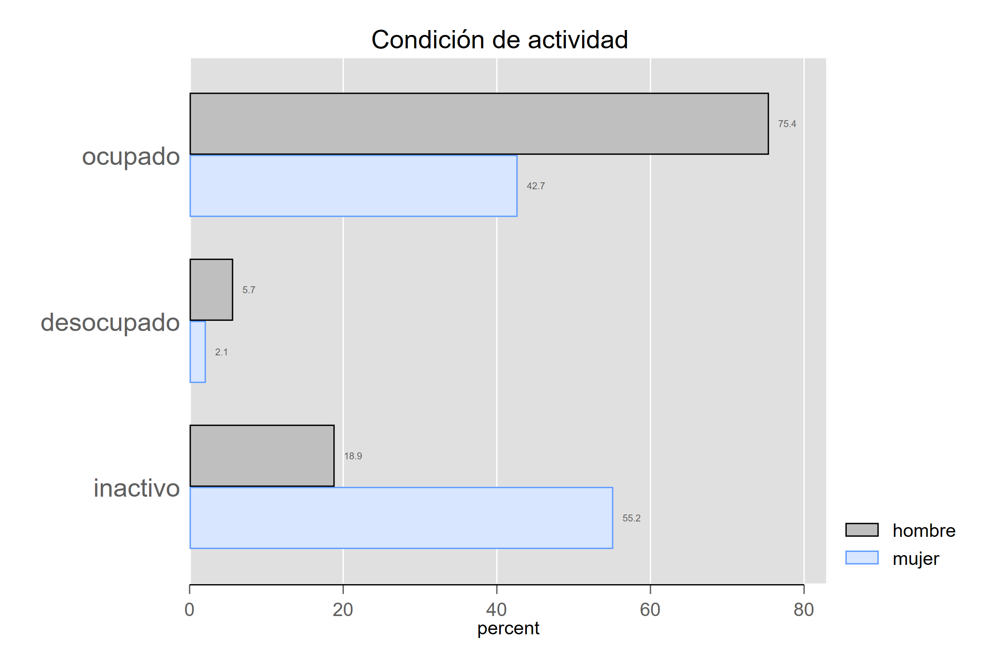

```{r, include=FALSE}
library(Statamarkdown)
stataexe <- find_stata()
knitr::opts_chunk$set(engine.path=list(stata=stataexe),
  error=TRUE, cleanlog=TRUE, comment=NA)

```


```{r setup, include=FALSE}
knitr::opts_chunk$set(echo = TRUE)
```

## Previo
Volvamos a la base de la EHPM. 

```{stata, collectcode=TRUE}
use "datos/ehpm_2019", clear

```


# Pendiente de la sesión pasada

## Variables cualitativas


### Pastel... pero ya no se usa. 


```{stata, collectcode=TRUE}

graph pie if actpr2012==10, over(r104)

```


Si queremos ponerle etiquetas a los pedazos de pastel.

```{stata, collectcode=TRUE}
graph pie if actpr2012==10, over(r104) plabel(_all percent) 
```


Este gráfico podría ser una línea de texto. TACHE.

### Barras

Para que sea más fácil e intuitivo utilizaremos un "ado".


```
ssc install catplot, replace

```

```{stata, collectcode=TRUE}

catplot r104 if actpr2012==10
catplot r104 if actpr2012==10 [iw=fac]

catplot r104 actpr2012 if r106>14 [iw=fac]

```


Un poquito más complicado

```{stata, collectcode=TRUE}


catplot r104 actpr2012 if r106>15, ///
percent(r104) ///
var1opts(label(labsize(small))) ///
var2opts(label(labsize(small)))  ///
title("Condición de actividad" ///
, span size(medium)) ///
blabel(bar, format(%4.1f)) ///
intensity(25) ///
asyvars


```


Podemos cambiar de esquemas para hacer estos gráficos más bonitos. 
Podemos instalar unos mejores esquemas


```
help schemes

ssc install blindschemes, replace

```

Checa el uso de las tres diagonales. 

```{stata, collectcode=TRUE}

graph query, schemes

catplot r104 actpr2012 if r106>15, ///
percent(r104) ///
var1opts(label(labsize(small))) ///
var2opts(label(labsize(small)))  ///
title("Condición de actividad" ///
, span size(medium)) ///
blabel(bar, format(%4.1f)) ///
intensity(25) ///
asyvars scheme(plottig)
```



Si quisieras hacerlo con la opción de barras... habría que empezar con algo así:

```{stata, collectcode=TRUE}

tab r104, gen(s_)
graph hbar s_1 s_2  if r106>15, over(actpr2012)

```


Las barras deben llevar "algo". Porque están construidas por variables (puedes hacer conteos, sumas o promedio - el *default*)
```{stata, collectcode=TRUE}
graph hbar (mean) money if r106>15, over(ciuo414)
```


# Intervalos de confianza y pruebas de hipótesis

En general, para las estimaciones poblacionales, tendremos un estadístico muestral que se aproxima al parámetro poblacional, más o menos un error. Ello da como resultado un intervalo de confianza a un nivel de confianza por determinar. 

$$ parámetro= estadístico \pm error $$
Si asumimos un muestreo aleatorio simple

## Una sola media
```{stata, collectcode=TRUE}

ci means r106
ci means r106, level(99)
ci means r01b, poisson
```


## Una proporción

```{stata, collectcode=TRUE}

ci proportion s_1 s_2
```

No permite que pongamos factores de expansión. 

## t-test

Para una sola muestra, podemos poner un valor normativo como hipótesis nula y el programa nos da las tres diferentes hipótesis alternativas:

```{stata, collectcode=TRUE}

ttest money==240 if actpr2012==10
```

El output comentado es un poco como lo que sigue:


$$ H_o:\mu=240 $$
$$ H_{a1}: \mu < 240 $$
$$ H_{a2}: \mu \neq 240 $$
$$ H_{a3}: \mu > 240 $$
Para dos muestras podemos establecer una diferencia entre dos variables:

```{stata, collectcode=TRUE}

ttest money if actpr2012==10, by(r104)
ttest money if actpr2012==10, by(r104) unequal

```

Si tuviéramos dos observaciones sobre la misma unidad de análisis podemos establecer la opción "paired" que se escribe un poco distinto

```
ttest var1==var2  
```

OJO:El comando ttest no permiten los  pesos. Ojo sería un error aplicar inferencia con "fweights"

## Prueba para varianzas

En realidad en STATA tenemos un comando pero para las desviaciones estándar:

```{stata, collectcode=TRUE}
sdtest money == 10 if actpr2012==10
```

También ponemos la H0 y nos da las tres alternativas


$$ H_o:\sigma=10 $$
$$ H_{a1}: \sigma < 10 $$
$$ H_{a2}: \sigma \neq 10 $$
$$ H_{a3}: \sigma > 10 $$

## Pruebas para diferencias de varianzas

Para grupos tenemos:

```{stata, collectcode=TRUE}

sdtest money if actpr2012==10, by(r104)
```

Por ejemplo, para el caso de la desigualdad
$$H_o:\frac{\sigma_1^2}{\sigma_2^2}=1$$
$$H_a:\frac{\sigma_1^2}{\sigma_2^2}\neq1$$

## Prueba chi-cuadrado

Cuando tenemos dos variables cualitativas o nominales podemos hacer esta la prueba chi-cuadrado, o prueba de independencia. Esta tiene una lógica un poco diferente a las pruebas que hemos hecho hasta hoy, porque proviene de comparar la distribución de los datos dado que no hay independencia entre las variables y los datos que tenemos. 

Esta prueba la podemos pedir con el tabulate:


```{stata, collectcode=TRUE}

tab actpr2012 r104 if r106>15, chi
```

$$H_o:\text{Las variables son independientes}$$
$$H_a:\text{Las variables no son independientes}$$
Podemos ver cómo se llega al estadístico de prueba chi con los siguientes comandos:

```{stata, collectcode=TRUE}

tab actpr2012 r104 if r106>15, expected
tab actpr2012 r104 if r106>15, cchi


```

Una vez que sabemos que no son independientes podemos medir con Cramer V la intensidad de la dependencia:

```{stata, collectcode=TRUE}
tab actpr2012 r104 if r106>15, V

```


## Prueba anova

Vamos a quedarnos con la anova de un solo factor; si queremos observar diferencias entre grupos de más de dos categorías

$$H_o:\mu_1=\mu_2=\mu_3=\mu_4$$

$$H_a:\text{Alguna de las medias es diferente}$$
```{stata, collectcode=TRUE}
oneway money region if actpr2012==10
```

No obstante esta prueba tiene los siguientes supuestos:


* Las observaciones se obtienen de forma independiente y aleatoria de la población definida por los niveles del factor

* Los datos de cada nivel de factor se distribuyen normalmente.

* Estas poblaciones normales tienen una varianza común. 

Ya sabemos que money no es normal

# Pruebas no paramétricas

Me robo esta imagen de Moore(2010, p.729)


## Wilcoxon

```{stata, collectcode=TRUE}
ranksum money if actpr2012==10, by(r104)
```


## Kruskal-Wallis

```{stata, collectcode=TRUE}
kwallis money if actpr2012==10, by(region)
```

## Correlaciones

Primero un gráfico:

```{stata, collectcode=TRUE}
graph matrix money r106 aproba1 if actpr2012==10
```


También podemos sacar significancias estadísticas de las correlaciones:

```{stata, collectcode=TRUE}
corr money r106 if actpr2012==10
pwcorr money r106 if actpr2012==10
pwcorr money r106 if actpr2012==10, sig
```


También hay correlaciones "no paramétricas". Las más famosas son tau (para datos ordinales) y Spearman (para relaciones monótonas)


```{stata, collectcode=TRUE}
spearman money r106 aproba1 if actpr2012==10, stats(p)
*ktau money r106 aproba1 if actpr2012==10, stats(p) // se tarda un montón
```

# Intervalos de confianza y diseño muestral complejo

Primero tenemos que configurar que tenemos un diseño muestral complejo. Es decir, explicitar la unida de primaria de muestro, el estrato y el factor de expansión. Veremos que aquí no hay problema de que hayan decimales:


## Diseño muestral complejo
```{stata, collectcode=TRUE}

svyset correlativo [pw=fac00],  ///
strata(estratoarea) vce(linearized) singleunit(certainty)
```

## Intervalo de confianza para medias

Con esto veremos las diferencias en las estimaciones y presentaremos el comando "mean"


```{stata, collectcode=TRUE}

mean ingfa if r103==1 // ¿por qué este filtro?

mean ingfa if r103==1  [pw=fac00]

svy: mean ingfa if r103==1 
```

¿Cuál es la diferencia? ¿Qué asume el error muestral?


Un  elemento fundamental para las estimaciones es el coeficiente de variación. 

---> Revisemos el documento metodológico:

```{stata, collectcode=TRUE}

estat cv
```

Veamos con otra variable per cápita

```{stata, collectcode=TRUE}
svy: mean ingpe

estat cv
```

Si queremos más estimaciones para otras categorías podemos utilizar la opción "over"

```{stata, collectcode=TRUE}
svy: mean ingpe, over(region)

estat cv
```

## Intervalo para proporciones

Usamos el prefijo "svy:", seguido de "proportion" 


```{stata, collectcode=TRUE}

svyset correlativo [pw=fac00],  ///
strata(estratoarea) vce(linearized) singleunit(certainty)

svy: proportion actpr2012 if r106>15
estat cv
```

También funciona con "over":

```{stata, collectcode=TRUE}
svy: proportion actpr2012 if r106>15, over(region)
estat cv
```
