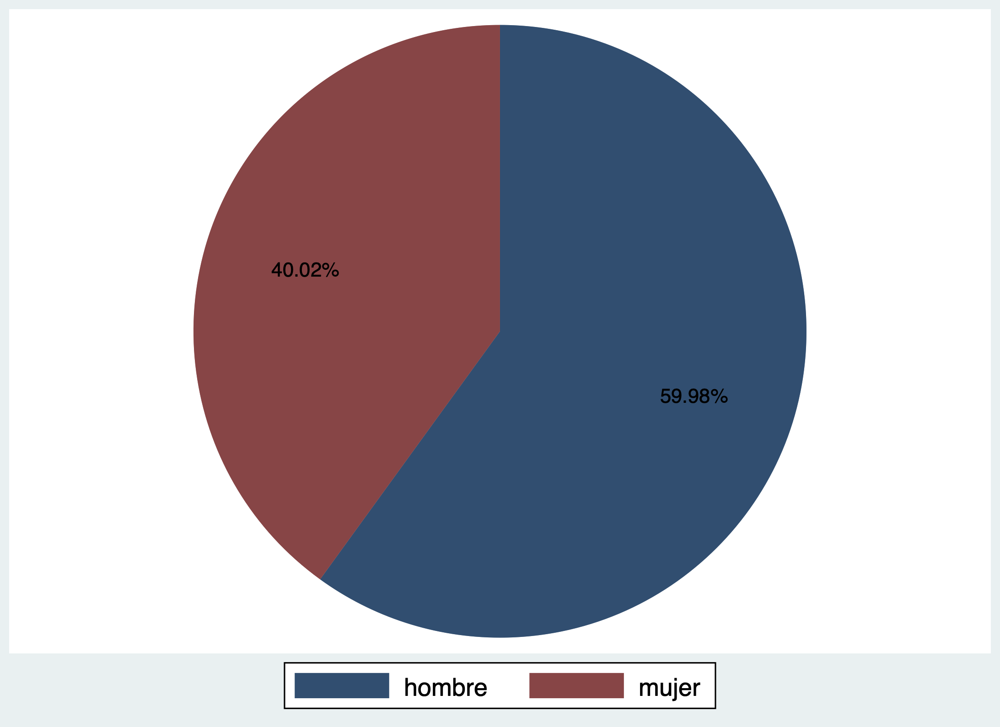
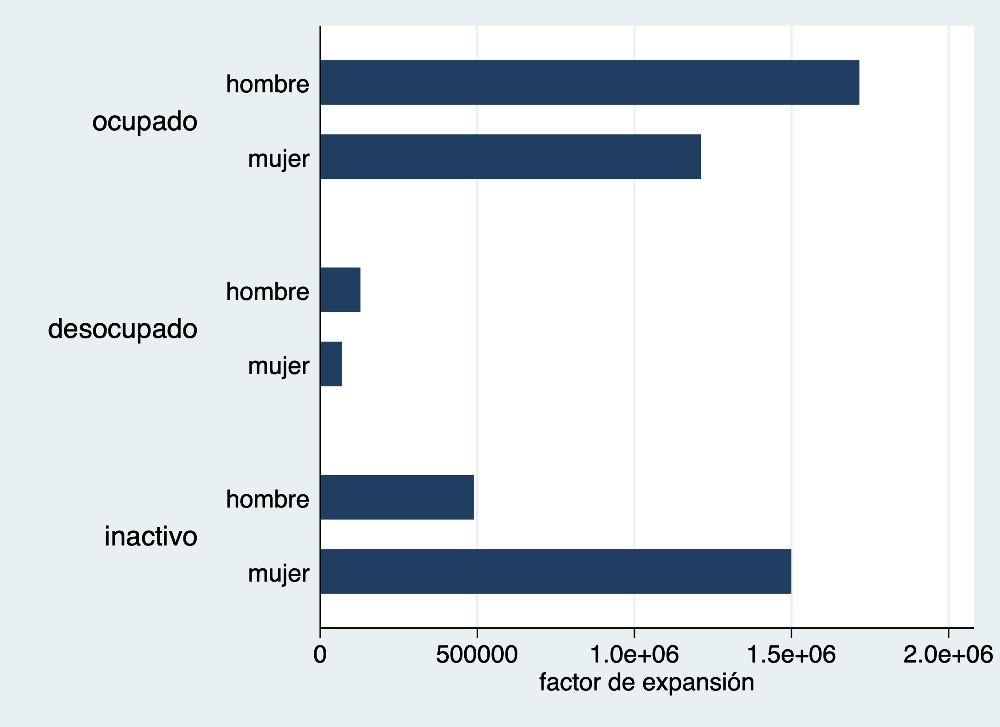
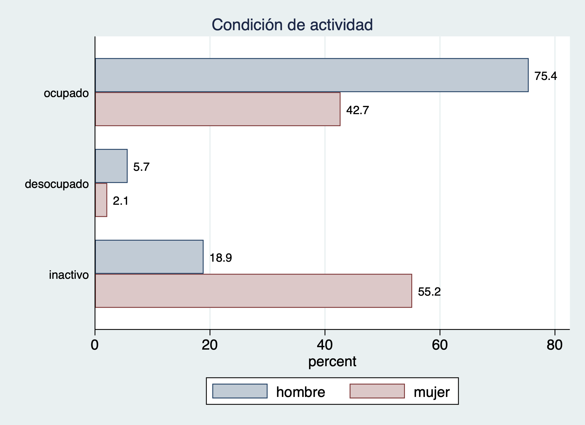
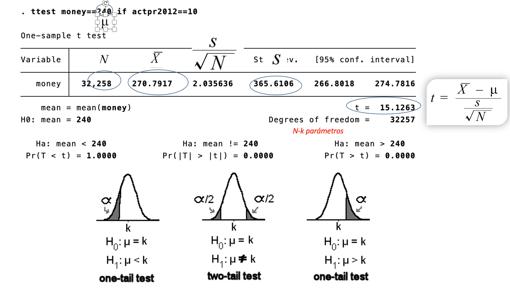
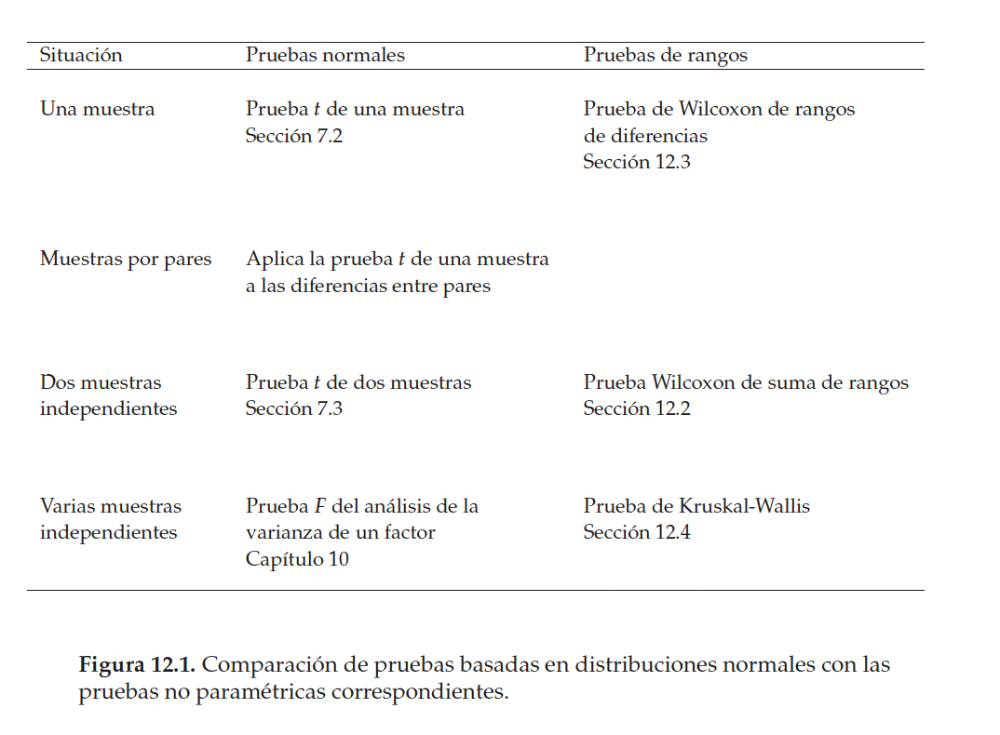

Sesión 2
================
Ana Escoto
16/10/2021

## Previo

Volvamos a la base de la EHPM.

``` stata
use "datos/ehpm_2019", clear
```

     variable s_1 not found
    r(111);

# Pendiente de la sesión pasada

## Variables cualitativas

### Pastel… pero ya no se usa.

``` stata
graph pie if actpr2012==10, over(r104)
```

     variable s_1 not found
    r(111);


Si queremos ponerle etiquetas a los pedazos de pastel.

``` stata
graph pie if actpr2012==10, over(r104) plabel(_all percent) 
```

     variable s_1 not found
    r(111);



Este gráfico podría ser una línea de texto. TACHE.

### Barras

Para que sea más fácil e intuitivo utilizaremos un “ado”.

    ssc install catplot, replace

``` stata
catplot r104 if actpr2012==10
catplot r104 if actpr2012==10 [iw=fac]

catplot r104 actpr2012 if r106>14 [iw=fac]
```

     variable s_1 not found
    r(111);



Un poquito más complicado

``` stata

catplot r104 actpr2012 if r106>15, ///
percent(r104) ///
var1opts(label(labsize(small))) ///
var2opts(label(labsize(small)))  ///
title("Condición de actividad" ///
, span size(medium)) ///
blabel(bar, format(%4.1f)) ///
intensity(25) ///
asyvars
```

     variable s_1 not found
    r(111);



Podemos cambiar de esquemas para hacer estos gráficos más bonitos.
Podemos instalar unos mejores esquemas

    help schemes

    ssc install blindschemes, replace

Checa el uso de las tres diagonales.

``` stata
graph query, schemes

catplot r104 actpr2012 if r106>15, ///
percent(r104) ///
var1opts(label(labsize(small))) ///
var2opts(label(labsize(small)))  ///
title("Condición de actividad" ///
, span size(medium)) ///
blabel(bar, format(%4.1f)) ///
intensity(25) ///
asyvars scheme(plottig)
```

     variable s_1 not found
    r(111);


    Available schemes are

        plotplain      see help scheme_plotplain
        plotplainblind see help scheme_plotplainblind
        plottig        see help scheme_plottig
        plottigblind   see help scheme_plottigblind
        s2color        see help scheme_s2color
        s2mono         see help scheme_s2mono
        s2manual       see help scheme_s2manual
        s2gmanual      see help scheme_s2gmanual
        s2gcolor       see help scheme_s2gcolor
        s1color        see help scheme_s1color
        s1mono         see help scheme_s1mono
        s1rcolor       see help scheme_s1rcolor
        s1manual       see help scheme_s1manual
        sj             see help scheme_sj
        economist      see help scheme_economist
        s2color8       see help scheme_s2color8
        meta

 Si quisieras hacerlo con la opción de barras…
habría que empezar con algo así:

``` stata
tab r104, gen(s_)
graph hbar s_1 s_2  if r106>15, over(actpr2012)
```

     variable s_1 not found
    r(111);

           sexo |      Freq.     Percent        Cum.
    ------------+-----------------------------------
         hombre |     35,099       47.15       47.15
          mujer |     39,349       52.85      100.00
    ------------+-----------------------------------
          Total |     74,448      100.00

Las barras deben llevar “algo”. Porque están construidas por variables
(puedes hacer conteos, sumas o promedio - el *default*)

``` stata
graph hbar (mean) money if r106>15, over(ciuo414)
```

     variable s_1 not found
    r(111);

# Intervalos de confianza y pruebas de hipótesis

En general, para las estimaciones poblacionales, tendremos un
estadístico muestral que se aproxima al parámetro poblacional, más o
menos un error. Ello da como resultado un intervalo de confianza a un
nivel de confianza por determinar.

*p**a**r**á**m**e**t**r**o* = *e**s**t**a**d**í**s**t**i**c**o* ± *e**r**r**o**r*
Si asumimos un muestreo aleatorio simple

## Una sola media

``` stata
ci means r106
ci means r106, level(99)
ci means r01b, poisson
```

     variable s_1 not found
    r(111);

        Variable |        Obs        Mean    Std. err.       [95% conf. interval]
    -------------+---------------------------------------------------------------
            r106 |     74,448    31.93829    .0797047        31.78207    32.09451

        Variable |        Obs        Mean    Std. err.       [99% conf. interval]
    -------------+---------------------------------------------------------------
            r106 |     74,448    31.93829    .0797047        31.73298     32.1436

                                                                Poisson exact    
        Variable |   Exposure        Mean    Std. err.       [95% conf. interval]
    -------------+---------------------------------------------------------------
            r01b |      12308    1.989438    .0127137        1.964596    2.014515

## Una proporción

``` stata
tab r104, gen(s_)
ci proportion s_1 s_2
```

     variable s_1 not found
    r(111);

           sexo |      Freq.     Percent        Cum.
    ------------+-----------------------------------
         hombre |     35,099       47.15       47.15
          mujer |     39,349       52.85      100.00
    ------------+-----------------------------------
          Total |     74,448      100.00

                                                                Binomial exact   
        Variable |        Obs  Proportion    Std. err.       [95% conf. interval]
    -------------+---------------------------------------------------------------
             s_1 |     74,448    .4714566    .0018295        .4678653    .4750501
             s_2 |     74,448    .5285434    .0018295        .5249499    .5321347

No permite que pongamos factores de expansión.

## t-test

Para una sola muestra, podemos poner un valor normativo como hipótesis
nula y el programa nos da las tres diferentes hipótesis alternativas:

``` stata
ttest money==240 if actpr2012==10
```

     variable s_1 not found
    r(111);


    One-sample t test
    ------------------------------------------------------------------------------
    Variable |     Obs        Mean    Std. err.   Std. dev.   [95% conf. interval]
    ---------+--------------------------------------------------------------------
       money |  32,258    270.7917    2.035636    365.6106    266.8018    274.7816
    ------------------------------------------------------------------------------
        mean = mean(money)                                            t =  15.1263
    H0: mean = 240                                   Degrees of freedom =    32257

       Ha: mean < 240               Ha: mean != 240               Ha: mean > 240
     Pr(T < t) = 1.0000         Pr(|T| > |t|) = 0.0000          Pr(T > t) = 0.0000

El output comentado es un poco como lo que sigue:



*H*<sub>*o*</sub> : *μ* = 240
*H*<sub>*a*1</sub> : *μ* &lt; 240
*H*<sub>*a*2</sub> : *μ* ≠ 240
*H*<sub>*a*3</sub> : *μ* &gt; 240
Para dos muestras podemos establecer una diferencia entre dos variables:

``` stata
ttest money if actpr2012==10, by(r104)
ttest money if actpr2012==10, by(r104) unequal
```

     variable s_1 not found
    r(111);


    Two-sample t test with equal variances
    ------------------------------------------------------------------------------
       Group |     Obs        Mean    Std. err.   Std. dev.   [95% conf. interval]
    ---------+--------------------------------------------------------------------
      hombre |  19,349    280.1702    2.938265    408.7147    274.4109    285.9294
       mujer |  12,909    256.7346    2.540604    288.6578    251.7546    261.7146
    ---------+--------------------------------------------------------------------
    Combined |  32,258    270.7917    2.035636    365.6106    266.8018    274.7816
    ---------+--------------------------------------------------------------------
        diff |            23.43556    4.152928                15.29566    31.57545
    ------------------------------------------------------------------------------
        diff = mean(hombre) - mean(mujer)                             t =   5.6431
    H0: diff = 0                                     Degrees of freedom =    32256

        Ha: diff < 0                 Ha: diff != 0                 Ha: diff > 0
     Pr(T < t) = 1.0000         Pr(|T| > |t|) = 0.0000          Pr(T > t) = 0.0000


    Two-sample t test with unequal variances
    ------------------------------------------------------------------------------
       Group |     Obs        Mean    Std. err.   Std. dev.   [95% conf. interval]
    ---------+--------------------------------------------------------------------
      hombre |  19,349    280.1702    2.938265    408.7147    274.4109    285.9294
       mujer |  12,909    256.7346    2.540604    288.6578    251.7546    261.7146
    ---------+--------------------------------------------------------------------
    Combined |  32,258    270.7917    2.035636    365.6106    266.8018    274.7816
    ---------+--------------------------------------------------------------------
        diff |            23.43556    3.884337                15.82211      31.049
    ------------------------------------------------------------------------------
        diff = mean(hombre) - mean(mujer)                             t =   6.0333
    H0: diff = 0                     Satterthwaite's degrees of freedom =  32153.8

        Ha: diff < 0                 Ha: diff != 0                 Ha: diff > 0
     Pr(T < t) = 1.0000         Pr(|T| > |t|) = 0.0000          Pr(T > t) = 0.0000

Si tuviéramos dos observaciones sobre la misma unidad de análisis
podemos establecer la opción “paired” que se escribe un poco distinto

    ttest var1==var2  

OJO:El comando ttest no permiten los pesos. Ojo sería un error aplicar
inferencia con “fweights”

## Prueba para varianzas

En realidad en STATA tenemos un comando pero para las desviaciones
estándar:

``` stata
sdtest money == 10 if actpr2012==10
```

     variable s_1 not found
    r(111);


    One-sample test of variance
    ------------------------------------------------------------------------------
    Variable |     Obs        Mean    Std. err.   Std. dev.   [95% conf. interval]
    ---------+--------------------------------------------------------------------
       money |  32,258    270.7917    2.035636    365.6106    266.8018    274.7816
    ------------------------------------------------------------------------------
        sd = sd(money)                                         c = chi2 =  4.3e+07
    H0: sd = 10                                      Degrees of freedom =    32257

         Ha: sd < 10                 Ha: sd != 10                   Ha: sd > 10
      Pr(C < c) = 1.0000         2*Pr(C > c) = 0.0000           Pr(C > c) = 0.0000

También ponemos la H0 y nos da las tres alternativas

*H*<sub>*o*</sub> : *σ* = 10
*H*<sub>*a*1</sub> : *σ* &lt; 10
*H*<sub>*a*2</sub> : *σ* ≠ 10
*H*<sub>*a*3</sub> : *σ* &gt; 10

## Pruebas para diferencias de varianzas

Para grupos tenemos:

``` stata
sdtest money if actpr2012==10, by(r104)
```

     variable s_1 not found
    r(111);


    Variance ratio test
    ------------------------------------------------------------------------------
       Group |     Obs        Mean    Std. err.   Std. dev.   [95% conf. interval]
    ---------+--------------------------------------------------------------------
      hombre |  19,349    280.1702    2.938265    408.7147    274.4109    285.9294
       mujer |  12,909    256.7346    2.540604    288.6578    251.7546    261.7146
    ---------+--------------------------------------------------------------------
    Combined |  32,258    270.7917    2.035636    365.6106    266.8018    274.7816
    ------------------------------------------------------------------------------
        ratio = sd(hombre) / sd(mujer)                                f =   2.0048
    H0: ratio = 1                                Degrees of freedom = 19348, 12908

        Ha: ratio < 1               Ha: ratio != 1                 Ha: ratio > 1
      Pr(F < f) = 1.0000         2*Pr(F > f) = 0.0000           Pr(F > f) = 0.0000

Por ejemplo, para el caso de la desigualdad
$$H\_o:\\frac{\\sigma\_1^2}{\\sigma\_2^2}=1$$
$$H\_a:\\frac{\\sigma\_1^2}{\\sigma\_2^2}\\neq1$$

## Prueba chi-cuadrado

Cuando tenemos dos variables cualitativas o nominales podemos hacer esta
la prueba chi-cuadrado, o prueba de independencia. Esta tiene una lógica
un poco diferente a las pruebas que hemos hecho hasta hoy, porque
proviene de comparar la distribución de los datos dado que no hay
independencia entre las variables y los datos que tenemos.

Esta prueba la podemos pedir con el tabulate:

``` stata
tab actpr2012 r104 if r106>15, chi
```

     variable s_1 not found
    r(111);

        estado |
    ocupaciona |         sexo
    l agregado |    hombre      mujer |     Total
    -----------+----------------------+----------
       ocupado |    18,813     12,677 |    31,490 
    desocupado |     1,416        632 |     2,048 
      inactivo |     4,711     16,375 |    21,086 
    -----------+----------------------+----------
         Total |    24,940     29,684 |    54,624 

              Pearson chi2(2) =  7.6e+03   Pr = 0.000

*H*<sub>*o*</sub> : Las variables son independientes
*H*<sub>*a*</sub> : Las variables no son independientes
Podemos ver cómo se llega al estadístico de prueba chi con los
siguientes comandos:

``` stata
tab actpr2012 r104 if r106>15, expected
tab actpr2012 r104 if r106>15, cchi
```

     variable s_1 not found
    r(111);


    +--------------------+
    | Key                |
    |--------------------|
    |     frequency      |
    | expected frequency |
    +--------------------+

        estado |
    ocupaciona |         sexo
    l agregado |    hombre      mujer |     Total
    -----------+----------------------+----------
       ocupado |    18,813     12,677 |    31,490 
               |  14,377.6   17,112.4 |  31,490.0 
    -----------+----------------------+----------
    desocupado |     1,416        632 |     2,048 
               |     935.1    1,112.9 |   2,048.0 
    -----------+----------------------+----------
      inactivo |     4,711     16,375 |    21,086 
               |   9,627.4   11,458.6 |  21,086.0 
    -----------+----------------------+----------
         Total |    24,940     29,684 |    54,624 
               |  24,940.0   29,684.0 |  54,624.0 


    +-------------------+
    | Key               |
    |-------------------|
    |     frequency     |
    | chi2 contribution |
    +-------------------+

        estado |
    ocupaciona |         sexo
    l agregado |    hombre      mujer |     Total
    -----------+----------------------+----------
       ocupado |    18,813     12,677 |    31,490 
               |    1368.3     1149.6 |    2517.9 
    -----------+----------------------+----------
    desocupado |     1,416        632 |     2,048 
               |     247.4      207.8 |     455.2 
    -----------+----------------------+----------
      inactivo |     4,711     16,375 |    21,086 
               |    2510.6     2109.4 |    4620.0 
    -----------+----------------------+----------
         Total |    24,940     29,684 |    54,624 
               |    4126.3     3466.8 |    7593.1 

Una vez que sabemos que no son independientes podemos medir con Cramer V
la intensidad de la dependencia:

``` stata
tab actpr2012 r104 if r106>15, V
```

     variable s_1 not found
    r(111);

        estado |
    ocupaciona |         sexo
    l agregado |    hombre      mujer |     Total
    -----------+----------------------+----------
       ocupado |    18,813     12,677 |    31,490 
    desocupado |     1,416        632 |     2,048 
      inactivo |     4,711     16,375 |    21,086 
    -----------+----------------------+----------
         Total |    24,940     29,684 |    54,624 

                   Cramér's V =   0.3728

## Prueba anova

Vamos a quedarnos con la anova de un solo factor; si queremos observar
diferencias entre grupos de más de dos categorías

*H*<sub>*o*</sub> : *μ*<sub>1</sub> = *μ*<sub>2</sub> = *μ*<sub>3</sub> = *μ*<sub>4</sub>

*H*<sub>*a*</sub> : Alguna de las medias es diferente

``` stata
oneway money region if actpr2012==10
```

     variable s_1 not found
    r(111);

                            Analysis of variance
        Source              SS         df      MS            F     Prob > F
    ------------------------------------------------------------------------
    Between groups      86395725.3      4   21598931.3    164.87     0.0000
     Within groups      4.2254e+09  32253   131009.004
    ------------------------------------------------------------------------
        Total           4.3118e+09  32257   133671.114

    Bartlett's equal-variances test: chi2(4) =  3.5e+03    Prob>chi2 = 0.000

No obstante esta prueba tiene los siguientes supuestos:

-   Las observaciones se obtienen de forma independiente y aleatoria de
    la población definida por los niveles del factor

-   Los datos de cada nivel de factor se distribuyen normalmente.

-   Estas poblaciones normales tienen una varianza común.

Ya sabemos que money no es normal

# Pruebas no paramétricas

Me robo esta imagen de Moore(2010, p.729) 

## Wilcoxon

``` stata
ranksum money if acptr2012==10, by(r104)
```

     variable s_1 not found
    r(111);


    acptr2012 not found
    r(111);

    end of do-file
    r(111);

## Kruskal-Wallis

``` stata
kwallis money if acptr2012==10, by(region)
```

     variable s_1 not found
    r(111);


    acptr2012 not found
    r(111);

    end of do-file
    r(111);

## Correlaciones

Primero un gráfico:

``` stata
graph matrix money r106 aproba1 if acptr2012==10
```

     variable s_1 not found
    r(111);


    acptr2012 not found
    r(111);

    end of do-file
    r(111);


También podemos sacar significancias estadísticas de las correlaciones:

``` stata
corr money r106 if actpr2012==10
pwcorr money r106 if actpr2012==10
pwcorr money r106 if actpr2012==10, sig
```

     variable s_1 not found
    r(111);


    (obs=32,258)

                 |    money     r106
    -------------+------------------
           money |   1.0000
            r106 |   0.0608   1.0000

                 |    money     r106
    -------------+------------------
           money |   1.0000 
            r106 |   0.0608   1.0000 

                 |    money     r106
    -------------+------------------
           money |   1.0000 
                 |
                 |
            r106 |   0.0608   1.0000 
                 |   0.0000
                 |

También hay correlaciones “no paramétricas”. Las más famosas son tau
(para datos ordinales) y Spearman (para relaciones monótonas)

``` stata
spearman money r106 aproba1 if actpr2012==10, , stats(p)
*ktau money r106 aproba1 if actpr2012==10, stats(p) // se tarda un montón
```

     variable s_1 not found
    r(111);


    invalid 'stats' 
    r(198);

    end of do-file
    r(198);

# Intervalos de confianza y diseño muestral complejo

Primero tenemos que configurar que tenemos un diseño muestral complejo.
Es decir, explicitar la unida de primaria de muestro, el estrato y el
factor de expansión. Veremos que aquí no hay problema de que hayan
decimales:

## Diseño muestral complejo

``` stata
svyset correlativo [pw=fac00],  ///
strata(estratoarea) vce(linearized) singleunit(certainty)
```

     variable s_1 not found
    r(111);


    Sampling weights: fac00
                 VCE: linearized
         Single unit: certainty
            Strata 1: estratoarea
     Sampling unit 1: correlativo
               FPC 1: <zero>

## Intervalo de confianza para medias

Con esto veremos las diferencias en las estimaciones y presentaremos el
comando “mean”

``` stata
mean ingfa if r103==1 // ¿por qué este filtro?

mean ingfa if r103==1  [pw=fac00]

svy: mean ingfa if r103==1 
```

     variable s_1 not found
    r(111);


    Mean estimation                         Number of obs = 21,331

    --------------------------------------------------------------
                 |       Mean   Std. err.     [95% conf. interval]
    -------------+------------------------------------------------
           ingfa |   572.8225   4.065057      564.8547    580.7903
    --------------------------------------------------------------


    Mean estimation                         Number of obs = 21,331

    --------------------------------------------------------------
                 |       Mean   Std. err.     [95% conf. interval]
    -------------+------------------------------------------------
           ingfa |   619.8996   6.455866      607.2456    632.5535
    --------------------------------------------------------------

    data not set up for svy, use svyset
    r(119);

    end of do-file
    r(119);

¿Cuál es la diferencia? ¿Qué asume el error muestral?

Un elemento fundamental para las estimaciones es el coeficiente de
variación.

—&gt; Revisemos el documento metodológico:

``` stata
estat cv
```

     variable s_1 not found
    r(111);


    last estimates not found
    r(301);

    end of do-file
    r(301);

Veamos con otra variable per cápita

``` stata
svy: mean ingpe

estat cv
```

     variable s_1 not found
    r(111);


    data not set up for svy, use svyset
    r(119);

    end of do-file
    r(119);

Si queremos más estimaciones para otras categorías podemos utilizar la
opción “over”

``` stata
svy: mean ingpe, over(region)

estat cv
```

     variable s_1 not found
    r(111);


    data not set up for svy, use svyset
    r(119);

    end of do-file
    r(119);

## Intervalo para proporciones

Usamos el prefijo “svy:”, seguido de “proportion”

``` stata
svyset correlativo [pw=fac00],  ///
strata(estratoarea) vce(linearized) singleunit(certainty)

svy: proportion actpr2012 if r106>15
estat cv
```

     variable s_1 not found
    r(111);


    Sampling weights: fac00
                 VCE: linearized
         Single unit: certainty
            Strata 1: estratoarea
     Sampling unit 1: correlativo
               FPC 1: <zero>

    (running proportion on estimation sample)

    Survey: Proportion estimation

    Number of strata =   119           Number of obs   =    54,624
    Number of PSUs   = 1,663           Population size = 4,995,745
                                       Design df       =     1,544

    --------------------------------------------------------------
                 |             Linearized            Logit
                 | Proportion   std. err.     [95% conf. interval]
    -------------+------------------------------------------------
       actpr2012 |
        ocupado  |   .5821192   .0031284      .5759704    .5882427
     desocupado  |   .0393829   .0014533      .0366292    .0423346
       inactivo  |   .3784978   .0031459       .372347     .384688
    --------------------------------------------------------------


    ------------------------------------------------
                 |             Linearized
                 | Proportion   std. err.     CV (%)
    -------------+----------------------------------
       actpr2012 |
        ocupado  |   .5821192   .0031284     .537421
     desocupado  |   .0393829   .0014533     3.69008
       inactivo  |   .3784978   .0031459     .831166
    ------------------------------------------------

También funciona con “over”:

``` stata
svy: proportion actpr2012 if r106>15, over(region)
estat cv
```

     variable s_1 not found
    r(111);


    data not set up for svy, use svyset
    r(119);

    end of do-file
    r(119);
