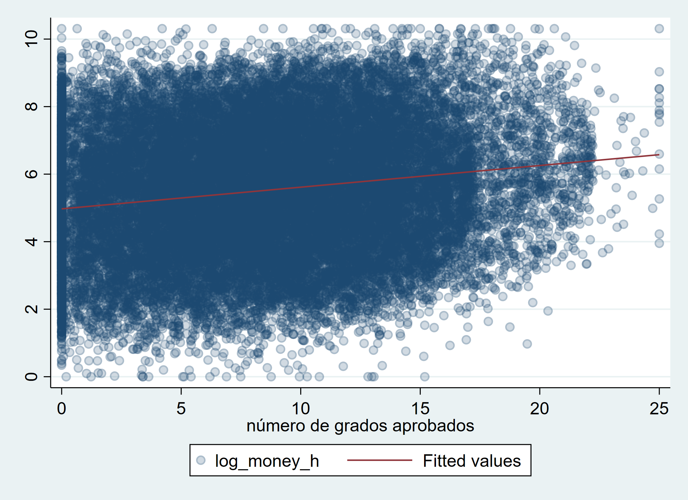
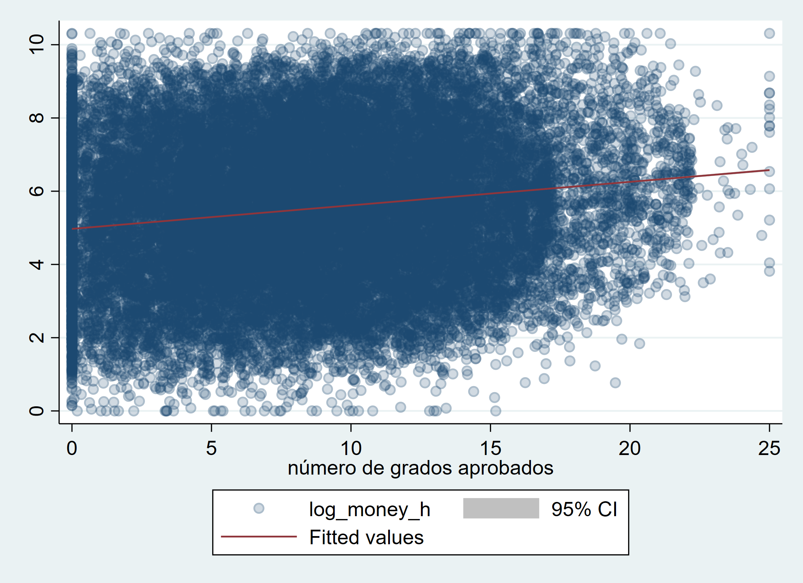

```{r, include=FALSE}
library(Statamarkdown)
stataexe <- find_stata()
knitr::opts_chunk$set(engine.path=list(stata=stataexe),
  error=TRUE, cleanlog=TRUE, comment=NA)

```


```{r setup, include=FALSE}
knitr::opts_chunk$set(echo = TRUE)
```

## Previo
Volvamos a la base de la EHPM. 

```{stata, collectcode=TRUE, include=FALSE}
clear
```
```{stata, collectcode=TRUE, warnings=FALSE}
use "datos/ehpm_2019", clear

gladder money if actpr2012==10  & money>0

```


# Relaciones gráficas

Transformación logaritmica
```{stata, collectcode=TRUE, warnings=FALSE}

gen log_money=log(money) if actpr2012==10

```

Para hacer gráficos de dos variables, se usa "twoway", no dice que cada eje es una variable. 

Veamos cómo se ve un gráfico de este tipo:

```{stata, collectcode=TRUE, warnings=FALSE}
twoway scatter log_money aproba1 if actpr2012==10 & money>0

```


La opción "jitter" nos puede ayudar ver mejor qué sucede y también bajándole la intensidad al color

```{stata, collectcode=TRUE, warnings=FALSE}
twoway scatter money aproba1 if actpr2012==10 & money>0, jitter(50)  mcolor(%20)

```


Estos gráficos nos permiten ver la relación positiva que existe, no entre los ingresos por hora, si no de los logaritmos de los ingresos por hora frente a los años aprobados de escolaridad.

Estos gráficos quizás nos proveen información a nosotros pero son díficiles de comunicar

Otra forma para ver la relación y su acelaracón

```{stata, collectcode=TRUE, warnings=FALSE}

graph bar (mean) money if actpr2012==10, over(aproba1)
```


```{stata, collectcode=TRUE, warnings=FALSE}
graph box money if actpr2012==10, over(aproba1)
```


Ojo con la representatividad

# Modelo de regresión lineal simple


Podemos describir una relación Para la población, como hemos observado, tenemos que usar letras griegas y también incluir un elemento de error para nuestras estimaciones, De ahí que las anteriores ecuaciones se escriben términos poblacionales de la siguiente forma:

$$y=\beta_o+\beta_1x +\epsilon$$

Donde los parámetros $\beta_o$ y $\beta_1$ describen la pendiente y el intercepto de la población, respectivamente.


Si quisiéramos ver cómo se ve esta línea para nuestro ejemplo:

```{stata, collectcode=TRUE, warnings=FALSE}
twoway lfit log_money aproba1 if actpr2012==10

```


Claramente aquí no vemos los datos. Podemos verlos:

```{stata, collectcode=TRUE, warnings=FALSE}
twoway (scatter log_money aproba1 if actpr2012==10 , jitter(50) mcolor(%20)) ///
       (lfit log_money aproba1 if actpr2012==10 )

```


¿Cómo se ajusta esta línea?

```{stata, collectcode=TRUE, warnings=FALSE}
regress log_money aproba1 if actpr2012==10 
```

Podemos poner entonces esa estimación un margen de confianza:


```{stata, collectcode=TRUE}
twoway (scatter log_money aproba1 if actpr2012==10 , jitter(50) mcolor(%20)) ///
       (lfitci log_money aproba1 if actpr2012==10 )

```


Vamos a instalar dos paquetes
```
ssc install estout, replace
ssc install coefplot, replace
```

```{stata, collectcode=TRUE}
coefplot
esttab
```

Para estos comando y para tener más clara nuestras estimaciones habrá que guardar nuestors resultados:

```{stata, collectcode=TRUE}
estimates store modelo0 // guarda el último modelo que se ha corrido
estimates replay // corre el último modelo corrido
estimates replay modelo0 // corre el modelo0 independientemente si ha corrido otro

```


```{stata, collectcode=TRUE}


svyset correlativo [pw=fac00],  ///
strata(estratoarea) vce(linearized) singleunit(certainty)

svy:regress log_money aproba1 if actpr2012==10 
estimates store modelo1


```

```{stata, collectcode=TRUE}
esttab modelo0 modelo1
```

## Predicciones

```{stata, collectcode=TRUE}

estimates restore modelo0

predict errores if _est_modelo0==1, res
predict y_hat if _est_modelo0==1, xb

```

## Análisis de supuestos


### Normalidad de los errores


```{stata, collectcode=TRUE}

histogram errores

sktest errores
```

### Heterocedasticidad

```{stata, collectcode=TRUE}
scatter errores y_hat
scatter errores y_hat, jitter(20) mcolor(%20)

rvfplot

```

También podemos hacer una prueba de hipótesis:


```{stata, collectcode=TRUE}
estat hettest

```

Estas pruebas suponen independencia de las observaciones. Por lo cual no se puede aplicar algunas de estas pruebas para el diseño muestral complejo.

### Datos atípicos

¿Mejora el ajuste de nuestro modelo sin datos atípicos?

```{stata, collectcode=TRUE}
 estat summarize
```

Pero si queremos ver la influencia de algunas observaciones:

```{stata, collectcode=TRUE}
predict residuos_est if _est_modelo0==1, rstandard
* Standardized residuals -- Valores de más de3 

```

```{stata, collectcode=TRUE}
predict leverage if _est_modelo0==1, leverage 
* Cuando  leverage > 2k/n es "alta"

```

```{stata, collectcode=TRUE}
estimates restore modelo0
dfbeta
```

```{stata, collectcode=TRUE}
predict cooksd if _est_modelo0==1, cooksd
*Valores mayores 4/N dan problema
```


```{stata, collectcode=TRUE}
regress log_money aproba1 if actpr2012==10 & residuos_est<3
```

Es un mejor modelo ¿pero cómo justificarlo? Yo prefiero usar la regresión robusta a datos atípicos. Porque podemos volver a hacer este proceso.


# Modelo de regresión lineal múltiple

## Introducción de una variable categórica

Podemos crear  una variable *dummy* o "ficticia"

```{stata, collectcode=TRUE}
tab r104, gen(s_)

regress log_money aproba1 s_2 if actpr2012==10

```

Esto es similar que usar la opción "i." precedida de la que tenemos como variable dependiente. Ojo, la variable debe estar almacenada como double no como de cadena, para poder aplicar esta opción.

```{stata, collectcode=TRUE}
regress log_money aproba1 i.r104 if actpr2012==10
estimates store modelo2
```


Si queremos cambiar la categoría de referencia:


```{stata, collectcode=TRUE}
regress log_money aproba1 ib1.r104 if actpr2012==10

```

Esta introducción de las variables asume un cambio en el intercepto. Es necesario establecer cuánto se gana frente a la categoría de referencia. Manteniendo, los años de escolaridad constantes.

```{stata, collectcode=TRUE}
esttab modelo0 modelo1 modelo2, ar2
```

Para poder usar variables categóricas de mejor manera, podemos utilizar este comando. Se parece a test, pero nos permite comparar modelos con "i."
```
ssc install ftest
```

```{stata, collectcode=TRUE}
ftest  modelo0  modelo2
```

Veamos qué pasa con una variable de más categorías


```{stata, collectcode=TRUE}
regress log_money aproba1 i.r104 i.region if actpr2012==10
estimates store modelo3
```

¿Mejora nuestro modelo?


```{stata, collectcode=TRUE}
ftest  modelo2  modelo3
```

## Introducción de una variable numérica

Los coeficientes pueden leerse como derivadas parciales de una función lineal 
:)


```{stata, collectcode=TRUE}
regress log_money aproba1 i.r104 i.region r106 if actpr2012==10
estimates store modelo4
```

¿Mejora nuestro modelo?

```{stata, collectcode=TRUE}
ftest modelo3 modelo4

```

Revisemos los modelos
```{stata, collectcode=TRUE}
esttab modelo*, ar2 label se 
```


## Análisis de supuestos

Para el caso de modelos con múltiples variables explicativas

## Predicciones:
```{stata, collectcode=TRUE}

estimates restore modelo4

predict errores4 if _est_modelo4==1, res
predict y_hat4 if _est_modelo4==1, xb

```

## Análisis de supuestos


### Normalidad multivariada

```{stata, collectcode=TRUE}

mvtest normality log_money r106 aproba1 if actpr2012==10
```


### Normalidad de los errores


```{stata, collectcode=TRUE}
estimates restore modelo4

histogram errores4

sktest errores4
```

### Heterocedasticidad

```{stata, collectcode=TRUE}
scatter errores y_hat4
scatter errores y_hat4, jitter(20) mcolor(%20)

rvfplot

```

También podemos hacer una prueba de hipótesis:


```{stata, collectcode=TRUE}
estat hettest

```

Stata ofrece varias formas de corregir la heterocedasticidad


```{stata, collectcode=TRUE}
regress log_money aproba1 i.r104 i.region r106 if actpr2012==10, robust
```


```{stata, collectcode=TRUE}
regress log_money aproba1 i.r104 i.region r106 if actpr2012==10,  vce(hc2)
```


```{stata, collectcode=TRUE}
regress log_money aproba1 i.r104 i.region r106 if actpr2012==10,  vce(hc3)
```


```{stata, collectcode=TRUE}
regress log_money aproba1 i.r104 i.region r106 if actpr2012==10, cluster(idboleta)
```

### Multicolinealidad


```{stata, collectcode=TRUE}
estimate restore modelo4
vif

```

## Post-estimación y cálculo de efecto marginales

Muchas veces para comunicar un modelo podemos valernos de predicciones o efectos marginales. Esto se realiza con el comando "margins"

Algunas formas de usar las predicciones:

```{stata, collectcode=TRUE}

margins r104
```


```{stata, collectcode=TRUE}

margins r104##region
```

```{stata, collectcode=TRUE}

margins r104##region
```


También hay otras opciones dydx(), eyex(), dyex(), eydx(). La más usada es la primera

```{stata, collectcode=TRUE}
margins, dydx(*)
```

Estos comando serán aún más importantes para la regresión logística.

Cómo hacemos porque transformamos. Para esto podríamos usar la opción de expresión. Ojo que esto podría ser interesante para presentar resultados, pero se tendría que ajustar mejor la varianza. Checa esa opción acá <https://www.stata.com/stata-news/news34-2/spotlight/>


```{stata, collectcode=TRUE}
margins, expression(exp(predict(xb))*exp((`e(rmse)'^2)/2))

```

Este es el valor dejando todos los valores constantes 

Podemos incluir una variable:

```{stata, collectcode=TRUE}

margins r104, expression(exp(predict(xb))*exp((`e(rmse)'^2)/2))

mean money if _est_modelo4==1, over(r104)
```


# Presentación de resultados

## Tablas de coeficientes y estimaciones

Como ya observamos, las tablas con esttab son muy fáciles. Podemos comparar nuestros resultados. Hemos ido utilizando estas tablas, podemos usar la opción "stats" para ir modificando qué escalares del modelo queremos. 


```{stata, collectcode=TRUE}
estimates restore modelo4
ereturn list 

```

Con ello podemos elegir los nombres de nuestros escalares para incluir en el modelo
```{stata, collectcode=TRUE}

esttab modelo0 modelo2 modelo3 modelo4, label stats(N r2_a F) se
```

También podemos exportar nuestros resultados

```{stata, collectcode=TRUE}

esttab modelo0 modelo2 modelo3 modelo4 using "out/resultados.rtf", label stats(N r2_a F) se replace
esttab modelo0 modelo2 modelo3 modelo4 using "out/resultados.csv", label stats(N r2_a F) se replace

```
Para más inspiración de tablas <http://repec.org/bocode/e/estout/esttab.html>

## Graficación de coeficientes y efectos marginales

Podemos utilizar: 

```
ssc install coefplot, replace
```


```{stata, collectcode=TRUE}

coefplot modelo0 modelo2 modelo3 modelo4, drop(_cons) title("Resultados de los modelos") xline(0)
```


TIP: También se pueden guardar estimaciones hecha con margin y se pueden graficar

```{stata, collectcode=TRUE}
estimates restore modelo4
margins, at(r106=(20(5)50)) expression(exp(predict(xb))*exp((`e(rmse)'^2)/2))
marginsplot, title("Predicción de los ingresos") ytitle("Dólares mensuales")

```


