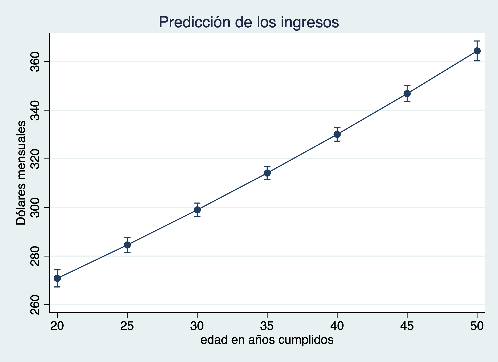

Sesión 3
================
Ana Escoto
23/10/2021

## Previo

Volvamos a la base de la EHPM.

``` stata
use "datos/ehpm_2019", clear

gladder money if actpr2012==10  & money>0
```


# Relaciones gráficas

Transformación logaritmica

``` stata
gen log_money=log(money) if actpr2012==10
```

    (47,267 missing values generated)

Para hacer gráficos de dos variables, se usa “twoway”, no dice que cada
eje es una variable.

Veamos cómo se ve un gráfico de este tipo:

``` stata
twoway scatter log_money aproba1 if actpr2012==10 & money>0
```


La opción “jitter” nos puede ayudar ver mejor qué sucede y también
bajándole la intensidad al color

``` stata
twoway scatter money aproba1 if actpr2012==10 & money>0, jitter(50)  mcolor(%20)
```

 Estos gráficos nos permiten ver la relación
positiva que existe, no entre los ingresos por hora, si no de los
logaritmos de los ingresos por hora frente a los años aprobados de
escolaridad.

Estos gráficos quizás nos proveen información a nosotros pero son
díficiles de comunicar

Otra forma para ver la relación y su acelaracón

``` stata
graph bar (mean) money if actpr2012==10, over(aproba1)
```


``` stata
graph box money if actpr2012==10, over(aproba1)
```


Ojo con la representatividad

# Modelo de regresión lineal simple

Podemos describir una relación Para la población, como hemos observado,
tenemos que usar letras griegas y también incluir un elemento de error
para nuestras estimaciones, De ahí que las anteriores ecuaciones se
escriben términos poblacionales de la siguiente forma:

*y* = *β*<sub>*o*</sub> + *β*<sub>1</sub>*x* + *ϵ*

Donde los parámetros *β*<sub>*o*</sub> y *β*<sub>1</sub> describen la
pendiente y el intercepto de la población, respectivamente.

Si quisiéramos ver cómo se ve esta línea para nuestro ejemplo:

``` stata
twoway lfit log_money aproba1 if actpr2012==10
```


Claramente aquí no vemos los datos. Podemos verlos:

``` stata
twoway (scatter log_money aproba1 if actpr2012==10 , jitter(50) mcolor(%20)) ///
       (lfit log_money aproba1 if actpr2012==10 )
```

    >        (lfit log_money aproba1 if actpr2012==10 )


¿Cómo se ajusta esta línea?

``` stata
regress log_money aproba1 if actpr2012==10 
```

          Source |       SS           df       MS      Number of obs   =    27,181
    -------------+----------------------------------   F(1, 27179)     =   5486.65
           Model |  2625.67642         1  2625.67642   Prob > F        =    0.0000
        Residual |  13006.7148    27,179   .47855752   R-squared       =    0.1680
    -------------+----------------------------------   Adj R-squared   =    0.1679
           Total |  15632.3913    27,180  .575143166   Root MSE        =    .69178

    ------------------------------------------------------------------------------
       log_money | Coefficient  Std. err.      t    P>|t|     [95% conf. interval]
    -------------+----------------------------------------------------------------
         aproba1 |   .0641594   .0008662    74.07   0.000     .0624616    .0658571
           _cons |   4.972621   .0082022   606.25   0.000     4.956544    4.988698
    ------------------------------------------------------------------------------

Podemos poner entonces esa estimación un margen de confianza:

``` stata
twoway (scatter log_money aproba1 if actpr2012==10 , jitter(50) mcolor(%20)) ///
       (lfitci log_money aproba1 if actpr2012==10 )
```

    >        (lfitci log_money aproba1 if actpr2012==10 )


Vamos a instalar dos paquetes

    ssc install estout, replace
    ssc install coefplot, replace

``` stata
coefplot
esttab
```

                          (1)   
                    log_money   
    ----------------------------
    aproba1            0.0642***
                      (74.07)   

    _cons               4.973***
                     (606.25)   
    ----------------------------
    N                   27181   
    ----------------------------
    t statistics in parentheses
    * p<0.05, ** p<0.01, *** p<0.001

Para estos comando y para tener más clara nuestras estimaciones habrá
que guardar nuestors resultados:

``` stata
estimates store modelo0 // guarda el último modelo que se ha corrido
estimates replay // corre el último modelo corrido
estimates replay modelo0 // corre el modelo0 independientemente si ha corrido otro
```

    Model modelo0
    -------------------------------------------------------------------------------------------------------------

          Source |       SS           df       MS      Number of obs   =    27,181
    -------------+----------------------------------   F(1, 27179)     =   5486.65
           Model |  2625.67642         1  2625.67642   Prob > F        =    0.0000
        Residual |  13006.7148    27,179   .47855752   R-squared       =    0.1680
    -------------+----------------------------------   Adj R-squared   =    0.1679
           Total |  15632.3913    27,180  .575143166   Root MSE        =    .69178

    ------------------------------------------------------------------------------
       log_money | Coefficient  Std. err.      t    P>|t|     [95% conf. interval]
    -------------+----------------------------------------------------------------
         aproba1 |   .0641594   .0008662    74.07   0.000     .0624616    .0658571
           _cons |   4.972621   .0082022   606.25   0.000     4.956544    4.988698
    ------------------------------------------------------------------------------


    -------------------------------------------------------------------------------------------------------------
    Model modelo0
    -------------------------------------------------------------------------------------------------------------

          Source |       SS           df       MS      Number of obs   =    27,181
    -------------+----------------------------------   F(1, 27179)     =   5486.65
           Model |  2625.67642         1  2625.67642   Prob > F        =    0.0000
        Residual |  13006.7148    27,179   .47855752   R-squared       =    0.1680
    -------------+----------------------------------   Adj R-squared   =    0.1679
           Total |  15632.3913    27,180  .575143166   Root MSE        =    .69178

    ------------------------------------------------------------------------------
       log_money | Coefficient  Std. err.      t    P>|t|     [95% conf. interval]
    -------------+----------------------------------------------------------------
         aproba1 |   .0641594   .0008662    74.07   0.000     .0624616    .0658571
           _cons |   4.972621   .0082022   606.25   0.000     4.956544    4.988698
    ------------------------------------------------------------------------------

``` stata

svyset correlativo [pw=fac00],  ///
strata(estratoarea) vce(linearized) singleunit(certainty)

svy:regress log_money aproba1 if actpr2012==10 
estimates store modelo1
```

    Sampling weights: fac00
                 VCE: linearized
         Single unit: certainty
            Strata 1: estratoarea
     Sampling unit 1: correlativo
               FPC 1: <zero>

    (running regress on estimation sample)

    Survey: Linear regression

    Number of strata =   119                           Number of obs   =    27,181
    Number of PSUs   = 1,663                           Population size = 2,580,092
                                                       Design df       =     1,544
                                                       F(1, 1544)      =   2501.67
                                                       Prob > F        =    0.0000
                                                       R-squared       =    0.2018

    ------------------------------------------------------------------------------
                 |             Linearized
       log_money | Coefficient  std. err.      t    P>|t|     [95% conf. interval]
    -------------+----------------------------------------------------------------
         aproba1 |   .0698602   .0013967    50.02   0.000     .0671205    .0725999
           _cons |   4.951058   .0133573   370.66   0.000     4.924858    4.977259
    ------------------------------------------------------------------------------

``` stata
esttab modelo0 modelo1
```

                          (1)             (2)   
                    log_money       log_money   
    --------------------------------------------
    aproba1            0.0642***       0.0699***
                      (74.07)         (50.02)   

    _cons               4.973***        4.951***
                     (606.25)        (370.66)   
    --------------------------------------------
    N                   27181           27181   
    --------------------------------------------
    t statistics in parentheses
    * p<0.05, ** p<0.01, *** p<0.001

## Predicciones

``` stata
estimates restore modelo0

predict errores if _est_modelo0==1, res
predict y_hat if _est_modelo0==1, xb
```

    (results modelo0 are active now)

    (47,267 missing values generated)

    (47,267 missing values generated)

## Análisis de supuestos

### Normalidad de los errores

``` stata
histogram errores

sktest errores
```

    (bin=44, start=-4.4694438, width=.20683383)


    Skewness and kurtosis tests for normality
                                                             ----- Joint test -----
        Variable |       Obs   Pr(skewness)   Pr(kurtosis)   Adj chi2(2)  Prob>chi2
    -------------+-----------------------------------------------------------------
         errores |    27,181         0.0000         0.0000             .          .

### Heterocedasticidad

``` stata
scatter errores y_hat
scatter errores y_hat, jitter(20) mcolor(%20)

rvfplot
```

También podemos hacer una prueba de hipótesis:

``` stata
estat hettest
```

    Breusch–Pagan/Cook–Weisberg test for heteroskedasticity 
    Assumption: Normal error terms
    Variable: Fitted values of log_money

    H0: Constant variance

        chi2(1) = 100.97
    Prob > chi2 = 0.0000

Estas pruebas suponen independencia de las observaciones. Por lo cual no
se puede aplicar algunas de estas pruebas para el diseño muestral
complejo.

### Datos atípicos

¿Mejora el ajuste de nuestro modelo sin datos atípicos?

``` stata
 estat summarize
```

      Estimation sample regress                Number of obs =     27,181

      -------------------------------------------------------------------
          Variable |         Mean      Std. dev.         Min          Max
      -------------+-----------------------------------------------------
         log_money |      5.49466      .7583819     1.098612     10.30962
           aproba1 |     8.136603      4.844354            0           25
      -------------------------------------------------------------------

Pero si queremos ver la influencia de algunas observaciones:

``` stata
predict residuos_est if _est_modelo0==1, rstandard
* Standardized residuals -- Valores de más de3 
```

    (47,267 missing values generated)

``` stata
predict leverage if _est_modelo0==1, leverage 
* Cuando  leverage > 2k/n es "alta"
```

    (47,267 missing values generated)

``` stata
estimates restore modelo0
dfbeta
```

    (results modelo0 are active now)


    Generating DFBETA variable ...

    (47,267 missing values generated)
        _dfbeta_1: DFBETA aproba1

``` stata
predict cooksd if _est_modelo0==1, cooksd
*Valores mayores 4/N dan problema
```

    (47,267 missing values generated)

``` stata
regress log_money aproba1 if actpr2012==10 & residuos_est<3
```

          Source |       SS           df       MS      Number of obs   =    27,097
    -------------+----------------------------------   F(1, 27095)     =   5692.11
           Model |  2612.16515         1  2612.16515   Prob > F        =    0.0000
        Residual |  12434.1703    27,095  .458910143   R-squared       =    0.1736
    -------------+----------------------------------   Adj R-squared   =    0.1736
           Total |  15046.3355    27,096  .555297294   Root MSE        =    .67743

    ------------------------------------------------------------------------------
       log_money | Coefficient  Std. err.      t    P>|t|     [95% conf. interval]
    -------------+----------------------------------------------------------------
         aproba1 |   .0641317     .00085    75.45   0.000     .0624656    .0657978
           _cons |   4.964906   .0080477   616.93   0.000     4.949133     4.98068
    ------------------------------------------------------------------------------

Es un mejor modelo ¿pero cómo justificarlo? Yo prefiero usar la
regresión robusta a datos atípicos. Porque podemos volver a hacer este
proceso.

# Modelo de regresión lineal múltiple

## Introducción de una variable categórica

Podemos crear una variable *dummy* o “ficticia”

``` stata
tab r104, gen(s_)

regress log_money aproba1 s_2 if actpr2012==10
```

           sexo |      Freq.     Percent        Cum.
    ------------+-----------------------------------
         hombre |     35,099       47.15       47.15
          mujer |     39,349       52.85      100.00
    ------------+-----------------------------------
          Total |     74,448      100.00

          Source |       SS           df       MS      Number of obs   =    27,181
    -------------+----------------------------------   F(2, 27178)     =   3405.84
           Model |  3132.80256         2  1566.40128   Prob > F        =    0.0000
        Residual |  12499.5887    27,178  .459915693   R-squared       =    0.2004
    -------------+----------------------------------   Adj R-squared   =    0.2003
           Total |  15632.3913    27,180  .575143166   Root MSE        =    .67817

    ------------------------------------------------------------------------------
       log_money | Coefficient  Std. err.      t    P>|t|     [95% conf. interval]
    -------------+----------------------------------------------------------------
         aproba1 |   .0640287   .0008491    75.40   0.000     .0623644    .0656931
             s_2 |  -.2762078    .008318   -33.21   0.000    -.2925114   -.2599042
           _cons |   5.091419   .0088009   578.51   0.000     5.074168    5.108669
    ------------------------------------------------------------------------------

Esto es similar que usar la opción “i.” precedida de la que tenemos como
variable dependiente. Ojo, la variable debe estar almacenada como double
no como de cadena, para poder aplicar esta opción.

``` stata
regress log_money aproba1 i.r104 if actpr2012==10
estimates store modelo2
```

          Source |       SS           df       MS      Number of obs   =    27,181
    -------------+----------------------------------   F(2, 27178)     =   3405.84
           Model |  3132.80256         2  1566.40128   Prob > F        =    0.0000
        Residual |  12499.5887    27,178  .459915693   R-squared       =    0.2004
    -------------+----------------------------------   Adj R-squared   =    0.2003
           Total |  15632.3913    27,180  .575143166   Root MSE        =    .67817

    ------------------------------------------------------------------------------
       log_money | Coefficient  Std. err.      t    P>|t|     [95% conf. interval]
    -------------+----------------------------------------------------------------
         aproba1 |   .0640287   .0008491    75.40   0.000     .0623644    .0656931
                 |
            r104 |
          mujer  |  -.2762078    .008318   -33.21   0.000    -.2925114   -.2599042
           _cons |   5.091419   .0088009   578.51   0.000     5.074168    5.108669
    ------------------------------------------------------------------------------

Si queremos cambiar la categoría de referencia:

``` stata
regress log_money aproba1 ib1.r104 if actpr2012==10
```

          Source |       SS           df       MS      Number of obs   =    27,181
    -------------+----------------------------------   F(2, 27178)     =   3405.84
           Model |  3132.80256         2  1566.40128   Prob > F        =    0.0000
        Residual |  12499.5887    27,178  .459915693   R-squared       =    0.2004
    -------------+----------------------------------   Adj R-squared   =    0.2003
           Total |  15632.3913    27,180  .575143166   Root MSE        =    .67817

    ------------------------------------------------------------------------------
       log_money | Coefficient  Std. err.      t    P>|t|     [95% conf. interval]
    -------------+----------------------------------------------------------------
         aproba1 |   .0640287   .0008491    75.40   0.000     .0623644    .0656931
                 |
            r104 |
          mujer  |  -.2762078    .008318   -33.21   0.000    -.2925114   -.2599042
           _cons |   5.091419   .0088009   578.51   0.000     5.074168    5.108669
    ------------------------------------------------------------------------------

Esta introducción de las variables asume un cambio en el intercepto. Es
necesario establecer cuánto se gana frente a la categoría de referencia.
Manteniendo, los años de escolaridad constantes.

``` stata
esttab modelo0 modelo1 modelo2, ar2
```

                          (1)             (2)             (3)   
                    log_money       log_money       log_money   
    ------------------------------------------------------------
    aproba1            0.0642***       0.0699***       0.0640***
                      (74.07)         (50.02)         (75.40)   

    1.r104                                                  0   
                                                          (.)   

    2.r104                                             -0.276***
                                                     (-33.21)   

    _cons               4.973***        4.951***        5.091***
                     (606.25)        (370.66)        (578.51)   
    ------------------------------------------------------------
    N                   27181           27181           27181   
    adj. R-sq           0.168                           0.200   
    ------------------------------------------------------------
    t statistics in parentheses
    * p<0.05, ** p<0.01, *** p<0.001

Para poder usar variables categóricas de mejor manera, podemos utilizar
este comando. Se parece a test, pero nos permite comparar modelos con
“i.”

    ssc install ftest

``` stata
ftest  modelo0  modelo2
```

    Assumption: modelo0 nested in modelo2

    F(  1,   27178) =   1102.65
           prob > F =    0.0000

Veamos qué pasa con una variable de más categorías

``` stata
regress log_money aproba1 i.r104 i.region if actpr2012==10
estimates store modelo3
```

          Source |       SS           df       MS      Number of obs   =    27,181
    -------------+----------------------------------   F(6, 27174)     =   1200.35
           Model |   3275.1224         6  545.853733   Prob > F        =    0.0000
        Residual |  12357.2689    27,174  .454746039   R-squared       =    0.2095
    -------------+----------------------------------   Adj R-squared   =    0.2093
           Total |  15632.3913    27,180  .575143166   Root MSE        =    .67435

    -----------------------------------------------------------------------------------------------------
                              log_money | Coefficient  Std. err.      t    P>|t|     [95% conf. interval]
    ------------------------------------+----------------------------------------------------------------
                                aproba1 |   .0610032   .0008622    70.76   0.000     .0593134    .0626931
                                        |
                                   r104 |
                                 mujer  |  -.2799828   .0082747   -33.84   0.000    -.2962016    -.263764
                                        |
                                 region |
                             central i  |   .0287756   .0119746     2.40   0.016     .0053049    .0522464
                            central ii  |  -.0212401   .0133346    -1.59   0.111    -.0473766    .0048964
                              oriental  |  -.0294394   .0122659    -2.40   0.016    -.0534812   -.0053976
    Área metropolitana de san salvador  |    .188387    .013424    14.03   0.000     .1620753    .2146987
                                        |
                                  _cons |   5.089817    .011179   455.30   0.000     5.067905    5.111728
    -----------------------------------------------------------------------------------------------------

¿Mejora nuestro modelo?

``` stata
ftest  modelo2  modelo3
```

    Assumption: modelo2 nested in modelo3

    F(  4,   27174) =     78.24
           prob > F =    0.0000

## Introducción de una variable numérica

Los coeficientes pueden leerse como derivadas parciales de una función
lineal :)

``` stata
regress log_money aproba1 i.r104 i.region r106 if actpr2012==10
estimates store modelo4
```

          Source |       SS           df       MS      Number of obs   =    27,181
    -------------+----------------------------------   F(7, 27173)     =   1231.28
           Model |  3764.39125         7  537.770179   Prob > F        =    0.0000
        Residual |       11868    27,173  .436757075   R-squared       =    0.2408
    -------------+----------------------------------   Adj R-squared   =    0.2406
           Total |  15632.3913    27,180  .575143166   Root MSE        =    .66088

    -----------------------------------------------------------------------------------------------------
                              log_money | Coefficient  Std. err.      t    P>|t|     [95% conf. interval]
    ------------------------------------+----------------------------------------------------------------
                                aproba1 |   .0697546   .0008845    78.87   0.000      .068021    .0714882
                                        |
                                   r104 |
                                 mujer  |  -.3017288   .0081353   -37.09   0.000    -.3176745   -.2857831
                                        |
                                 region |
                             central i  |   .0206726   .0117378     1.76   0.078    -.0023342    .0436794
                            central ii  |  -.0185689   .0130684    -1.42   0.155    -.0441837    .0070459
                              oriental  |  -.0308927   .0120209    -2.57   0.010    -.0544543   -.0073311
    Área metropolitana de san salvador  |   .1438722   .0132228    10.88   0.000     .1179547    .1697896
                                        |
                                   r106 |    .009887   .0002954    33.47   0.000      .009308     .010466
                                  _cons |   4.654994   .0169943   273.92   0.000     4.621684    4.688303
    -----------------------------------------------------------------------------------------------------

¿Mejora nuestro modelo?

``` stata
ftest modelo3 modelo4
```

    Assumption: modelo3 nested in modelo4

    F(  1,   27173) =   1120.23
           prob > F =    0.0000

Revisemos los modelos

``` stata
esttab modelo*, ar2 label se 
```

                                  (1)             (2)             (3)             (4)             (5)   
                            log_money       log_money       log_money       log_money       log_money   
    ----------------------------------------------------------------------------------------------------
    número de grados a~s       0.0642***       0.0699***       0.0640***       0.0610***       0.0698***
                           (0.000866)       (0.00140)      (0.000849)      (0.000862)      (0.000884)   

    hombre                                                          0               0               0   
                                                                  (.)             (.)             (.)   

    mujer                                                      -0.276***       -0.280***       -0.302***
                                                            (0.00832)       (0.00827)       (0.00814)   

    occidental                                                                      0               0   
                                                                                  (.)             (.)   

    central i                                                                  0.0288*         0.0207   
                                                                             (0.0120)        (0.0117)   

    central ii                                                                -0.0212         -0.0186   
                                                                             (0.0133)        (0.0131)   

    oriental                                                                  -0.0294*        -0.0309*  
                                                                             (0.0123)        (0.0120)   

    Área metropolitana~d                                                        0.188***        0.144***
                                                                             (0.0134)        (0.0132)   

    edad en años cumpl~s                                                                      0.00989***
                                                                                           (0.000295)   

    Constant                    4.973***        4.951***        5.091***        5.090***        4.655***
                            (0.00820)        (0.0134)       (0.00880)        (0.0112)        (0.0170)   
    ----------------------------------------------------------------------------------------------------
    Observations                27181           27181           27181           27181           27181   
    Adjusted R-squared          0.168                           0.200           0.209           0.241   
    ----------------------------------------------------------------------------------------------------
    Standard errors in parentheses
    * p<0.05, ** p<0.01, *** p<0.001

## Análisis de supuestos

Para el caso de modelos con múltiples variables explicativas

## Predicciones:

``` stata
estimates restore modelo4

predict errores4 if _est_modelo4==1, res
predict y_hat4 if _est_modelo4==1, xb
```

    (results modelo4 are active now)

    (47,267 missing values generated)

    (47,267 missing values generated)

## Análisis de supuestos

### Normalidad multivariada

``` stata
mvtest normality log_money r106 aproba1 if actpr2012==10
```

    Test for multivariate normality

        Doornik-Hansen                   chi2(6) = 5395.079   Prob>chi2 =  0.0000

### Normalidad de los errores

``` stata
estimates restore modelo4

histogram errores4

sktest errores4
```

    (results modelo4 are active now)

    (bin=44, start=-4.5629158, width=.20803703)


    Skewness and kurtosis tests for normality
                                                             ----- Joint test -----
        Variable |       Obs   Pr(skewness)   Pr(kurtosis)   Adj chi2(2)  Prob>chi2
    -------------+-----------------------------------------------------------------
        errores4 |    27,181         0.0000         0.0000             .          .

### Heterocedasticidad

``` stata
scatter errores y_hat4
scatter errores y_hat4, jitter(20) mcolor(%20)

rvfplot
```

También podemos hacer una prueba de hipótesis:

``` stata
estat hettest
```

    Breusch–Pagan/Cook–Weisberg test for heteroskedasticity 
    Assumption: Normal error terms
    Variable: Fitted values of log_money

    H0: Constant variance

        chi2(1) = 296.42
    Prob > chi2 = 0.0000

Stata ofrece varias formas de corregir la heterocedasticidad

``` stata
regress log_money aproba1 i.r104 i.region r106 if actpr2012==10, robust
```

    Linear regression                               Number of obs     =     27,181
                                                    F(7, 27173)       =    1155.57
                                                    Prob > F          =     0.0000
                                                    R-squared         =     0.2408
                                                    Root MSE          =     .66088

    -----------------------------------------------------------------------------------------------------
                                        |               Robust
                              log_money | Coefficient  std. err.      t    P>|t|     [95% conf. interval]
    ------------------------------------+----------------------------------------------------------------
                                aproba1 |   .0697546   .0008996    77.54   0.000     .0679914    .0715178
                                        |
                                   r104 |
                                 mujer  |  -.3017288    .008382   -36.00   0.000     -.318158   -.2852997
                                        |
                                 region |
                             central i  |   .0206726   .0115381     1.79   0.073    -.0019426    .0432878
                            central ii  |  -.0185689   .0130067    -1.43   0.153    -.0440627     .006925
                              oriental  |  -.0308927   .0125467    -2.46   0.014    -.0554848   -.0063006
    Área metropolitana de san salvador  |   .1438722    .012786    11.25   0.000     .1188111    .1689333
                                        |
                                   r106 |    .009887   .0003248    30.44   0.000     .0092504    .0105237
                                  _cons |   4.654994   .0172811   269.37   0.000     4.621122    4.688865
    -----------------------------------------------------------------------------------------------------

``` stata
regress log_money aproba1 i.r104 i.region r106 if actpr2012==10,  vce(hc2)
```

    Linear regression                               Number of obs     =     27,181
                                                    F(7, 27173)       =    1155.50
                                                    Prob > F          =     0.0000
                                                    R-squared         =     0.2408
                                                    Root MSE          =     .66088

    -----------------------------------------------------------------------------------------------------
                                        |             Robust HC2
                              log_money | Coefficient  std. err.      t    P>|t|     [95% conf. interval]
    ------------------------------------+----------------------------------------------------------------
                                aproba1 |   .0697546   .0008996    77.54   0.000     .0679914    .0715179
                                        |
                                   r104 |
                                 mujer  |  -.3017288   .0083821   -36.00   0.000    -.3181581   -.2852995
                                        |
                                 region |
                             central i  |   .0206726    .011538     1.79   0.073    -.0019425    .0432877
                            central ii  |  -.0185689   .0130069    -1.43   0.153    -.0440631    .0069253
                              oriental  |  -.0308927   .0125466    -2.46   0.014    -.0554847   -.0063007
    Área metropolitana de san salvador  |   .1438722   .0127862    11.25   0.000     .1188107    .1689337
                                        |
                                   r106 |    .009887   .0003248    30.44   0.000     .0092504    .0105237
                                  _cons |   4.654994   .0172815   269.36   0.000     4.621121    4.688866
    -----------------------------------------------------------------------------------------------------

``` stata
regress log_money aproba1 i.r104 i.region r106 if actpr2012==10,  vce(hc3)
```

    Linear regression                               Number of obs     =     27,181
                                                    F(7, 27173)       =    1155.10
                                                    Prob > F          =     0.0000
                                                    R-squared         =     0.2408
                                                    Root MSE          =     .66088

    -----------------------------------------------------------------------------------------------------
                                        |             Robust HC3
                              log_money | Coefficient  std. err.      t    P>|t|     [95% conf. interval]
    ------------------------------------+----------------------------------------------------------------
                                aproba1 |   .0697546   .0008998    77.53   0.000      .067991    .0715182
                                        |
                                   r104 |
                                 mujer  |  -.3017288   .0083833   -35.99   0.000    -.3181606    -.285297
                                        |
                                 region |
                             central i  |   .0206726   .0115396     1.79   0.073    -.0019456    .0432908
                            central ii  |  -.0185689    .013009    -1.43   0.153    -.0440672    .0069295
                              oriental  |  -.0308927   .0125484    -2.46   0.014    -.0554883   -.0062971
    Área metropolitana de san salvador  |   .1438722   .0127882    11.25   0.000     .1188066    .1689378
                                        |
                                   r106 |    .009887   .0003249    30.43   0.000     .0092503    .0105238
                                  _cons |   4.654994   .0172845   269.32   0.000     4.621115    4.688872
    -----------------------------------------------------------------------------------------------------

``` stata
regress log_money aproba1 i.r104 i.region r106 if actpr2012==10, cluster(idboleta)
```

    Linear regression                               Number of obs     =     27,181
                                                    F(7, 17017)       =    1054.68
                                                    Prob > F          =     0.0000
                                                    R-squared         =     0.2408
                                                    Root MSE          =     .66088

                                                     (Std. err. adjusted for 17,018 clusters in idboleta)
    -----------------------------------------------------------------------------------------------------
                                        |               Robust
                              log_money | Coefficient  std. err.      t    P>|t|     [95% conf. interval]
    ------------------------------------+----------------------------------------------------------------
                                aproba1 |   .0697546    .000953    73.19   0.000     .0678865    .0716227
                                        |
                                   r104 |
                                 mujer  |  -.3017288   .0082305   -36.66   0.000    -.3178615   -.2855961
                                        |
                                 region |
                             central i  |   .0206726   .0122783     1.68   0.092    -.0033942    .0447394
                            central ii  |  -.0185689   .0140144    -1.32   0.185    -.0460386    .0089008
                              oriental  |  -.0308927   .0135067    -2.29   0.022    -.0573672   -.0044181
    Área metropolitana de san salvador  |   .1438722   .0135948    10.58   0.000      .117225    .1705194
                                        |
                                   r106 |    .009887   .0003312    29.85   0.000     .0092378    .0105363
                                  _cons |   4.654994   .0179986   258.63   0.000     4.619714    4.690273
    -----------------------------------------------------------------------------------------------------

### Multicolinealidad

``` stata
estimate restore modelo4
vif
```

    (results modelo4 are active now)

        Variable |       VIF       1/VIF  
    -------------+----------------------
         aproba1 |      1.14    0.875308
          2.r104 |      1.01    0.992737
          region |
              2  |      1.54    0.651111
              3  |      1.41    0.709321
              4  |      1.50    0.665922
              5  |      1.48    0.674044
            r106 |      1.11    0.903983
    -------------+----------------------
        Mean VIF |      1.31

## Post-estimación y cálculo de efecto marginales

Muchas veces para comunicar un modelo podemos valernos de predicciones o
efectos marginales. Esto se realiza con el comando “margins”

Algunas formas de usar las predicciones:

``` stata
margins r104
```

    Predictive margins                                      Number of obs = 27,181
    Model VCE: OLS

    Expression: Linear prediction, predict()

    ------------------------------------------------------------------------------
                 |            Delta-method
                 |     Margin   std. err.      t    P>|t|     [95% conf. interval]
    -------------+----------------------------------------------------------------
            r104 |
         hombre  |   5.623273   .0053003  1060.93   0.000     5.612884    5.633662
          mujer  |   5.321545   .0061527   864.92   0.000     5.309485    5.333604
    ------------------------------------------------------------------------------

``` stata
margins r104##region
```

    Predictive margins                                      Number of obs = 27,181
    Model VCE: OLS

    Expression: Linear prediction, predict()

    ------------------------------------------------------------------------------------------------------------
                                               |            Delta-method
                                               |     Margin   std. err.      t    P>|t|     [95% conf. interval]
    -------------------------------------------+----------------------------------------------------------------
                                          r104 |
                                       hombre  |   5.623273   .0053003  1060.93   0.000     5.612884    5.633662
                                        mujer  |   5.321545   .0061527   864.92   0.000     5.309485    5.333604
                                               |
                                        region |
                                   occidental  |   5.475864   .0083099   658.96   0.000     5.459576    5.492152
                                    central i  |   5.496536   .0082909   662.96   0.000     5.480286    5.512787
                                   central ii  |   5.457295   .0101152   539.52   0.000     5.437469    5.477121
                                     oriental  |   5.444971   .0087264   623.97   0.000     5.427867    5.462075
           Área metropolitana de san salvador  |   5.619736   .0101553   553.38   0.000     5.599831    5.639641
                                               |
                                   r104#region |
                            hombre#occidental  |   5.604477   .0089586   625.60   0.000     5.586917    5.622036
                             hombre#central i  |   5.625149   .0090017   624.90   0.000     5.607505    5.642793
                            hombre#central ii  |   5.585908   .0106961   522.24   0.000     5.564943    5.606873
                              hombre#oriental  |   5.573584   .0093779   594.33   0.000     5.555203    5.591965
    hombre#Área metropolitana de san salvador  |   5.748349   .0107791   533.29   0.000     5.727221    5.769477
                             mujer#occidental  |   5.302748   .0095889   553.01   0.000     5.283953    5.321543
                              mujer#central i  |   5.323421   .0094956   560.62   0.000     5.304809    5.342033
                             mujer#central ii  |   5.284179   .0111362   474.50   0.000     5.262351    5.306007
                               mujer#oriental  |   5.271855   .0099119   531.87   0.000     5.252428    5.291283
     mujer#Área metropolitana de san salvador  |    5.44662   .0111142   490.06   0.000     5.424836    5.468405
    ------------------------------------------------------------------------------------------------------------

``` stata
margins sexo##region
```

    variable sexo not found
    r(111);

    end of do-file
    r(111);

También hay otras opciones dydx(), eyex(), dyex(), eydx(). La más usada
es la primera

``` stata
margins, dydx(*)
```

     variable sexo not found
    r(111);


    Average marginal effects                                Number of obs = 27,181
    Model VCE: OLS

    Expression: Linear prediction, predict()
    dy/dx wrt:  aproba1 2.r104 2.region 3.region 4.region 5.region r106

    -----------------------------------------------------------------------------------------------------
                                        |            Delta-method
                                        |      dy/dx   std. err.      t    P>|t|     [95% conf. interval]
    ------------------------------------+----------------------------------------------------------------
                                aproba1 |   .0697546   .0008845    78.87   0.000      .068021    .0714882
                                        |
                                   r104 |
                                 mujer  |  -.3017288   .0081353   -37.09   0.000    -.3176745   -.2857831
                                        |
                                 region |
                             central i  |   .0206726   .0117378     1.76   0.078    -.0023342    .0436794
                            central ii  |  -.0185689   .0130684    -1.42   0.155    -.0441837    .0070459
                              oriental  |  -.0308927   .0120209    -2.57   0.010    -.0544543   -.0073311
    Área metropolitana de san salvador  |   .1438722   .0132228    10.88   0.000     .1179547    .1697896
                                        |
                                   r106 |    .009887   .0002954    33.47   0.000      .009308     .010466
    -----------------------------------------------------------------------------------------------------
    Note: dy/dx for factor levels is the discrete change from the base level.

Estos comando serán aún más importantes para la regresión logística.

Cómo hacemos porque transformamos. Para esto podríamos usar la opción de
expresión. Ojo que esto podría ser interesante para presentar
resultados, pero se tendría que ajustar mejor la varianza. Checa esa
opción acá <https://www.stata.com/stata-news/news34-2/spotlight/>

``` stata
margins, expression(exp(predict(xb))*exp((`e(rmse)'^2)/2))
```

     variable sexo not found
    r(111);


    Predictive margins                                      Number of obs = 27,181
    Model VCE: OLS

    Expression: exp(predict(xb))*exp((.6608759909481651^2)/2)

    ------------------------------------------------------------------------------
                 |            Delta-method
                 |     Margin   std. err.      z    P>|z|     [95% conf. interval]
    -------------+----------------------------------------------------------------
           _cons |   324.9672   1.395268   232.91   0.000     322.2326    327.7019
    ------------------------------------------------------------------------------

Este es el valor dejando todos los valores constantes

Podemos incluir una variable:

``` stata
margins r104, expression(exp(predict(xb))*exp((`e(rmse)'^2)/2))

mean money if _est_modelo4==1, over(r104)
```

     variable sexo not found
    r(111);


    Predictive margins                                      Number of obs = 27,181
    Model VCE: OLS

    Expression: exp(predict(xb))*exp((.6608759909481651^2)/2)

    ------------------------------------------------------------------------------
                 |            Delta-method
                 |     Margin   std. err.      z    P>|z|     [95% conf. interval]
    -------------+----------------------------------------------------------------
            r104 |
         hombre  |   366.2156   2.023701   180.96   0.000     362.2492     370.182
          mujer  |   270.8306   1.701886   159.14   0.000      267.495    274.1662
    ------------------------------------------------------------------------------


    Mean estimation                         Number of obs = 27,181

    --------------------------------------------------------------
                 |       Mean   Std. err.     [95% conf. interval]
    -------------+------------------------------------------------
    c.money@r104 |
         hombre  |   347.6122   3.433204       340.883    354.3415
          mujer  |    286.051   2.699843      280.7592    291.3428
    --------------------------------------------------------------

# Presentación de resultados

## Tablas de coeficientes y estimaciones

Como ya observamos, las tablas con esttab son muy fáciles. Podemos
comparar nuestros resultados. Hemos ido utilizando estas tablas, podemos
usar la opción “stats” para ir modificando qué escalares del modelo
queremos.

``` stata
estimates restore modelo4
ereturn list 
```

     variable sexo not found
    r(111);


    (results modelo4 are active now)


    scalars:
                   e(rank) =  8
                   e(ll_0) =  -31050.26959045027
                     e(ll) =  -27306.09470708167
                   e(r2_a) =  .2406115538050895
                    e(rss) =  11868.00001016265
                    e(mss) =  3764.391250427603
                   e(rmse) =  .6608759909481651
                     e(r2) =  .2408071284601065
                      e(F) =  1231.279832445927
                   e(df_r) =  27173
                   e(df_m) =  7
                      e(N) =  27181

    macros:
                e(cmdline) : "regress log_money aproba1 i.r104 i.region r106 if actpr2012==10"
                  e(title) : "Linear regression"
              e(marginsok) : "XB default"
                    e(vce) : "ols"
                 e(depvar) : "log_money"
                    e(cmd) : "regress"
             e(properties) : "b V"
                e(predict) : "regres_p"
                  e(model) : "ols"
              e(estat_cmd) : "regress_estat"

    matrices:
                      e(b) :  1 x 10
                      e(V) :  10 x 10

    functions:
                 e(sample)   

Con ello podemos elegir los nombres de nuestros escalares para incluir
en el modelo

``` stata
esttab modelo0 modelo2 modelo3 modelo4, label stats(N r2_a F) se
```

     variable sexo not found
    r(111);


    ------------------------------------------------------------------------------------
                                  (1)             (2)             (3)             (4)   
                            log_money       log_money       log_money       log_money   
    ------------------------------------------------------------------------------------
    número de grados a~s       0.0642***       0.0640***       0.0610***       0.0698***
                           (0.000866)      (0.000849)      (0.000862)      (0.000884)   

    hombre                                          0               0               0   
                                                  (.)             (.)             (.)   

    mujer                                      -0.276***       -0.280***       -0.302***
                                            (0.00832)       (0.00827)       (0.00814)   

    occidental                                                      0               0   
                                                                  (.)             (.)   

    central i                                                  0.0288*         0.0207   
                                                             (0.0120)        (0.0117)   

    central ii                                                -0.0212         -0.0186   
                                                             (0.0133)        (0.0131)   

    oriental                                                  -0.0294*        -0.0309*  
                                                             (0.0123)        (0.0120)   

    Área metropolitana~d                                        0.188***        0.144***
                                                             (0.0134)        (0.0132)   

    edad en años cumpl~s                                                      0.00989***
                                                                           (0.000295)   

    Constant                    4.973***        5.091***        5.090***        4.655***
                            (0.00820)       (0.00880)        (0.0112)        (0.0170)   
    ------------------------------------------------------------------------------------
    N                           27181           27181           27181           27181   
    r2_a                        0.168           0.200           0.209           0.241   
    F                          5486.6          3405.8          1200.3          1231.3   
    ------------------------------------------------------------------------------------
    Standard errors in parentheses
    * p<0.05, ** p<0.01, *** p<0.001

También podemos exportar nuestros resultados

``` stata
esttab modelo0 modelo2 modelo3 modelo4 using "out/resultados.rtf", label stats(N r2_a F) se
esttab modelo0 modelo2 modelo3 modelo4 using "out/resultados.csv", label stats(N r2_a F) se
```

     variable sexo not found
    r(111);


    file out/resultados.rtf already exists
    r(602);

    end of do-file
    r(602);

Para más inspiración de tablas
<http://repec.org/bocode/e/estout/esttab.html>

## Graficación de coeficientes y efectos marginales

Podemos utilizar:

    ssc install coefplot, replace

``` stata
coefplot modelo0 modelo2 modelo3 modelo4, drop(_cons) title("Resultados de los modelos") xline(0)
```

     variable sexo not found
    r(111);


TIP: También se pueden guardar estimaciones hecha con margin y se pueden
graficar

``` stata
estimates restore modelo4
margins, at(r106=(20(5)50)) expression(exp(predict(xb))*exp((`e(rmse)'^2)/2))
marginsplot, title("Predicción de los ingresos") ylabel("Dólares mensuales")
```

     variable sexo not found
    r(111);


    (results modelo4 are active now)


    Predictive margins                                      Number of obs = 27,181
    Model VCE: OLS

    Expression: exp(predict(xb))*exp((.6608759909481651^2)/2)
    1._at: r106 = 20
    2._at: r106 = 25
    3._at: r106 = 30
    4._at: r106 = 35
    5._at: r106 = 40
    6._at: r106 = 45
    7._at: r106 = 50

    ------------------------------------------------------------------------------
                 |            Delta-method
                 |     Margin   std. err.      z    P>|z|     [95% conf. interval]
    -------------+----------------------------------------------------------------
             _at |
              1  |   270.8593   1.800919   150.40   0.000     267.3296    274.3891
              2  |   284.5858   1.593738   178.57   0.000     281.4621    287.7095
              3  |   299.0079   1.430234   209.06   0.000     296.2047    301.8111
              4  |   314.1609   1.360723   230.88   0.000     311.4939    316.8278
              5  |   330.0818   1.438933   229.39   0.000     327.2615     332.902
              6  |   346.8095   1.685164   205.80   0.000     343.5066    350.1123
              7  |   364.3849   2.079873   175.20   0.000     360.3084    368.4614
    ------------------------------------------------------------------------------


    Variables that uniquely identify margins: r106
    invalid label specifier, :  "Dólares mensuales":
    r(198);

    end of do-file
    r(198);


