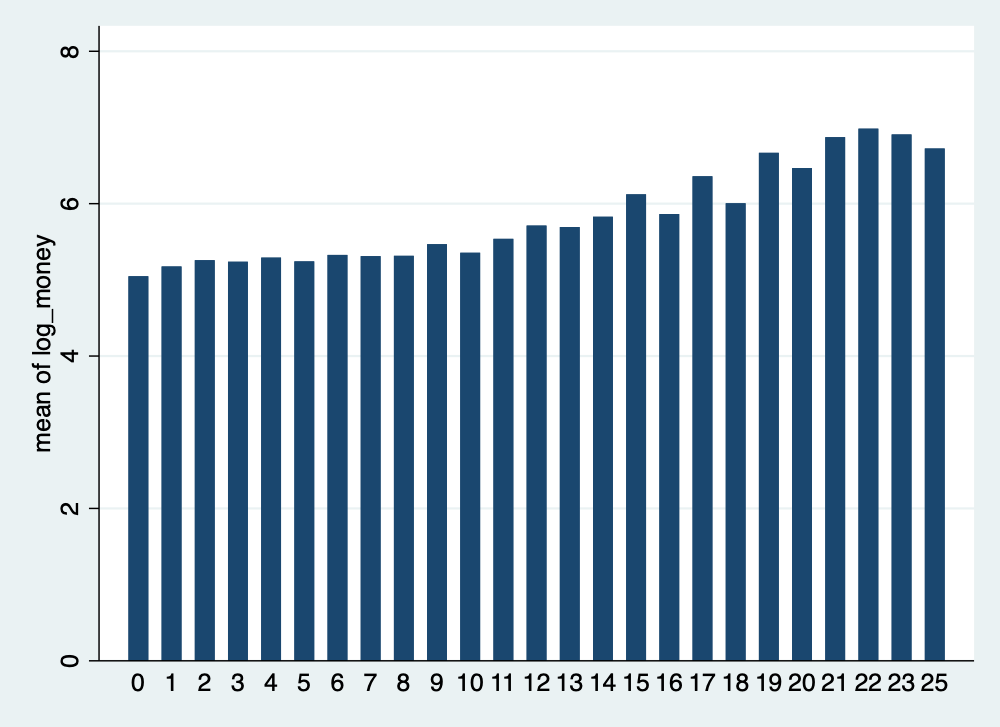
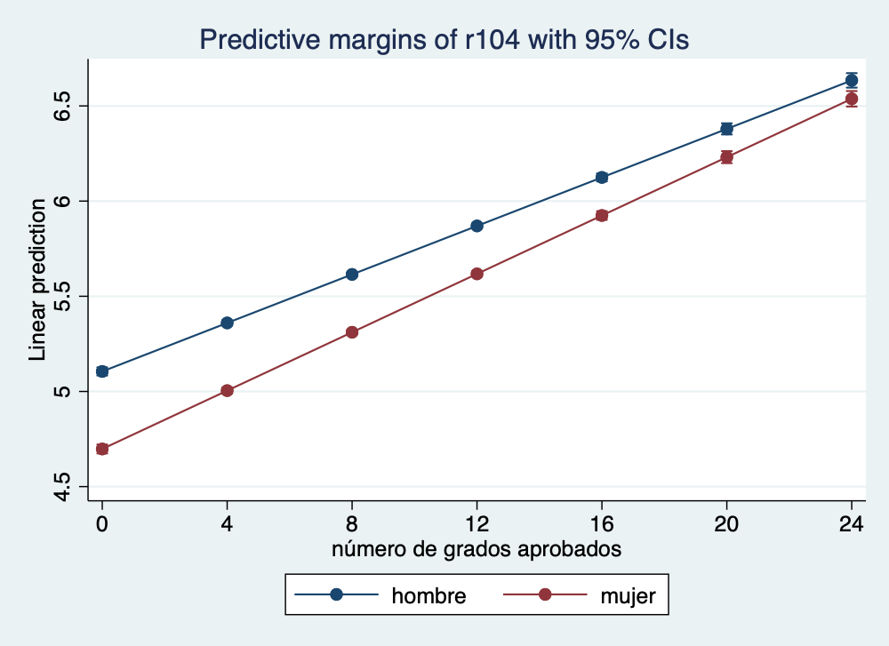
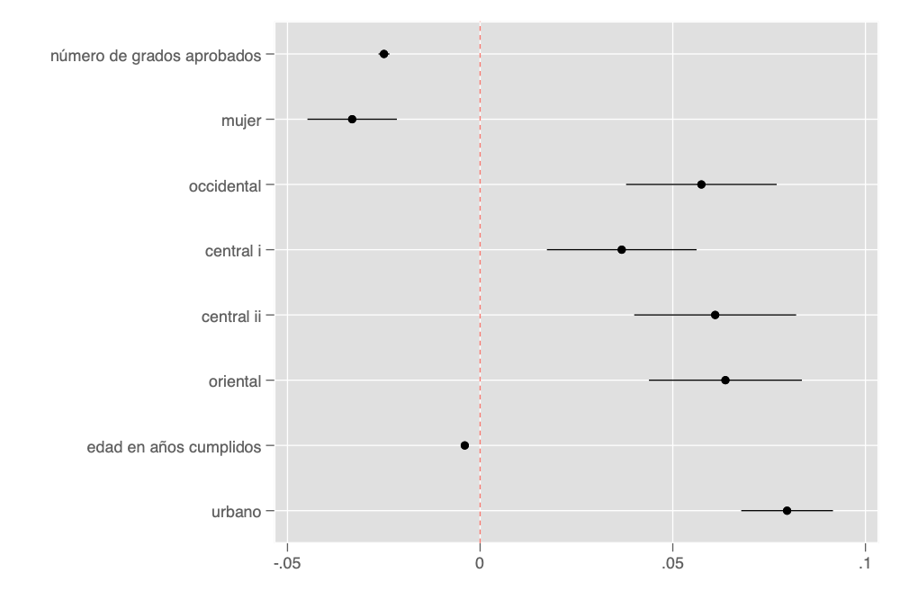

```{r, include=FALSE}
library(Statamarkdown)
stataexe <- find_stata()
knitr::opts_chunk$set(engine.path=list(stata=stataexe),
  error=TRUE, cleanlog=TRUE, comment=NA)

```


```{r setup, include=FALSE}
knitr::opts_chunk$set(echo = TRUE)
```

## Previo
Volvamos a la base de la EHPM. 

```{stata, collectcode=TRUE, include=FALSE}
clear
```
```{stata, collectcode=TRUE, warnings=FALSE}
use "datos/ehpm_2019", clear

```

Transformación logaritmica
```{stata, collectcode=TRUE, warnings=FALSE}

gen log_money=log(money) if actpr2012==10

```

Con este modelo empezamos la sesión pasada. Lo corremos para tenerlo en la memoria

```{stata, collectcode=TRUE}
regress log_money aproba1 i.r104 ib5.region r106 if actpr2012==10
estimates store modelo4
```


# Extensión de modelos (efectos cuadráticos e interacciones)

## Efecto cuadrático de la escolaridad en los ingresos

Recordemos las relaciones gráficas


```{stata, collectcode=TRUE, warnings=FALSE}

graph bar (mean) money if actpr2012==10, over(aproba1)
```


```{stata, collectcode=TRUE, warnings=FALSE}

graph bar (mean) log_money if actpr2012==10, over(aproba1)
```

```{stata, collectcode=TRUE, warnings=FALSE, include=FALSE}

graph bar (mean) log_money if actpr2012==10, over(aproba1)
graph export "images/cuadratico.png", replace width(1000)
```

Tan a nivel como en logaritmo, podemos ver un efecto un ligero efecto acelaración. Estos efectos normalmente se introducen como valores cuadráticos. Veamos, creamos las variables

```{stata, collectcode=TRUE}
gen aproba2=aproba1^2
```

Ahora veamos su relación con con un *scatterplot*
```{stata, collectcode=TRUE, warnings=FALSE,include=FALSE}
twoway scatter log_money aproba2 if actpr2012==10, jitter(50)  mcolor(%20)
graph export "images/scatter_cuadri.png", replace width(1000)

```

```{stata, collectcode=TRUE, warnings=FALSE}
twoway scatter log_money aproba2 if actpr2012==10, jitter(50)  mcolor(%20)
```


```{stata, collectcode=TRUE, warnings=FALSE}
pwcorr log_money aproba* if actpr2012==10, sig obs

```


Corremos otro modelo con el efecto cuadratico
```{stata, collectcode=TRUE}
regress log_money aproba1 aproba2 i.r104 ib5.region r106 if actpr2012==10
estimates store modelo5
```


```{stata, collectcode=TRUE}
ftest modelo4 modelo5
```

No obstante, el modelo 5 es un poco problemático para calcular el efecto acumulado de la escolaridad, o el efecto promedio.


Corremos otro modelo con el efecto cuadratico
```{stata, collectcode=TRUE}
estimates restore modelo5
margins, dydx(aproba*)
```

¿Cómo podríamos tener un efecto marginal que de cuenta de las dos variables como una sola?

Vamos a introduci otro prefijo de variable que es "c."


Corremos otro modelo con el efecto cuadratico
```{stata, collectcode=TRUE}
regress log_money c.aproba1##c.aproba1 i.r104 ib5.region r106 if actpr2012==10
estimates store modelo6
```


Corremos otro modelo con el efecto cuadratico
```{stata, collectcode=TRUE}
estimates restore modelo6
margins, dydx(aproba1)
```

## Interacciones

Los ## nos sirven para tener las interacciones. También nos sirven para ver interacciones de varios tipos

### Cuali y cuanti

Sabemos que las mujeres son más escolarizadas que los hombres. Si quisiéramos un cambio en el intercepto, podríamos introducir esto:


```{stata, collectcode=TRUE}
regress log_money c.aproba1##i.r104 ib5.region r106 if actpr2012==10
estimates store modelo7
```

Vamos a ver esto en qué se puede traducir, veamos cómo se predicen los efectos de los años de escolaridad para el modelo 4 y luego para el modelo 7


```{stata, collectcode=TRUE}

estimates restore modelo4
margins r104, at(aproba1=(0(4)25))
marginsplot
```


```{stata, collectcode=TRUE, include=FALSE}

estimates restore modelo4
margins r104, at(aproba1=(0(4)25))
marginsplot
graph export "images/marginsplot4.png", replace width(1000)
```


Veamos con el modelo de interacción
```{stata, collectcode=TRUE}

estimates restore modelo7
margins r104, at(aproba1=(0(4)25))
marginsplot

```



```{stata, collectcode=TRUE, include=FALSE}

estimates restore modelo7
margins r104, at(aproba1=(0(4)25))
marginsplot
graph export "images/marginsplot7.png", replace width(1000)
```

### Cuali y cuali 

De nuevo, usamos los "##" para indicar las interacciones. Acá es hay que tener claro que hay dobles categorías de referencia: la combinación de ambas. 

```{stata, collectcode=TRUE}
regress log_money aproba1 i.r104##ib5.region r106 if actpr2012==10
estimates store modelo8
```


## Uso de “lincom” y “nlcom”

Para calcular además los errores estándar de esta suma de coeficientes, podemos utilizar el comando "lincom", que refiere a combinaciones lineales (sumas y restas) de coeficientes

Para saber "cómo se llaman los coeficientes", podemos pedírselos a stata con la opción coeflegend


```{stata, collectcode=TRUE}
estimates replay  modelo8, coeflegend
```

Si quisiéramos saber cómo comparamos a una mujer de la región 4 con respecto a un hombre en la región 5 (AMSS), podemos computar:

```{stata, collectcode=TRUE}

lincom   _b[2.r104]+ _b[4.region]+ _b[2.r104#4.region]
```

De manera análoga, "nlcom" nos permite hacer combinaciones no lineales (cocientes y multiplicadores)

```{stata, collectcode=TRUE}

nlcom   _b[2.r104]/_b[4.region]
```


# Un poquito de otros modelos para respuestas cuantitativas

Como vimos algunos supuestos de normalidad no se cumplían con nuestras variables. Podemos modelar nuestra respuesta de diferentes maneras:

## Regresión robusta (a los outliers)


```{stata, collectcode=TRUE}
rreg log_money aproba1 i.r104 ib5.region r106 if actpr2012==10
estimates store modelo9
```

No se ve el r2 ni el r2 ajustado:

```{stata, collectcode=TRUE}
di"R2 = " e(r2)
di "R2a = " e(r2_a)

```

¡Cuidado! Hay que corregir, porque este R2 es sobre las seudo-observaciones

```
findit rregfit
```

```{stata, collectcode=TRUE}
rreg log_money aproba1 i.r104 ib5.region r106 if actpr2012==10
rregfit
```

## Regresión cuantílica

Se basa en la mediana y hay desviaciones. Ver Yaffee <http://web.ipac.caltech.edu/staff/fmasci/home/astro_refs/RobustRegAnalysis.pdf>


```{stata, collectcode=TRUE}
qreg log_money aproba1 i.r104 ib5.region r106 if actpr2012==10
estimates store modelo10
```

Aquí no hay "r2", pero podemos sacar una medida sobre las desviaciones absolutas

```{stata, collectcode=TRUE}
di 1- (`=e(sum_adev)'/`=e(sum_rdev)')
```


Veamos los resultados


```{stata, collectcode=TRUE}
esttab modelo4 modelo9 modelo10, ar2 r2 pr2
```


# Modelo de regresión logística e introducción a los modelos lineales generalizados

Hasta el momento hemos tenido variables cuya respuesta es cuantitativa.

Si quisiéramos predecir la probabilidad de que un hogar sea pobre de acuerdo a las características de la jefatura del hogar tenemos:

Primero generemos nuestra variable de respuesta dicotómica

```{stata, collectcode=TRUE}
tab pobreza // tiene tres categorías

gen pobre_total=pobreza<3 // 0 no pobre, 1 cualquier pobreza
```

Hoy sí estamos listos y listas para correr nuestro modelo

```{stata, collectcode=TRUE}
logit pobre_total aproba1 i.r104 ib5.region r106 if r103==1
estimates store logit1
```

Los resultado pueden tambien obtenerse como *odd-ratios*


```{stata, collectcode=TRUE}
estimates replay logit1, or
```

Para ver el ajuste
```{stata, collectcode=TRUE}
estat class
estat gof, group(10)
```

El estadístico de ajuste de Hosmer-Lemeshov es muy sensible al tamaño de la muestra. Allison lo explica bien acá 
<https://statisticalhorizons.com/hosmer-lemeshow>

Si queremos utilizar otro corte para evaluar nuestra clasificación, podemos ver el gráfico:

```{stata, collectcode=TRUE}
lsens
```


```{stata, collectcode=TRUE, include=FALSE}
estimates restore logit1
lsens
graph export "images/lsens.png", replace width(1000)
```

Más valores de ajuste:
```
findit fitstat
```

Para ver el ajuste
```{stata, collectcode=TRUE}
logit pobre_total aproba1 i.r104 ib5.region r106 if r103==1
fitstat
estadd fitstat 
estimates store logit1
```

"estadd" si queremos que se guarden en e() para su uso en "esttab"

Si queremos introducir una variable más, por ejemplo el area de residencia. Podemos introducirla y luego comparar modelos. Muy parecido a F-test, es el lrtest. Sólo que hoy compara tomando en cuenta las devianzas, que están basadas en la maxima verosimilitud

```{stata, collectcode=TRUE}
logit pobre_total aproba1 i.r104 ib5.region r106 i.area if r103==1
estadd fitstat 
estimates store logit2
```

Comparando:

```{stata, collectcode=TRUE}
lrtest logit1 logit2
```

Veamos la tabla:

```{stata, collectcode=TRUE}
esttab logit*, eform cells(b(fmt(2) star)) ///
scalars(r2_mf r2_mfadj r2_ml r2_cu dev ll bic aic) ///
starlevel(* 0.10 ** 0.05 *** 0.001) ///
legend label replace unstack	 
```

## Análisis de supuestos

La única limitación "real" en la regresión logística es que la variable de respuesta debe ser discreta.

También necesitamos suficiente muestra.  El uso de variables discretas requiere que haya suficientes respuestas en cada categoría dada. Si hay demasiadas celdas sin respuesta, las estimaciones de los parámetros y los errores estándar probablemente explotarán. Aquí pues esto lo podemos ver en un análisis descriptivo anterior y ver si podemos juntar categorías.

### Multicolinealiad
La multicolinealidad será un problema porque hará imposible la estimación de máxima verosimilitud. Así como los valores atípicos, siempre pueden generar problemas de estimación. Aquí no podemos usar el VIF, porque sólo sirve para modelos de otro tipo. 

```
findit collin
```

```{stata, collectcode=TRUE}
collin aproba1 r104 region r106 area
```

### valores atípicos

Podemos como siempre utilizar algunos elementos de los modelos lineales. 


```{stata, collectcode=TRUE}
predict p
predict stdres, rstand
```

Para ver mejor podemos hacer un scatter:
```{stata, collectcode=TRUE}
scatter stdres p
```


# Post-estimación y cálculo de efecto marginales

Como habíamos mencionado los efectos marginales serán mucho más interesantes en este tipo de modelo

```{stata, collectcode=TRUE}
estimates restore logit2
margins 
margins r104
```

Por *default* nos está dando la probabilidad predicha. Esto es sumamente útil. 

Dado que leer los resultados a veces es muy complicados por el concepto de momios, esto puede ayudarnos a comunicar los resultados. Lo ideal es crear "tipos" de individuos en nuestro estudio y comparar las probabilidades. 

Una buena idea puede ser guardar estos valores y usar "coefplot" para graficarlos. Para ello debemos utilizar la opción "post" con margins, para que los guardemos como cualquier otra estimación. 

Veamos esto con los efectos marginales:

```{stata, collectcode=TRUE}
estimates restore logit2
margins, dydx(*) post
estimates store eff2
```

Ahora con esta estimación la podemos grafica

```{stata, collectcode=TRUE}
coefplot eff2, xline(0) scheme(plottig)
```

```{stata, collectcode=TRUE, include=FALSE}
coefplot eff2, xline(0) scheme(plottig)
graph export "images/eff2.png", replace width(1000)
```


Más de coefplot  y cómo poner los coeficientes <http://repec.sowi.unibe.ch/stata/coefplot/getting-started.html#h-4>
