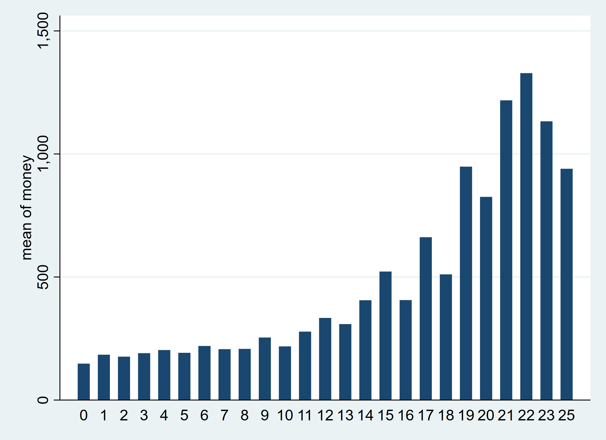

Sesión 4
================
Ana Escoto
30/10/2021

## Previo

Volvamos a la base de la EHPM.

``` stata
use "datos/ehpm_2019", clear
```

Transformación logaritmica

``` stata
gen log_money=log(money) if actpr2012==10
```

    (47,267 missing values generated)

Con este modelo empezamos la sesión pasada. Lo corremos para tenerlo en
la memoria

``` stata
regress log_money aproba1 i.r104 ib5.region r106 if actpr2012==10
estimates store modelo4
```

          Source |       SS           df       MS      Number of obs   =    27,181
    -------------+----------------------------------   F(7, 27173)     =   1231.28
           Model |  3764.39125         7  537.770179   Prob > F        =    0.0000
        Residual |       11868    27,173  .436757075   R-squared       =    0.2408
    -------------+----------------------------------   Adj R-squared   =    0.2406
           Total |  15632.3913    27,180  .575143166   Root MSE        =    .66088

    ------------------------------------------------------------------------------
       log_money | Coefficient  Std. err.      t    P>|t|     [95% conf. interval]
    -------------+----------------------------------------------------------------
         aproba1 |   .0697546   .0008845    78.87   0.000      .068021    .0714882
                 |
            r104 |
          mujer  |  -.3017288   .0081353   -37.09   0.000    -.3176745   -.2857831
                 |
          region |
     occidental  |  -.1438722   .0132228   -10.88   0.000    -.1697896   -.1179547
      central i  |  -.1231996    .013113    -9.40   0.000    -.1489017   -.0974975
     central ii  |  -.1624411    .014404   -11.28   0.000    -.1906736   -.1342085
       oriental  |  -.1747649   .0134767   -12.97   0.000      -.20118   -.1483498
                 |
            r106 |    .009887   .0002954    33.47   0.000      .009308     .010466
           _cons |   4.798866   .0198346   241.94   0.000     4.759989    4.837743
    ------------------------------------------------------------------------------

# Extensión de modelos (efectos cuadráticos e interacciones)

## Efecto cuadrático de la escolaridad en los ingresos

Recordemos las relaciones gráficas

``` stata
graph bar (mean) money if actpr2012==10, over(aproba1)
```



``` stata
graph bar (mean) log_money if actpr2012==10, over(aproba1)
```

 Tan a nivel como en logaritmo, podemos ver un
efecto un ligero efecto acelaración. Estos efectos normalmente se
introducen como valores cuadráticos. Veamos, creamos las variables

``` stata
gen aproba2=aproba1^2
```

    (4,572 missing values generated)

Ahora veamos su relación con con un *scatterplot*

``` stata
twoway scatter log_money aproba2 if actpr2012==10, jitter(50)  mcolor(%20)
```


``` stata
pwcorr log_money aproba* if actpr2012==10, sig obs
```

                 | log_mo~y  aproba1  aproba2
    -------------+---------------------------
       log_money |   1.0000 
                 |
                 |    27181
                 |
         aproba1 |   0.4098   1.0000 
                 |   0.0000
                 |    27181    32258
                 |
         aproba2 |   0.4317   0.9484   1.0000 
                 |   0.0000   0.0000
                 |    27181    32258    32258
                 |

Corremos otro modelo con el efecto cuadratico

``` stata
regress log_money aproba1 aproba2 i.r104 ib5.region r106 if actpr2012==10
estimates store modelo5
```

          Source |       SS           df       MS      Number of obs   =    27,181
    -------------+----------------------------------   F(8, 27172)     =   1149.59
           Model |  3953.03702         8  494.129627   Prob > F        =    0.0000
        Residual |  11679.3542    27,172  .429830496   R-squared       =    0.2529
    -------------+----------------------------------   Adj R-squared   =    0.2527
           Total |  15632.3913    27,180  .575143166   Root MSE        =    .65561

    ------------------------------------------------------------------------------
       log_money | Coefficient  Std. err.      t    P>|t|     [95% conf. interval]
    -------------+----------------------------------------------------------------
         aproba1 |   .0143285   .0027874     5.14   0.000      .008865    .0197919
         aproba2 |   .0033159   .0001583    20.95   0.000     .0030056    .0036261
                 |
            r104 |
          mujer  |  -.3128858   .0080881   -38.68   0.000    -.3287389   -.2970326
                 |
          region |
     occidental  |  -.1415599    .013118   -10.79   0.000    -.1672719   -.1158479
      central i  |  -.1130063   .0130177    -8.68   0.000    -.1385216    -.087491
     central ii  |  -.1585421   .0142905   -11.09   0.000    -.1865523   -.1305319
       oriental  |  -.1841687    .013377   -13.77   0.000    -.2103883   -.1579491
                 |
            r106 |   .0083257   .0003024    27.53   0.000      .007733    .0089183
           _cons |   5.016032   .0222403   225.54   0.000      4.97244    5.059624
    ------------------------------------------------------------------------------

``` stata
ftest modelo4 modelo5
```

    Assumption: modelo4 nested in modelo5

    F(  1,   27172) =    438.88
           prob > F =    0.0000

No obstante, el modelo 5 es un poco problemático para calcular el efecto
acumulado de la escolaridad, o el efecto promedio.

Corremos otro modelo con el efecto cuadratico

``` stata
estimates restore modelo5
margins, dydx(aproba*)
```

    (results modelo5 are active now)


    Average marginal effects                                Number of obs = 27,181
    Model VCE: OLS

    Expression: Linear prediction, predict()
    dy/dx wrt:  aproba1 aproba2

    ------------------------------------------------------------------------------
                 |            Delta-method
                 |      dy/dx   std. err.      t    P>|t|     [95% conf. interval]
    -------------+----------------------------------------------------------------
         aproba1 |   .0143285   .0027874     5.14   0.000      .008865    .0197919
         aproba2 |   .0033159   .0001583    20.95   0.000     .0030056    .0036261
    ------------------------------------------------------------------------------

¿Cómo podríamos tener un efecto marginal que de cuenta de las dos
variables como una sola?

Vamos a introduci otro prefijo de variable que es “c.”

Corremos otro modelo con el efecto cuadratico

``` stata
regress log_money c.aproba1##c.aproba1 i.r104 ib5.region r106 if actpr2012==10
estimates store modelo6
```

          Source |       SS           df       MS      Number of obs   =    27,181
    -------------+----------------------------------   F(8, 27172)     =   1149.59
           Model |  3953.03702         8  494.129627   Prob > F        =    0.0000
        Residual |  11679.3542    27,172  .429830496   R-squared       =    0.2529
    -------------+----------------------------------   Adj R-squared   =    0.2527
           Total |  15632.3913    27,180  .575143166   Root MSE        =    .65561

    -------------------------------------------------------------------------------------
              log_money | Coefficient  Std. err.      t    P>|t|     [95% conf. interval]
    --------------------+----------------------------------------------------------------
                aproba1 |   .0143285   .0027874     5.14   0.000      .008865    .0197919
                        |
    c.aproba1#c.aproba1 |   .0033159   .0001583    20.95   0.000     .0030056    .0036261
                        |
                   r104 |
                 mujer  |  -.3128858   .0080881   -38.68   0.000    -.3287389   -.2970326
                        |
                 region |
            occidental  |  -.1415599    .013118   -10.79   0.000    -.1672719   -.1158479
             central i  |  -.1130063   .0130177    -8.68   0.000    -.1385216    -.087491
            central ii  |  -.1585421   .0142905   -11.09   0.000    -.1865523   -.1305319
              oriental  |  -.1841687    .013377   -13.77   0.000    -.2103883   -.1579491
                        |
                   r106 |   .0083257   .0003024    27.53   0.000      .007733    .0089183
                  _cons |   5.016032   .0222403   225.54   0.000      4.97244    5.059624
    -------------------------------------------------------------------------------------

Corremos otro modelo con el efecto cuadratico

``` stata
estimates restore modelo6
margins, dydx(aproba1)
```

    (results modelo6 are active now)


    Average marginal effects                                Number of obs = 27,181
    Model VCE: OLS

    Expression: Linear prediction, predict()
    dy/dx wrt:  aproba1

    ------------------------------------------------------------------------------
                 |            Delta-method
                 |      dy/dx   std. err.      t    P>|t|     [95% conf. interval]
    -------------+----------------------------------------------------------------
         aproba1 |   .0682883   .0008802    77.58   0.000      .066563    .0700135
    ------------------------------------------------------------------------------

## Interacciones

Los \#\# nos sirven para tener las interacciones. También nos sirven
para ver interacciones de varios tipos

### Cuali y cuanti

Sabemos que las mujeres son más escolarizadas que los hombres. Si
quisiéramos un cambio en el intercepto, podríamos introducir esto:

``` stata
regress log_money c.aproba1##i.r104 ib5.region r106 if actpr2012==10
estimates store modelo7
```

          Source |       SS           df       MS      Number of obs   =    27,181
    -------------+----------------------------------   F(8, 27172)     =   1087.35
           Model |  3790.90328         8   473.86291   Prob > F        =    0.0000
        Residual |   11841.488    27,172  .435797438   R-squared       =    0.2425
    -------------+----------------------------------   Adj R-squared   =    0.2423
           Total |  15632.3913    27,180  .575143166   Root MSE        =    .66015

    --------------------------------------------------------------------------------
         log_money | Coefficient  Std. err.      t    P>|t|     [95% conf. interval]
    ---------------+----------------------------------------------------------------
           aproba1 |   .0637174   .0011746    54.25   0.000     .0614152    .0660197
                   |
              r104 |
            mujer  |  -.4072198   .0157786   -25.81   0.000    -.4381466    -.376293
                   |
    r104#c.aproba1 |
            mujer  |   .0129382   .0016588     7.80   0.000     .0096869    .0161895
                   |
            region |
       occidental  |  -.1440278   .0132083   -10.90   0.000    -.1699168   -.1181388
        central i  |  -.1229838   .0130986    -9.39   0.000    -.1486577     -.09731
       central ii  |  -.1642713   .0143901   -11.42   0.000    -.1924765    -.136066
         oriental  |  -.1770857   .0134652   -13.15   0.000    -.2034782   -.1506932
                   |
              r106 |   .0100006   .0002954    33.85   0.000     .0094216    .0105797
             _cons |   4.844602   .0206623   234.47   0.000     4.804103    4.885102
    --------------------------------------------------------------------------------

Vamos a ver esto en qué se puede traducir, veamos cómo se predicen los
efectos de los años de escolaridad para el modelo 4 y luego para el
modelo 7

``` stata
estimates restore modelo4
margins r104, at(aproba1=(0(4)25))
marginsplot
```

    (results modelo4 are active now)


    Predictive margins                                      Number of obs = 27,181
    Model VCE: OLS

    Expression: Linear prediction, predict()
    1._at: aproba1 =  0
    2._at: aproba1 =  4
    3._at: aproba1 =  8
    4._at: aproba1 = 12
    5._at: aproba1 = 16
    6._at: aproba1 = 20
    7._at: aproba1 = 24

    ------------------------------------------------------------------------------
                 |            Delta-method
                 |     Margin   std. err.      t    P>|t|     [95% conf. interval]
    -------------+----------------------------------------------------------------
        _at#r104 |
       1#hombre  |   5.055708   .0088987   568.14   0.000     5.038266     5.07315
        1#mujer  |   4.753979   .0095174   499.50   0.000     4.735324    4.772634
       2#hombre  |   5.334726   .0064129   831.87   0.000     5.322157    5.347296
        2#mujer  |   5.032997   .0071915   699.86   0.000     5.018902    5.047093
       3#hombre  |   5.613745   .0053006  1059.07   0.000     5.603355    5.624134
        3#mujer  |   5.312016   .0061551   863.02   0.000     5.299951     5.32408
       4#hombre  |   5.892763   .0063325   930.57   0.000     5.880351    5.905175
        4#mujer  |   5.591034   .0070062   798.01   0.000     5.577302    5.604767
       5#hombre  |   6.171781   .0087827   702.72   0.000     6.154567    6.188996
        5#mujer  |   5.870053   .0092369   635.50   0.000     5.851948    5.888157
       6#hombre  |     6.4508   .0117985   546.75   0.000     6.427674    6.473926
        6#mujer  |   6.149071   .0121073   507.88   0.000      6.12534    6.172802
       7#hombre  |   6.729818   .0150435   447.36   0.000     6.700332    6.759304
        7#mujer  |   6.428089   .0152606   421.22   0.000     6.398178    6.458001
    ------------------------------------------------------------------------------


    Variables that uniquely identify margins: aproba1 r104


Veamos con el modelo de interacción

``` stata
estimates restore modelo7
margins r104, at(aproba1=(0(4)25))
marginsplot
```

    (results modelo7 are active now)


    Predictive margins                                      Number of obs = 27,181
    Model VCE: OLS

    Expression: Linear prediction, predict()
    1._at: aproba1 =  0
    2._at: aproba1 =  4
    3._at: aproba1 =  8
    4._at: aproba1 = 12
    5._at: aproba1 = 16
    6._at: aproba1 = 20
    7._at: aproba1 = 24

    ------------------------------------------------------------------------------
                 |            Delta-method
                 |     Margin   std. err.      t    P>|t|     [95% conf. interval]
    -------------+----------------------------------------------------------------
        _at#r104 |
       1#hombre  |   5.105066   .0109115   467.86   0.000     5.083679    5.126453
        1#mujer  |   4.697846   .0119237   393.99   0.000     4.674475    4.721218
       2#hombre  |   5.359936   .0071751   747.02   0.000     5.345872       5.374
        2#mujer  |   5.004469   .0080611   620.82   0.000     4.988669    5.020269
       3#hombre  |   5.614806   .0052965  1060.09   0.000     5.604424    5.625187
        3#mujer  |   5.311092   .0061495   863.66   0.000     5.299038    5.323145
       4#hombre  |   5.869676   .0069838   840.47   0.000     5.855987    5.883364
        4#mujer  |   5.617714   .0077897   721.17   0.000     5.602446    5.632983
       5#hombre  |   6.124545   .0106604   574.52   0.000     6.103651     6.14544
        5#mujer  |   5.924337   .0115573   512.61   0.000     5.901684     5.94699
       6#hombre  |   6.379415   .0149219   427.52   0.000     6.350168    6.408663
        6#mujer  |    6.23096   .0160154   389.06   0.000     6.199569     6.26235
       7#hombre  |   6.634285   .0193863   342.21   0.000     6.596287    6.672283
        7#mujer  |   6.537582    .020723   315.48   0.000     6.496964      6.5782
    ------------------------------------------------------------------------------


    Variables that uniquely identify margins: aproba1 r104


### Cuali y cuali

De nuevo, usamos los “\#\#” para indicar las interacciones. Acá es hay
que tener claro que hay dobles categorías de referencia: la combinación
de ambas.

``` stata
regress log_money aproba1 i.r104##ib5.region r106 if actpr2012==10
estimates store modelo8
```

          Source |       SS           df       MS      Number of obs   =    27,181
    -------------+----------------------------------   F(11, 27169)    =    784.83
           Model |  3769.51926        11  342.683569   Prob > F        =    0.0000
        Residual |   11862.872    27,169  .436632633   R-squared       =    0.2411
    -------------+----------------------------------   Adj R-squared   =    0.2408
           Total |  15632.3913    27,180  .575143166   Root MSE        =    .66078

    -----------------------------------------------------------------------------------
            log_money | Coefficient  Std. err.      t    P>|t|     [95% conf. interval]
    ------------------+----------------------------------------------------------------
              aproba1 |   .0696711    .000885    78.73   0.000     .0679365    .0714057
                      |
                 r104 |
               mujer  |  -.2790907   .0199549   -13.99   0.000    -.3182033    -.239978
                      |
               region |
          occidental  |  -.1181965   .0174392    -6.78   0.000    -.1523782   -.0840148
           central i  |  -.1052724   .0174778    -6.02   0.000    -.1395299    -.071015
          central ii  |  -.1676344   .0191302    -8.76   0.000    -.2051306   -.1301382
            oriental  |  -.1723192   .0178837    -9.64   0.000    -.2073721   -.1372662
                      |
          r104#region |
    mujer#occidental  |  -.0609188   .0261146    -2.33   0.020    -.1121048   -.0097329
     mujer#central i  |  -.0409196   .0260445    -1.57   0.116    -.0919682    .0101291
    mujer#central ii  |    .013186   .0285724     0.46   0.644    -.0428174    .0691895
      mujer#oriental  |  -.0046721   .0266397    -0.18   0.861    -.0568872     .047543
                      |
                 r106 |    .009876   .0002955    33.42   0.000     .0092968    .0104551
                _cons |   4.789918   .0216073   221.68   0.000     4.747566    4.832269
    -----------------------------------------------------------------------------------

## Uso de “lincom” y “nlcom”

Para calcular además los errores estándar de esta suma de coeficientes,
podemos utilizar el comando “lincom”, que refiere a combinaciones
lineales (sumas y restas) de coeficientes

Para saber “cómo se llaman los coeficientes”, podemos pedírselos a stata
con la opción coeflegend

``` stata
estimates replay  modelo8, coeflegend
```

    Model modelo8
    --------------------------------------------------------------------------------------------------------------------------------------------

          Source |       SS           df       MS      Number of obs   =    27,181
    -------------+----------------------------------   F(11, 27169)    =    784.83
           Model |  3769.51926        11  342.683569   Prob > F        =    0.0000
        Residual |   11862.872    27,169  .436632633   R-squared       =    0.2411
    -------------+----------------------------------   Adj R-squared   =    0.2408
           Total |  15632.3913    27,180  .575143166   Root MSE        =    .66078

    -----------------------------------------------------------------------------------
            log_money | Coefficient  Legend
    ------------------+----------------------------------------------------------------
              aproba1 |   .0696711  _b[aproba1]
                      |
                 r104 |
               mujer  |  -.2790907  _b[2.r104]
                      |
               region |
          occidental  |  -.1181965  _b[1.region]
           central i  |  -.1052724  _b[2.region]
          central ii  |  -.1676344  _b[3.region]
            oriental  |  -.1723192  _b[4.region]
                      |
          r104#region |
    mujer#occidental  |  -.0609188  _b[2.r104#1.region]
     mujer#central i  |  -.0409196  _b[2.r104#2.region]
    mujer#central ii  |    .013186  _b[2.r104#3.region]
      mujer#oriental  |  -.0046721  _b[2.r104#4.region]
                      |
                 r106 |    .009876  _b[r106]
                _cons |   4.789918  _b[_cons]
    -----------------------------------------------------------------------------------

Si quisiéramos saber cómo comparamos a una mujer de la región 4 con
respecto a un hombre en la región 5 (AMSS), podemos computar:

``` stata
lincom   _b[2.r104]+ _b[4.region]+ _b[2.r104#4.region]
```

     ( 1)  2.r104 + 4.region + 2.r104#4.region = 0

    ------------------------------------------------------------------------------
       log_money | Coefficient  Std. err.      t    P>|t|     [95% conf. interval]
    -------------+----------------------------------------------------------------
             (1) |  -.4560819   .0191316   -23.84   0.000    -.4935808   -.4185831
    ------------------------------------------------------------------------------

De manera análoga, “nlcom” nos permite hacer combinaciones no lineales
(cocientes y multiplicadores)

``` stata
nlcom   _b[2.r104]/_b[4.region]
```

           _nl_1: _b[2.r104]/_b[4.region]

    ------------------------------------------------------------------------------
       log_money | Coefficient  Std. err.      z    P>|z|     [95% conf. interval]
    -------------+----------------------------------------------------------------
           _nl_1 |   1.619615   .1483251    10.92   0.000     1.328903    1.910326
    ------------------------------------------------------------------------------

# Un poquito de otros modelos para respuestas cuantitativas

Como vimos algunos supuestos de normalidad no se cumplían con nuestras
variables. Podemos modelar nuestra respuesta de diferentes maneras:

## Regresión robusta (a los outliers)

``` stata
rreg log_money aproba1 i.r104 ib5.region r106 if actpr2012==10
estimates store modelo9
```

       Huber iteration 1:  maximum difference in weights = .8461893
       Huber iteration 2:  maximum difference in weights = .07085394
       Huber iteration 3:  maximum difference in weights = .01581995
    Biweight iteration 4:  maximum difference in weights = .29421442
    Biweight iteration 5:  maximum difference in weights = .01341401
    Biweight iteration 6:  maximum difference in weights = .00402433

    Robust regression                               Number of obs     =     27,181
                                                    F(  7,     27173) =    1508.08
                                                    Prob > F          =     0.0000

    ------------------------------------------------------------------------------
       log_money | Coefficient  Std. err.      t    P>|t|     [95% conf. interval]
    -------------+----------------------------------------------------------------
         aproba1 |    .069702   .0007789    89.49   0.000     .0681754    .0712287
                 |
            r104 |
          mujer  |   -.257507   .0071642   -35.94   0.000    -.2715491   -.2434648
                 |
          region |
     occidental  |  -.1277654   .0116443   -10.97   0.000     -.150589   -.1049419
      central i  |  -.1036672   .0115476    -8.98   0.000     -.126301   -.0810334
     central ii  |  -.1506257   .0126845   -11.87   0.000    -.1754879   -.1257634
       oriental  |  -.1608037   .0118679   -13.55   0.000    -.1840654   -.1375419
                 |
            r106 |   .0099245   .0002601    38.15   0.000     .0094146    .0104344
           _cons |   4.815209   .0174668   275.68   0.000     4.780973    4.849445
    ------------------------------------------------------------------------------

No se ve el r2 ni el r2 ajustado:

``` stata
di"R2 = " e(r2)
di "R2a = " e(r2_a)
```

    R2 = .27979501

    R2a = .27960948

¡Cuidado! Hay que corregir, porque este R2 es sobre las
seudo-observaciones

    findit rregfit

``` stata
rreg log_money aproba1 i.r104 ib5.region r106 if actpr2012==10
rregfit
```

       Huber iteration 1:  maximum difference in weights = .8461893
       Huber iteration 2:  maximum difference in weights = .07085394
       Huber iteration 3:  maximum difference in weights = .01581995
    Biweight iteration 4:  maximum difference in weights = .29421442
    Biweight iteration 5:  maximum difference in weights = .01341401
    Biweight iteration 6:  maximum difference in weights = .00402433

    Robust regression                               Number of obs     =     27,181
                                                    F(  7,     27173) =    1508.08
                                                    Prob > F          =     0.0000

    ------------------------------------------------------------------------------
       log_money | Coefficient  Std. err.      t    P>|t|     [95% conf. interval]
    -------------+----------------------------------------------------------------
         aproba1 |    .069702   .0007789    89.49   0.000     .0681754    .0712287
                 |
            r104 |
          mujer  |   -.257507   .0071642   -35.94   0.000    -.2715491   -.2434648
                 |
          region |
     occidental  |  -.1277654   .0116443   -10.97   0.000     -.150589   -.1049419
      central i  |  -.1036672   .0115476    -8.98   0.000     -.126301   -.0810334
     central ii  |  -.1506257   .0126845   -11.87   0.000    -.1754879   -.1257634
       oriental  |  -.1608037   .0118679   -13.55   0.000    -.1840654   -.1375419
                 |
            r106 |   .0099245   .0002601    38.15   0.000     .0094146    .0104344
           _cons |   4.815209   .0174668   275.68   0.000     4.780973    4.849445
    ------------------------------------------------------------------------------


    robust regression measures of fit
    R-square = .21022503
    AICR     = 31234.167
    BICR     = 31301.998
    deviance = 8441.6603

## Regresión cuantílica

Se basa en la mediana y hay desviaciones. Ver Yaffee
<http://web.ipac.caltech.edu/staff/fmasci/home/astro_refs/RobustRegAnalysis.pdf>

``` stata
qreg log_money aproba1 i.r104 ib5.region r106 if actpr2012==10
estimates store modelo10
```

    Iteration  1:  WLS sum of weighted deviations =   6581.538

    Iteration  1: sum of abs. weighted deviations =  6581.6775
    Iteration  2: sum of abs. weighted deviations =  6581.4567
    Iteration  3: sum of abs. weighted deviations =  6570.5958
    Iteration  4: sum of abs. weighted deviations =  6558.2434
    Iteration  5: sum of abs. weighted deviations =  6551.2479
    note: alternate solutions exist.
    Iteration  6: sum of abs. weighted deviations =  6549.4545
    Iteration  7: sum of abs. weighted deviations =  6549.0696
    Iteration  8: sum of abs. weighted deviations =  6547.1725
    Iteration  9: sum of abs. weighted deviations =  6546.6382
    Iteration 10: sum of abs. weighted deviations =  6544.4749
    Iteration 11: sum of abs. weighted deviations =  6544.0539
    Iteration 12: sum of abs. weighted deviations =  6542.8008
    Iteration 13: sum of abs. weighted deviations =  6539.9671
    Iteration 14: sum of abs. weighted deviations =  6539.0453
    note: alternate solutions exist.
    Iteration 15: sum of abs. weighted deviations =  6538.2036
    Iteration 16: sum of abs. weighted deviations =  6537.8203
    Iteration 17: sum of abs. weighted deviations =  6537.5598
    Iteration 18: sum of abs. weighted deviations =  6537.2905
    Iteration 19: sum of abs. weighted deviations =  6537.2277
    note: alternate solutions exist.
    Iteration 20: sum of abs. weighted deviations =  6537.2213
    Iteration 21: sum of abs. weighted deviations =  6537.2094
    Iteration 22: sum of abs. weighted deviations =  6537.2056
    Iteration 23: sum of abs. weighted deviations =  6537.1879
    Iteration 24: sum of abs. weighted deviations =  6537.1854
    Iteration 25: sum of abs. weighted deviations =  6537.1755
    Iteration 26: sum of abs. weighted deviations =  6537.1752
    Iteration 27: sum of abs. weighted deviations =  6537.1729
    Iteration 28: sum of abs. weighted deviations =  6537.1698
    Iteration 29: sum of abs. weighted deviations =  6537.1648
    Iteration 30: sum of abs. weighted deviations =  6537.1583
    note: alternate solutions exist.
    Iteration 31: sum of abs. weighted deviations =  6537.1574
    Iteration 32: sum of abs. weighted deviations =  6537.1525
    Iteration 33: sum of abs. weighted deviations =   6537.148
    Iteration 34: sum of abs. weighted deviations =  6537.1474
    Iteration 35: sum of abs. weighted deviations =  6537.1471
    Iteration 36: sum of abs. weighted deviations =  6537.1471
    Iteration 37: sum of abs. weighted deviations =  6537.1453
    Iteration 38: sum of abs. weighted deviations =  6537.1447
    Iteration 39: sum of abs. weighted deviations =  6537.1444
    Iteration 40: sum of abs. weighted deviations =  6537.1437
    Iteration 41: sum of abs. weighted deviations =  6537.1434
    Iteration 42: sum of abs. weighted deviations =  6537.1432
    Iteration 43: sum of abs. weighted deviations =  6537.1432
    Iteration 44: sum of abs. weighted deviations =  6537.1431
    Iteration 45: sum of abs. weighted deviations =  6537.1431
    Iteration 46: sum of abs. weighted deviations =   6537.143
    Iteration 47: sum of abs. weighted deviations =  6537.1429
    Iteration 48: sum of abs. weighted deviations =  6537.1428
    Iteration 49: sum of abs. weighted deviations =  6537.1428
    Iteration 50: sum of abs. weighted deviations =  6537.1428
    Iteration 51: sum of abs. weighted deviations =  6537.1427
    Iteration 52: sum of abs. weighted deviations =  6537.1427
    Iteration 53: sum of abs. weighted deviations =  6537.1427

    Median regression                                   Number of obs =     27,181
      Raw sum of deviations 7754.033 (about 5.5606818)
      Min sum of deviations 6537.143                    Pseudo R2     =     0.1569

    ------------------------------------------------------------------------------
       log_money | Coefficient  Std. err.      t    P>|t|     [95% conf. interval]
    -------------+----------------------------------------------------------------
         aproba1 |   .0715223   .0009348    76.51   0.000     .0696901    .0733545
                 |
            r104 |
          mujer  |  -.2362042   .0085982   -27.47   0.000    -.2530571   -.2193513
                 |
          region |
     occidental  |   -.133126   .0139751    -9.53   0.000     -.160518    -.105734
      central i  |  -.1026239    .013859    -7.40   0.000    -.1297883   -.0754596
     central ii  |  -.1504622   .0152235    -9.88   0.000     -.180301   -.1206233
       oriental  |  -.1756024   .0142435   -12.33   0.000    -.2035203   -.1476844
                 |
            r106 |   .0091656   .0003122    29.36   0.000     .0085536    .0097775
           _cons |    4.84487   .0209631   231.11   0.000     4.803781    4.885958
    ------------------------------------------------------------------------------

Aquí no hay “r2”, pero podemos sacar una medida sobre las desviaciones
absolutas

``` stata
di 1- (`=e(sum_adev)'/`=e(sum_rdev)')
```

    .15693645

Veamos los resultados

``` stata
esttab modelo4 modelo9 modelo10, ar2 r2 pr2
```

                          (1)             (2)             (3)   
                    log_money       log_money       log_money   
    ------------------------------------------------------------
    aproba1            0.0698***       0.0697***       0.0715***
                      (78.87)         (89.49)         (76.51)   

    1.r104                  0               0               0   
                          (.)             (.)             (.)   

    2.r104             -0.302***       -0.258***       -0.236***
                     (-37.09)        (-35.94)        (-27.47)   

    1.region           -0.144***       -0.128***       -0.133***
                     (-10.88)        (-10.97)         (-9.53)   

    2.region           -0.123***       -0.104***       -0.103***
                      (-9.40)         (-8.98)         (-7.40)   

    3.region           -0.162***       -0.151***       -0.150***
                     (-11.28)        (-11.87)         (-9.88)   

    4.region           -0.175***       -0.161***       -0.176***
                     (-12.97)        (-13.55)        (-12.33)   

    5.region                0               0               0   
                          (.)             (.)             (.)   

    r106              0.00989***      0.00992***      0.00917***
                      (33.47)         (38.15)         (29.36)   

    _cons               4.799***        4.815***        4.845***
                     (241.94)        (275.68)        (231.11)   
    ------------------------------------------------------------
    N                   27181           27181           27181   
    R-sq                0.241           0.280                   
    adj. R-sq           0.241           0.280                   
    pseudo R-sq                                         0.157   
    ------------------------------------------------------------
    t statistics in parentheses
    * p<0.05, ** p<0.01, *** p<0.001

# Modelo de regresión logística e introducción a los modelos lineales generalizados

Hasta el momento hemos tenido variables cuya respuesta es cuantitativa.

Si quisiéramos predecir la probabilidad de que un hogar sea pobre de
acuerdo a las características de la jefatura del hogar tenemos:

Primero generemos nuestra variable de respuesta dicotómica

``` stata
tab pobreza // tiene tres categorías

gen pobre_total=pobreza<3 // 0 no pobre, 1 cualquier pobreza
```

        condición de |
         pobreza del |
               hogar |      Freq.     Percent        Cum.
    -----------------+-----------------------------------
     pobreza extrema |      4,731        6.35        6.35
    pobreza relativa |     16,767       22.52       28.88
            no pobre |     52,950       71.12      100.00
    -----------------+-----------------------------------
               Total |     74,448      100.00

Hoy sí estamos listos y listas para correr nuestro modelo

``` stata
logit pobre_total aproba1 i.r104 ib5.region r106 if r103==1
estimates store logit1
```

    Iteration 0:   log likelihood = -11891.073  
    Iteration 1:   log likelihood = -11291.151  
    Iteration 2:   log likelihood = -11275.073  
    Iteration 3:   log likelihood = -11275.059  
    Iteration 4:   log likelihood = -11275.059  

    Logistic regression                                    Number of obs =  21,331
                                                           LR chi2(7)    = 1232.03
                                                           Prob > chi2   =  0.0000
    Log likelihood = -11275.059                            Pseudo R2     =  0.0518

    ------------------------------------------------------------------------------
     pobre_total | Coefficient  Std. err.      z    P>|z|     [95% conf. interval]
    -------------+----------------------------------------------------------------
         aproba1 |   -.128476    .004288   -29.96   0.000    -.1368802   -.1200717
                 |
            r104 |
          mujer  |  -.1420712   .0345934    -4.11   0.000     -.209873   -.0742694
                 |
          region |
     occidental  |   .2060723   .0615682     3.35   0.001     .0854008    .3267438
      central i  |   .1262053   .0625852     2.02   0.044     .0035405      .24887
     central ii  |   .2085533   .0649272     3.21   0.001     .0812983    .3358083
       oriental  |   .2142587   .0617314     3.47   0.001     .0932673    .3352501
                 |
            r106 |  -.0209154   .0010955   -19.09   0.000    -.0230625   -.0187684
           _cons |   .5034647   .0902672     5.58   0.000     .3265442    .6803852
    ------------------------------------------------------------------------------

Los resultado pueden tambien obtenerse como *odd-ratios*

``` stata
estimates replay logit1, or
```

    Model logit1
    --------------------------------------------------------------------------------------------------------------------------------------------

    Logistic regression                                    Number of obs =  21,331
                                                           LR chi2(7)    = 1232.03
                                                           Prob > chi2   =  0.0000
    Log likelihood = -11275.059                            Pseudo R2     =  0.0518

    ------------------------------------------------------------------------------
     pobre_total | Odds ratio   Std. err.      z    P>|z|     [95% conf. interval]
    -------------+----------------------------------------------------------------
         aproba1 |   .8794347    .003771   -29.96   0.000     .8720747    .8868568
                 |
            r104 |
          mujer  |   .8675595   .0300118    -4.11   0.000     .8106872    .9284215
                 |
          region |
     occidental  |   1.228842   .0756576     3.35   0.001     1.089153    1.386446
      central i  |   1.134515   .0710039     2.02   0.044     1.003547    1.282575
     central ii  |   1.231895   .0799835     3.21   0.001     1.084694    1.399071
       oriental  |   1.238943   .0764817     3.47   0.001     1.097755     1.39829
                 |
            r106 |   .9793018   .0010728   -19.09   0.000     .9772014    .9814067
           _cons |   1.654444    .149342     5.58   0.000      1.38617    1.974638
    ------------------------------------------------------------------------------
    Note: _cons estimates baseline odds.

Para ver el ajuste

``` stata
estat class
estat gof, group(10)
```

    Logistic model for pobre_total

                  -------- True --------
    Classified |         D            ~D  |      Total
    -----------+--------------------------+-----------
         +     |        81            68  |        149
         -     |      5158         16024  |      21182
    -----------+--------------------------+-----------
       Total   |      5239         16092  |      21331

    Classified + if predicted Pr(D) >= .5
    True D defined as pobre_total != 0
    --------------------------------------------------
    Sensitivity                     Pr( +| D)    1.55%
    Specificity                     Pr( -|~D)   99.58%
    Positive predictive value       Pr( D| +)   54.36%
    Negative predictive value       Pr(~D| -)   75.65%
    --------------------------------------------------
    False + rate for true ~D        Pr( +|~D)    0.42%
    False - rate for true D         Pr( -| D)   98.45%
    False + rate for classified +   Pr(~D| +)   45.64%
    False - rate for classified -   Pr( D| -)   24.35%
    --------------------------------------------------
    Correctly classified                        75.50%
    --------------------------------------------------

    note: obs collapsed on 10 quantiles of estimated probabilities.

    Goodness-of-fit test after logistic model
    Variable: pobre_total

     Number of observations = 21,331
           Number of groups =     10
    Hosmer–Lemeshow chi2(8) =  56.35
                Prob > chi2 = 0.0000

El estadístico de ajuste de Hosmer-Lemeshov es muy sensible al tamaño de
la muestra. Allison lo explica bien acá
<https://statisticalhorizons.com/hosmer-lemeshow>

Si queremos utilizar otro corte para evaluar nuestra clasificación,
podemos ver el gráfico:

``` stata
lsens
```

 Más valores de ajuste:

    findit fitstat

Para ver el ajuste

``` stata
logit pobre_total aproba1 i.r104 ib5.region r106 if r103==1
fitstat
estadd fitstat 
estimates store logit1
```

    Iteration 0:   log likelihood = -11891.073  
    Iteration 1:   log likelihood = -11291.151  
    Iteration 2:   log likelihood = -11275.073  
    Iteration 3:   log likelihood = -11275.059  
    Iteration 4:   log likelihood = -11275.059  

    Logistic regression                                    Number of obs =  21,331
                                                           LR chi2(7)    = 1232.03
                                                           Prob > chi2   =  0.0000
    Log likelihood = -11275.059                            Pseudo R2     =  0.0518

    ------------------------------------------------------------------------------
     pobre_total | Coefficient  Std. err.      z    P>|z|     [95% conf. interval]
    -------------+----------------------------------------------------------------
         aproba1 |   -.128476    .004288   -29.96   0.000    -.1368802   -.1200717
                 |
            r104 |
          mujer  |  -.1420712   .0345934    -4.11   0.000     -.209873   -.0742694
                 |
          region |
     occidental  |   .2060723   .0615682     3.35   0.001     .0854008    .3267438
      central i  |   .1262053   .0625852     2.02   0.044     .0035405      .24887
     central ii  |   .2085533   .0649272     3.21   0.001     .0812983    .3358083
       oriental  |   .2142587   .0617314     3.47   0.001     .0932673    .3352501
                 |
            r106 |  -.0209154   .0010955   -19.09   0.000    -.0230625   -.0187684
           _cons |   .5034647   .0902672     5.58   0.000     .3265442    .6803852
    ------------------------------------------------------------------------------


    Measures of Fit for logit of pobre_total

    Log-Lik Intercept Only:   -11891.073     Log-Lik Full Model:       -11275.059
    D(21321):                  22550.117     LR(7):                      1232.029
                                             Prob > LR:                     0.000
    McFadden's R2:                 0.052     McFadden's Adj R2:             0.051
    Maximum Likelihood R2:         0.056     Cragg & Uhler's R2:            0.084
    McKelvey and Zavoina's R2:     0.104     Efron's R2:                    0.053
    Variance of y*:                3.674     Variance of error:             3.290
    Count R2:                      0.755     Adj Count R2:                  0.002
    AIC:                           1.058     AIC*n:                     22570.117
    BIC:                     -189975.834     BIC':                      -1162.253


    Measures of Fit for logit of pobre_total

    Log-Lik Intercept Only:   -11891.073     Log-Lik Full Model:       -11275.059
    D(21321):                  22550.117     LR(7):                      1232.029
                                             Prob > LR:                     0.000
    McFadden's R2:                 0.052     McFadden's Adj R2:             0.051
    Maximum Likelihood R2:         0.056     Cragg & Uhler's R2:            0.084
    McKelvey and Zavoina's R2:     0.104     Efron's R2:                    0.053
    Variance of y*:                3.674     Variance of error:             3.290
    Count R2:                      0.755     Adj Count R2:                  0.002
    AIC:                           1.058     AIC*n:                     22570.117
    BIC:                     -189975.834     BIC':                      -1162.253

    added scalars:
                    e(dev) =  22550.117
                 e(dev_df) =  21321
                   e(lrx2) =  1232.0286
                e(lrx2_df) =  7
                 e(lrx2_p) =  8.37e-262
                  e(r2_mf) =  .05180477
               e(r2_mfadj) =  .0509638
                  e(r2_ml) =  .05612134
                  e(r2_cu) =  .08350704
                  e(r2_mz) =  .10443644
                  e(r2_ef) =  .05304936
                e(v_ystar) =  3.6735172
                e(v_error) =  3.2898681
                  e(r2_ct) =  .75500445
               e(r2_ctadj) =  .00248139
                   e(aic0) =  1.05809
                  e(aic_n) =  22570.117
                   e(bic0) =  -189975.83
                  e(bic_p) =  -1162.2532
                  e(n_rhs) =  9
                 e(n_parm) =  10

“estadd” si queremos que se guarden en e() para su uso en “esttab”

Si queremos introducir una variable más, por ejemplo el area de
residencia. Podemos introducirla y luego comparar modelos. Muy parecido
a F-test, es el lrtest. Sólo que hoy compara tomando en cuenta las
devianzas, que están basadas en la maxima verosimilitud

``` stata
logit pobre_total aproba1 i.r104 ib5.region r106 i.area if r103==1
estadd fitstat 
estimates store logit2
```

    Iteration 0:   log likelihood = -11891.073  
    Iteration 1:   log likelihood = -11211.763  
    Iteration 2:   log likelihood = -11190.853  
    Iteration 3:   log likelihood =  -11190.83  
    Iteration 4:   log likelihood =  -11190.83  

    Logistic regression                                    Number of obs =  21,331
                                                           LR chi2(8)    = 1400.49
                                                           Prob > chi2   =  0.0000
    Log likelihood = -11190.83                             Pseudo R2     =  0.0589

    ------------------------------------------------------------------------------
     pobre_total | Coefficient  Std. err.      z    P>|z|     [95% conf. interval]
    -------------+----------------------------------------------------------------
         aproba1 |  -.1438601    .004474   -32.16   0.000    -.1526289   -.1350913
                 |
            r104 |
          mujer  |  -.1937378   .0350171    -5.53   0.000    -.2623699   -.1251056
                 |
          region |
     occidental  |   .3488809    .062636     5.57   0.000     .2261165    .4716452
      central i  |   .2299571   .0632498     3.64   0.000     .1059898    .3539245
     central ii  |   .3688563   .0662361     5.57   0.000     .2390358    .4986767
       oriental  |   .3835654   .0632084     6.07   0.000     .2596793    .5074515
                 |
            r106 |  -.0229387   .0011131   -20.61   0.000    -.0251203   -.0207572
                 |
            area |
         urbano  |   .4621418   .0357997    12.91   0.000     .3919758    .5323079
           _cons |    .338888   .0911579     3.72   0.000     .1602219    .5175542
    ------------------------------------------------------------------------------


    Measures of Fit for logit of pobre_total

    Log-Lik Intercept Only:   -11891.073     Log-Lik Full Model:       -11190.830
    D(21319):                  22381.659     LR(8):                      1400.486
                                             Prob > LR:                     0.000
    McFadden's R2:                 0.059     McFadden's Adj R2:             0.058
    Maximum Likelihood R2:         0.064     Cragg & Uhler's R2:            0.095
    McKelvey and Zavoina's R2:     0.116     Efron's R2:                    0.061
    Variance of y*:                3.722     Variance of error:             3.290
    Count R2:                      0.754     Adj Count R2:                  0.000
    AIC:                           1.050     AIC*n:                     22405.659
    BIC:                     -190124.357     BIC':                      -1320.743

    added scalars:
                    e(dev) =  22381.659
                 e(dev_df) =  21319
                   e(lrx2) =  1400.4865
                e(lrx2_df) =  8
                 e(lrx2_p) =  4.44e-297
                  e(r2_mf) =  .05888815
               e(r2_mfadj) =  .05787899
                  e(r2_ml) =  .0635461
                  e(r2_cu) =  .09455488
                  e(r2_mz) =  .11616935
                  e(r2_ef) =  .06131076
                e(v_ystar) =  3.7222834
                e(v_error) =  3.2898681
                  e(r2_ct) =  .75444189
               e(r2_ctadj) =  .00019088
                   e(aic0) =  1.0503802
                  e(aic_n) =  22405.659
                   e(bic0) =  -190124.36
                  e(bic_p) =  -1320.7432
                  e(n_rhs) =  11
                 e(n_parm) =  12

Comparando:

``` stata
lrtest logit1 logit2
```

    Likelihood-ratio test
    Assumption: logit1 nested within logit2

     LR chi2(1) = 168.46
    Prob > chi2 = 0.0000

Veamos la tabla:

``` stata
esttab logit*, eform cells(b(fmt(2) star)) ///
scalars(r2_mf r2_mfadj r2_ml r2_cu dev ll bic aic) ///
starlevel(* 0.10 ** 0.05 *** 0.001) ///
legend label replace unstack     
```

    > scalars(r2_mf r2_mfadj r2_ml r2_cu dev ll bic aic) ///
    > starlevel(* 0.10 ** 0.05 *** 0.001) ///
    > legend label replace unstack     

    ----------------------------------------------------
                                  (1)             (2)   
                          pobre_total     pobre_total   
                          pobre_total     pobre_total   
                                    b               b   
    ----------------------------------------------------
    número de grados a~s         0.88***         0.87***
    hombre                       1.00            1.00   
    mujer                        0.87***         0.82***
    occidental                   1.23***         1.42***
    central i                    1.13**          1.26***
    central ii                   1.23**          1.45***
    oriental                     1.24***         1.47***
    Área metropolitana~d         1.00            1.00   
    edad en años cumpl~s         0.98***         0.98***
    rural                                        1.00   
    urbano                                       1.59***
    ----------------------------------------------------
    Observations                21331           21331   
    r2_mf                      0.0518          0.0589   
    r2_mfadj                   0.0510          0.0579   
    r2_ml                      0.0561          0.0635   
    r2_cu                      0.0835          0.0946   
    dev                       22550.1         22381.7   
    ll                       -11275.1        -11190.8   
    bic                       22629.9         22471.4   
    aic                       22566.1         22399.7   
    ----------------------------------------------------
    Exponentiated coefficients
    * p<0.10, ** p<0.05, *** p<0.001

## Análisis de supuestos

La única limitación “real” en la regresión logística es que la variable
de respuesta debe ser discreta.

También necesitamos suficiente muestra. El uso de variables discretas
requiere que haya suficientes respuestas en cada categoría dada. Si hay
demasiadas celdas sin respuesta, las estimaciones de los parámetros y
los errores estándar probablemente explotarán. Aquí pues esto lo podemos
ver en un análisis descriptivo anterior y ver si podemos juntar
categorías.

### Multicolinealiad

La multicolinealidad será un problema porque hará imposible la
estimación de máxima verosimilitud. Así como los valores atípicos,
siempre pueden generar problemas de estimación. Aquí no podemos usar el
VIF, porque sólo sirve para modelos de otro tipo.

    findit collin

``` stata
collin aproba1 r104 region r106 area
```

    (obs=69,876)

      Collinearity Diagnostics

                            SQRT                   R-
      Variable      VIF     VIF    Tolerance    Squared
    ----------------------------------------------------
       aproba1      1.07    1.04    0.9321      0.0679
          r104      1.00    1.00    0.9972      0.0028
        region      1.02    1.01    0.9801      0.0199
          r106      1.01    1.01    0.9883      0.0117
          area      1.08    1.04    0.9256      0.0744
    ----------------------------------------------------
      Mean VIF      1.04

                               Cond
            Eigenval          Index
    ---------------------------------
        1     4.8337          1.0000
        2     0.4339          3.3377
        3     0.3276          3.8412
        4     0.2205          4.6826
        5     0.1453          5.7683
        6     0.0391         11.1238
    ---------------------------------
     Condition Number        11.1238 
     Eigenvalues & Cond Index computed from scaled raw sscp (w/ intercept)
     Det(correlation matrix)    0.9118

### valores atípicos

Podemos como siempre utilizar algunos elementos de los modelos lineales.

``` stata
predict p
predict stdres, rstand
```

    (option pr assumed; Pr(pobre_total))
    (4,572 missing values generated)

    (53,117 missing values generated)

Para ver mejor podemos hacer un scatter:

``` stata
scatter stdres p
```

# Post-estimación y cálculo de efecto marginales

Como habíamos mencionado los efectos marginales serán mucho más
interesantes en este tipo de modelo

``` stata
estimates restore logit2
margins 
margins r104
```

    (results logit2 are active now)


    Predictive margins                                      Number of obs = 21,331
    Model VCE: OIM

    Expression: Pr(pobre_total), predict()

    ------------------------------------------------------------------------------
                 |            Delta-method
                 |     Margin   std. err.      z    P>|z|     [95% conf. interval]
    -------------+----------------------------------------------------------------
           _cons |    .245605   .0028514    86.14   0.000     .2400164    .2511936
    ------------------------------------------------------------------------------


    Predictive margins                                      Number of obs = 21,331
    Model VCE: OIM

    Expression: Pr(pobre_total), predict()

    ------------------------------------------------------------------------------
                 |            Delta-method
                 |     Margin   std. err.      z    P>|z|     [95% conf. interval]
    -------------+----------------------------------------------------------------
            r104 |
         hombre  |   .2582766   .0037116    69.59   0.000      .251002    .2655513
          mujer  |   .2250636   .0045394    49.58   0.000     .2161665    .2339608
    ------------------------------------------------------------------------------

Por *default* nos está dando la probabilidad predicha. Esto es sumamente
útil.

Dado que leer los resultados a veces es muy complicados por el concepto
de momios, esto puede ayudarnos a comunicar los resultados. Lo ideal es
crear “tipos” de individuos en nuestro estudio y comparar las
probabilidades.

Una buena idea puede ser guardar estos valores y usar “coefplot” para
graficarlos. Para ello debemos utilizar la opción “post” con margins,
para que los guardemos como cualquier otra estimación.

Veamos esto con los efectos marginales:

``` stata
estimates restore logit2
margins, dydx(*) post
estimates store eff2
```

    (results logit2 are active now)


    Average marginal effects                                Number of obs = 21,331
    Model VCE: OIM

    Expression: Pr(pobre_total), predict()
    dy/dx wrt:  aproba1 2.r104 1.region 2.region 3.region 4.region r106 1.area

    ------------------------------------------------------------------------------
                 |            Delta-method
                 |      dy/dx   std. err.      z    P>|z|     [95% conf. interval]
    -------------+----------------------------------------------------------------
         aproba1 |  -.0249494   .0007225   -34.53   0.000    -.0263655   -.0235334
                 |
            r104 |
          mujer  |   -.033213   .0059227    -5.61   0.000    -.0448214   -.0216046
                 |
          region |
     occidental  |   .0574259   .0099703     5.76   0.000     .0378845    .0769673
      central i  |   .0367519   .0099072     3.71   0.000     .0173341    .0561696
     central ii  |   .0610069   .0107199     5.69   0.000     .0399963    .0820174
       oriental  |   .0636633   .0101247     6.29   0.000     .0438193    .0835073
                 |
            r106 |  -.0039782   .0001874   -21.23   0.000    -.0043455   -.0036109
                 |
            area |
         urbano  |   .0796675   .0060731    13.12   0.000     .0677644    .0915706
    ------------------------------------------------------------------------------
    Note: dy/dx for factor levels is the discrete change from the base level.

Ahora con esta estimación la podemos grafica

``` stata
coefplot eff2, xline(0) scheme(plottig)
```


