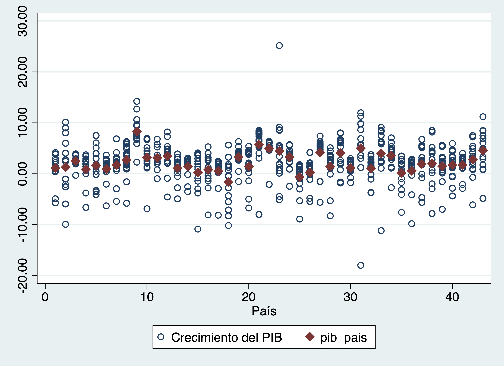
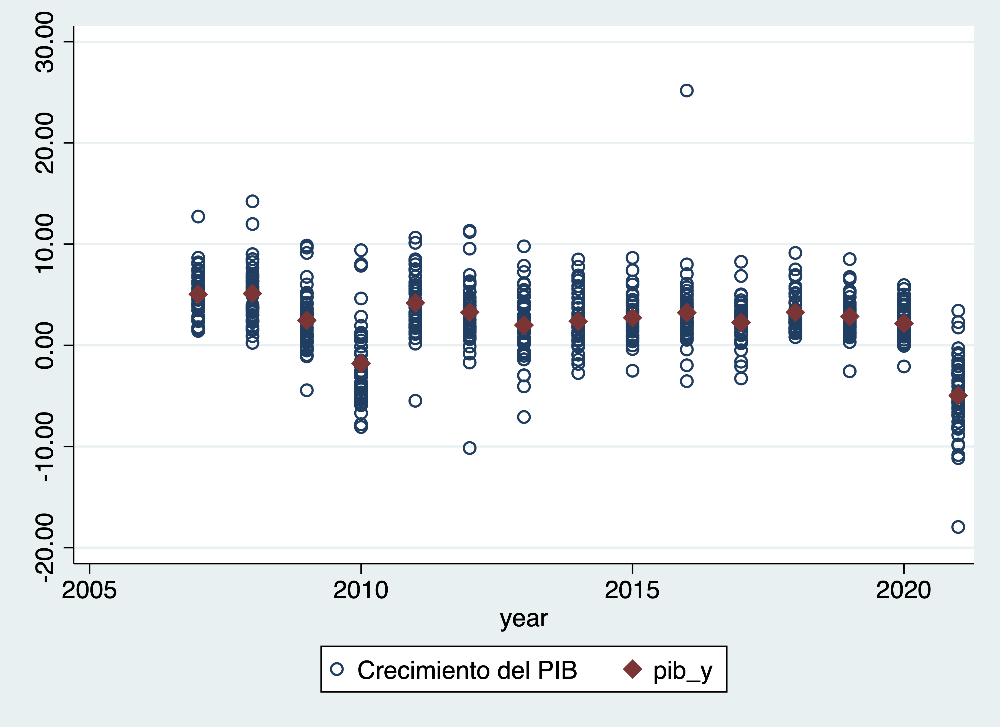

```{r, include=FALSE}
library(Statamarkdown)
stataexe <- find_stata()
knitr::opts_chunk$set(engine.path=list(stata=stataexe),
  error=TRUE, cleanlog=TRUE, comment=NA)

```


```{r setup, include=FALSE}
knitr::opts_chunk$set(echo = TRUE)
```

# Importando bases e introducción a los loops
Volvamos a la base de la EHPM. 

```{stata, collectcode=TRUE, include=FALSE}
clear
```

Vamos a utilizar una base de países, descárgarla de [acá](https://github.com/aniuxa/Curso_Fundaungo_STATA/raw/main/datos/ICI_total.xlsx) y ponla en tu carpeta de "datos" 

Si no tienes la carpeta "temp", créala. Ahí guarderemos las bases

Es importante que instalemos el "ado" que se llama "renvars"
```
findit renvars
```
Puedes usar *renvarlab*, pero tiene otros comandos.


Hemos visto los "global" como parte de crear ligas o elementos. Estos elementos pueden ser muy útiles para automatizar procesos.

```{stata, collectcode=TRUE, warnings=FALSE}
gl datos "datos/"
gl temp  "datos/temp"

```


Si nuestras bases son iguales, como en este caso, serán muy útiles, sobre todo en combinación del comando "foreach"

```{stata, collectcode=TRUE, warnings=FALSE}

global wave 07 08 09 10 11 12 13 14 15 16 17 18 19 20 21

foreach w of global wave {

* Importamos la base de cada año
import excel "$datos/ICI_total.xlsx", sheet("ICI 20`w'") cellrange (A7:BC50) firstrow case(lower) clear

* generamos el año que identificará nuestra ronda
gen year="20`w'", after(país)

* Despues necesitaremos esto
encode país, gen(pais2)

order pais2, after(país)

*Botamos un par de variables que tienen nombres muy largos o están vacíos
drop protección*
drop independenciadelpoderjudicial*

drop b

renvars índicede* , predrop(8) // bota los primeros 8 caracteres

renvars índice* , predrop(6) // bota los primeros 8 caracteres


save "$temp/ICI20`w'.dta", replace 

}

```

Todo lo que está entre las llaves se repite para cada valor de global.

En nuestra carpeta "temp" hoy tenemos todas las bases.


# Formato de la información

## Formato ancho

Cuando tenemos formato ancho, nuestra base tiene el mismo número de observaciones, y cada variable tiene un nombre específico por año. Esta forma de trabajar nos permite revisar con mucha claridad la atrición, pero para muchas variables se vuelve problemático. 

Vamos a juntar dos bases con diez años de diferencia. 

Utilizaremos renvars para renombrar las variables según su año 
```{stata, collectcode=TRUE, warnings=FALSE}


use "$temp/ICI2021.dta", clear

renvars , trim(14) // corta los nombres

renvars  homicidios-crecimiento, postfix(_2021) // agrega un sufijo
save "$temp/ICI2021_wide.dta", replace


use "$temp/ICI2011.dta", clear

renvars , trim(14) // corta los nombres
renvars  homicidios-crecimiento, postfix(_2011) // agrega un sufijo
save "$temp/ICI2011_wide.dta", replace
```

Tenemos abierto (master) la versión de 2011, por lo que llamaremos a la basde 2021 (using)

Una vez identificadas  las ondas podemos hacer un "merge" uno a uno

```{stata, collectcode=TRUE, warnings=FALSE}
merge 1:1 país using  "$temp/ICI2021_wide.dta"
```

Aquí vemos que no hay atrición. Pero acá podemos identificar con un tabulado a _merge qué observaciones están en cada una de las bases

### Prueba t de muestras apareadas

hora que tenemos estos elementos podemos hacer un prueba de hipótesis 
que no habíamos hecho. 

Se trata de una prueba t, que nos dara cuenta de los cambios entre un año y otro

Esta prueba nos dará una idea de qué hacen los efectos fijos vs los aleatorios


```{stata, collectcode=TRUE, warnings=FALSE}
ttest egini_2021==egini_2011
```

## De ancho a largo y viceversa

Stata tiene una opción para movernos de formato largo ancho y viceversa. Para fines de ejemplo, será más fácil que tengamos menos variables


```{stata, collectcode=TRUE, warnings=FALSE}
keep egini* pa* year*
```


### De ancho a largo

```{stata, collectcode=TRUE, warnings=FALSE}
reshape long egini_ participación_, i(país pais2) j(onda)
```


 Ojo con la variable year 

```{stata, collectcode=TRUE, warnings=FALSE}
tab year // no cambió!
```

### De largo a ancho

```{stata, collectcode=TRUE, warnings=FALSE}
reshape wide egini_ participación_, i(país pais2) j(onda)
```

## Formato largo
Para crear una base de formato largo, podemos crear nuestra base pero con append. 

Cada renglón corresponde a una persona en un onda. Como es un proceso largo, usaremos un foreach:

```{stata, collectcode=TRUE, warnings=FALSE}

use "$temp/ICI2007.dta", clear

global wave  08 09 10 11 12 13 14 15 16 17 18 19 20 21

foreach w of global wave {
	append using "$temp/ICI20`w'.dta"
}

describe
```

Podemos ver si todas las observaciones tienen la misma cantidad de observaciones.  Una función útil es la de los contadores. Chequemos qué hacen:


```{stata, collectcode=TRUE, warnings=FALSE}
sort pais year 
by pais: gen n=_n
by pais: gen N=_N

tab n
tab pais
tab N

```

# Trabajando con las funcionalidades de STATA 

Con el formato "largo" o "long" podemos usar todas las funcionalidades que STATA tiene para panales. Para ello debemos declarar la base como tal:

```{stata, collectcode=TRUE, warnings=FALSE}

destring year, replace // tanto i como t deben ser numéricas aunque pueden tener etiquetas.

```

El comando xtset nos sirve para ello. 

```
xtset i t
```

En nuestra base sería:


```{stata, collectcode=TRUE, warnings=FALSE}
xtset pais2 year
```

Con ello podemos hacer modelos y gráficos que consideran este diseño. 

Por ejemplo: 

```{stata, collectcode=TRUE, warnings=FALSE}
xtline crecimientodelpib

xtline crecimientodelpib if pais2<6, overlay
```

Como vemos las trayectorias son diversas entre los países. Podemos adjudicar esto a la heterogeneidad entre los países o bien entre los años. Visualmente podemos comparar las medias con respecto a las observaciones individales

También podemos crear estimaciones de estadísticos básicos

```{stata, collectcode=TRUE, warnings=FALSE}
xtsum crecimientodelpib
```

Para el caso de variables cualitativas tenemos

```{stata, collectcode=TRUE, warnings=FALSE}
gen crec_dummy=crecimientodelpib>0
xttab crec_dummy
xttrans crec_dummy
```

## Heterogeneidad entre países

Comparamos la media del país en tiempo contra todo su desempeño

```{stata, collectcode=TRUE, warnings=FALSE}

bysort país: egen pib_pais=mean(crecimientodelpib)

twoway (scatter crecimientodelpib pais2, msymbol(circle_hollow)) ///
       (scatter pib_pais pais2, msymbol(diamond) )
	   
```



## Heterogeneidad entre los años

Comparamos la media de los años contra su desempeño


```{stata, collectcode=TRUE, warnings=FALSE}

bysort year: egen pib_y=mean(crecimientodelpib)

twoway (scatter crecimientodelpib year, msymbol(circle_hollow)) ///
       (scatter pib_y year, msymbol(diamond) )
	   
```


# Modelos estadísticos
Vamos a hacer varios modelos e iremos comparando sus resultados. Modelaremos un modelo de este tipo:

$$ y= X_{it}\beta + \varepsilon_{it} $$
[Montero Grandos (2011)](https://www.ugr.es/~montero/matematicas/especificacion.pdf) explica que en un panel balanceado (como el nuestro):

>Los datos de panel combinan cortes transversales (información de varios individuos en un momento dado) durante varios períodos de tiempo. El disponer de datos de panel constituye una ventaja y un inconveniente:
* ventaja porque disponemos de más datos y se puede hacer un seguimiento de cada individuo.
* inconveniente porque si todas las cualidades relevantes del individuo NO son observables entonces los errores individuales estarán correlacionados con las observaciones y los MCO serán inconsistentes.

## MCO
¡Recordemos que esto modelo la media!

```{stata, collectcode=TRUE, warnings=FALSE}
regress crecimientodelpib escolaridadpromedio
estimates store mco
	   
```

## MCO con dummies o regresión agrupada 
¡La media cambia con respecto los países!
O "pooled"

```{stata, collectcode=TRUE, warnings=FALSE}
regress crecimientodelpib escolaridadpromedio i.pais2
estimates store mco_dummies
	   
```

## Regresión agrupada absorbida
Sigue siendo MCO, ¡La media cambia con respecto los países!, pero la variable categórica es "absorbida"


```{stata, collectcode=TRUE, warnings=FALSE}
areg crecimientodelpib escolaridadpromedio, absorb(pais2)
estimates store mco_areg
	   
```
Comparemos:

```{stata, collectcode=TRUE, warnings=FALSE}
esttab mco*, ar2 r2 se
```

## Modelo de efectos fijos

>Si no se disponen de todas las variables de influencia entonces $Cov(X_{it},\varepsilon_{it}) ≠ 0$,es decir los residuos no son independientes de las observaciones por lo que MCO estará sesgado.

$$ y= \alpha + \beta x_{it} + u_{it} $$
(regresión agrupada)

En un modelo de efectos fijos podemos suponer qué el intercepto tiene una parte común y otra parte explicada por los individuos

$$\alpha_i = \alpha + v_i$$

Si sustituimos: 

$$ y= \alpha + \beta x_{it}  + v_i + u_{it} $$
Es decir nuestro error $\varepsilon_{ij}$ tiene dos componentes, el estimador "within" o fija para cada individuo $v_i$ y otra aleatoria $u_{it}$

Es decir, tendremos una tendencia general por regresión dando a cada individuo un punto de origen (intercepto) distinto.

```{stata, collectcode=TRUE, warnings=FALSE}
xtreg crecimientodelpib escolaridadpromedio, fe
estimates store panel_fe
```

Comparemos con nuestras otras estimaciones
```{stata, collectcode=TRUE, warnings=FALSE}
esttab mco mco_dummies mco_areg panel_fe, ar2 r2 se
```

## Modelo de efectos aleatorios

>El modelo de efectos aleatorios tiene la misma especificación que el de efectos fijos con la salvedad de que vi, en lugar de ser un valor fijo para cada individuo y constante a lo largo del tiempo para cada individuo, es una variable aleatoria con un valor medio $v_i$ y una varianza $Var(v_i)=0$

$$ y= \alpha + \beta x_{it}  + v_i + u_{it} $$

```{stata, collectcode=TRUE, warnings=FALSE}

xtreg crecimientodelpib escolaridadpromedio, re
estimates store panel_re

```

# Pruebas de especificación


Para elegir, podemos hacer la prueba Hausman.

Si rechazmos H0, podemos usar efectos fijos. Si no rechazamos debemos usar efectos aleatorios. 

```{stata, collectcode=TRUE, warnings=FALSE}
hausman panel_fe panel_re
```

## ¿MCO o panel?

Si rechazamos, debemos usar MCO y no panel.

```{stata, collectcode=TRUE, warnings=FALSE}
estimates restore panel_re
xttest0
```

## Heterocedasticidad

Vamos a instalar otro comando

```
findit xttest3
```

H0: Los errores son homocedásticos
Ha: Los errores no son homocedásticos

```{stata, collectcode=TRUE, warnings=FALSE}
estimates restore panel_fe
xttest3
```

Para corregir:

```{stata, collectcode=TRUE, warnings=FALSE}
xtreg crecimientodelpib escolaridadpromedio, fe robust
estimates store fe_robust
```

## Efectos fijos de tiempo


```{stata, collectcode=TRUE, warnings=FALSE}

xtreg crecimientodelpib escolaridadpromedio i.year , fe
testparm i.year

```

Si es significativa, sí.


## Despendencia crosseccional

```
findit xttest2
```

La hipótesis nula en la prueba de independencia B-P / LM es que los residuos entre entidades no están correlacionados. 

```{stata, collectcode=TRUE, warnings=FALSE}
estimates restore panel_fe
*xttest2
```

Da error porque funciona mejor para paneles más grandes.

Pasaran CD (cross-sectional dependence

```
ssc install xtcsd, replace
```

```{stata, collectcode=TRUE, warnings=FALSE}
estimates restore panel_fe
xtcsd, pesaran abs
```

Si rechazomos la hipótesis nula hay dependencia cross-sectional. No queremos rechazar la HO.

Para corregir podemos hacerlo con otro tipo de estimación
```
ssc install xtscc, replace
```

```{stata, collectcode=TRUE, warnings=FALSE}
xtscc crecimientodelpib escolaridadpromedio, fe 
estimates store driscoll_kay
```

## Correlación serial

Las pruebas de correlación serial se aplican a paneles macro con series de tiempo prolongadas (más de 20 a 30 años). 

No hay problema en micropaneles (con muy pocos años como el nuestro). La correlación en serie hace que los errores estándar de los coeficientes sean más pequeños de lo que realmente son y un R-cuadrado más alto

La H0 no hay correlación serial. 

```
ssc install xtserial, replace
```
```{stata, collectcode=TRUE, warnings=FALSE}
xtserial crecimientodelpib escolaridadpromedio

```

Comparemos:

```{stata, collectcode=TRUE, warnings=FALSE}
esttab panel_fe fe_robust driscoll_kay
```


# Inspiración

Mucho de este código ha sido retomado y adaptado de [Torres-Reyna(2007)] (https://www.princeton.edu/~otorres/Panel101.pdf). También de [Montero Grandos (2011)](https://www.ugr.es/~montero/matematicas/especificacion.pdf)

## Más bibliografía

* An, W., & Winship, C. (2015). Causal Inference in Panel Data With Application to Estimating Race-of-Interviewer Effects in the General Social Survey. Sociological Methods & Research. <https://doi.org/10.1177/0049124115600614>

* Bell, A., & Jones, K. (2015). Explaining Fixed Effects: Random Effects Modeling of Time-Series Cross-Sectional and Panel Data. Political Science Research and Methods, 3(01), 133–153. <https://doi.org/10.1017/psrm.2014.7>

* Brüderl, J., & Ludwig, V. (2014). Fixed-Effects Panel Regression. En H. Best & C. Wolf, The SAGE Handbook of Regression Analysis and Causal Inference (pp. 327–358). 1 Oliver’s Yard, 55 City Road, London EC1Y 1SP United Kingdom: SAGE Publications Ltd. Recuperado de <http://methods.sagepub.com/book/regression-analysis-and-causal-inference/n15.xml>

* Deaton, A. (1985). Panel data from time series of cross-sections. Journal of Econometrics, 30(1–2), 109–126. <https://doi.org/10.1016/0304-4076(85)90134-4>

* Duval‐Hernández, R., Fields, G. S., & ... (2017). Cross‐Sectional Versus Panel Income Approaches: Analyzing Income Distribution Changes for the Case of Mexico. Review of Income and …. Recuperado de <https://onlinelibrary.wiley.com/doi/abs/10.1111/roiw.12271>

* Gardes, F., Duncan, G., Gaubert, P., Gurgand, M., & Starzec, C. (2007). Panel and Pseudo-Panel Estimation of Cross-Sectional and Time Series Elasticities of Food Consumption: The Case of American and Polish Data. <https://doi.org/10.1198/073500104000000587>

* Taris, T. (2000). A Primer in Logitudinal Data Analysis. London/Thousand Oaks/New Dehli: Sage Publications. Recuperado de <https://books.google.de/books?hl=de&lr=&id=X_zSAwAAQBAJ&oi=fnd&pg=PR7&dq=taris+2000+a+primer&ots=pmksdYZBMo&sig=DRMadGJARf-JH6vDi0DPIKrbQ-8#v=onepage&q=taris%202000%20a%20primer&f=false>


