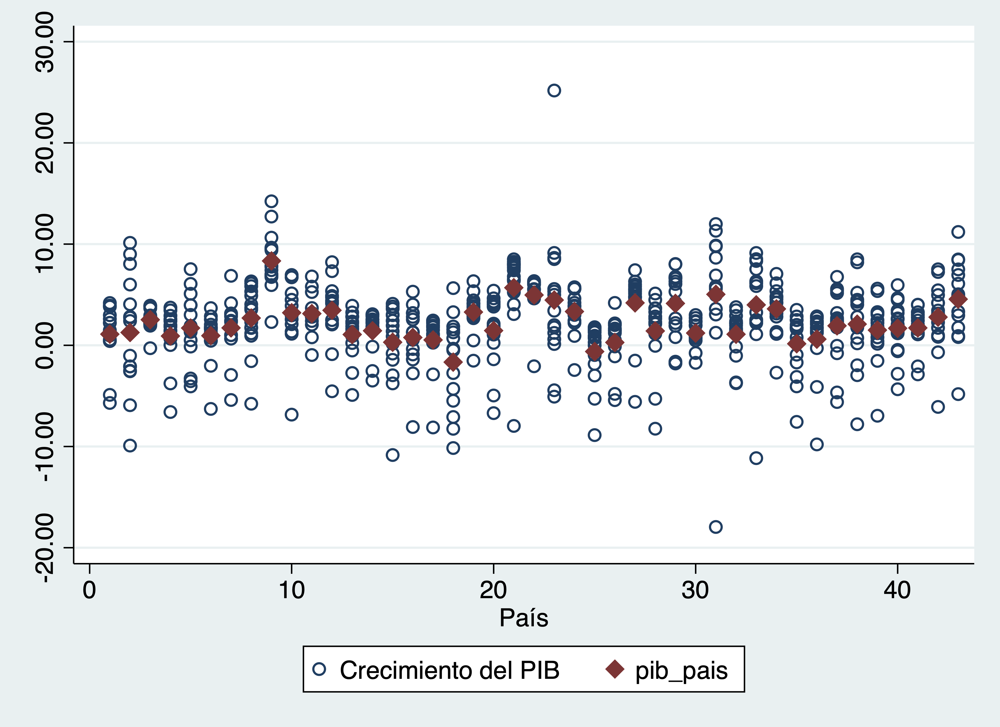
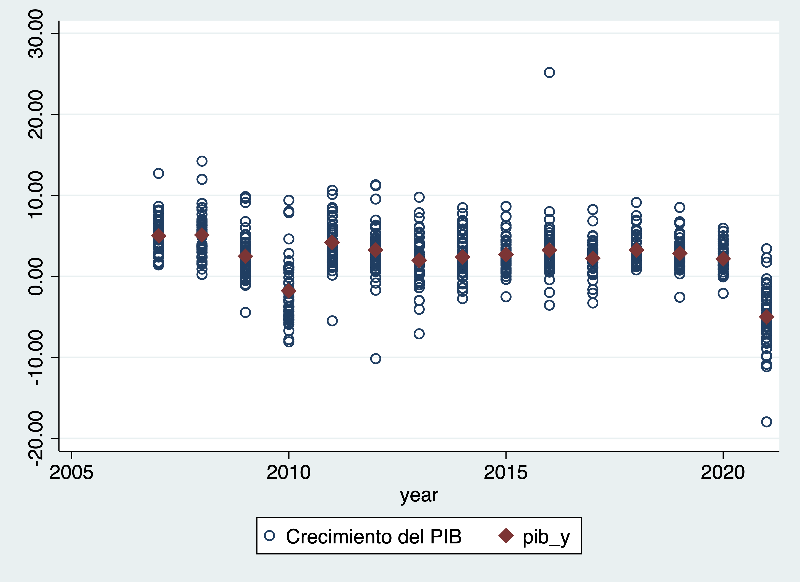

Sesión 5
================
Ana Escoto
06/11/2021

# Importando bases e introducción a los loops

Volvamos a la base de la EHPM.

Vamos a utilizar una base de países, descárgarla de
[acá](https://github.com/aniuxa/Curso_Fundaungo_STATA/raw/main/datos/ICI_total.xlsx)
y ponla en tu carpeta de “datos”

Si no tienes la carpeta “temp”, créala. Ahí guarderemos las bases

Es importante que instalemos el “ado” que se llama “renvars”

    findit renvars

Puedes usar *renvarlab*, pero tiene otros comandos.

Hemos visto los “global” como parte de crear ligas o elementos. Estos
elementos pueden ser muy útiles para automatizar procesos.

``` stata
gl datos "datos/"
gl temp  "datos/temp"
```

Si nuestras bases son iguales, como en este caso, serán muy útiles,
sobre todo en combinación del comando “foreach”

``` stata
global wave 07 08 09 10 11 12 13 14 15 16 17 18 19 20 21

foreach w of global wave {

* Importamos la base de cada año
import excel "$datos/ICI_total.xlsx", sheet("ICI 20`w'") cellrange (A7:BC50) firstrow case(lower) clear

* generamos el año que identificará nuestra ronda
gen year="20`w'", after(país)

* Despues necesitaremos esto
encode país, gen(pais2)

order pais2, after(país)

*Botamos un par de variables que tienen nombres muy largos o están vacíos
drop protección*
drop independenciadelpoderjudicial*

drop b

renvars índicede* , predrop(8) // bota los primeros 8 caracteres

renvars índice* , predrop(6) // bota los primeros 8 caracteres


save "$temp/ICI20`w'.dta", replace 

}
```

      3. 
    (55 vars, 43 obs)
    file datos/temp/ICI2007.dta saved
    (55 vars, 43 obs)
    file datos/temp/ICI2008.dta saved
    (55 vars, 43 obs)
    file datos/temp/ICI2009.dta saved
    (55 vars, 43 obs)
    file datos/temp/ICI2010.dta saved
    (55 vars, 43 obs)
    file datos/temp/ICI2011.dta saved
    (55 vars, 43 obs)
    file datos/temp/ICI2012.dta saved
    (55 vars, 43 obs)
    file datos/temp/ICI2013.dta saved
    (55 vars, 43 obs)
    file datos/temp/ICI2014.dta saved
    (55 vars, 43 obs)
    file datos/temp/ICI2015.dta saved
    (55 vars, 43 obs)
    file datos/temp/ICI2016.dta saved
    (55 vars, 43 obs)
    file datos/temp/ICI2017.dta saved
    (55 vars, 43 obs)
    file datos/temp/ICI2018.dta saved
    (55 vars, 43 obs)
    file datos/temp/ICI2019.dta saved
    (55 vars, 43 obs)
    file datos/temp/ICI2020.dta saved
    (55 vars, 43 obs)
    file datos/temp/ICI2021.dta saved

Todo lo que está entre las llaves se repite para cada valor de global.

En nuestra carpeta “temp” hoy tenemos todas las bases.

# Formato de la información

## Formato ancho

Cuando tenemos formato ancho, nuestra base tiene el mismo número de
observaciones, y cada variable tiene un nombre específico por año. Esta
forma de trabajar nos permite revisar con mucha claridad la atrición,
pero para muchas variables se vuelve problemático.

Vamos a juntar dos bases con diez años de diferencia.

Utilizaremos renvars para renombrar las variables según su año

``` stata

use "$temp/ICI2021.dta", clear

renvars , trim(14) // corta los nombres

renvars  homicidios-crecimiento, postfix(_2021) // agrega un sufijo
save "$temp/ICI2021_wide.dta", replace


use "$temp/ICI2011.dta", clear

renvars , trim(14) // corta los nombres
renvars  homicidios-crecimiento, postfix(_2011) // agrega un sufijo
save "$temp/ICI2011_wide.dta", replace
```

    file datos/temp/ICI2021_wide.dta saved


    file datos/temp/ICI2011_wide.dta saved

Tenemos abierto (master) la versión de 2011, por lo que llamaremos a la
basde 2021 (using)

Una vez identificadas las ondas podemos hacer un “merge” uno a uno

``` stata
merge 1:1 país using  "$temp/ICI2021_wide.dta"
```

    (label pais2 already defined)

        Result                      Number of obs
        -----------------------------------------
        Not matched                             0
        Matched                                43  (_merge==3)
        -----------------------------------------

Aquí vemos que no hay atrición. Pero acá podemos identificar con un
tabulado a \_merge qué observaciones están en cada una de las bases

### Prueba t de muestras apareadas

hora que tenemos estos elementos podemos hacer un prueba de hipótesis
que no habíamos hecho.

Se trata de una prueba t, que nos dara cuenta de los cambios entre un
año y otro

Esta prueba nos dará una idea de qué hacen los efectos fijos vs los
aleatorios

``` stata
ttest egini_2021==egini_2011
```

    Paired t test
    ------------------------------------------------------------------------------
    Variable |     Obs        Mean    Std. err.   Std. dev.   [95% conf. interval]
    ---------+--------------------------------------------------------------------
    egi~2021 |      43    36.93953    1.243718    8.155604    34.42961    39.44946
    egi~2011 |      43    37.94771    1.381272    9.057607    35.16019    40.73523
    ---------+--------------------------------------------------------------------
        diff |      43   -1.008174    .3637036    2.384964   -1.742158   -.2741905
    ------------------------------------------------------------------------------
         mean(diff) = mean(egini_2021 - egini_2011)                   t =  -2.7720
     H0: mean(diff) = 0                              Degrees of freedom =       42

     Ha: mean(diff) < 0           Ha: mean(diff) != 0           Ha: mean(diff) > 0
     Pr(T < t) = 0.0041         Pr(|T| > |t|) = 0.0083          Pr(T > t) = 0.9959

## De ancho a largo y viceversa

Stata tiene una opción para movernos de formato largo ancho y viceversa.
Para fines de ejemplo, será más fácil que tengamos menos variables

``` stata
keep egini* pa* year*
```

### De ancho a largo

``` stata
reshape long egini_ participación_, i(país pais2) j(onda)
```

    (j = 2011 2021)

    Data                               Wide   ->   Long
    -----------------------------------------------------------------------------
    Number of observations               43   ->   86          
    Number of variables                   7   ->   6           
    j variable (2 values)                     ->   onda
    xij variables:
                      egini_2011 egini_2021   ->   egini_
    participación_2011 participación_2021     ->   participación_
    -----------------------------------------------------------------------------

Ojo con la variable year

``` stata
tab year // no cambió!
```

           year |      Freq.     Percent        Cum.
    ------------+-----------------------------------
           2011 |         86      100.00      100.00
    ------------+-----------------------------------
          Total |         86      100.00

### De largo a ancho

``` stata
reshape wide egini_ participación_, i(país pais2) j(onda)
```

    (j = 2011 2021)

    Data                               Long   ->   Wide
    -----------------------------------------------------------------------------
    Number of observations               86   ->   43          
    Number of variables                   6   ->   7           
    j variable (2 values)              onda   ->   (dropped)
    xij variables:
                                     egini_   ->   egini_2011 egini_2021
                            participación_    ->   participación_2011 participación_2021
    -----------------------------------------------------------------------------

## Formato largo

Para crear una base de formato largo, podemos crear nuestra base pero
con append.

Cada renglón corresponde a una persona en un onda. Como es un proceso
largo, usaremos un foreach:

``` stata
use "$temp/ICI2007.dta", clear

global wave  08 09 10 11 12 13 14 15 16 17 18 19 20 21

foreach w of global wave {
    append using "$temp/ICI20`w'.dta"
}

describe
```

    (label pais2 already defined)
    (label pais2 already defined)
    (label pais2 already defined)
    (label pais2 already defined)
    (label pais2 already defined)
    (label pais2 already defined)
    (label pais2 already defined)
    (label pais2 already defined)
    (label pais2 already defined)
    (label pais2 already defined)
    (label pais2 already defined)
    (label pais2 already defined)
    (label pais2 already defined)
    (label pais2 already defined)


    Contains data from datos/temp/ICI2007.dta
     Observations:           645                  
        Variables:            53                  5 Nov 2021 19:05
    ----------------------------------------------------------------------------------------------------
    Variable      Storage   Display    Value
        name         type    format    label      Variable label
    ----------------------------------------------------------------------------------------------------
    país            str14   %14s                  País
    pais2           long    %14.0g     pais2      País
    year            str4    %9s                   
    homicidiosdol~s double  %14.2f                Homicidios dolosos
    confianzaenla~a double  %14.2f                Confianza en la policía
    tiempoparares~s double  %14.2f                Tiempo para resolver quiebras
    cumplimientod~s double  %14.2f                Cumplimiento de contratos
    eestadodedere~o double  %14.2f                Índice de Estado de Derecho
    epazglobal      int     %14.2f                Índice de Paz Global
    contaminación~e double  %14.2f                Contaminación del aire
    emisionesdeco2  double  %14.2f                Emisiones de CO2
    recursoshídri~s double  %14.2f                Recursos hídricos renovables
    áreasnaturale~s double  %14.2f                Áreas naturales protegidas
    superficiefor~a double  %14.2f                Superficie forestal perdida
    usodepesticidas double  %14.2f                Uso de pesticidas
    fuentesdeener~n double  %14.2f                Fuentes de energía no contaminantes
    evulnerabilid~t double  %14.2f                Índice de vulnerabilidad a efectos del cambio
                                                    climático
    egini           double  %14.2f                Índice de Gini
    eglobaldebrec~r double  %14.2f                Índice Global de Brecha de Género
    mujeresenlapea  double  %14.2f                Mujeres en la PEA
    dependientesd~a double  %14.2f                Dependientes de la PEA
    accesoaaguapo~e double  %14.2f                Acceso a agua potable
    accesoaalcant~o double  %14.2f                Acceso a alcantarillado
    analfabetismo   double  %14.2f                Analfabetismo
    escolaridadpr~o double  %14.2f                Escolaridad promedio
    calidadeducat~a double  %14.2f                Calidad educativa
    esperanzadevida double  %14.2f                Esperanza de vida
    mortalidadinf~l double  %14.2f                Mortalidad infantil
    coberturadeva~n double  %14.2f                Cobertura de vacunación
    médicosymédicas double  %14.2f                Médicos y médicas
    gastoensalud~ta double  %14.2f                Gasto en salud per cápita
    gastoensalud~ia double  %14.2f                Gasto en salud por cuenta propia
    estabilidadpo~a double  %14.2f                Estabilidad política y ausencia de violencia
    interferencia~a double  %14.2f                Interferencia militar en el Estado de derecho o en el
                                                    proceso político
    libertadesciv~s byte    %14.2f                Libertades civiles
    epercepciónde~i byte    %14.2f                Índice de Percepción de Corrupción
    disponibilida~ú double  %14.2f                Disponibilidad de información pública
    participación~l double  %14.2f                Participación electoral
    equidadenlosc~s double  %14.2f                Equidad en los congresos
    eefectividadd~r double  %14.2f                Índice de efectividad del gobierno
    miembrodelaal~o byte    %14.2f                Miembro de la Alianza para el Gobierno Abierto
    edesarrollode~o double  %14.2f                Índice de desarrollo de Gobierno Electrónico
    facilidadpara~a double  %14.2f                Facilidad para abrir una empresa
    tiempoparapre~p double  %14.2f                Tiempo para preparar y pagar impuestos
    ingresosfisca~s double  %14.2f                Ingresos fiscales
    finanzassanas   double  %14.2f                Finanzas sanas
    cargaimpositiva double  %14.2f                Carga impositiva
    edadefectivad~o double  %14.2f                Edad efectiva de retiro
    flexibilidadd~a double  %14.2f                Flexibilidad de las leyes laborales
    productividad~o double  %14.2f                Productividad media del trabajo
    valoragregado~a double  %14.2f                Valor agregado de la industria
    etransparenci~a double  %14.2f                Índice de transparencia y regulación de la propiedad
                                                    privada
    crecimientode~b double  %14.2f                Crecimiento del PIB
    ----------------------------------------------------------------------------------------------------
    Sorted by: 
         Note: Dataset has changed since last saved.

Podemos ver si todas las observaciones tienen la misma cantidad de
observaciones. Una función útil es la de los contadores. Chequemos qué
hacen:

``` stata
sort pais year 
by pais: gen n=_n
by pais: gen N=_N

tab n
tab pais
tab N
```

              n |      Freq.     Percent        Cum.
    ------------+-----------------------------------
              1 |         43        6.67        6.67
              2 |         43        6.67       13.33
              3 |         43        6.67       20.00
              4 |         43        6.67       26.67
              5 |         43        6.67       33.33
              6 |         43        6.67       40.00
              7 |         43        6.67       46.67
              8 |         43        6.67       53.33
              9 |         43        6.67       60.00
             10 |         43        6.67       66.67
             11 |         43        6.67       73.33
             12 |         43        6.67       80.00
             13 |         43        6.67       86.67
             14 |         43        6.67       93.33
             15 |         43        6.67      100.00
    ------------+-----------------------------------
          Total |        645      100.00

             País |      Freq.     Percent        Cum.
    --------------+-----------------------------------
         Alemania |         15        2.33        2.33
        Argentina |         15        2.33        4.65
        Australia |         15        2.33        6.98
          Austria |         15        2.33        9.30
           Brasil |         15        2.33       11.63
          Bélgica |         15        2.33       13.95
           Canadá |         15        2.33       16.28
            Chile |         15        2.33       18.60
            China |         15        2.33       20.93
         Colombia |         15        2.33       23.26
    Corea del Sur |         15        2.33       25.58
       Costa Rica |         15        2.33       27.91
        Dinamarca |         15        2.33       30.23
              EUA |         15        2.33       32.56
           España |         15        2.33       34.88
        Finlandia |         15        2.33       37.21
          Francia |         15        2.33       39.53
           Grecia |         15        2.33       41.86
        Guatemala |         15        2.33       44.19
          Hungría |         15        2.33       46.51
            India |         15        2.33       48.84
        Indonesia |         15        2.33       51.16
          Irlanda |         15        2.33       53.49
           Israel |         15        2.33       55.81
           Italia |         15        2.33       58.14
            Japón |         15        2.33       60.47
          Malasia |         15        2.33       62.79
           México |         15        2.33       65.12
          Nigeria |         15        2.33       67.44
          Noruega |         15        2.33       69.77
           Panamá |         15        2.33       72.09
    Países Bajos  |         15        2.33       74.42
             Perú |         15        2.33       76.74
          Polonia |         15        2.33       79.07
         Portugal |         15        2.33       81.40
      Reino Unido |         15        2.33       83.72
       Rep. Checa |         15        2.33       86.05
            Rusia |         15        2.33       88.37
        Sudáfrica |         15        2.33       90.70
           Suecia |         15        2.33       93.02
            Suiza |         15        2.33       95.35
        Tailandia |         15        2.33       97.67
          Turquía |         15        2.33      100.00
    --------------+-----------------------------------
            Total |        645      100.00

              N |      Freq.     Percent        Cum.
    ------------+-----------------------------------
             15 |        645      100.00      100.00
    ------------+-----------------------------------
          Total |        645      100.00

# Trabajando con las funcionalidades de STATA

Con el formato “largo” o “long” podemos usar todas las funcionalidades
que STATA tiene para panales. Para ello debemos declarar la base como
tal:

``` stata
destring year, replace // tanto i como t deben ser numéricas aunque pueden tener etiquetas.
```

    year: all characters numeric; replaced as int

El comando xtset nos sirve para ello.

    xtset i t

En nuestra base sería:

``` stata
xtset pais2 year
```

    Panel variable: pais2 (strongly balanced)
     Time variable: year, 2007 to 2021
             Delta: 1 unit

Con ello podemos hacer modelos y gráficos que consideran este diseño.

Por ejemplo:

``` stata
xtline crecimientodelpib

xtline crecimientodelpib if pais2<6, overlay
```

Como vemos las trayectorias son diversas entre los países. Podemos
adjudicar esto a la heterogeneidad entre los países o bien entre los
años. Visualmente podemos comparar las medias con respecto a las
observaciones individales

También podemos crear estimaciones de estadísticos básicos

``` stata
xtsum crecimientodelpib
```

    Variable         |      Mean   Std. dev.       Min        Max |    Observations
    -----------------+--------------------------------------------+----------------
    crecim~b overall |  2.280496   3.813672  -17.94933    25.1764 |     N =     645
             between |             1.885895  -1.661138    8.33869 |     n =      43
             within  |             3.326381  -20.70827   22.99251 |     T =      15

Para el caso de variables cualitativas tenemos

``` stata
gen crec_dummy=crecimientodelpib>0
xttab crec_dummy
xttrans crec_dummy
```

                      Overall             Between            Within
    crec_du~y |    Freq.  Percent      Freq.  Percent        Percent
    ----------+-----------------------------------------------------
            0 |     114     17.67        42     97.67          18.10
            1 |     531     82.33        43    100.00          82.33
    ----------+-----------------------------------------------------
        Total |     645    100.00        85    197.67          50.59
                                    (n = 43)

               |      crec_dummy
    crec_dummy |         0          1 |     Total
    -----------+----------------------+----------
             0 |     36.49      63.51 |    100.00 
             1 |     16.48      83.52 |    100.00 
    -----------+----------------------+----------
         Total |     18.94      81.06 |    100.00 

## Heterogeneidad entre países

Comparamos la media del país en tiempo contra todo su desempeño

``` stata
bysort país: egen pib_pais=mean(crecimientodelpib)

twoway (scatter crecimientodelpib pais2, msymbol(circle_hollow)) ///
       (scatter pib_pais pais2, msymbol(diamond) )
       
```



## Heterogeneidad entre los años

Comparamos la media de los años contra su desempeño

``` stata
bysort year: egen pib_y=mean(crecimientodelpib)

twoway (scatter crecimientodelpib year, msymbol(circle_hollow)) ///
       (scatter pib_y year, msymbol(diamond) )
       
```



# Modelos estadísticos

Vamos a hacer varios modelos e iremos comparando sus resultados.
Modelaremos un modelo de este tipo:

*y* = *X*<sub>*i**t*</sub>*β* + *ε*<sub>*i**t*</sub>
[Montero Grandos
(2011)](https://www.ugr.es/~montero/matematicas/especificacion.pdf)
explica que en un panel balanceado (como el nuestro):

> Los datos de panel combinan cortes transversales (información de
> varios individuos en un momento dado) durante varios períodos de
> tiempo. El disponer de datos de panel constituye una ventaja y un
> inconveniente: \* ventaja porque disponemos de más datos y se puede
> hacer un seguimiento de cada individuo. \* inconveniente porque si
> todas las cualidades relevantes del individuo NO son observables
> entonces los errores individuales estarán correlacionados con las
> observaciones y los MCO serán inconsistentes.

## MCO

¡Recordemos que esto modelo la media!

``` stata
regress crecimientodelpib escolaridadpromedio
estimates store mco
       
```

          Source |       SS           df       MS      Number of obs   =       645
    -------------+----------------------------------   F(1, 643)       =     53.41
           Model |  718.344623         1  718.344623   Prob > F        =    0.0000
        Residual |  8648.04976       643  13.4495331   R-squared       =    0.0767
    -------------+----------------------------------   Adj R-squared   =    0.0753
           Total |  9366.39439       644  14.5440907   Root MSE        =    3.6674

    -------------------------------------------------------------------------------------
      crecimientodelpib | Coefficient  Std. err.      t    P>|t|     [95% conf. interval]
    --------------------+----------------------------------------------------------------
    escolaridadpromedio |  -.4441839   .0607785    -7.31   0.000    -.5635323   -.3248356
                  _cons |   6.882931    .646103    10.65   0.000     5.614204    8.151657
    -------------------------------------------------------------------------------------

## MCO con dummies o regresión agrupada

¡La media cambia con respecto los países! O “pooled”

``` stata
regress crecimientodelpib escolaridadpromedio i.pais2
estimates store mco_dummies
       
```

          Source |       SS           df       MS      Number of obs   =       645
    -------------+----------------------------------   F(43, 601)      =      6.03
           Model |  2821.43424        43  65.6147497   Prob > F        =    0.0000
        Residual |  6544.96015       601  10.8901167   R-squared       =    0.3012
    -------------+----------------------------------   Adj R-squared   =    0.2512
           Total |  9366.39439       644  14.5440907   Root MSE        =       3.3

    -------------------------------------------------------------------------------------
      crecimientodelpib | Coefficient  Std. err.      t    P>|t|     [95% conf. interval]
    --------------------+----------------------------------------------------------------
    escolaridadpromedio |  -2.033253   .2784215    -7.30   0.000     -2.58005   -1.486455
                        |
                  pais2 |
             Argentina  |  -6.928201   1.548549    -4.47   0.000    -9.969425   -3.886976
             Australia  |  -1.676838   1.277767    -1.31   0.190    -4.186269    .8325936
               Austria  |  -4.257665   1.328217    -3.21   0.001    -6.866175   -1.649154
                Brasil  |  -12.92195   2.209868    -5.85   0.000    -17.26195   -8.581948
               Bélgica  |  -5.098972   1.382393    -3.69   0.000    -7.813881   -2.384063
                Canadá  |  -1.418837   1.237163    -1.15   0.252    -3.848524    1.010851
                 Chile  |  -6.148144   1.604779    -3.83   0.000    -9.299799   -2.996488
                 China  |  -5.772823   2.151087    -2.68   0.007    -9.997384   -1.548263
              Colombia  |  -10.40572   2.096069    -4.96   0.000    -14.52223   -6.289215
         Corea del Sur  |  -2.043134   1.328217    -1.54   0.125    -4.651644    .5653768
            Costa Rica  |  -8.625741   1.926774    -4.48   0.000    -12.40977   -4.841713
             Dinamarca  |  -2.357304   1.246571    -1.89   0.059    -4.805469    .0908615
                   EUA  |  -.8934615   1.216777    -0.73   0.463    -3.283113     1.49619
                España  |  -9.334999    1.67912    -5.56   0.000    -12.63265   -6.037344
             Finlandia  |  -2.570982   1.243307    -2.07   0.039    -5.012737   -.1292271
               Francia  |  -6.222484    1.43217    -4.34   0.000     -9.03515   -3.409819
                Grecia  |  -9.984659   1.559095    -6.40   0.000     -13.0466   -6.922722
             Guatemala  |  -15.63395   2.720405    -5.75   0.000    -20.97661    -10.2913
               Hungría  |   -3.97203   1.342613    -2.96   0.003    -6.608814   -1.335247
                 India  |  -11.97495    2.56842    -4.66   0.000    -17.01912   -6.930784
             Indonesia  |  -8.651649   2.096069    -4.13   0.000    -12.76816    -4.53514
               Irlanda  |  -.4432699   1.313034    -0.34   0.736    -3.021962    2.135422
                Israel  |  -.0217668   1.244227    -0.02   0.986    -2.465328    2.421794
                Italia  |  -9.822828   1.638309    -6.00   0.000    -13.04034   -6.605321
                 Japón  |  -4.531618   1.307927    -3.46   0.001    -7.100281   -1.962956
               Malasia  |  -5.375012    1.67267    -3.21   0.001        -8.66   -2.090024
                México  |  -10.89473   1.951496    -5.58   0.000    -14.72731   -7.062152
               Nigeria  |  -13.35658   2.548771    -5.24   0.000    -18.36216   -8.351002
               Noruega  |  -2.291026   1.248981    -1.83   0.067    -4.743923    .1618702
                Panamá  |  -4.666698   1.685596    -2.77   0.006    -7.977072   -1.356323
         Países Bajos   |  -3.607253   1.301522    -2.77   0.006    -6.163337   -1.051169
                  Perú  |  -7.139468   1.828592    -3.90   0.000    -10.73067   -3.548262
               Polonia  |  -1.080298   1.300822    -0.83   0.407    -3.635006     1.47441
              Portugal  |  -11.88593   1.922432    -6.18   0.000    -15.66143   -8.110427
           Reino Unido  |  -2.549088   1.237584    -2.06   0.040    -4.979604   -.1185726
            Rep. Checa  |  -1.971442    1.26477    -1.56   0.120    -4.455347     .512463
                 Rusia  |   -3.40042   1.346732    -2.52   0.012    -6.045292    -.755548
             Sudáfrica  |  -7.774103   1.644611    -4.73   0.000    -11.00399   -4.544219
                Suecia  |  -2.404608   1.272905    -1.89   0.059     -4.90449    .0952732
                 Suiza  |  -1.013939   1.225748    -0.83   0.408    -3.421209     1.39333
             Tailandia  |  -11.29627   2.148013    -5.26   0.000    -15.51479   -7.077746
               Turquía  |  -10.29928   2.236385    -4.61   0.000    -14.69136   -5.907205
                        |
                  _cons |   29.22536   3.944622     7.41   0.000     21.47844    36.97228
    -------------------------------------------------------------------------------------

## Regresión agrupada absorbida

Sigue siendo MCO, ¡La media cambia con respecto los países!, pero la
variable categórica es “absorbida”

``` stata
areg crecimientodelpib escolaridadpromedio, absorb(pais2)
estimates store mco_areg
       
```

    Linear regression, absorbing indicators             Number of obs     =    645
    Absorbed variable: pais2                            No. of categories =     43
                                                        F(1, 601)         =  53.33
                                                        Prob > F          = 0.0000
                                                        R-squared         = 0.3012
                                                        Adj R-squared     = 0.2512
                                                        Root MSE          = 3.3000

    -------------------------------------------------------------------------------------
      crecimientodelpib | Coefficient  Std. err.      t    P>|t|     [95% conf. interval]
    --------------------+----------------------------------------------------------------
    escolaridadpromedio |  -2.033253   .2784215    -7.30   0.000     -2.58005   -1.486455
                  _cons |   23.34815   2.887804     8.09   0.000     17.67673    29.01956
    -------------------------------------------------------------------------------------
    F test of absorbed indicators: F(42, 601) = 4.598             Prob > F = 0.000

Comparemos:

``` stata
esttab mco*, ar2 r2 se
```

                          (1)             (2)             (3)   
                 crecimient~b    crecimient~b    crecimient~b   
    ------------------------------------------------------------
    escolarida~o       -0.444***       -2.033***       -2.033***
                     (0.0608)         (0.278)         (0.278)   

    1.pais2                                 0                   
                                          (.)                   

    2.pais2                            -6.928***                
                                      (1.549)                   

    3.pais2                            -1.677                   
                                      (1.278)                   

    4.pais2                            -4.258**                 
                                      (1.328)                   

    5.pais2                            -12.92***                
                                      (2.210)                   

    6.pais2                            -5.099***                
                                      (1.382)                   

    7.pais2                            -1.419                   
                                      (1.237)                   

    8.pais2                            -6.148***                
                                      (1.605)                   

    9.pais2                            -5.773**                 
                                      (2.151)                   

    10.pais2                           -10.41***                
                                      (2.096)                   

    11.pais2                           -2.043                   
                                      (1.328)                   

    12.pais2                           -8.626***                
                                      (1.927)                   

    13.pais2                           -2.357                   
                                      (1.247)                   

    14.pais2                           -0.893                   
                                      (1.217)                   

    15.pais2                           -9.335***                
                                      (1.679)                   

    16.pais2                           -2.571*                  
                                      (1.243)                   

    17.pais2                           -6.222***                
                                      (1.432)                   

    18.pais2                           -9.985***                
                                      (1.559)                   

    19.pais2                           -15.63***                
                                      (2.720)                   

    20.pais2                           -3.972**                 
                                      (1.343)                   

    21.pais2                           -11.97***                
                                      (2.568)                   

    22.pais2                           -8.652***                
                                      (2.096)                   

    23.pais2                           -0.443                   
                                      (1.313)                   

    24.pais2                          -0.0218                   
                                      (1.244)                   

    25.pais2                           -9.823***                
                                      (1.638)                   

    26.pais2                           -4.532***                
                                      (1.308)                   

    27.pais2                           -5.375**                 
                                      (1.673)                   

    28.pais2                           -10.89***                
                                      (1.951)                   

    29.pais2                           -13.36***                
                                      (2.549)                   

    30.pais2                           -2.291                   
                                      (1.249)                   

    31.pais2                           -4.667**                 
                                      (1.686)                   

    32.pais2                           -3.607**                 
                                      (1.302)                   

    33.pais2                           -7.139***                
                                      (1.829)                   

    34.pais2                           -1.080                   
                                      (1.301)                   

    35.pais2                           -11.89***                
                                      (1.922)                   

    36.pais2                           -2.549*                  
                                      (1.238)                   

    37.pais2                           -1.971                   
                                      (1.265)                   

    38.pais2                           -3.400*                  
                                      (1.347)                   

    39.pais2                           -7.774***                
                                      (1.645)                   

    40.pais2                           -2.405                   
                                      (1.273)                   

    41.pais2                           -1.014                   
                                      (1.226)                   

    42.pais2                           -11.30***                
                                      (2.148)                   

    43.pais2                           -10.30***                
                                      (2.236)                   

    _cons               6.883***        29.23***        23.35***
                      (0.646)         (3.945)         (2.888)   
    ------------------------------------------------------------
    N                     645             645             645   
    R-sq                0.077           0.301           0.301   
    adj. R-sq           0.075           0.251           0.251   
    ------------------------------------------------------------
    Standard errors in parentheses
    * p<0.05, ** p<0.01, *** p<0.001

## Modelo de efectos fijos

> Si no se disponen de todas las variables de influencia entonces
> *C**o**v*(*X*<sub>*i**t*</sub>, *ε*<sub>*i**t*</sub>) ≠ 0,es decir los
> residuos no son independientes de las observaciones por lo que MCO
> estará sesgado.

*y* = *α* + *β**x*<sub>*i**t*</sub> + *u*<sub>*i**t*</sub>
(regresión agrupada)

En un modelo de efectos fijos podemos suponer qué el intercepto tiene
una parte común y otra parte explicada por los individuos

*α*<sub>*i*</sub> = *α* + *v*<sub>*i*</sub>

Si sustituimos:

*y* = *α* + *β**x*<sub>*i**t*</sub> + *v*<sub>*i*</sub> + *u*<sub>*i**t*</sub>
Es decir nuestro error *ε*<sub>*i**j*</sub> tiene dos componentes, el
estimador “within” o fija para cada individuo *v*<sub>*i*</sub> y otra
aleatoria *u*<sub>*i**t*</sub>

Es decir, tendremos una tendencia general por regresión dando a cada
individuo un punto de origen (intercepto) distinto.

``` stata
xtreg crecimientodelpib escolaridadpromedio, fe
estimates store panel_fe
```

    Fixed-effects (within) regression               Number of obs     =        645
    Group variable: pais2                           Number of groups  =         43

    R-squared:                                      Obs per group:
         Within  = 0.0815                                         min =         15
         Between = 0.2261                                         avg =       15.0
         Overall = 0.0767                                         max =         15

                                                    F(1,601)          =      53.33
    corr(u_i, Xb) = -0.9021                         Prob > F          =     0.0000

    -------------------------------------------------------------------------------------
      crecimientodelpib | Coefficient  Std. err.      t    P>|t|     [95% conf. interval]
    --------------------+----------------------------------------------------------------
    escolaridadpromedio |  -2.033253   .2784215    -7.30   0.000     -2.58005   -1.486455
                  _cons |   23.34815   2.887804     8.09   0.000     17.67673    29.01956
    --------------------+----------------------------------------------------------------
                sigma_u |  4.2345583
                sigma_e |  3.3000177
                    rho |  .62215434   (fraction of variance due to u_i)
    -------------------------------------------------------------------------------------
    F test that all u_i=0: F(42, 601) = 4.60                     Prob > F = 0.0000

Comparemos con nuestras otras estimaciones

``` stata
esttab mco mco_dummies mco_areg panel_fe, ar2 r2 se
```

                          (1)             (2)             (3)             (4)   
                 crecimient~b    crecimient~b    crecimient~b    crecimient~b   
    ----------------------------------------------------------------------------
    escolarida~o       -0.444***       -2.033***       -2.033***       -2.033***
                     (0.0608)         (0.278)         (0.278)         (0.278)   

    1.pais2                                 0                                   
                                          (.)                                   

    2.pais2                            -6.928***                                
                                      (1.549)                                   

    3.pais2                            -1.677                                   
                                      (1.278)                                   

    4.pais2                            -4.258**                                 
                                      (1.328)                                   

    5.pais2                            -12.92***                                
                                      (2.210)                                   

    6.pais2                            -5.099***                                
                                      (1.382)                                   

    7.pais2                            -1.419                                   
                                      (1.237)                                   

    8.pais2                            -6.148***                                
                                      (1.605)                                   

    9.pais2                            -5.773**                                 
                                      (2.151)                                   

    10.pais2                           -10.41***                                
                                      (2.096)                                   

    11.pais2                           -2.043                                   
                                      (1.328)                                   

    12.pais2                           -8.626***                                
                                      (1.927)                                   

    13.pais2                           -2.357                                   
                                      (1.247)                                   

    14.pais2                           -0.893                                   
                                      (1.217)                                   

    15.pais2                           -9.335***                                
                                      (1.679)                                   

    16.pais2                           -2.571*                                  
                                      (1.243)                                   

    17.pais2                           -6.222***                                
                                      (1.432)                                   

    18.pais2                           -9.985***                                
                                      (1.559)                                   

    19.pais2                           -15.63***                                
                                      (2.720)                                   

    20.pais2                           -3.972**                                 
                                      (1.343)                                   

    21.pais2                           -11.97***                                
                                      (2.568)                                   

    22.pais2                           -8.652***                                
                                      (2.096)                                   

    23.pais2                           -0.443                                   
                                      (1.313)                                   

    24.pais2                          -0.0218                                   
                                      (1.244)                                   

    25.pais2                           -9.823***                                
                                      (1.638)                                   

    26.pais2                           -4.532***                                
                                      (1.308)                                   

    27.pais2                           -5.375**                                 
                                      (1.673)                                   

    28.pais2                           -10.89***                                
                                      (1.951)                                   

    29.pais2                           -13.36***                                
                                      (2.549)                                   

    30.pais2                           -2.291                                   
                                      (1.249)                                   

    31.pais2                           -4.667**                                 
                                      (1.686)                                   

    32.pais2                           -3.607**                                 
                                      (1.302)                                   

    33.pais2                           -7.139***                                
                                      (1.829)                                   

    34.pais2                           -1.080                                   
                                      (1.301)                                   

    35.pais2                           -11.89***                                
                                      (1.922)                                   

    36.pais2                           -2.549*                                  
                                      (1.238)                                   

    37.pais2                           -1.971                                   
                                      (1.265)                                   

    38.pais2                           -3.400*                                  
                                      (1.347)                                   

    39.pais2                           -7.774***                                
                                      (1.645)                                   

    40.pais2                           -2.405                                   
                                      (1.273)                                   

    41.pais2                           -1.014                                   
                                      (1.226)                                   

    42.pais2                           -11.30***                                
                                      (2.148)                                   

    43.pais2                           -10.30***                                
                                      (2.236)                                   

    _cons               6.883***        29.23***        23.35***        23.35***
                      (0.646)         (3.945)         (2.888)         (2.888)   
    ----------------------------------------------------------------------------
    N                     645             645             645             645   
    R-sq                0.077           0.301           0.301           0.082   
    adj. R-sq           0.075           0.251           0.251           0.016   
    ----------------------------------------------------------------------------
    Standard errors in parentheses
    * p<0.05, ** p<0.01, *** p<0.001

## Modelo de efectos aleatorios

> El modelo de efectos aleatorios tiene la misma especificación que el
> de efectos fijos con la salvedad de que vi, en lugar de ser un valor
> fijo para cada individuo y constante a lo largo del tiempo para cada
> individuo, es una variable aleatoria con un valor medio
> *v*<sub>*i*</sub> y una varianza *V**a**r*(*v*<sub>*i*</sub>) = 0

*y* = *α* + *β**x*<sub>*i**t*</sub> + *v*<sub>*i*</sub> + *u*<sub>*i**t*</sub>

``` stata
xtreg crecimientodelpib escolaridadpromedio, re
estimates store panel_re
```

    Random-effects GLS regression                   Number of obs     =        645
    Group variable: pais2                           Number of groups  =         43

    R-squared:                                      Obs per group:
         Within  = 0.0815                                         min =         15
         Between = 0.2261                                         avg =       15.0
         Overall = 0.0767                                         max =         15

                                                    Wald chi2(1)      =      33.29
    corr(u_i, X) = 0 (assumed)                      Prob > chi2       =     0.0000

    -------------------------------------------------------------------------------------
      crecimientodelpib | Coefficient  Std. err.      z    P>|z|     [95% conf. interval]
    --------------------+----------------------------------------------------------------
    escolaridadpromedio |  -.6032991    .104561    -5.77   0.000    -.8082349   -.3983633
                  _cons |   8.531611   1.114616     7.65   0.000     6.347004    10.71622
    --------------------+----------------------------------------------------------------
                sigma_u |   1.446957
                sigma_e |  3.3000177
                    rho |   .1612536   (fraction of variance due to u_i)
    -------------------------------------------------------------------------------------

# Pruebas de especificación

Para elegir, podemos hacer la prueba Hausman.

Si rechazmos H0, podemos usar efectos fijos. Si no rechazamos debemos
usar efectos aleatorios.

``` stata
hausman panel_fe panel_re
```

                     ---- Coefficients ----
                 |      (b)          (B)            (b-B)     sqrt(diag(V_b-V_B))
                 |    panel_fe     panel_re      Difference       Std. err.
    -------------+----------------------------------------------------------------
    escolarida~o |   -2.033253    -.6032991       -1.429953        .2580418
    ------------------------------------------------------------------------------
                              b = Consistent under H0 and Ha; obtained from xtreg.
               B = Inconsistent under Ha, efficient under H0; obtained from xtreg.

    Test of H0: Difference in coefficients not systematic

        chi2(1) = (b-B)'[(V_b-V_B)^(-1)](b-B)
                =  30.71
    Prob > chi2 = 0.0000

## ¿MCO o panel?

Si rechazamos, debemos usar MCO y no panel.

``` stata
estimates restore panel_re
xttest0
```

    (results panel_re are active now)


    Breusch and Pagan Lagrangian multiplier test for random effects

            crecimientodelpib[pais2,t] = Xb + u[pais2] + e[pais2,t]

            Estimated results:
                             |       Var     SD = sqrt(Var)
                    ---------+-----------------------------
                   crecimi~b |   14.54409       3.813672
                           e |   10.89012       3.300018
                           u |   2.093685       1.446957

            Test: Var(u) = 0
                                 chibar2(01) =    95.16
                              Prob > chibar2 =   0.0000

## Heterocedasticidad

Vamos a instalar otro comando

    findit xttest3

H0: Los errores son homocedásticos Ha: Los errores no son homocedásticos

``` stata
estimates restore panel_fe
xttest3
```

    (results panel_fe are active now)


    Modified Wald test for groupwise heteroskedasticity
    in fixed effect regression model

    H0: sigma(i)^2 = sigma^2 for all i

    chi2 (43)  =     933.02
    Prob>chi2 =      0.0000

Para corregir:

``` stata
xtreg crecimientodelpib escolaridadpromedio, fe robust
estimates store fe_robust
```

    Fixed-effects (within) regression               Number of obs     =        645
    Group variable: pais2                           Number of groups  =         43

    R-squared:                                      Obs per group:
         Within  = 0.0815                                         min =         15
         Between = 0.2261                                         avg =       15.0
         Overall = 0.0767                                         max =         15

                                                    F(1,42)           =      20.30
    corr(u_i, Xb) = -0.9021                         Prob > F          =     0.0001

                                            (Std. err. adjusted for 43 clusters in pais2)
    -------------------------------------------------------------------------------------
                        |               Robust
      crecimientodelpib | Coefficient  std. err.      t    P>|t|     [95% conf. interval]
    --------------------+----------------------------------------------------------------
    escolaridadpromedio |  -2.033253   .4512895    -4.51   0.000    -2.943992   -1.122514
                  _cons |   23.34815   4.676058     4.99   0.000     13.91148    32.78481
    --------------------+----------------------------------------------------------------
                sigma_u |  4.2345583
                sigma_e |  3.3000177
                    rho |  .62215434   (fraction of variance due to u_i)
    -------------------------------------------------------------------------------------

## Efectos fijos de tiempo

``` stata
xtreg crecimientodelpib escolaridadpromedio i.year , fe
testparm i.year
```

    Fixed-effects (within) regression               Number of obs     =        645
    Group variable: pais2                           Number of groups  =         43

    R-squared:                                      Obs per group:
         Within  = 0.5560                                         min =         15
         Between = 0.2261                                         avg =       15.0
         Overall = 0.4723                                         max =         15

                                                    F(15,587)         =      49.00
    corr(u_i, Xb) = -0.0746                         Prob > F          =     0.0000

    -------------------------------------------------------------------------------------
      crecimientodelpib | Coefficient  Std. err.      t    P>|t|     [95% conf. interval]
    --------------------+----------------------------------------------------------------
    escolaridadpromedio |  -.5048232   .3112906    -1.62   0.105    -1.116202    .1065557
                        |
                   year |
                  2008  |   .1409859   .5022875     0.28   0.779    -.8455135    1.127485
                  2009  |  -2.428751   .5078203    -4.78   0.000    -3.426117   -1.431385
                  2010  |  -6.614955   .5172034   -12.79   0.000    -7.630749    -5.59916
                  2011  |  -.5732834   .5272106    -1.09   0.277    -1.608732    .4621653
                  2012  |   -1.51545   .5267591    -2.88   0.004    -2.550012   -.4808876
                  2013  |  -2.727972   .5359416    -5.09   0.000    -3.780569   -1.675376
                  2014  |  -2.309906    .544918    -4.24   0.000    -3.380133    -1.23968
                  2015  |  -1.911202   .5535379    -3.45   0.001    -2.998358   -.8240465
                  2016  |  -1.363852   .5748213    -2.37   0.018    -2.492809   -.2348952
                  2017  |  -2.287306   .5839234    -3.92   0.000     -3.43414   -1.140473
                  2018  |  -1.268111   .5930497    -2.14   0.033    -2.432869   -.1033535
                  2019  |  -1.636535   .6061875    -2.70   0.007    -2.827096   -.4459745
                  2020  |  -2.305836   .6119577    -3.77   0.000    -3.507729   -1.103943
                  2021  |  -9.388845   .6277401   -14.96   0.000    -10.62174   -8.155955
                        |
                  _cons |   9.923982   3.033015     3.27   0.001       3.9671    15.88086
    --------------------+----------------------------------------------------------------
                sigma_u |   1.684803
                sigma_e |  2.3216822
                    rho |  .34495571   (fraction of variance due to u_i)
    -------------------------------------------------------------------------------------
    F test that all u_i=0: F(42, 587) = 7.66                     Prob > F = 0.0000


     ( 1)  2008.year = 0
     ( 2)  2009.year = 0
     ( 3)  2010.year = 0
     ( 4)  2011.year = 0
     ( 5)  2012.year = 0
     ( 6)  2013.year = 0
     ( 7)  2014.year = 0
     ( 8)  2015.year = 0
     ( 9)  2016.year = 0
     (10)  2017.year = 0
     (11)  2018.year = 0
     (12)  2019.year = 0
     (13)  2020.year = 0
     (14)  2021.year = 0

           F( 14,   587) =   44.80
                Prob > F =    0.0000

Si es significativa, sí.

## Despendencia crosseccional

    findit xttest2

La hipótesis nula en la prueba de independencia B-P / LM es que los
residuos entre entidades no están correlacionados.

``` stata
estimates restore panel_fe
*xttest2
```

    (results panel_fe are active now)

Da error porque funciona mejor para paneles más grandes.

Pasaran CD (cross-sectional dependence

    ssc install xtcsd, replace

``` stata
estimates restore panel_fe
xtcsd, pesaran abs
```

    (results panel_fe are active now)

     
     
    Pesaran's test of cross sectional independence =    69.473, Pr = 0.0000
     
    Average absolute value of the off-diagonal elements =     0.605

Si rechazomos la hipótesis nula hay dependencia cross-sectional. No
queremos rechazar la HO.

Para corregir podemos hacerlo con otro tipo de estimación

    ssc install xtscc, replace

``` stata
xtscc crecimientodelpib escolaridadpromedio, fe 
estimates store driscoll_kay
```

    Regression with Driscoll-Kraay standard errors   Number of obs     =       645
    Method: Fixed-effects regression                 Number of groups  =        43
    Group variable (i): pais2                        F(  1,    14)     =      3.12
    maximum lag: 2                                   Prob > F          =    0.0991
                                                     within R-squared  =    0.0815

    -------------------------------------------------------------------------------------
                        |             Drisc/Kraay
      crecimientodelpib | Coefficient  std. err.      t    P>|t|     [95% conf. interval]
    --------------------+----------------------------------------------------------------
    escolaridadpromedio |  -2.033253   1.150841    -1.77   0.099     -4.50156    .4350553
                  _cons |   23.34815   11.61892     2.01   0.064    -1.571964    48.26826
    -------------------------------------------------------------------------------------

## Correlación serial

Las pruebas de correlación serial se aplican a paneles macro con series
de tiempo prolongadas (más de 20 a 30 años).

No hay problema en micropaneles (con muy pocos años como el nuestro). La
correlación en serie hace que los errores estándar de los coeficientes
sean más pequeños de lo que realmente son y un R-cuadrado más alto

La H0 no hay correlación serial.

    ssc install xtserial, replace

``` stata
xtserial crecimientodelpib escolaridadpromedio
```

    Wooldridge test for autocorrelation in panel data
    H0: no first-order autocorrelation
        F(  1,      42) =     30.408
               Prob > F =      0.0000

Comparemos:

``` stata
esttab panel_fe fe_robust driscoll_kay
```

                          (1)             (2)             (3)   
                 crecimient~b    crecimient~b    crecimient~b   
    ------------------------------------------------------------
    escolarida~o       -2.033***       -2.033***       -2.033   
                      (-7.30)         (-4.51)         (-1.77)   

    _cons               23.35***        23.35***        23.35   
                       (8.09)          (4.99)          (2.01)   
    ------------------------------------------------------------
    N                     645             645             645   
    ------------------------------------------------------------
    t statistics in parentheses
    * p<0.05, ** p<0.01, *** p<0.001

# Inspiración

Mucho de este código ha sido retomado y adaptado de
\[Torres-Reyna(2007)\]
(<https://www.princeton.edu/~otorres/Panel101.pdf>). También de [Montero
Grandos
(2011)](https://www.ugr.es/~montero/matematicas/especificacion.pdf)

## Más bibliografía

-   An, W., & Winship, C. (2015). Causal Inference in Panel Data With
    Application to Estimating Race-of-Interviewer Effects in the General
    Social Survey. Sociological Methods & Research.
    <https://doi.org/10.1177/0049124115600614>

-   Bell, A., & Jones, K. (2015). Explaining Fixed Effects: Random
    Effects Modeling of Time-Series Cross-Sectional and Panel Data.
    Political Science Research and Methods, 3(01), 133–153.
    <https://doi.org/10.1017/psrm.2014.7>

-   Brüderl, J., & Ludwig, V. (2014). Fixed-Effects Panel Regression.
    En H. Best & C. Wolf, The SAGE Handbook of Regression Analysis and
    Causal Inference (pp. 327–358). 1 Oliver’s Yard, 55 City
    Road, London EC1Y 1SP United Kingdom: SAGE Publications
    Ltd. Recuperado de
    <http://methods.sagepub.com/book/regression-analysis-and-causal-inference/n15.xml>

-   Deaton, A. (1985). Panel data from time series of cross-sections.
    Journal of Econometrics, 30(1–2), 109–126.
    <https://doi.org/10.1016/0304-4076(85)90134-4>

-   Duval‐Hernández, R., Fields, G. S., & … (2017). Cross‐Sectional
    Versus Panel Income Approaches: Analyzing Income Distribution
    Changes for the Case of Mexico. Review of Income and …. Recuperado
    de <https://onlinelibrary.wiley.com/doi/abs/10.1111/roiw.12271>

-   Gardes, F., Duncan, G., Gaubert, P., Gurgand, M., & Starzec, C.
    (2007). Panel and Pseudo-Panel Estimation of Cross-Sectional and
    Time Series Elasticities of Food Consumption: The Case of American
    and Polish Data. <https://doi.org/10.1198/073500104000000587>

-   Taris, T. (2000). A Primer in Logitudinal Data Analysis.
    London/Thousand Oaks/New Dehli: Sage Publications. Recuperado de
    <https://books.google.de/books?hl=de&lr=&id=X_zSAwAAQBAJ&oi=fnd&pg=PR7&dq=taris+2000+a+primer&ots=pmksdYZBMo&sig=DRMadGJARf-JH6vDi0DPIKrbQ-8#v=onepage&q=taris%202000%20a%20primer&f=false>
