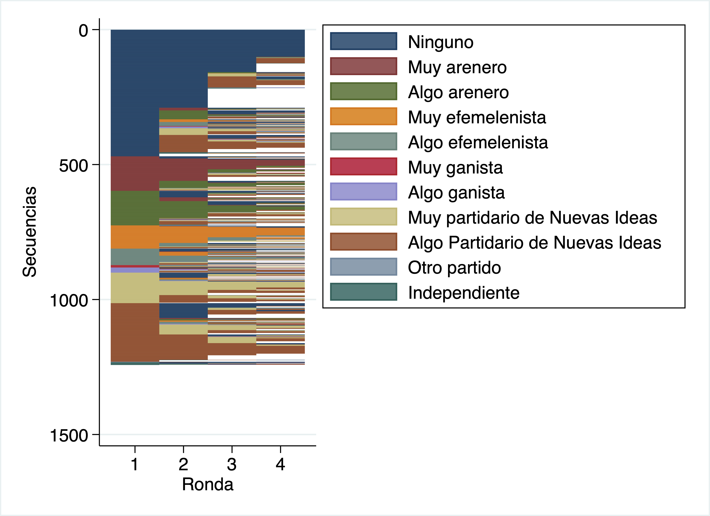
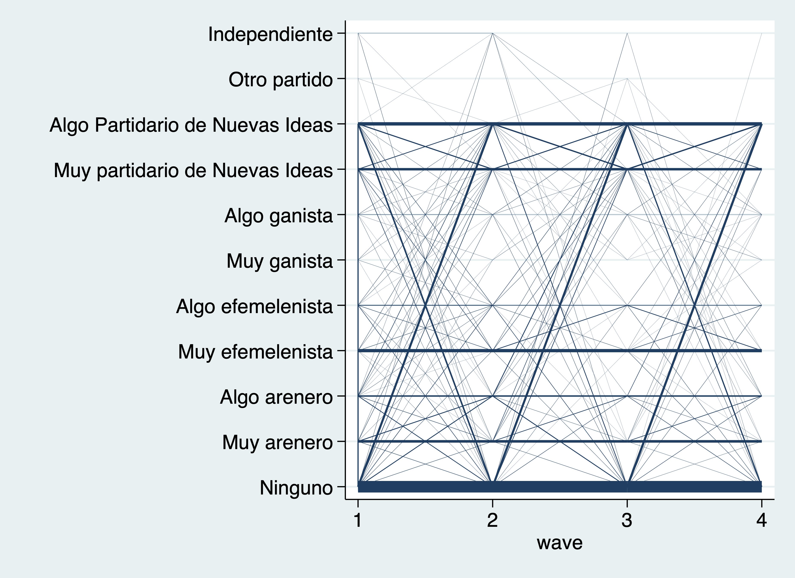
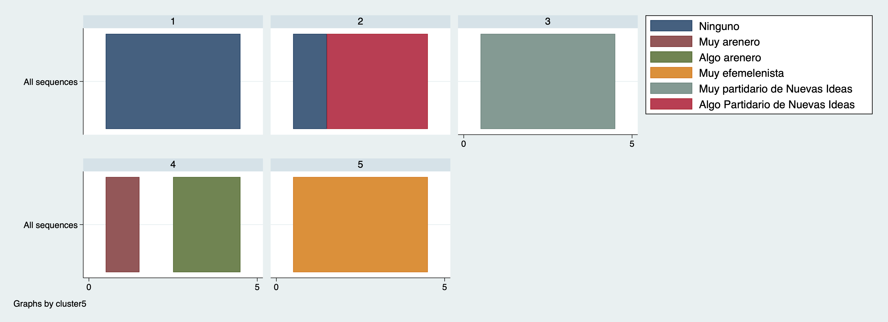
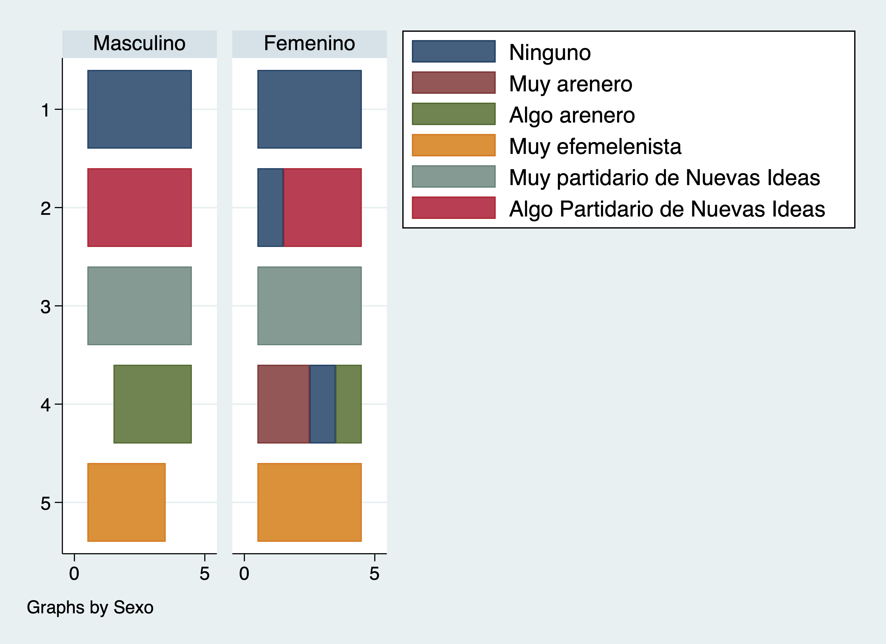
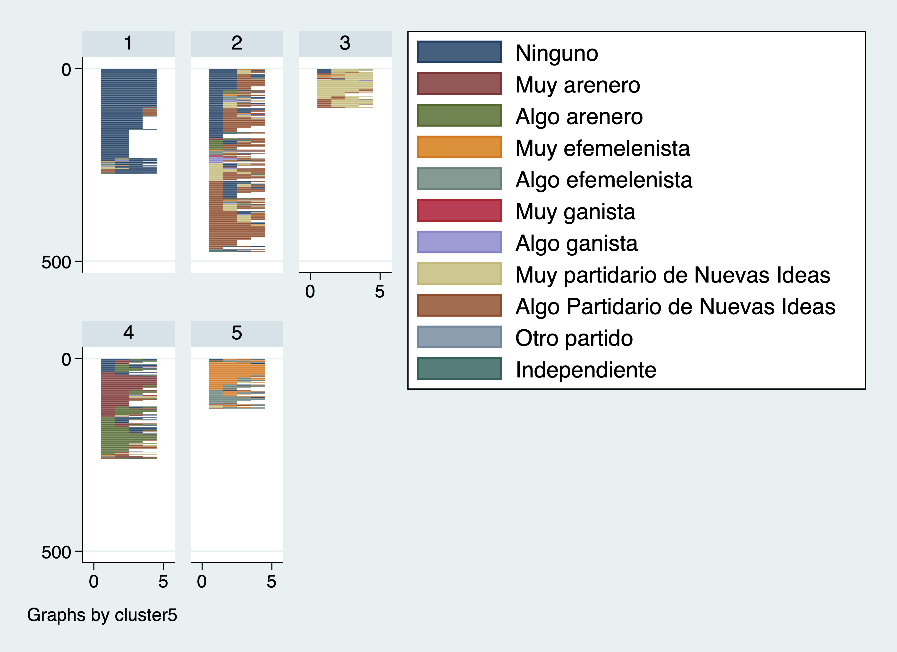

Sesión 6
================
Ana Escoto
13/11/2021

-   [Previo](#previo)
-   [Base de datos de Fundaungo:](#base-de-datos-de-fundaungo)
-   [Contruyendo un índice en escala de
    likert](#contruyendo-un-índice-en-escala-de-likert)
-   [Introducción al análisis de
    secuencias](#introducción-al-análisis-de-secuencias)
    -   [Preparación y declaración de la
        base](#preparación-y-declaración-de-la-base)
    -   [Análisis descriptivo de la
        secuencia](#análisis-descriptivo-de-la-secuencia)
    -   [Graficación de secuencias](#graficación-de-secuencias)
    -   [Comparación de secuencias: Optimal
        matching](#comparación-de-secuencias-optimal-matching)
    -   [¿Qué hay dentro de los clúster](#qué-hay-dentro-de-los-clúster)
    -   [Aplicación de las secuencias](#aplicación-de-las-secuencias)
-   [Bibliografía para seguirle](#bibliografía-para-seguirle)

## Previo

Paquetes que hay que instalar

    * findit renvars
     ssc install sq, replace
     ssc install moremata, replace
    * search SADI

## Base de datos de Fundaungo:

``` stata
gl datos "datos/"
gl temp  "datos/temp"
```

# Contruyendo un índice en escala de likert

No tengan miedo del cero…

Vamos a recodificar con un loop

Con estas variables nuevas, sumamos columnas


Tiene un comportamiento más continuo entre más opciones. Y sin el cero
es posible que esté menos centrada, o bien, puede ser efecto de la
opinión de los salvadoreños.

# Introducción al análisis de secuencias

## Preparación y declaración de la base

Vamos a quedarnos sólo con los que iniciaron la ronda.

``` stata
 
gen id_miss=(id==.)

drop if id_miss==1 // nos vamos a quedar con el mismo inicio
isid correlativo
```

    (5,003 observations deleted)

Renombramos con sufijo algunas variables de la ronda 1. Luego creamos
listado de variables homologadas para cada ronda. Y nos quedamos con una
base más pequeña.

``` stata
 
renvars se1-l1  pol2 nb2 id1 , postfix(_1) // para identificador de la ronda1

gl inicio correlativo id ronda departamento se1_1-ac2_1

forvalues i=1(1)5 {
 global onda_`i' se2_`i' sit1_`i'  id1_`i'
}

keep $inicio $onda_1 $onda_2 $onda_3 $onda_4 $onda_5
```

Para declarar la base la necesitamos en formato “long” por lo que vamos
a hacer un reshape

``` stata
 
reshape long se2_ sit1_  id1_, i(id) j(wave)

drop if ronda>1 // botamos el refrescamiento

recode id1 (99=.) // nuestra variable de secuencia le quitamos los missings
```

    (j = 1 2 3 4 5)

    Data                               Wide   ->   Long
    -----------------------------------------------------------------------------
    Number of observations            2,481   ->   12,405      
    Number of variables                  26   ->   15          
    j variable (5 values)                     ->   wave
    xij variables:
                      se2_1 se2_2 ... se2_5   ->   se2_
                   sit1_1 sit1_2 ... sit1_5   ->   sit1_
                      id1_1 id1_2 ... id1_5   ->   id1_
    -----------------------------------------------------------------------------

    (2,480 observations deleted)

    (91 changes made to id1_)

La base de secuencia se declara con sqset + variable de secuencia + id +
onda

``` stata
sqset id1 id wave, keeplongest
```

    Note: dataset has been changed due to the use of option -keeplongest-

           element variable:  id1_, 0 to 10
           identifier variable:  id, 1.010e+09 to 1.063e+09
           order variable:  wave, 1 to 4

Si no tenemos missing no usamos la opció keeplongest. Aquí se quedará
con la secuencia más larga que logre.

## Análisis descriptivo de la secuencia

### Tabulados

``` stata
*frecuencia de las secuencias
sqtab
sqtab if se1_1==0
sqtab if se1_1==1
```

    Sequence-Pa |
          ttern |      Freq.     Percent        Cum.
    ------------+-----------------------------------
            0:4 |        100        8.05        8.05
            0:2 |         71        5.72       13.77
            0:3 |         32        2.58       16.34
            8:4 |         29        2.33       18.68
            3:4 |         28        2.25       20.93
            1:4 |         22        1.77       22.71
            7:4 |         21        1.69       24.40
          0:3 8 |         19        1.53       25.93
          0 8:3 |         18        1.45       27.38
        0:2 8:2 |         18        1.45       28.82
            8:2 |         17        1.37       30.19
            1:2 |         15        1.21       31.40
            8 0 |         13        1.05       32.45
            0 8 |         12        0.97       33.41
            2:4 |         12        0.97       34.38
        8:2 7 8 |         11        0.89       35.27
              0 |         10        0.81       36.07
        0:2 8 0 |         10        0.81       36.88
          8 0:3 |         10        0.81       37.68
          0:2 8 |          9        0.72       38.41
        8 0 8:2 |          9        0.72       39.13
          8 7:3 |          9        0.72       39.86
            7:2 |          8        0.64       40.50
        7:2 8:2 |          8        0.64       41.14
        0 2 0:2 |          7        0.56       41.71
          1 2:3 |          7        0.56       42.27
        2:2 8:2 |          7        0.56       42.83
          7:3 8 |          7        0.56       43.40
          8:2 7 |          7        0.56       43.96
        0 8 0:2 |          6        0.48       44.44
            2 0 |          6        0.48       44.93
            2:2 |          6        0.48       45.41
        2:2 0:2 |          6        0.48       45.89
        3:2 4 3 |          6        0.48       46.38
            4:2 |          6        0.48       46.86
          7 8:3 |          6        0.48       47.34
              8 |          6        0.48       47.83
        8 7 8:2 |          6        0.48       48.31
            8:3 |          6        0.48       48.79
        0 8 0 8 |          5        0.40       49.19
          0 8:2 |          5        0.40       49.60
        0:2 7 8 |          5        0.40       50.00
          1:2 2 |          5        0.40       50.40
            1:3 |          5        0.40       50.81
          1:3 2 |          5        0.40       51.21
            2:3 |          5        0.40       51.61
            3:2 |          5        0.40       52.01
            4:4 |          5        0.40       52.42
        7 8 7 8 |          5        0.40       52.82
        8 0 8 0 |          5        0.40       53.22
            8 7 |          5        0.40       53.62
          8 7:2 |          5        0.40       54.03
          8:3 0 |          5        0.40       54.43
        0 4 0:2 |          4        0.32       54.75
          0 7:3 |          4        0.32       55.07
          1 2:2 |          4        0.32       55.39
        1:2 2:2 |          4        0.32       55.72
        1:2 8:2 |          4        0.32       56.04
            2 8 |          4        0.32       56.36
          2:3 8 |          4        0.32       56.68
          3:3 4 |          4        0.32       57.00
          4 0:3 |          4        0.32       57.33
            7 0 |          4        0.32       57.65
            7 3 |          4        0.32       57.97
          7 8 7 |          4        0.32       58.29
        7 8:2 7 |          4        0.32       58.62
        8 0 7 8 |          4        0.32       58.94
          8 0:2 |          4        0.32       59.26
          8:3 7 |          4        0.32       59.58
            0 2 |          3        0.24       59.82
        0 2 0 8 |          3        0.24       60.06
        0 2 8 0 |          3        0.24       60.31
          0 2:3 |          3        0.24       60.55
            0 7 |          3        0.24       60.79
          0 7 8 |          3        0.24       61.03
        0 7 8:2 |          3        0.24       61.27
          0 8 0 |          3        0.24       61.51
        0 8 7 8 |          3        0.24       61.76
        0 8:2 7 |          3        0.24       62.00
        0:2 2 0 |          3        0.24       62.24
            1 0 |          3        0.24       62.48
          1 7:3 |          3        0.24       62.72
        1:2 7:2 |          3        0.24       62.96
          2 0 8 |          3        0.24       63.20
          2 0:2 |          3        0.24       63.45
            2 1 |          3        0.24       63.69
          2 8:3 |          3        0.24       63.93
          2:2 0 |          3        0.24       64.17
        2:2 0 2 |          3        0.24       64.41
        2:2 8 7 |          3        0.24       64.65
          2:3 0 |          3        0.24       64.90
          3:2 4 |          3        0.24       65.14
        3:2 7:2 |          3        0.24       65.38
          3:3 0 |          3        0.24       65.62
            4 3 |          3        0.24       65.86
        7 0 7 8 |          3        0.24       66.10
        7 0 7:2 |          3        0.24       66.34
          7 0:3 |          3        0.24       66.59
            7 8 |          3        0.24       66.83
        7:2 8 7 |          3        0.24       67.07
          8 0 8 |          3        0.24       67.31
        8 4 8:2 |          3        0.24       67.55
        8 7 8 7 |          3        0.24       67.79
        8 7:2 8 |          3        0.24       68.04
        8:2 7:2 |          3        0.24       68.28
            0 1 |          2        0.16       68.44
        0 1 0:2 |          2        0.16       68.60
        0 1 2:2 |          2        0.16       68.76
          0 2 8 |          2        0.16       68.92
        0 2 8:2 |          2        0.16       69.08
        0 4:2 0 |          2        0.16       69.24
        0 6 0:2 |          2        0.16       69.40
        0 7 8 0 |          2        0.16       69.57
        0 7 8 7 |          2        0.16       69.73
          0 7:2 |          2        0.16       69.89
        0 7:2 8 |          2        0.16       70.05
          0 8 7 |          2        0.16       70.21
         0:2 10 |          2        0.16       70.37
          0:2 7 |          2        0.16       70.53
        0:2 7 0 |          2        0.16       70.69
        0:2 7:2 |          2        0.16       70.85
        0:2 8 4 |          2        0.16       71.01
          0:3 4 |          2        0.16       71.18
          1 0:3 |          2        0.16       71.34
            1 2 |          2        0.16       71.50
        1 2 0 2 |          2        0.16       71.66
        1 2 0:2 |          2        0.16       71.82
        1:2 2 1 |          2        0.16       71.98
        1:2 6 5 |          2        0.16       72.14
          1:3 0 |          2        0.16       72.30
          1:3 8 |          2        0.16       72.46
        2 0 2 0 |          2        0.16       72.62
        2 0 7 8 |          2        0.16       72.79
        2 0 8:2 |          2        0.16       72.95
        2 0:2 8 |          2        0.16       73.11
          2 0:3 |          2        0.16       73.27
        2 1:2 2 |          2        0.16       73.43
            2 7 |          2        0.16       73.59
          2 8:2 |          2        0.16       73.75
        2:2 0 8 |          2        0.16       73.91
        3 4 0 8 |          2        0.16       74.07
          3 4:2 |          2        0.16       74.24
          3 4:3 |          2        0.16       74.40
          3 7:3 |          2        0.16       74.56
            3 8 |          2        0.16       74.72
          3 8:3 |          2        0.16       74.88
        3:2 4:2 |          2        0.16       75.04
            3:3 |          2        0.16       75.20
          4 0:2 |          2        0.16       75.36
          4 1:2 |          2        0.16       75.52
        4 3 4:2 |          2        0.16       75.68
        4 8 0:2 |          2        0.16       75.85
        4:2 7:2 |          2        0.16       76.01
          4:3 0 |          2        0.16       76.17
        6:2 8:2 |          2        0.16       76.33
              7 |          2        0.16       76.49
          7 0 7 |          2        0.16       76.65
        7 0:2 8 |          2        0.16       76.81
        7 8 7:2 |          2        0.16       76.97
          7 8:2 |          2        0.16       77.13
        7:2 0:2 |          2        0.16       77.29
            7:3 |          2        0.16       77.46
        8 0 7 0 |          2        0.16       77.62
        8 0:2 8 |          2        0.16       77.78
        8 2 8:2 |          2        0.16       77.94
            8 3 |          2        0.16       78.10
        8 4 8 7 |          2        0.16       78.26
          8 4:3 |          2        0.16       78.42
        8 7:2 0 |          2        0.16       78.58
        8:2 0 7 |          2        0.16       78.74
        8:2 0:2 |          2        0.16       78.90
          0 1 0 |          1        0.08       78.99
        0 1 0 8 |          1        0.08       79.07
          0 1 2 |          1        0.08       79.15
          0 1 8 |          1        0.08       79.23
       0 10 0 8 |          1        0.08       79.31
       0 10 0:2 |          1        0.08       79.39
         0 10 7 |          1        0.08       79.47
       0 10 7 8 |          1        0.08       79.55
       0 10 8:2 |          1        0.08       79.63
          0 2 0 |          1        0.08       79.71
        0 2 0 1 |          1        0.08       79.79
        0 2 0 2 |          1        0.08       79.87
        0 2 0 6 |          1        0.08       79.95
          0 2 1 |          1        0.08       80.03
        0 2 6 2 |          1        0.08       80.11
        0 2 7 8 |          1        0.08       80.19
          0 2:2 |          1        0.08       80.27
        0 2:2 0 |          1        0.08       80.35
        0 2:2 8 |          1        0.08       80.43
            0 3 |          1        0.08       80.52
        0 3 0 4 |          1        0.08       80.60
        0 3 0 7 |          1        0.08       80.68
        0 3 0:2 |          1        0.08       80.76
          0 3 7 |          1        0.08       80.84
        0 3 8 0 |          1        0.08       80.92
        0 3 8 7 |          1        0.08       81.00
        0 3 8:2 |          1        0.08       81.08
        0 3:2 4 |          1        0.08       81.16
          0 3:3 |          1        0.08       81.24
            0 4 |          1        0.08       81.32
          0 4 0 |          1        0.08       81.40
        0 4 0 8 |          1        0.08       81.48
          0 4 3 |          1        0.08       81.56
        0 4 3:2 |          1        0.08       81.64
        0 4 7 0 |          1        0.08       81.72
          0 4 8 |          1        0.08       81.80
        0 4 8 7 |          1        0.08       81.88
          0 4:2 |          1        0.08       81.96
        0 5 7:2 |          1        0.08       82.05
        0 5 8 0 |          1        0.08       82.13
            0 6 |          1        0.08       82.21
        0 6 0 7 |          1        0.08       82.29
        0 6 0 8 |          1        0.08       82.37
        0 6 8:2 |          1        0.08       82.45
          0 7 0 |          1        0.08       82.53
        0 7 0 8 |          1        0.08       82.61
        0 7 8 6 |          1        0.08       82.69
        0 7:2 0 |          1        0.08       82.77
        0 8 3 5 |          1        0.08       82.85
        0 8 5 8 |          1        0.08       82.93
        0 8 6 0 |          1        0.08       83.01
        0 8 6:2 |          1        0.08       83.09
        0 8 7:2 |          1        0.08       83.17
        0 8:2 0 |          1        0.08       83.25
        0 8:2 6 |          1        0.08       83.33
       0:2 10 0 |          1        0.08       83.41
        0:2 2 8 |          1        0.08       83.49
        0:2 3:2 |          1        0.08       83.57
        0:2 8 2 |          1        0.08       83.66
        0:2 8 7 |          1        0.08       83.74
        0:2 9 6 |          1        0.08       83.82
          0:3 1 |          1        0.08       83.90
         0:3 10 |          1        0.08       83.98
          0:3 2 |          1        0.08       84.06
          0:3 7 |          1        0.08       84.14
              1 |          1        0.08       84.22
          1 0 2 |          1        0.08       84.30
        1 0 8 0 |          1        0.08       84.38
        1 0 8:2 |          1        0.08       84.46
          1 2 0 |          1        0.08       84.54
        1 2 0 8 |          1        0.08       84.62
        1 2 1 2 |          1        0.08       84.70
        1 2 1:2 |          1        0.08       84.78
        1 2 4 8 |          1        0.08       84.86
        1 2 7 2 |          1        0.08       84.94
        1 2 8 2 |          1        0.08       85.02
        1 2 8:2 |          1        0.08       85.10
        1 2:2 1 |          1        0.08       85.19
        1 4 3:2 |          1        0.08       85.27
        1 4 7 8 |          1        0.08       85.35
        1 7 1 6 |          1        0.08       85.43
        1 7:2 8 |          1        0.08       85.51
            1 8 |          1        0.08       85.59
        1 8 7 0 |          1        0.08       85.67
        1 8 7:2 |          1        0.08       85.75
             10 |          1        0.08       85.83
           10 0 |          1        0.08       85.91
       10 0 4 0 |          1        0.08       85.99
         10 0 8 |          1        0.08       86.07
       10 0:2 6 |          1        0.08       86.15
       10 0:2 8 |          1        0.08       86.23
         10 0:3 |          1        0.08       86.31
       10 7 0 8 |          1        0.08       86.39
       10:2 0 8 |          1        0.08       86.47
       10:2 1:2 |          1        0.08       86.55
        1:2 0 1 |          1        0.08       86.63
        1:2 0 2 |          1        0.08       86.71
        1:2 0:2 |          1        0.08       86.80
        1:2 2 0 |          1        0.08       86.88
        1:2 2 8 |          1        0.08       86.96
          1:2 7 |          1        0.08       87.04
        1:2 7 1 |          1        0.08       87.12
        1:2 7 2 |          1        0.08       87.20
          1:2 8 |          1        0.08       87.28
        1:2 8 0 |          1        0.08       87.36
        1:2 8 2 |          1        0.08       87.44
          1:3 7 |          1        0.08       87.52
              2 |          1        0.08       87.60
          2 0 2 |          1        0.08       87.68
        2 0 4 0 |          1        0.08       87.76
          2 1 2 |          1        0.08       87.84
        2 1 2 1 |          1        0.08       87.92
        2 1 2:2 |          1        0.08       88.00
          2 1 6 |          1        0.08       88.08
        2 1 7 8 |          1        0.08       88.16
        2 1 8 0 |          1        0.08       88.24
        2 1 8 6 |          1        0.08       88.33
        2 1 8:2 |          1        0.08       88.41
           2 10 |          1        0.08       88.49
         2 10 0 |          1        0.08       88.57
        2 1:2 8 |          1        0.08       88.65
          2 3 4 |          1        0.08       88.73
          2 4 0 |          1        0.08       88.81
        2 4 1 2 |          1        0.08       88.89
        2 4 3 8 |          1        0.08       88.97
        2 4:2 3 |          1        0.08       89.05
            2 5 |          1        0.08       89.13
        2 6 2 8 |          1        0.08       89.21
        2 6 7 8 |          1        0.08       89.29
          2 7:3 |          1        0.08       89.37
        2 8 0 8 |          1        0.08       89.45
        2 8 0:2 |          1        0.08       89.53
          2 8 7 |          1        0.08       89.61
        2 8 7:2 |          1        0.08       89.69
        2:2 1 2 |          1        0.08       89.77
        2:2 1 7 |          1        0.08       89.86
        2:2 6 2 |          1        0.08       89.94
          2:2 7 |          1        0.08       90.02
        2:2 7 8 |          1        0.08       90.10
        2:2 7:2 |          1        0.08       90.18
          2:2 8 |          1        0.08       90.26
        2:2 8 2 |          1        0.08       90.34
          2:3 1 |          1        0.08       90.42
              3 |          1        0.08       90.50
            3 0 |          1        0.08       90.58
          3 0:2 |          1        0.08       90.66
            3 1 |          1        0.08       90.74
            3 4 |          1        0.08       90.82
          3 4 0 |          1        0.08       90.90
        3 4 0 4 |          1        0.08       90.98
        3 4 0:2 |          1        0.08       91.06
        3 4 3 4 |          1        0.08       91.14
        3 4 8 0 |          1        0.08       91.22
        3 4 8:2 |          1        0.08       91.30
          3 8 0 |          1        0.08       91.38
        3:2 0 4 |          1        0.08       91.47
        3:2 0:2 |          1        0.08       91.55
        3:2 4 8 |          1        0.08       91.63
        3:2 7 3 |          1        0.08       91.71
          3:3 1 |          1        0.08       91.79
          3:3 8 |          1        0.08       91.87
              4 |          1        0.08       91.95
            4 0 |          1        0.08       92.03
       4 0 10 0 |          1        0.08       92.11
          4 0 8 |          1        0.08       92.19
        4 0:2 4 |          1        0.08       92.27
        4 3 0:2 |          1        0.08       92.35
        4 3 4 0 |          1        0.08       92.43
        4 3 4 3 |          1        0.08       92.51
          4 3 8 |          1        0.08       92.59
        4 3 8 7 |          1        0.08       92.67
        4 3 8:2 |          1        0.08       92.75
          4 3:2 |          1        0.08       92.83
        4 3:2 4 |          1        0.08       92.91
          4 3:3 |          1        0.08       93.00
          4 6:3 |          1        0.08       93.08
            4 7 |          1        0.08       93.16
          4 7 0 |          1        0.08       93.24
          4 7:2 |          1        0.08       93.32
          4 7:3 |          1        0.08       93.40
            4 8 |          1        0.08       93.48
        4 8 0 8 |          1        0.08       93.56
        4 8 4 8 |          1        0.08       93.64
          4 8:2 |          1        0.08       93.72
        4:2 0 4 |          1        0.08       93.80
        4:2 0 8 |          1        0.08       93.88
        4:2 3 6 |          1        0.08       93.96
        4:2 3:2 |          1        0.08       94.04
        4:2 8 4 |          1        0.08       94.12
        4:2 8:2 |          1        0.08       94.20
            4:3 |          1        0.08       94.28
          4:3 8 |          1        0.08       94.36
            5 0 |          1        0.08       94.44
            5 4 |          1        0.08       94.52
        5 4 3 4 |          1        0.08       94.61
        5 4:2 8 |          1        0.08       94.69
            5 7 |          1        0.08       94.77
          5 7 5 |          1        0.08       94.85
        5 8 0 7 |          1        0.08       94.93
        5 8 7:2 |          1        0.08       95.01
          5 8:2 |          1        0.08       95.09
              6 |          1        0.08       95.17
            6 0 |          1        0.08       95.25
          6 0:2 |          1        0.08       95.33
        6 0:2 8 |          1        0.08       95.41
        6 2:2 8 |          1        0.08       95.49
          6 5 7 |          1        0.08       95.57
        6 5 7 1 |          1        0.08       95.65
        6 7 8:2 |          1        0.08       95.73
        6 7:2 8 |          1        0.08       95.81
        6 8 0 8 |          1        0.08       95.89
        6 8 6 8 |          1        0.08       95.97
        6 8 7 8 |          1        0.08       96.05
          6 8:2 |          1        0.08       96.14
        6 8:2 6 |          1        0.08       96.22
          6:2 7 |          1        0.08       96.30
        6:2 8 6 |          1        0.08       96.38
        6:2 8 7 |          1        0.08       96.46
        7 0 8:2 |          1        0.08       96.54
            7 1 |          1        0.08       96.62
        7 2 8 1 |          1        0.08       96.70
        7 3 8 4 |          1        0.08       96.78
        7 4 0:2 |          1        0.08       96.86
          7 4 3 |          1        0.08       96.94
        7 4 3 4 |          1        0.08       97.02
        7 4 7:2 |          1        0.08       97.10
        7 6 8:2 |          1        0.08       97.18
        7 6:2 8 |          1        0.08       97.26
        7 8 0:2 |          1        0.08       97.34
        7 8:2 0 |          1        0.08       97.42
          7:3 6 |          1        0.08       97.50
          8 0 4 |          1        0.08       97.58
        8 0 4:2 |          1        0.08       97.67
        8 0 7:2 |          1        0.08       97.75
        8 1 0 2 |          1        0.08       97.83
        8 1 2 8 |          1        0.08       97.91
       8 10 8 0 |          1        0.08       97.99
        8 1:2 2 |          1        0.08       98.07
          8 1:3 |          1        0.08       98.15
        8 2 0 2 |          1        0.08       98.23
        8 2 6 8 |          1        0.08       98.31
          8 2:3 |          1        0.08       98.39
        8 3 7:2 |          1        0.08       98.47
        8 3 8:2 |          1        0.08       98.55
          8 3:2 |          1        0.08       98.63
          8 6 2 |          1        0.08       98.71
        8 6 7 5 |          1        0.08       98.79
        8 6 8:2 |          1        0.08       98.87
        8 7 4 8 |          1        0.08       98.95
        8 7 6 8 |          1        0.08       99.03
          8 7 8 |          1        0.08       99.11
        8 7 8 0 |          1        0.08       99.19
        8:2 0 2 |          1        0.08       99.28
        8:2 0 8 |          1        0.08       99.36
          8:2 4 |          1        0.08       99.44
        8:2 5 6 |          1        0.08       99.52
        8:2 6 8 |          1        0.08       99.60
        8:2 7 0 |          1        0.08       99.68
        8:2 7 3 |          1        0.08       99.76
          8:3 3 |          1        0.08       99.84
          9 0:3 |          1        0.08       99.92
        9 8 9 0 |          1        0.08      100.00
    ------------+-----------------------------------
          Total |      1,242      100.00


    Sequence-Pa |
          ttern |      Freq.     Percent        Cum.
    ------------+-----------------------------------
            0:4 |         42        7.18        7.18
            0:2 |         31        5.30       12.48
            0:3 |         15        2.56       15.04
            3:4 |         13        2.22       17.26
            8:4 |         13        2.22       19.49
          0 8:3 |         11        1.88       21.37
            7:4 |         11        1.88       23.25
            8:2 |         10        1.71       24.96
            0 8 |          7        1.20       26.15
            1:2 |          7        1.20       27.35
            1:4 |          6        1.03       28.38
            2:4 |          6        1.03       29.40
            8 0 |          6        1.03       30.43
        8 0 8:2 |          6        1.03       31.45
              0 |          5        0.85       32.31
          0:2 8 |          5        0.85       33.16
        0:2 8:2 |          5        0.85       34.02
          0:3 8 |          5        0.85       34.87
        2:2 8:2 |          5        0.85       35.73
            7:2 |          5        0.85       36.58
        7:2 8:2 |          5        0.85       37.44
        8:2 7 8 |          5        0.85       38.29
            8:3 |          5        0.85       39.15
          1 2:2 |          4        0.68       39.83
            2:3 |          4        0.68       40.51
            4:4 |          4        0.68       41.20
            7 0 |          4        0.68       41.88
          7 8:3 |          4        0.68       42.56
              8 |          4        0.68       43.25
          8 0:2 |          4        0.68       43.93
          8:2 7 |          4        0.68       44.62
        0 2 0:2 |          3        0.51       45.13
          0 7:3 |          3        0.51       45.64
        0 8:2 7 |          3        0.51       46.15
        0:2 7 8 |          3        0.51       46.67
        0:2 8 0 |          3        0.51       47.18
          1 2:3 |          3        0.51       47.69
          1:2 2 |          3        0.51       48.21
        1:2 8:2 |          3        0.51       48.72
          1:3 2 |          3        0.51       49.23
            2 0 |          3        0.51       49.74
          2 0:2 |          3        0.51       50.26
            2:2 |          3        0.51       50.77
        3:2 4 3 |          3        0.51       51.28
          3:3 0 |          3        0.51       51.79
          3:3 4 |          3        0.51       52.31
            4:2 |          3        0.51       52.82
            7 3 |          3        0.51       53.33
        8 0 8 0 |          3        0.51       53.85
        8 7 8 7 |          3        0.51       54.36
          8 7:2 |          3        0.51       54.87
          8 7:3 |          3        0.51       55.38
        8:2 7:2 |          3        0.51       55.90
        0 1 2:2 |          2        0.34       56.24
            0 2 |          2        0.34       56.58
          0 2:3 |          2        0.34       56.92
          0 7:2 |          2        0.34       57.26
        0 8 0 8 |          2        0.34       57.61
        0 8 0:2 |          2        0.34       57.95
        0 8 7 8 |          2        0.34       58.29
          0 8:2 |          2        0.34       58.63
        0:2 2 0 |          2        0.34       58.97
        0:2 7:2 |          2        0.34       59.32
          1 7:3 |          2        0.34       59.66
        1:2 2:2 |          2        0.34       60.00
        1:2 6 5 |          2        0.34       60.34
        1:2 7:2 |          2        0.34       60.68
            1:3 |          2        0.34       61.03
            2 1 |          2        0.34       61.37
          2 8:3 |          2        0.34       61.71
        2:2 8 7 |          2        0.34       62.05
          2:3 8 |          2        0.34       62.39
        3 4 0 8 |          2        0.34       62.74
          3 8:3 |          2        0.34       63.08
            3:2 |          2        0.34       63.42
        3:2 4:2 |          2        0.34       63.76
        3:2 7:2 |          2        0.34       64.10
          4 0:3 |          2        0.34       64.44
        4 3 4:2 |          2        0.34       64.79
          4:3 0 |          2        0.34       65.13
        6:2 8:2 |          2        0.34       65.47
              7 |          2        0.34       65.81
        7 0 7 8 |          2        0.34       66.15
        7 0 7:2 |          2        0.34       66.50
          7 8 7 |          2        0.34       66.84
        7:2 0:2 |          2        0.34       67.18
        7:2 8 7 |          2        0.34       67.52
          7:3 8 |          2        0.34       67.86
        8 0 7 0 |          2        0.34       68.21
        8 0 7 8 |          2        0.34       68.55
          8 0 8 |          2        0.34       68.89
          8 0:3 |          2        0.34       69.23
            8 3 |          2        0.34       69.57
          8 4:3 |          2        0.34       69.91
            8 7 |          2        0.34       70.26
        8:2 0 7 |          2        0.34       70.60
          8:3 0 |          2        0.34       70.94
          8:3 7 |          2        0.34       71.28
            0 1 |          1        0.17       71.45
          0 1 0 |          1        0.17       71.62
       0 10 0 8 |          1        0.17       71.79
       0 10 0:2 |          1        0.17       71.97
       0 10 7 8 |          1        0.17       72.14
       0 10 8:2 |          1        0.17       72.31
          0 2 0 |          1        0.17       72.48
        0 2 0 8 |          1        0.17       72.65
          0 2 1 |          1        0.17       72.82
        0 2 8 0 |          1        0.17       72.99
        0 2 8:2 |          1        0.17       73.16
          0 2:2 |          1        0.17       73.33
        0 2:2 8 |          1        0.17       73.50
            0 3 |          1        0.17       73.68
        0 3 0 7 |          1        0.17       73.85
        0 3 0:2 |          1        0.17       74.02
        0 3 8 0 |          1        0.17       74.19
        0 3 8 7 |          1        0.17       74.36
        0 3 8:2 |          1        0.17       74.53
            0 4 |          1        0.17       74.70
          0 4 0 |          1        0.17       74.87
        0 4 0 8 |          1        0.17       75.04
        0 4 3:2 |          1        0.17       75.21
        0 4 7 0 |          1        0.17       75.38
        0 4:2 0 |          1        0.17       75.56
        0 5 7:2 |          1        0.17       75.73
        0 6 0 8 |          1        0.17       75.90
        0 6 8:2 |          1        0.17       76.07
            0 7 |          1        0.17       76.24
          0 7 0 |          1        0.17       76.41
        0 7 0 8 |          1        0.17       76.58
          0 7 8 |          1        0.17       76.75
        0 7 8 7 |          1        0.17       76.92
        0 7 8:2 |          1        0.17       77.09
        0 7:2 0 |          1        0.17       77.26
        0 7:2 8 |          1        0.17       77.44
          0 8 0 |          1        0.17       77.61
        0 8 3 5 |          1        0.17       77.78
        0 8 5 8 |          1        0.17       77.95
        0 8 6:2 |          1        0.17       78.12
          0 8 7 |          1        0.17       78.29
        0 8:2 0 |          1        0.17       78.46
        0 8:2 6 |          1        0.17       78.63
         0:2 10 |          1        0.17       78.80
       0:2 10 0 |          1        0.17       78.97
          0:2 7 |          1        0.17       79.15
        0:2 7 0 |          1        0.17       79.32
        0:2 9 6 |          1        0.17       79.49
          0:3 1 |          1        0.17       79.66
          0:3 2 |          1        0.17       79.83
          0:3 7 |          1        0.17       80.00
              1 |          1        0.17       80.17
            1 0 |          1        0.17       80.34
            1 2 |          1        0.17       80.51
        1 2 0 8 |          1        0.17       80.68
        1 2 1 2 |          1        0.17       80.85
        1 2 4 8 |          1        0.17       81.03
        1 2 8 2 |          1        0.17       81.20
        1 2 8:2 |          1        0.17       81.37
        1 4 7 8 |          1        0.17       81.54
        1 7 1 6 |          1        0.17       81.71
        1 8 7:2 |          1        0.17       81.88
           10 0 |          1        0.17       82.05
       10 0 4 0 |          1        0.17       82.22
         10 0 8 |          1        0.17       82.39
       10:2 0 8 |          1        0.17       82.56
        1:2 2 0 |          1        0.17       82.74
        1:2 2 8 |          1        0.17       82.91
          1:2 8 |          1        0.17       83.08
          1:3 0 |          1        0.17       83.25
          1:3 8 |          1        0.17       83.42
        2 0 2 0 |          1        0.17       83.59
        2 0 4 0 |          1        0.17       83.76
          2 0 8 |          1        0.17       83.93
        2 0:2 8 |          1        0.17       84.10
          2 1 2 |          1        0.17       84.27
        2 1 2 1 |          1        0.17       84.44
          2 1 6 |          1        0.17       84.62
           2 10 |          1        0.17       84.79
        2 1:2 2 |          1        0.17       84.96
        2 1:2 8 |          1        0.17       85.13
          2 3 4 |          1        0.17       85.30
        2 4 1 2 |          1        0.17       85.47
        2 4 3 8 |          1        0.17       85.64
        2 4:2 3 |          1        0.17       85.81
            2 5 |          1        0.17       85.98
        2 6 7 8 |          1        0.17       86.15
            2 7 |          1        0.17       86.32
            2 8 |          1        0.17       86.50
        2 8 0 8 |          1        0.17       86.67
          2 8 7 |          1        0.17       86.84
          2:2 0 |          1        0.17       87.01
        2:2 0 2 |          1        0.17       87.18
        2:2 0 8 |          1        0.17       87.35
        2:2 0:2 |          1        0.17       87.52
        2:2 8 2 |          1        0.17       87.69
          2:3 0 |          1        0.17       87.86
          2:3 1 |          1        0.17       88.03
        3 4 0 4 |          1        0.17       88.21
        3 4 8:2 |          1        0.17       88.38
          3 4:2 |          1        0.17       88.55
          3 4:3 |          1        0.17       88.72
          3 7:3 |          1        0.17       88.89
        3:2 0:2 |          1        0.17       89.06
        3:2 4 8 |          1        0.17       89.23
          3:3 8 |          1        0.17       89.40
              4 |          1        0.17       89.57
            4 0 |          1        0.17       89.74
          4 1:2 |          1        0.17       89.91
            4 3 |          1        0.17       90.09
        4 3 0:2 |          1        0.17       90.26
        4 3 4 0 |          1        0.17       90.43
          4 3 8 |          1        0.17       90.60
        4 3 8 7 |          1        0.17       90.77
          4 3:2 |          1        0.17       90.94
          4 6:3 |          1        0.17       91.11
          4 7:2 |          1        0.17       91.28
        4 8 0 8 |          1        0.17       91.45
        4 8 0:2 |          1        0.17       91.62
          4 8:2 |          1        0.17       91.79
        4:2 0 4 |          1        0.17       91.97
        4:2 3:2 |          1        0.17       92.14
        4:2 8 4 |          1        0.17       92.31
            4:3 |          1        0.17       92.48
            5 0 |          1        0.17       92.65
        5 4 3 4 |          1        0.17       92.82
        5 4:2 8 |          1        0.17       92.99
            5 7 |          1        0.17       93.16
          5 7 5 |          1        0.17       93.33
              6 |          1        0.17       93.50
          6 0:2 |          1        0.17       93.68
        6 2:2 8 |          1        0.17       93.85
        6 5 7 1 |          1        0.17       94.02
        6 7 8:2 |          1        0.17       94.19
        6 7:2 8 |          1        0.17       94.36
        6 8 0 8 |          1        0.17       94.53
        6 8 6 8 |          1        0.17       94.70
          6:2 7 |          1        0.17       94.87
        6:2 8 6 |          1        0.17       95.04
        7 0:2 8 |          1        0.17       95.21
        7 3 8 4 |          1        0.17       95.38
          7 4 3 |          1        0.17       95.56
        7 4 7:2 |          1        0.17       95.73
        7 8 0:2 |          1        0.17       95.90
        7 8 7 8 |          1        0.17       96.07
          7 8:2 |          1        0.17       96.24
        7 8:2 7 |          1        0.17       96.41
            7:3 |          1        0.17       96.58
          8 0 4 |          1        0.17       96.75
        8 1 2 8 |          1        0.17       96.92
       8 10 8 0 |          1        0.17       97.09
        8 2 0 2 |          1        0.17       97.26
        8 2 8:2 |          1        0.17       97.44
        8 3 7:2 |          1        0.17       97.61
        8 4 8 7 |          1        0.17       97.78
        8 4 8:2 |          1        0.17       97.95
          8 6 2 |          1        0.17       98.12
        8 6 8:2 |          1        0.17       98.29
          8 7 8 |          1        0.17       98.46
        8 7 8 0 |          1        0.17       98.63
        8 7 8:2 |          1        0.17       98.80
        8 7:2 0 |          1        0.17       98.97
        8 7:2 8 |          1        0.17       99.15
        8:2 0 2 |          1        0.17       99.32
        8:2 0 8 |          1        0.17       99.49
        8:2 0:2 |          1        0.17       99.66
        8:2 5 6 |          1        0.17       99.83
          8:3 3 |          1        0.17      100.00
    ------------+-----------------------------------
          Total |        585      100.00


    Sequence-Pa |
          ttern |      Freq.     Percent        Cum.
    ------------+-----------------------------------
            0:4 |         58        8.83        8.83
            0:2 |         40        6.09       14.92
            0:3 |         17        2.59       17.50
            1:4 |         16        2.44       19.94
            8:4 |         16        2.44       22.37
            3:4 |         15        2.28       24.66
          0:3 8 |         14        2.13       26.79
        0:2 8:2 |         13        1.98       28.77
            7:4 |         10        1.52       30.29
            1:2 |          8        1.22       31.51
          8 0:3 |          8        1.22       32.72
          0 8:3 |          7        1.07       33.79
        0:2 8 0 |          7        1.07       34.86
            8 0 |          7        1.07       35.92
            8:2 |          7        1.07       36.99
            2:4 |          6        0.91       37.90
          8 7:3 |          6        0.91       38.81
        8:2 7 8 |          6        0.91       39.73
              0 |          5        0.76       40.49
            0 8 |          5        0.76       41.25
        2:2 0:2 |          5        0.76       42.01
          7:3 8 |          5        0.76       42.77
        8 7 8:2 |          5        0.76       43.53
        0 2 0:2 |          4        0.61       44.14
        0 4 0:2 |          4        0.61       44.75
        0 8 0:2 |          4        0.61       45.36
          0:2 8 |          4        0.61       45.97
          1 2:3 |          4        0.61       46.58
        7 8 7 8 |          4        0.61       47.18
        0 8 0 8 |          3        0.46       47.64
          0 8:2 |          3        0.46       48.10
            1:3 |          3        0.46       48.55
            2 0 |          3        0.46       49.01
            2 8 |          3        0.46       49.47
            2:2 |          3        0.46       49.92
            3:2 |          3        0.46       50.38
          3:2 4 |          3        0.46       50.84
        3:2 4 3 |          3        0.46       51.29
            4:2 |          3        0.46       51.75
          7 0:3 |          3        0.46       52.21
            7 8 |          3        0.46       52.66
        7 8:2 7 |          3        0.46       53.12
            7:2 |          3        0.46       53.58
        7:2 8:2 |          3        0.46       54.03
        8 0 8:2 |          3        0.46       54.49
            8 7 |          3        0.46       54.95
          8:2 7 |          3        0.46       55.40
          8:3 0 |          3        0.46       55.86
        0 1 0:2 |          2        0.30       56.16
        0 2 0 8 |          2        0.30       56.47
          0 2 8 |          2        0.30       56.77
        0 2 8 0 |          2        0.30       57.08
        0 6 0:2 |          2        0.30       57.38
            0 7 |          2        0.30       57.69
          0 7 8 |          2        0.30       57.99
        0 7 8 0 |          2        0.30       58.30
        0 7 8:2 |          2        0.30       58.60
          0 8 0 |          2        0.30       58.90
        0:2 7 8 |          2        0.30       59.21
        0:2 8 4 |          2        0.30       59.51
          0:3 4 |          2        0.30       59.82
            1 0 |          2        0.30       60.12
          1 0:3 |          2        0.30       60.43
        1 2 0 2 |          2        0.30       60.73
        1 2 0:2 |          2        0.30       61.04
          1:2 2 |          2        0.30       61.34
        1:2 2 1 |          2        0.30       61.64
        1:2 2:2 |          2        0.30       61.95
          1:3 2 |          2        0.30       62.25
        2 0 7 8 |          2        0.30       62.56
          2 0 8 |          2        0.30       62.86
        2 0 8:2 |          2        0.30       63.17
          2 0:3 |          2        0.30       63.47
          2 8:2 |          2        0.30       63.77
          2:2 0 |          2        0.30       64.08
        2:2 0 2 |          2        0.30       64.38
        2:2 8:2 |          2        0.30       64.69
          2:3 0 |          2        0.30       64.99
          2:3 8 |          2        0.30       65.30
            3 8 |          2        0.30       65.60
            3:3 |          2        0.30       65.91
          4 0:2 |          2        0.30       66.21
          4 0:3 |          2        0.30       66.51
            4 3 |          2        0.30       66.82
        4:2 7:2 |          2        0.30       67.12
          7 0 7 |          2        0.30       67.43
          7 8 7 |          2        0.30       67.73
        7 8 7:2 |          2        0.30       68.04
          7 8:3 |          2        0.30       68.34
              8 |          2        0.30       68.65
        8 0 7 8 |          2        0.30       68.95
        8 0 8 0 |          2        0.30       69.25
        8 0:2 8 |          2        0.30       69.56
        8 4 8:2 |          2        0.30       69.86
          8 7:2 |          2        0.30       70.17
        8 7:2 8 |          2        0.30       70.47
          8:3 7 |          2        0.30       70.78
            0 1 |          1        0.15       70.93
        0 1 0 8 |          1        0.15       71.08
          0 1 2 |          1        0.15       71.23
          0 1 8 |          1        0.15       71.39
         0 10 7 |          1        0.15       71.54
            0 2 |          1        0.15       71.69
        0 2 0 1 |          1        0.15       71.84
        0 2 0 2 |          1        0.15       71.99
        0 2 0 6 |          1        0.15       72.15
        0 2 6 2 |          1        0.15       72.30
        0 2 7 8 |          1        0.15       72.45
        0 2 8:2 |          1        0.15       72.60
        0 2:2 0 |          1        0.15       72.75
          0 2:3 |          1        0.15       72.91
        0 3 0 4 |          1        0.15       73.06
          0 3 7 |          1        0.15       73.21
        0 3:2 4 |          1        0.15       73.36
          0 3:3 |          1        0.15       73.52
          0 4 3 |          1        0.15       73.67
          0 4 8 |          1        0.15       73.82
        0 4 8 7 |          1        0.15       73.97
          0 4:2 |          1        0.15       74.12
        0 4:2 0 |          1        0.15       74.28
        0 5 8 0 |          1        0.15       74.43
            0 6 |          1        0.15       74.58
        0 6 0 7 |          1        0.15       74.73
        0 7 8 6 |          1        0.15       74.89
        0 7 8 7 |          1        0.15       75.04
        0 7:2 8 |          1        0.15       75.19
          0 7:3 |          1        0.15       75.34
        0 8 6 0 |          1        0.15       75.49
          0 8 7 |          1        0.15       75.65
        0 8 7 8 |          1        0.15       75.80
        0 8 7:2 |          1        0.15       75.95
         0:2 10 |          1        0.15       76.10
        0:2 2 0 |          1        0.15       76.26
        0:2 2 8 |          1        0.15       76.41
        0:2 3:2 |          1        0.15       76.56
          0:2 7 |          1        0.15       76.71
        0:2 7 0 |          1        0.15       76.86
        0:2 8 2 |          1        0.15       77.02
        0:2 8 7 |          1        0.15       77.17
         0:3 10 |          1        0.15       77.32
          1 0 2 |          1        0.15       77.47
        1 0 8 0 |          1        0.15       77.63
        1 0 8:2 |          1        0.15       77.78
            1 2 |          1        0.15       77.93
          1 2 0 |          1        0.15       78.08
        1 2 1:2 |          1        0.15       78.23
        1 2 7 2 |          1        0.15       78.39
        1 2:2 1 |          1        0.15       78.54
        1 4 3:2 |          1        0.15       78.69
        1 7:2 8 |          1        0.15       78.84
          1 7:3 |          1        0.15       79.00
            1 8 |          1        0.15       79.15
        1 8 7 0 |          1        0.15       79.30
             10 |          1        0.15       79.45
       10 0:2 6 |          1        0.15       79.60
       10 0:2 8 |          1        0.15       79.76
         10 0:3 |          1        0.15       79.91
       10 7 0 8 |          1        0.15       80.06
       10:2 1:2 |          1        0.15       80.21
        1:2 0 1 |          1        0.15       80.37
        1:2 0 2 |          1        0.15       80.52
        1:2 0:2 |          1        0.15       80.67
          1:2 7 |          1        0.15       80.82
        1:2 7 1 |          1        0.15       80.97
        1:2 7 2 |          1        0.15       81.13
        1:2 7:2 |          1        0.15       81.28
        1:2 8 0 |          1        0.15       81.43
        1:2 8 2 |          1        0.15       81.58
        1:2 8:2 |          1        0.15       81.74
          1:3 0 |          1        0.15       81.89
          1:3 7 |          1        0.15       82.04
          1:3 8 |          1        0.15       82.19
              2 |          1        0.15       82.34
          2 0 2 |          1        0.15       82.50
        2 0 2 0 |          1        0.15       82.65
        2 0:2 8 |          1        0.15       82.80
            2 1 |          1        0.15       82.95
        2 1 2:2 |          1        0.15       83.11
        2 1 7 8 |          1        0.15       83.26
        2 1 8 0 |          1        0.15       83.41
        2 1 8 6 |          1        0.15       83.56
        2 1 8:2 |          1        0.15       83.71
         2 10 0 |          1        0.15       83.87
        2 1:2 2 |          1        0.15       84.02
          2 4 0 |          1        0.15       84.17
        2 6 2 8 |          1        0.15       84.32
            2 7 |          1        0.15       84.47
          2 7:3 |          1        0.15       84.63
        2 8 0:2 |          1        0.15       84.78
        2 8 7:2 |          1        0.15       84.93
          2 8:3 |          1        0.15       85.08
        2:2 0 8 |          1        0.15       85.24
        2:2 1 2 |          1        0.15       85.39
        2:2 1 7 |          1        0.15       85.54
        2:2 6 2 |          1        0.15       85.69
          2:2 7 |          1        0.15       85.84
        2:2 7 8 |          1        0.15       86.00
        2:2 7:2 |          1        0.15       86.15
          2:2 8 |          1        0.15       86.30
        2:2 8 7 |          1        0.15       86.45
            2:3 |          1        0.15       86.61
              3 |          1        0.15       86.76
            3 0 |          1        0.15       86.91
          3 0:2 |          1        0.15       87.06
            3 1 |          1        0.15       87.21
            3 4 |          1        0.15       87.37
          3 4 0 |          1        0.15       87.52
        3 4 0:2 |          1        0.15       87.67
        3 4 3 4 |          1        0.15       87.82
        3 4 8 0 |          1        0.15       87.98
          3 4:2 |          1        0.15       88.13
          3 4:3 |          1        0.15       88.28
          3 7:3 |          1        0.15       88.43
          3 8 0 |          1        0.15       88.58
        3:2 0 4 |          1        0.15       88.74
        3:2 7 3 |          1        0.15       88.89
        3:2 7:2 |          1        0.15       89.04
          3:3 1 |          1        0.15       89.19
          3:3 4 |          1        0.15       89.35
       4 0 10 0 |          1        0.15       89.50
          4 0 8 |          1        0.15       89.65
        4 0:2 4 |          1        0.15       89.80
          4 1:2 |          1        0.15       89.95
        4 3 4 3 |          1        0.15       90.11
        4 3 8:2 |          1        0.15       90.26
        4 3:2 4 |          1        0.15       90.41
          4 3:3 |          1        0.15       90.56
            4 7 |          1        0.15       90.72
          4 7 0 |          1        0.15       90.87
          4 7:3 |          1        0.15       91.02
            4 8 |          1        0.15       91.17
        4 8 0:2 |          1        0.15       91.32
        4 8 4 8 |          1        0.15       91.48
        4:2 0 8 |          1        0.15       91.63
        4:2 3 6 |          1        0.15       91.78
        4:2 8:2 |          1        0.15       91.93
          4:3 8 |          1        0.15       92.09
            4:4 |          1        0.15       92.24
            5 4 |          1        0.15       92.39
        5 8 0 7 |          1        0.15       92.54
        5 8 7:2 |          1        0.15       92.69
          5 8:2 |          1        0.15       92.85
            6 0 |          1        0.15       93.00
        6 0:2 8 |          1        0.15       93.15
          6 5 7 |          1        0.15       93.30
        6 8 7 8 |          1        0.15       93.46
          6 8:2 |          1        0.15       93.61
        6 8:2 6 |          1        0.15       93.76
        6:2 8 7 |          1        0.15       93.91
        7 0 7 8 |          1        0.15       94.06
        7 0 7:2 |          1        0.15       94.22
        7 0 8:2 |          1        0.15       94.37
        7 0:2 8 |          1        0.15       94.52
            7 1 |          1        0.15       94.67
        7 2 8 1 |          1        0.15       94.82
            7 3 |          1        0.15       94.98
        7 4 0:2 |          1        0.15       95.13
        7 4 3 4 |          1        0.15       95.28
        7 6 8:2 |          1        0.15       95.43
        7 6:2 8 |          1        0.15       95.59
          7 8:2 |          1        0.15       95.74
        7 8:2 0 |          1        0.15       95.89
        7:2 8 7 |          1        0.15       96.04
            7:3 |          1        0.15       96.19
          7:3 6 |          1        0.15       96.35
        8 0 4:2 |          1        0.15       96.50
        8 0 7:2 |          1        0.15       96.65
          8 0 8 |          1        0.15       96.80
        8 1 0 2 |          1        0.15       96.96
        8 1:2 2 |          1        0.15       97.11
          8 1:3 |          1        0.15       97.26
        8 2 6 8 |          1        0.15       97.41
        8 2 8:2 |          1        0.15       97.56
          8 2:3 |          1        0.15       97.72
        8 3 8:2 |          1        0.15       97.87
          8 3:2 |          1        0.15       98.02
        8 4 8 7 |          1        0.15       98.17
        8 6 7 5 |          1        0.15       98.33
        8 7 4 8 |          1        0.15       98.48
        8 7 6 8 |          1        0.15       98.63
        8 7:2 0 |          1        0.15       98.78
        8:2 0:2 |          1        0.15       98.93
          8:2 4 |          1        0.15       99.09
        8:2 6 8 |          1        0.15       99.24
        8:2 7 0 |          1        0.15       99.39
        8:2 7 3 |          1        0.15       99.54
            8:3 |          1        0.15       99.70
          9 0:3 |          1        0.15       99.85
        9 8 9 0 |          1        0.15      100.00
    ------------+-----------------------------------
          Total |        657      100.00

### Ranking

\*las 20 secuencias más frecuentes

``` stata
sqtab, ranks(1/20)
sqtab if se1_1==0, ranks(1/20)
sqtab if se1_1==1, ranks(1/20)
```

    Sequence-Pa |
          ttern |      Freq.     Percent        Cum.
    ------------+-----------------------------------
            0:4 |        100       20.20       20.20
            0:2 |         71       14.34       34.55
            0:3 |         32        6.46       41.01
            8:4 |         29        5.86       46.87
            3:4 |         28        5.66       52.53
            1:4 |         22        4.44       56.97
            7:4 |         21        4.24       61.21
          0:3 8 |         19        3.84       65.05
          0 8:3 |         18        3.64       68.69
        0:2 8:2 |         18        3.64       72.32
            8:2 |         17        3.43       75.76
            1:2 |         15        3.03       78.79
            8 0 |         13        2.63       81.41
            0 8 |         12        2.42       83.84
            2:4 |         12        2.42       86.26
        8:2 7 8 |         11        2.22       88.48
              0 |         10        2.02       90.51
        0:2 8 0 |         10        2.02       92.53
          8 0:3 |         10        2.02       94.55
          0:2 8 |          9        1.82       96.36
        8 0 8:2 |          9        1.82       98.18
          8 7:3 |          9        1.82      100.00
    ------------+-----------------------------------
          Total |        495      100.00


    Sequence-Pa |
          ttern |      Freq.     Percent        Cum.
    ------------+-----------------------------------
            0:4 |         42       18.34       18.34
            0:2 |         31       13.54       31.88
            0:3 |         15        6.55       38.43
            3:4 |         13        5.68       44.10
            8:4 |         13        5.68       49.78
          0 8:3 |         11        4.80       54.59
            7:4 |         11        4.80       59.39
            8:2 |         10        4.37       63.76
            0 8 |          7        3.06       66.81
            1:2 |          7        3.06       69.87
            1:4 |          6        2.62       72.49
            2:4 |          6        2.62       75.11
            8 0 |          6        2.62       77.73
        8 0 8:2 |          6        2.62       80.35
              0 |          5        2.18       82.53
          0:2 8 |          5        2.18       84.72
        0:2 8:2 |          5        2.18       86.90
          0:3 8 |          5        2.18       89.08
        2:2 8:2 |          5        2.18       91.27
            7:2 |          5        2.18       93.45
        7:2 8:2 |          5        2.18       95.63
        8:2 7 8 |          5        2.18       97.82
            8:3 |          5        2.18      100.00
    ------------+-----------------------------------
          Total |        229      100.00


    Sequence-Pa |
          ttern |      Freq.     Percent        Cum.
    ------------+-----------------------------------
            0:4 |         58       20.28       20.28
            0:2 |         40       13.99       34.27
            0:3 |         17        5.94       40.21
            1:4 |         16        5.59       45.80
            8:4 |         16        5.59       51.40
            3:4 |         15        5.24       56.64
          0:3 8 |         14        4.90       61.54
        0:2 8:2 |         13        4.55       66.08
            7:4 |         10        3.50       69.58
            1:2 |          8        2.80       72.38
          8 0:3 |          8        2.80       75.17
          0 8:3 |          7        2.45       77.62
        0:2 8 0 |          7        2.45       80.07
            8 0 |          7        2.45       82.52
            8:2 |          7        2.45       84.97
            2:4 |          6        2.10       87.06
          8 7:3 |          6        2.10       89.16
        8:2 7 8 |          6        2.10       91.26
              0 |          5        1.75       93.01
            0 8 |          5        1.75       94.76
        2:2 0:2 |          5        1.75       96.50
          7:3 8 |          5        1.75       98.25
        8 7 8:2 |          5        1.75      100.00
    ------------+-----------------------------------
          Total |        286      100.00

### Mismo orden vs mismo elementos

``` stata
*SO secuencias con el mismo orden de elementos
```

``` stata
sqtab, ranks(1/10) so
```

    Sequence-Or |
            der |      Freq.     Percent        Cum.
    ------------+-----------------------------------
              0 |        213       36.47       36.47
            0 8 |         81       13.87       50.34
              8 |         58        9.93       60.27
              1 |         43        7.36       67.64
              3 |         36        6.16       73.80
            8 0 |         34        5.82       79.62
              7 |         33        5.65       85.27
            8 7 |         33        5.65       90.92
            1 2 |         27        4.62       95.55
            7 8 |         26        4.45      100.00
    ------------+-----------------------------------
          Total |        584      100.00

``` stata
*SE secuencias con los mismos elementos
sqtab, ranks(1/10) se
```

    Sequence-El |
         ements |      Freq.     Percent        Cum.
    ------------+-----------------------------------
              0 |        213       27.13       27.13
            0 8 |        160       20.38       47.52
            7 8 |        101       12.87       60.38
              8 |         58        7.39       67.77
            0 2 |         50        6.37       74.14
          0 7 8 |         49        6.24       80.38
              1 |         43        5.48       85.86
            1 2 |         42        5.35       91.21
              3 |         36        4.59       95.80
              7 |         33        4.20      100.00
    ------------+-----------------------------------
          Total |        785      100.00

### Concentración:

``` stata
*concentración
sqdes 
```

       # of observed sequences: 1242
    overall # of obs. elements: 11
           max sequence length: 4
     # of producible sequences: 14641

    ----------------------------------------------------------
    Observations |     Sequences  % of observed           Cum.
    -------------+--------------------------------------------
               1 |           262       21.09501       21.09501
               2 |            66        5.31401       26.40902
               3 |            36       2.898551       29.30757
               4 |            16       1.288245       30.59581
               5 |            14       1.127214       31.72303
               6 |            10        .805153       32.52818
               7 |             5       .4025765       32.93076
               8 |             2       .1610306       33.09179
               9 |             3       .2415459       33.33334
              10 |             3       .2415459       33.57488
              11 |             1       .0805153        33.6554
              12 |             2       .1610306       33.81643
              13 |             1       .0805153       33.89694
              15 |             1       .0805153       33.97746
              17 |             1       .0805153       34.05797
              18 |             2       .1610306         34.219
              19 |             1       .0805153       34.29952
              21 |             1       .0805153       34.38003
              22 |             1       .0805153       34.46055
              28 |             1       .0805153       34.54107
              29 |             1       .0805153       34.62158
              32 |             1       .0805153        34.7021
              71 |             1       .0805153       34.78261
             100 |             1       .0805153       34.86312
                 | 
           Total |           433       34.86312               
    ----------------------------------------------------------

### Descriptivo

``` stata
*descripción de las secuencias
egen length=sqlength()
egen length1=sqlength(), element(1)
egen length2=sqlength(), element(2)
egen length3=sqlength(), element(3)
egen length4=sqlength(), element(4)
egen elemnum=sqelemcount()
egen epinum=sqepicount()

sqstatsum

sqstattab1 elemnum //las secuencias están compuestas principalmente de 2 o 3 elementos

sqstattabsum se1_1
```

        Variable |        Obs        Mean    Std. dev.       Min        Max
    -------------+---------------------------------------------------------
          length |      1,242    3.433977    .8483221          1          4
         length1 |      1,242    .2673108    .7718104          0          4
         length2 |      1,242      .31562    .7650067          0          4
         length3 |      1,242    .2294686    .7657039          0          4
         length4 |      1,242    .1698873    .5454033          0          4
    -------------+---------------------------------------------------------
         elemnum |      1,242     1.87037    .7607037          1          4
          epinum |      1,242    2.086151    .9774994          1          4


    -> tabulation of elemnum

      Number of |
      different |
    elements in |
       sequence |      Freq.     Percent        Cum.
    ------------+-----------------------------------
              1 |        422       33.98       33.98
              2 |        587       47.26       81.24
              3 |        205       16.51       97.75
              4 |         28        2.25      100.00
    ------------+-----------------------------------
          Total |      1,242      100.00

                |    Summary of Length of sequence
           Sexo |        Mean   Std. dev.       Freq.
    ------------+------------------------------------
      Masculino |         3.4   .86642076         585
       Femenino |   3.4642314    .8313681         657
    ------------+------------------------------------
          Total |   3.4339775   .84832211       1,242

                |  Summary of Length of episodes of
                |              element 1
           Sexo |        Mean   Std. dev.       Freq.
    ------------+------------------------------------
      Masculino |   .22735043   .68341707         585
       Femenino |   .30289193   .84167779         657
    ------------+------------------------------------
          Total |   .26731079   .77181036       1,242

                |  Summary of Length of episodes of
                |              element 2
           Sexo |        Mean   Std. dev.       Freq.
    ------------+------------------------------------
      Masculino |   .31965812   .77771171         585
       Femenino |   .31202435   .75408947         657
    ------------+------------------------------------
          Total |   .31561997   .76500671       1,242

                |  Summary of Length of episodes of
                |              element 3
           Sexo |        Mean   Std. dev.       Freq.
    ------------+------------------------------------
      Masculino |   .23931624   .76804293         585
       Femenino |   .22070015   .76409367         657
    ------------+------------------------------------
          Total |    .2294686   .76570395       1,242

                |  Summary of Length of episodes of
                |              element 4
           Sexo |        Mean   Std. dev.       Freq.
    ------------+------------------------------------
      Masculino |    .1965812    .6226231         585
       Femenino |   .14611872    .4652114         657
    ------------+------------------------------------
          Total |   .16988728   .54540331       1,242

                |   Summary of Number of different
                |        elements in sequence
           Sexo |        Mean   Std. dev.       Freq.
    ------------+------------------------------------
      Masculino |   1.8700855   .75865609         585
       Femenino |    1.870624   .76310007         657
    ------------+------------------------------------
          Total |   1.8703704   .76070371       1,242

                |    Summary of Number of episodes
           Sexo |        Mean   Std. dev.       Freq.
    ------------+------------------------------------
      Masculino |   2.0820513   .98103728         585
       Femenino |   2.0898021   .97507166         657
    ------------+------------------------------------
          Total |   2.0861514    .9774994       1,242

## Graficación de secuencias

Gráfico de índice, una linea por secuencia. Se ven todas

``` stata
*gráficamente...
sqindexplot, ///
    ytitle(Secuencias) xtitle(Ronda) xlabel(1(1)4) ///
    graphregion(fcolor(white)) 
    
```



Trayectorias:

``` stata
sqparcoord, ylabel(0(1)10, valuelabel angle(0)) wlines(2)
```



## Comparación de secuencias: Optimal matching

Con costos default: indel=1,sub=2

``` stata
sqom, full
*** OJO ESTO SE TIENE QUE CORRER TODO JUNTO
sqclusterdat
clustermat wardslinkage SQdist, name(wards) add         
cluster tree wards, cutnumber(10)
cluster generate cluster5 = groups(5) // hacemos 5 grupos de acuerdo al grafico
sqclusterdat, return
```

    Perform 93528 Comparisons with Needleman-Wunsch Algorithm
    Running mata function
    Distance matrix saved as SQdist


Es muy util, dado el formato long, que hagamos algunos indicadores
internos:

``` stata
bysort id: gen n_ent=_n
tab cluster5 if n_ent==1
```

       cluster5 |      Freq.     Percent        Cum.
    ------------+-----------------------------------
              1 |        273       21.98       21.98
              2 |        476       38.33       60.31
              3 |        102        8.21       68.52
              4 |        261       21.01       89.53
              5 |        130       10.47      100.00
    ------------+-----------------------------------
          Total |      1,242      100.00

## ¿Qué hay dentro de los clúster

Podemos encontrar la secuencia que más se repite dentro de cada cluster.
Esto nos puede ayudar a darle nombre a nuestros cluster y por tanto a
las tipologías de las variables

``` stata
*Tipo ideal de trayectoria por cluster
sqmodalplot, by(cluster5) graphregion(fcolor(white)) 
```

    More than 1 mode found at some positions; tie(gap) applied



``` stata
*por sexo
sqmodalplot, over(cluster5) by(se1_1) graphregion(fcolor(white)) 
```

    More than 1 mode found at some positions; tie(gap) applied

 También podemos hacer un indexplot:

``` stata
sqindexplot, by(cluster5)
```



También podemos tabular su interior:

``` stata
sqtab if cluster5==1
sqtab if cluster5==2
sqtab if cluster5==3
sqtab if cluster5==4
sqtab if cluster5==5
```

    Sequence-Pa |
          ttern |      Freq.     Percent        Cum.
    ------------+-----------------------------------
            0:4 |        100       36.63       36.63
            0:2 |         71       26.01       62.64
            0:3 |         32       11.72       74.36
          0:3 8 |         19        6.96       81.32
          8 0:3 |         10        3.66       84.98
        0 4 0:2 |          4        1.47       86.45
          4 0:3 |          4        1.47       87.91
          7 0:3 |          3        1.10       89.01
        0 6 0:2 |          2        0.73       89.74
         0:2 10 |          2        0.73       90.48
          0:3 4 |          2        0.73       91.21
          4 0:2 |          2        0.73       91.94
        7:2 0:2 |          2        0.73       92.67
       0 10 0:2 |          1        0.37       93.04
        0 3 0 4 |          1        0.37       93.41
        0 3 0:2 |          1        0.37       93.77
       0:2 10 0 |          1        0.37       94.14
        0:2 9 6 |          1        0.37       94.51
          0:3 1 |          1        0.37       94.87
         0:3 10 |          1        0.37       95.24
          0:3 2 |          1        0.37       95.60
       10 0:2 6 |          1        0.37       95.97
         10 0:3 |          1        0.37       96.34
          3 0:2 |          1        0.37       96.70
        3 4 0:2 |          1        0.37       97.07
        3:2 0:2 |          1        0.37       97.44
       4 0 10 0 |          1        0.37       97.80
        4 0:2 4 |          1        0.37       98.17
        4 3 0:2 |          1        0.37       98.53
          6 0:2 |          1        0.37       98.90
        6 0:2 8 |          1        0.37       99.27
        7 4 0:2 |          1        0.37       99.63
          9 0:3 |          1        0.37      100.00
    ------------+-----------------------------------
          Total |        273      100.00


    Sequence-Pa |
          ttern |      Freq.     Percent        Cum.
    ------------+-----------------------------------
            8:4 |         29        6.09        6.09
          0 8:3 |         18        3.78        9.87
        0:2 8:2 |         18        3.78       13.66
            8:2 |         17        3.57       17.23
            8 0 |         13        2.73       19.96
            0 8 |         12        2.52       22.48
        8:2 7 8 |         11        2.31       24.79
              0 |         10        2.10       26.89
        0:2 8 0 |         10        2.10       28.99
          0:2 8 |          9        1.89       30.88
        8 0 8:2 |          9        1.89       32.77
        7:2 8:2 |          8        1.68       34.45
          8:2 7 |          7        1.47       35.92
        0 8 0:2 |          6        1.26       37.18
          7 8:3 |          6        1.26       38.45
              8 |          6        1.26       39.71
        8 7 8:2 |          6        1.26       40.97
            8:3 |          6        1.26       42.23
        0 8 0 8 |          5        1.05       43.28
          0 8:2 |          5        1.05       44.33
        0:2 7 8 |          5        1.05       45.38
        7 8 7 8 |          5        1.05       46.43
        8 0 8 0 |          5        1.05       47.48
            8 7 |          5        1.05       48.53
          8:3 0 |          5        1.05       49.58
            2 8 |          4        0.84       50.42
            7 0 |          4        0.84       51.26
        7 8:2 7 |          4        0.84       52.10
        8 0 7 8 |          4        0.84       52.94
          8 0:2 |          4        0.84       53.78
          8:3 7 |          4        0.84       54.62
        0 2 0 8 |          3        0.63       55.25
        0 2 8 0 |          3        0.63       55.88
            0 7 |          3        0.63       56.51
          0 7 8 |          3        0.63       57.14
        0 7 8:2 |          3        0.63       57.77
          0 8 0 |          3        0.63       58.40
        0 8 7 8 |          3        0.63       59.03
        0 8:2 7 |          3        0.63       59.66
          2 0 8 |          3        0.63       60.29
          2 8:3 |          3        0.63       60.92
        7 0 7 8 |          3        0.63       61.55
            7 8 |          3        0.63       62.18
          8 0 8 |          3        0.63       62.82
        8 4 8:2 |          3        0.63       63.45
        8 7 8 7 |          3        0.63       64.08
          0 2 8 |          2        0.42       64.50
        0 2 8:2 |          2        0.42       64.92
        0 4:2 0 |          2        0.42       65.34
        0 7 8 0 |          2        0.42       65.76
        0 7:2 8 |          2        0.42       66.18
          0 8 7 |          2        0.42       66.60
          0:2 7 |          2        0.42       67.02
        0:2 7 0 |          2        0.42       67.44
        0:2 7:2 |          2        0.42       67.86
        0:2 8 4 |          2        0.42       68.28
        2 0 7 8 |          2        0.42       68.70
        2 0 8:2 |          2        0.42       69.12
        2 0:2 8 |          2        0.42       69.54
          2 8:2 |          2        0.42       69.96
          3 8:3 |          2        0.42       70.38
        4 8 0:2 |          2        0.42       70.80
        6:2 8:2 |          2        0.42       71.22
              7 |          2        0.42       71.64
          7 0 7 |          2        0.42       72.06
        7 0:2 8 |          2        0.42       72.48
          7 8:2 |          2        0.42       72.90
        8 0 7 0 |          2        0.42       73.32
        8 0:2 8 |          2        0.42       73.74
        8 2 8:2 |          2        0.42       74.16
            8 3 |          2        0.42       74.58
        8 4 8 7 |          2        0.42       75.00
        8:2 0 7 |          2        0.42       75.42
        8:2 0:2 |          2        0.42       75.84
       0 10 0 8 |          1        0.21       76.05
         0 10 7 |          1        0.21       76.26
       0 10 7 8 |          1        0.21       76.47
       0 10 8:2 |          1        0.21       76.68
        0 2 7 8 |          1        0.21       76.89
            0 3 |          1        0.21       77.10
        0 3 0 7 |          1        0.21       77.31
          0 3 7 |          1        0.21       77.52
        0 3 8 7 |          1        0.21       77.73
        0 3 8:2 |          1        0.21       77.94
            0 4 |          1        0.21       78.15
          0 4 0 |          1        0.21       78.36
        0 4 0 8 |          1        0.21       78.57
          0 4 3 |          1        0.21       78.78
        0 4 7 0 |          1        0.21       78.99
          0 4 8 |          1        0.21       79.20
        0 4 8 7 |          1        0.21       79.41
          0 4:2 |          1        0.21       79.62
        0 5 8 0 |          1        0.21       79.83
            0 6 |          1        0.21       80.04
        0 6 0 7 |          1        0.21       80.25
        0 6 0 8 |          1        0.21       80.46
        0 6 8:2 |          1        0.21       80.67
          0 7 0 |          1        0.21       80.88
        0 7 0 8 |          1        0.21       81.09
        0 7 8 6 |          1        0.21       81.30
        0 8 3 5 |          1        0.21       81.51
        0 8 5 8 |          1        0.21       81.72
        0 8 6 0 |          1        0.21       81.93
        0 8 6:2 |          1        0.21       82.14
        0 8:2 0 |          1        0.21       82.35
        0 8:2 6 |          1        0.21       82.56
        0:2 2 8 |          1        0.21       82.77
        0:2 3:2 |          1        0.21       82.98
        0:2 8 2 |          1        0.21       83.19
        0:2 8 7 |          1        0.21       83.40
          0:3 7 |          1        0.21       83.61
        1 0 8 0 |          1        0.21       83.82
        1 0 8:2 |          1        0.21       84.03
        1 2 0 8 |          1        0.21       84.24
        1 2 4 8 |          1        0.21       84.45
        1 2 8:2 |          1        0.21       84.66
        1 4 7 8 |          1        0.21       84.87
        1 7:2 8 |          1        0.21       85.08
             10 |          1        0.21       85.29
           10 0 |          1        0.21       85.50
       10 0 4 0 |          1        0.21       85.71
         10 0 8 |          1        0.21       85.92
       10 0:2 8 |          1        0.21       86.13
       10 7 0 8 |          1        0.21       86.34
       10:2 0 8 |          1        0.21       86.55
        2 1 7 8 |          1        0.21       86.76
        2 1 8:2 |          1        0.21       86.97
           2 10 |          1        0.21       87.18
         2 10 0 |          1        0.21       87.39
        2 6 7 8 |          1        0.21       87.61
        2 8 0 8 |          1        0.21       87.82
        3 4 8:2 |          1        0.21       88.03
        4 3 8:2 |          1        0.21       88.24
          4 6:3 |          1        0.21       88.45
            4 7 |          1        0.21       88.66
          4 7 0 |          1        0.21       88.87
        4 8 0 8 |          1        0.21       89.08
        4 8 4 8 |          1        0.21       89.29
          4 8:2 |          1        0.21       89.50
        4:2 8:2 |          1        0.21       89.71
            5 0 |          1        0.21       89.92
            5 7 |          1        0.21       90.13
          5 7 5 |          1        0.21       90.34
        5 8 0 7 |          1        0.21       90.55
          5 8:2 |          1        0.21       90.76
              6 |          1        0.21       90.97
            6 0 |          1        0.21       91.18
          6 5 7 |          1        0.21       91.39
        6 5 7 1 |          1        0.21       91.60
        6 7 8:2 |          1        0.21       91.81
        6 7:2 8 |          1        0.21       92.02
        6 8 0 8 |          1        0.21       92.23
        6 8 6 8 |          1        0.21       92.44
        6 8 7 8 |          1        0.21       92.65
          6 8:2 |          1        0.21       92.86
        6 8:2 6 |          1        0.21       93.07
          6:2 7 |          1        0.21       93.28
        6:2 8 6 |          1        0.21       93.49
        6:2 8 7 |          1        0.21       93.70
        7 0 8:2 |          1        0.21       93.91
            7 1 |          1        0.21       94.12
        7 2 8 1 |          1        0.21       94.33
        7 6 8:2 |          1        0.21       94.54
        7 6:2 8 |          1        0.21       94.75
        7 8 0:2 |          1        0.21       94.96
        7 8:2 0 |          1        0.21       95.17
          8 0 4 |          1        0.21       95.38
        8 0 4:2 |          1        0.21       95.59
        8 1 2 8 |          1        0.21       95.80
       8 10 8 0 |          1        0.21       96.01
        8 2 6 8 |          1        0.21       96.22
        8 3 8:2 |          1        0.21       96.43
          8 3:2 |          1        0.21       96.64
          8 6 2 |          1        0.21       96.85
        8 6 7 5 |          1        0.21       97.06
        8 6 8:2 |          1        0.21       97.27
        8 7 4 8 |          1        0.21       97.48
        8 7 6 8 |          1        0.21       97.69
          8 7 8 |          1        0.21       97.90
        8 7 8 0 |          1        0.21       98.11
        8:2 0 2 |          1        0.21       98.32
        8:2 0 8 |          1        0.21       98.53
          8:2 4 |          1        0.21       98.74
        8:2 5 6 |          1        0.21       98.95
        8:2 6 8 |          1        0.21       99.16
        8:2 7 0 |          1        0.21       99.37
        8:2 7 3 |          1        0.21       99.58
          8:3 3 |          1        0.21       99.79
        9 8 9 0 |          1        0.21      100.00
    ------------+-----------------------------------
          Total |        476      100.00


    Sequence-Pa |
          ttern |      Freq.     Percent        Cum.
    ------------+-----------------------------------
            7:4 |         21       20.59       20.59
          8 7:3 |          9        8.82       29.41
            7:2 |          8        7.84       37.25
          7:3 8 |          7        6.86       44.12
          8 7:2 |          5        4.90       49.02
          0 7:3 |          4        3.92       52.94
          7 8 7 |          4        3.92       56.86
          1 7:3 |          3        2.94       59.80
        3:2 7:2 |          3        2.94       62.75
        7 0 7:2 |          3        2.94       65.69
        7:2 8 7 |          3        2.94       68.63
        8 7:2 8 |          3        2.94       71.57
        8:2 7:2 |          3        2.94       74.51
        0 7 8 7 |          2        1.96       76.47
          0 7:2 |          2        1.96       78.43
          3 7:3 |          2        1.96       80.39
        4:2 7:2 |          2        1.96       82.35
        7 8 7:2 |          2        1.96       84.31
            7:3 |          2        1.96       86.27
        8 7:2 0 |          2        1.96       88.24
        0 5 7:2 |          1        0.98       89.22
        0 7:2 0 |          1        0.98       90.20
        0 8 7:2 |          1        0.98       91.18
        1 8 7:2 |          1        0.98       92.16
          2 7:3 |          1        0.98       93.14
          4 7:2 |          1        0.98       94.12
          4 7:3 |          1        0.98       95.10
        5 8 7:2 |          1        0.98       96.08
        7 4 7:2 |          1        0.98       97.06
          7:3 6 |          1        0.98       98.04
        8 0 7:2 |          1        0.98       99.02
        8 3 7:2 |          1        0.98      100.00
    ------------+-----------------------------------
          Total |        102      100.00


    Sequence-Pa |
          ttern |      Freq.     Percent        Cum.
    ------------+-----------------------------------
            1:4 |         22        8.43        8.43
            1:2 |         15        5.75       14.18
            2:4 |         12        4.60       18.77
        0 2 0:2 |          7        2.68       21.46
          1 2:3 |          7        2.68       24.14
        2:2 8:2 |          7        2.68       26.82
            2 0 |          6        2.30       29.12
            2:2 |          6        2.30       31.42
        2:2 0:2 |          6        2.30       33.72
          1:2 2 |          5        1.92       35.63
            1:3 |          5        1.92       37.55
          1:3 2 |          5        1.92       39.46
            2:3 |          5        1.92       41.38
          1 2:2 |          4        1.53       42.91
        1:2 2:2 |          4        1.53       44.44
        1:2 8:2 |          4        1.53       45.98
          2:3 8 |          4        1.53       47.51
            0 2 |          3        1.15       48.66
          0 2:3 |          3        1.15       49.81
        0:2 2 0 |          3        1.15       50.96
            1 0 |          3        1.15       52.11
        1:2 7:2 |          3        1.15       53.26
          2 0:2 |          3        1.15       54.41
            2 1 |          3        1.15       55.56
          2:2 0 |          3        1.15       56.70
        2:2 0 2 |          3        1.15       57.85
        2:2 8 7 |          3        1.15       59.00
          2:3 0 |          3        1.15       60.15
            0 1 |          2        0.77       60.92
        0 1 0:2 |          2        0.77       61.69
        0 1 2:2 |          2        0.77       62.45
          1 0:3 |          2        0.77       63.22
            1 2 |          2        0.77       63.98
        1 2 0 2 |          2        0.77       64.75
        1 2 0:2 |          2        0.77       65.52
        1:2 2 1 |          2        0.77       66.28
        1:2 6 5 |          2        0.77       67.05
          1:3 0 |          2        0.77       67.82
          1:3 8 |          2        0.77       68.58
        2 0 2 0 |          2        0.77       69.35
          2 0:3 |          2        0.77       70.11
        2 1:2 2 |          2        0.77       70.88
            2 7 |          2        0.77       71.65
        2:2 0 8 |          2        0.77       72.41
          4 1:2 |          2        0.77       73.18
          0 1 0 |          1        0.38       73.56
        0 1 0 8 |          1        0.38       73.95
          0 1 2 |          1        0.38       74.33
          0 1 8 |          1        0.38       74.71
          0 2 0 |          1        0.38       75.10
        0 2 0 1 |          1        0.38       75.48
        0 2 0 2 |          1        0.38       75.86
        0 2 0 6 |          1        0.38       76.25
          0 2 1 |          1        0.38       76.63
        0 2 6 2 |          1        0.38       77.01
          0 2:2 |          1        0.38       77.39
        0 2:2 0 |          1        0.38       77.78
        0 2:2 8 |          1        0.38       78.16
              1 |          1        0.38       78.54
          1 0 2 |          1        0.38       78.93
          1 2 0 |          1        0.38       79.31
        1 2 1 2 |          1        0.38       79.69
        1 2 1:2 |          1        0.38       80.08
        1 2 7 2 |          1        0.38       80.46
        1 2 8 2 |          1        0.38       80.84
        1 2:2 1 |          1        0.38       81.23
        1 7 1 6 |          1        0.38       81.61
            1 8 |          1        0.38       81.99
        1 8 7 0 |          1        0.38       82.38
       10:2 1:2 |          1        0.38       82.76
        1:2 0 1 |          1        0.38       83.14
        1:2 0 2 |          1        0.38       83.52
        1:2 0:2 |          1        0.38       83.91
        1:2 2 0 |          1        0.38       84.29
        1:2 2 8 |          1        0.38       84.67
          1:2 7 |          1        0.38       85.06
        1:2 7 1 |          1        0.38       85.44
        1:2 7 2 |          1        0.38       85.82
          1:2 8 |          1        0.38       86.21
        1:2 8 0 |          1        0.38       86.59
        1:2 8 2 |          1        0.38       86.97
          1:3 7 |          1        0.38       87.36
              2 |          1        0.38       87.74
          2 0 2 |          1        0.38       88.12
        2 0 4 0 |          1        0.38       88.51
          2 1 2 |          1        0.38       88.89
        2 1 2 1 |          1        0.38       89.27
        2 1 2:2 |          1        0.38       89.66
          2 1 6 |          1        0.38       90.04
        2 1 8 0 |          1        0.38       90.42
        2 1 8 6 |          1        0.38       90.80
        2 1:2 8 |          1        0.38       91.19
          2 4 0 |          1        0.38       91.57
        2 4 1 2 |          1        0.38       91.95
            2 5 |          1        0.38       92.34
        2 6 2 8 |          1        0.38       92.72
        2 8 0:2 |          1        0.38       93.10
          2 8 7 |          1        0.38       93.49
        2 8 7:2 |          1        0.38       93.87
        2:2 1 2 |          1        0.38       94.25
        2:2 1 7 |          1        0.38       94.64
        2:2 6 2 |          1        0.38       95.02
          2:2 7 |          1        0.38       95.40
        2:2 7 8 |          1        0.38       95.79
        2:2 7:2 |          1        0.38       96.17
          2:2 8 |          1        0.38       96.55
        2:2 8 2 |          1        0.38       96.93
          2:3 1 |          1        0.38       97.32
            3 1 |          1        0.38       97.70
        6 2:2 8 |          1        0.38       98.08
        8 1 0 2 |          1        0.38       98.47
        8 1:2 2 |          1        0.38       98.85
          8 1:3 |          1        0.38       99.23
        8 2 0 2 |          1        0.38       99.62
          8 2:3 |          1        0.38      100.00
    ------------+-----------------------------------
          Total |        261      100.00


    Sequence-Pa |
          ttern |      Freq.     Percent        Cum.
    ------------+-----------------------------------
            3:4 |         28       21.54       21.54
        3:2 4 3 |          6        4.62       26.15
            4:2 |          6        4.62       30.77
            3:2 |          5        3.85       34.62
            4:4 |          5        3.85       38.46
          3:3 4 |          4        3.08       41.54
            7 3 |          4        3.08       44.62
          3:2 4 |          3        2.31       46.92
          3:3 0 |          3        2.31       49.23
            4 3 |          3        2.31       51.54
        3 4 0 8 |          2        1.54       53.08
          3 4:2 |          2        1.54       54.62
          3 4:3 |          2        1.54       56.15
            3 8 |          2        1.54       57.69
        3:2 4:2 |          2        1.54       59.23
            3:3 |          2        1.54       60.77
        4 3 4:2 |          2        1.54       62.31
          4:3 0 |          2        1.54       63.85
          8 4:3 |          2        1.54       65.38
        0 3 8 0 |          1        0.77       66.15
        0 3:2 4 |          1        0.77       66.92
          0 3:3 |          1        0.77       67.69
        0 4 3:2 |          1        0.77       68.46
        1 4 3:2 |          1        0.77       69.23
          2 3 4 |          1        0.77       70.00
        2 4 3 8 |          1        0.77       70.77
        2 4:2 3 |          1        0.77       71.54
              3 |          1        0.77       72.31
            3 0 |          1        0.77       73.08
            3 4 |          1        0.77       73.85
          3 4 0 |          1        0.77       74.62
        3 4 0 4 |          1        0.77       75.38
        3 4 3 4 |          1        0.77       76.15
        3 4 8 0 |          1        0.77       76.92
          3 8 0 |          1        0.77       77.69
        3:2 0 4 |          1        0.77       78.46
        3:2 4 8 |          1        0.77       79.23
        3:2 7 3 |          1        0.77       80.00
          3:3 1 |          1        0.77       80.77
          3:3 8 |          1        0.77       81.54
              4 |          1        0.77       82.31
            4 0 |          1        0.77       83.08
          4 0 8 |          1        0.77       83.85
        4 3 4 0 |          1        0.77       84.62
        4 3 4 3 |          1        0.77       85.38
          4 3 8 |          1        0.77       86.15
        4 3 8 7 |          1        0.77       86.92
          4 3:2 |          1        0.77       87.69
        4 3:2 4 |          1        0.77       88.46
          4 3:3 |          1        0.77       89.23
            4 8 |          1        0.77       90.00
        4:2 0 4 |          1        0.77       90.77
        4:2 0 8 |          1        0.77       91.54
        4:2 3 6 |          1        0.77       92.31
        4:2 3:2 |          1        0.77       93.08
        4:2 8 4 |          1        0.77       93.85
            4:3 |          1        0.77       94.62
          4:3 8 |          1        0.77       95.38
            5 4 |          1        0.77       96.15
        5 4 3 4 |          1        0.77       96.92
        5 4:2 8 |          1        0.77       97.69
        7 3 8 4 |          1        0.77       98.46
          7 4 3 |          1        0.77       99.23
        7 4 3 4 |          1        0.77      100.00
    ------------+-----------------------------------
          Total |        130      100.00

## Aplicación de las secuencias

¿Qué define que algunas personas tengan unas trayectorias de identidad
partidaria y otras?

Hacemos un multilogit:

``` stata
recode se4_1 (99=.)

mlogit cluster5 i.se1_1 se2_ se4_1 if n_ent==1
estimates store mlogit
estadd fitstat
```

    (6 changes made to se4_1)


    Iteration 0:   log likelihood =  -1821.083  
    Iteration 1:   log likelihood = -1785.8622  
    Iteration 2:   log likelihood = -1785.5173  
    Iteration 3:   log likelihood = -1785.5171  
    Iteration 4:   log likelihood = -1785.5171  

    Multinomial logistic regression                         Number of obs =  1,240
                                                            LR chi2(12)   =  71.13
                                                            Prob > chi2   = 0.0000
    Log likelihood = -1785.5171                             Pseudo R2     = 0.0195

    ------------------------------------------------------------------------------
        cluster5 | Coefficient  Std. err.      z    P>|z|     [95% conf. interval]
    -------------+----------------------------------------------------------------
    1            |
           se1_1 |
       Femenino  |   .4826684   .1568056     3.08   0.002     .1753352    .7900017
            se2_ |   .0124333   .0048851     2.55   0.011     .0028586    .0220079
           se4_1 |    .043819   .0182045     2.41   0.016     .0081389    .0794992
           _cons |  -1.683068   .3249921    -5.18   0.000    -2.320041   -1.046095
    -------------+----------------------------------------------------------------
    2            |  (base outcome)
    -------------+----------------------------------------------------------------
    3            |
           se1_1 |
       Femenino  |   .0196463   .2228605     0.09   0.930    -.4171523    .4564449
            se2_ |   .0246671   .0066706     3.70   0.000      .011593    .0377413
           se4_1 |   .0388988   .0252905     1.54   0.124    -.0106697    .0884674
           _cons |  -2.893028   .4615213    -6.27   0.000    -3.797593   -1.988463
    -------------+----------------------------------------------------------------
    4            |
           se1_1 |
       Femenino  |   .2236207   .1586186     1.41   0.159     -.087266    .5345074
            se2_ |   .0156911   .0049177     3.19   0.001     .0060526    .0253295
           se4_1 |  -.0250579   .0186168    -1.35   0.178    -.0615462    .0114304
           _cons |  -1.164667   .3288827    -3.54   0.000    -1.809265   -.5200686
    -------------+----------------------------------------------------------------
    5            |
           se1_1 |
       Femenino  |  -.0321322   .2060244    -0.16   0.876    -.4359325    .3716682
            se2_ |   .0340292   .0061547     5.53   0.000     .0219662    .0460923
           se4_1 |    .003339   .0232512     0.14   0.886    -.0422324    .0489105
           _cons |  -2.799438   .4317647    -6.48   0.000    -3.645681   -1.953194
    ------------------------------------------------------------------------------


    Measures of Fit for mlogit of cluster5

    Log-Lik Intercept Only:    -1821.083     Log-Lik Full Model:        -1785.517
    D(1215):                    3571.034     LR(12):                       71.132
                                             Prob > LR:                     0.000
    McFadden's R2:                 0.020     McFadden's Adj R2:             0.006
    Maximum Likelihood R2:         0.056     Cragg & Uhler's R2:            0.059
    Count R2:                      0.388     Adj Count R2:                  0.007
    AIC:                           2.920     AIC*n:                      3621.034
    BIC:                       -5083.249     BIC':                         14.342

    added scalars:
                    e(dev) =  3571.0341
                 e(dev_df) =  1215
                   e(lrx2) =  71.131921
                e(lrx2_df) =  12
                 e(lrx2_p) =  1.966e-10
                  e(r2_mf) =  .01953011
               e(r2_mfadj) =  .00580202
                  e(r2_ml) =  .05575013
                  e(r2_cu) =  .05887102
                  e(r2_ct) =  .38790323
               e(r2_ctadj) =  .0065445
                   e(aic0) =  2.9201888
                  e(aic_n) =  3621.0341
                   e(bic0) =  -5083.2488
                  e(bic_p) =  14.342479
                  e(n_rhs) =  24
                 e(n_parm) =  25

Para poder intrerpretar mejor hacemos los margins, con un loop para cada
respuesta de la variable dependiente

``` stata
foreach o in 1 2 3 4 5 {
    margins, dydx(*) predict(outcome(`o')) post
    estimates store out`o', title(Outcome `o')
    estimates restore mlogit
}
```

      2.     margins, dydx(*) predict(outcome(`o')) post
      3.     estimates store out`o', title(Outcome `o')
      4.     estimates restore mlogit
      5. }

    Average marginal effects                                 Number of obs = 1,240
    Model VCE: OIM

    Expression: Pr(cluster5==1), predict(outcome(1))
    dy/dx wrt:  1.se1_1 se2_ se4_1

    ------------------------------------------------------------------------------
                 |            Delta-method
                 |      dy/dx   std. err.      z    P>|z|     [95% conf. interval]
    -------------+----------------------------------------------------------------
           se1_1 |
       Femenino  |   .0716804   .0235556     3.04   0.002     .0255123    .1178486
            se2_ |   .0002094   .0007151     0.29   0.770    -.0011922     .001611
           se4_1 |   .0077849   .0027157     2.87   0.004     .0024622    .0131076
    ------------------------------------------------------------------------------
    Note: dy/dx for factor levels is the discrete change from the base level.
    (results mlogit are active now)

    Average marginal effects                                 Number of obs = 1,240
    Model VCE: OIM

    Expression: Pr(cluster5==2), predict(outcome(2))
    dy/dx wrt:  1.se1_1 se2_ se4_1

    ------------------------------------------------------------------------------
                 |            Delta-method
                 |      dy/dx   std. err.      z    P>|z|     [95% conf. interval]
    -------------+----------------------------------------------------------------
           se1_1 |
       Femenino  |  -.0577896   .0277728    -2.08   0.037    -.1122233    -.003356
            se2_ |  -.0042946   .0008365    -5.13   0.000    -.0059341    -.002655
           se4_1 |   -.003025   .0032463    -0.93   0.351    -.0093877    .0033377
    ------------------------------------------------------------------------------
    Note: dy/dx for factor levels is the discrete change from the base level.
    (results mlogit are active now)

    Average marginal effects                                 Number of obs = 1,240
    Model VCE: OIM

    Expression: Pr(cluster5==3), predict(outcome(3))
    dy/dx wrt:  1.se1_1 se2_ se4_1

    ------------------------------------------------------------------------------
                 |            Delta-method
                 |      dy/dx   std. err.      z    P>|z|     [95% conf. interval]
    -------------+----------------------------------------------------------------
           se1_1 |
       Femenino  |  -.0108397   .0158185    -0.69   0.493    -.0418434     .020164
            se2_ |   .0010452   .0004582     2.28   0.023     .0001471    .0019433
           se4_1 |   .0025312   .0017648     1.43   0.151    -.0009278    .0059902
    ------------------------------------------------------------------------------
    Note: dy/dx for factor levels is the discrete change from the base level.
    (results mlogit are active now)

    Average marginal effects                                 Number of obs = 1,240
    Model VCE: OIM

    Expression: Pr(cluster5==4), predict(outcome(4))
    dy/dx wrt:  1.se1_1 se2_ se4_1

    ------------------------------------------------------------------------------
                 |            Delta-method
                 |      dy/dx   std. err.      z    P>|z|     [95% conf. interval]
    -------------+----------------------------------------------------------------
           se1_1 |
       Femenino  |   .0156862   .0234332     0.67   0.503     -.030242    .0616144
            se2_ |   .0008147   .0006981     1.17   0.243    -.0005537     .002183
           se4_1 |  -.0068562   .0027085    -2.53   0.011    -.0121648   -.0015476
    ------------------------------------------------------------------------------
    Note: dy/dx for factor levels is the discrete change from the base level.
    (results mlogit are active now)

    Average marginal effects                                 Number of obs = 1,240
    Model VCE: OIM

    Expression: Pr(cluster5==5), predict(outcome(5))
    dy/dx wrt:  1.se1_1 se2_ se4_1

    ------------------------------------------------------------------------------
                 |            Delta-method
                 |      dy/dx   std. err.      z    P>|z|     [95% conf. interval]
    -------------+----------------------------------------------------------------
           se1_1 |
       Femenino  |  -.0187373   .0174404    -1.07   0.283    -.0529198    .0154451
            se2_ |   .0022253   .0005116     4.35   0.000     .0012226    .0032279
           se4_1 |  -.0004349   .0019197    -0.23   0.821    -.0041973    .0033276
    ------------------------------------------------------------------------------
    Note: dy/dx for factor levels is the discrete change from the base level.
    (results mlogit are active now)

Y a graficar:

``` stata
coefplot  out1 out2 out3 out4 out5 ,  xline(0)  xline(0) msymbol(d) ///
 mfcolor(white) 
```

    >  mfcolor(white) 

# Bibliografía para seguirle

-   Abbott, A. (1983). Sequences of Social Events: Concepts and Methods
    for the Analysis of Order in Social Processes. Historical Methods,
    16(4), 129–147.
-   Abbott, A. (1990). A Primer on Sequence Methods. Organization
    Science, 1(4), 375–392.
-   Aisenbrey, S., & Fasang, A. E. (2010). New Life for Old Ideas: The
    “Second Wave” of Sequence Analysis Bringing the “Course” Back Into
    the Life Course. Sociological Methods & Research, 38(3), 420–462.
    <https://doi.org/10.1177/0049124109357532>
-   Billari, F. C., & Piccarreta, R. (2005). Analyzing Demographic Life
    Courses through Sequence Analysis. Mathematical Population Studies,
    12(2), 81–106. <https://doi.org/10.1080/08898480590932287>
-   Brzinsky-Fay, C., Kohler, U., & Luniak, M. (2006). Sequence Analysis
    with Stata. The Stata Journal: Promoting Communications on
    Statistics and Stata, 6(4), 435–460.
    <https://doi.org/10.1177/1536867X0600600401>
-   Fasang, A. E. (2014). New Perspectives on Family Formation: What Can
    We Learn from Sequence Analysis? En P. Blanchard, F. Bühlmann, &
    J.-A. Gauthier (Eds.), Advances in Sequence Analysis: Theory,
    Method, Applications (pp. 107–128). Cham: Springer International
    Publishing. <https://doi.org/10.1007/978-3-319-04969-4_6>
-   Gabadinho, A., Ritschard, G., Müller, N. S., & Studer, M. (2011).
    Analyzing and Visualizing State Sequences in R with TraMineR.
    Journal of Statistical Software, 40(4).
    <https://doi.org/10.18637/jss.v040.i04>
-   Gauthier, J.-A., Widmer, E. D., Bucher, P., & Notredame, C.
    (2010). 1. Multichannel Sequence Analysis Applied to Social Science
    Data. Sociological Methodology, 40(1), 1–38.
    <https://doi.org/10.1111/j.1467-9531.2010.01227.x>
-   Halpin, B. (2017). SADI: Sequence Analysis Tools for Stata. The
    Stata Journal: Promoting Communications on Statistics and Stata,
    17(3), 546–572. <https://doi.org/10.1177/1536867X1701700302>
-   Kohler, U., Luniak, M., & Brzinsky-Fay, C. (2016). SQ: Stata module
    for sequence analysis. Boston College Department of Economics.
    Recuperado de <https://ideas.repec.org/c/boc/bocode/s456755.html>
-   Rossignon, F., Studer, M., Gauthier, J.-A., & Gof\* f, J.-M. L.
    (2018). Sequence History Analysis (SHA): Estimating the Effect of
    Past Trajectories on an Upcoming Event. En G. Ritschard & M. Studer
    (Eds.), Sequence Analysis and Related Approaches (pp. 83–100). Cham:
    Springer International Publishing.
    <https://doi.org/10.1007/978-3-319-95420-2_6>
